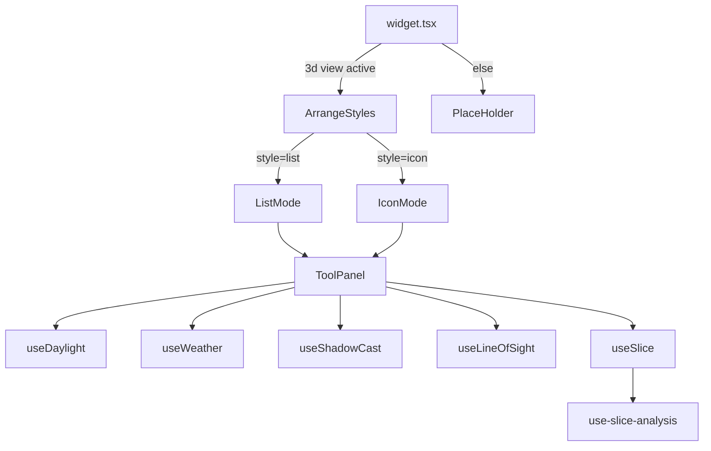

# OTB Widget: arcgis/3d-toolbox

Online widget doc: https://developers.arcgis.com/experience-builder/guide/3d-toolbox-widget/

## Purpose
A container of 3D analysis tools that only works against a 3D `SceneView`. It presents up to five JSAPI analysis/environment widgets in a single arrangeable panel:
- `daylight` - animate sun position / shadows over time or by season.
- `weather` - apply sunny / cloudy / rainy / snowy / foggy environment effects.
- `shadowcast` - visualize accumulated shadow over a time window.
- `lineofsight` - interactive line-of-sight visibility analysis.
- `slice` - slice through 3D layers with an interactive plane, with optional preset analysis saved per map.

Each tool is a thin ExB wrapper around the corresponding `esri/widgets/*` or `esri/analysis/*` module. The widget renders a placeholder until a 3D map view is active.

## Source paths inspected
Root: `ArcGISExperienceBuilder/client/dist/widgets/arcgis/3d-toolbox/` (gitignored build output; read with includeIgnoredFiles). `dist/` and `tests/` ignored.
- `manifest.json`
- `config.json` (default config values)
- `src/config.ts` (IMConfig shape)
- `src/constraints.ts` (all enums / interfaces)
- `src/version-manager.ts`
- `src/runtime/widget.tsx`
- `src/runtime/components/arrange-styles/index.tsx`
- `src/runtime/components/arrange-styles/list-mode.tsx`
- `src/runtime/components/arrange-styles/icon-mode.tsx` (listed, not fully quoted)
- `src/runtime/components/place-holder/index.tsx`
- `src/runtime/components/tool-panel/index.tsx`
- `src/runtime/components/tool-panel/daylight.ts`
- `src/runtime/components/tool-panel/weather.ts`
- `src/runtime/components/tool-panel/shadowcast.ts`
- `src/runtime/components/tool-panel/lineofsight.ts`
- `src/runtime/components/tool-panel/slice.ts`
- `src/runtime/components/tool-panel/utils/ui-utils.ts`
- `src/runtime/components/tool-panel/utils/use-env-defaults.ts`
- `src/common/use-slice-analysis.ts`
- `src/setting/setting.tsx`

## Architecture overview
Two layers: a tool-arrangement UI and the individual 3D analysis tools.

1. `widget.tsx` binds a Map widget via `JimuMapViewComponent`, tracks the active `JimuMapView`, and only mounts the toolset when `activeView.view.type === '3d'`. Otherwise it shows `PlaceHolder`.
2. `ArrangeStyles` reads `config.arrangement.style` and renders either `ListMode` (vertical list, click a row to open a tool panel) or `IconMode` (icon buttons, horizontal or vertical). Both feed the same `ToolPanel`.
3. `ToolPanel` is the per-tool host. It owns a `domContainerRef` DIV, decides which of the five tool hooks to use based on `props.mode` (a `ToolsID`), creates the native JSAPI widget into that DIV via the hook's `update*Widget(container)`, shows a `Loading` spinner until the JSAPI widget's `.when()` resolves, and provides Back / Clear (and slice-specific Cancel/Reset) buttons.
4. Each tool is a custom hook (`useDaylight`, `useWeather`, `useShadowCast`, `useLineOfSight`, `useSlice`) returning `{ update*Widget, destroy*Widget }`. The hooks construct the `esri/widgets/*` instance (usually with an explicit ViewModel) and wire environment/analysis state.
5. `use-slice-analysis` (in `src/common`) is a separate hook used only by slice to persist a `SliceAnalysis` (as JSON) plus a `Viewpoint` per map in config.



## Key imports and packages
Grouped by source file.

`src/runtime/widget.tsx`
- `React, jsx, type AllWidgetProps, appActions, hooks` from `jimu-core`
- `type JimuMapView, JimuMapViewComponent` from `jimu-arcgis`
- `ArrangeStyles` from `./components/arrange-styles`
- `PlaceHolder` from `./components/place-holder`
- `versionManager` from `../version-manager`

`src/runtime/components/arrange-styles/index.tsx`
- `React, jsx, Immutable, type ImmutableObject, type IMState, ReactRedux` from `jimu-core`
- `useTheme` from `jimu-theme`
- `type JimuMapView` from `jimu-arcgis`

`src/runtime/components/tool-panel/index.tsx`
- `React, jsx, type ImmutableObject, type AppMode, hooks, focusElementInKeyboardMode` from `jimu-core`
- `Button, Label, Loading, LoadingType, FOCUSABLE_CONTAINER_CLASS, useTrapFocusByBoundaryNodes, defaultMessages as jimuUIMessages` from `jimu-ui`
- `ArrowLeftOutlined` from `jimu-icons/outlined/directional/arrow-left`
- the five tool hooks from `./daylight | ./weather | ./shadowcast | ./lineofsight | ./slice`

`src/runtime/components/tool-panel/daylight.ts`
- `Daylight` from `esri/widgets/Daylight`
- `DaylightViewModel` from `esri/widgets/Daylight/DaylightViewModel`
- `useEnvDefault` from `./utils/use-env-defaults`

`src/runtime/components/tool-panel/weather.ts`
- `Weather` from `esri/widgets/Weather`
- `* as reactiveUtils` from `esri/core/reactiveUtils`
- `useEnvDefault` from `./utils/use-env-defaults`

`src/runtime/components/tool-panel/shadowcast.ts`
- `ShadowCast` from `esri/widgets/ShadowCast`
- `ShadowCastViewModel` from `esri/widgets/ShadowCast/ShadowCastViewModel`

`src/runtime/components/tool-panel/lineofsight.ts`
- `LineOfSight` from `esri/widgets/LineOfSight`
- `LineOfSightViewModel` from `esri/widgets/LineOfSight/LineOfSightViewModel`
- `* as reactiveUtils` from `esri/core/reactiveUtils`

`src/runtime/components/tool-panel/slice.ts`
- `Slice` from `esri/widgets/Slice`
- `SliceViewModel` from `esri/widgets/Slice/SliceViewModel`
- `* as reactiveUtils` from `esri/core/reactiveUtils`
- `useSliceAnalysis` from `../../../common/use-slice-analysis`

`src/common/use-slice-analysis.ts`
- `SlicePlane` from `esri/analysis/SlicePlane`
- `SliceAnalysis` from `esri/analysis/SliceAnalysis`
- `Viewpoint` from `esri/Viewpoint`
- `* as reactiveUtils` from `esri/core/reactiveUtils`

`src/setting/setting.tsx`
- `type AllWidgetSettingProps, getAppConfigAction` from `jimu-for-builder`
- `MapWidgetSelector, SettingRow, SettingSection` from `jimu-ui/advanced/setting-components`
- `LayoutType, ReactRedux, type IMState, type IMAppConfig` from `jimu-core`

Note: the JSAPI modules are imported via the `esri/*` alias (SystemJS/AMD style), not `@arcgis/core`, and are constructed synchronously in the hooks. This widget does NOT call `loadArcGISJSAPIModules` at runtime; the `esri/*` deps are declared in the manifest (see below). UNVERIFIED whether manifest lists them explicitly - manifest read did not show a `dependency` array for esri modules; only `"dependency": "jimu-arcgis"` was present (`manifest.json`).

## Reusable patterns found
- SceneView-only binding: `JimuMapViewComponent` + `onActiveViewChange`, gating on `activeView?.view?.type === '3d'` and resetting to `null` for 2D. Pattern in `src/runtime/widget.tsx`.
- One-time layout registration: `hooks.useEffectOnce` dispatches `appActions.widgetStatePropChange(id, 'layoutInfo', { layoutId, layoutItemId })` so settings can later resize the layout item (`widget.tsx`).
- Tool-as-hook abstraction: each analysis tool exports `{ update*Widget(container), destroy*Widget() }`; `ToolPanel` picks by `switch (props.mode)`. Uniform, so new tools slot in cleanly (`tool-panel/index.tsx`).
- Native widget into a managed DIV: `ToolPanel.createContainerDom` builds a fresh `<div>` under `domContainerRef` each init and clears `innerHTML` on destroy; JSAPI widgets receive that DOM node as `container`.
- Loading gate: `isLoadingState` shows `Loading` until `widget.when()` (or, for line-of-sight, both `widget.when()` and viewModel `state === 'ready'`) fires `onUpdated`.
- Environment snapshot/restore: `use-env-defaults` clones `view.environment.lighting` / `view.environment.weather` before a tool mutates them and restores on destroy (`utils/use-env-defaults.ts`). Used by daylight and weather.
- `reactiveUtils.watch` for viewModel state: slice watches `layersMode` and `active` to toggle Reset/Cancel buttons; weather watches `environment.weather.type` to re-apply configured params on type switch; line-of-sight watches viewModel `state`.
- Slice preset analysis persistence: `use-slice-analysis` serializes a `SlicePlane`/`SliceAnalysis` to JSON and stores it with a `Viewpoint` keyed by `jimuMapView.dataSourceId` in `SliceConfig.analyses` (an `ImmutableArray`). `reactiveUtils.whenOnce(() => !view.updating)` waits for the view before `view.analyses.add(...)`.
- Constraint-driven config: `constraints.ts` centralizes all enums (`ToolsID`, `WeatherType`, `DateOrSeason`, `Season`, `ShadowCastVisType`, `ArrangementStyle`, `ArrangementDirection`) and per-tool config interfaces.
- Version manager upgrade: `version-manager.ts` v1.11.0 appends a default `slice` tool to older configs.
- Settings dispatch via `getAppConfigAction`: `setting.tsx` uses `editLayoutItemSize` and `editWidgetProperty('inControllerUx', ...)` to reshape the widget when arrangement changes.
- a11y focus trapping: `useTrapFocusByBoundaryNodes` and `focusElementInKeyboardMode` for 508 keyboard loops (`tool-panel/index.tsx`, `list-mode.tsx`).

## Builder vs runtime split
- Runtime: `src/runtime/**` (`widget.tsx`, `arrange-styles`, `tool-panel`, `place-holder`) plus the shared `src/common/use-slice-analysis.ts`, `src/constraints.ts`, `src/config.ts`, `src/version-manager.ts`.
- Builder (settings): `src/setting/**`. `setting.tsx` provides map selection (`MapWidgetSelector`), per-tool enable/config editing (`ToolsContainer` + `SidePopperContainer`, referenced but not quoted), and arrangement style/direction (`ArrangementContainer`). It writes config with `props.onSettingChange` and reshapes layout via `getAppConfigAction()`.
- Manifest wires both: `"hasSettingPage": true`, `"dependency": "jimu-arcgis"`, `"settingDependency": "jimu-arcgis"`.

## Lifecycle and cleanup
- `ToolPanel.destroyWidget` (`tool-panel/index.tsx`): if the JSAPI widget still has a live `view.map`, it calls the tool-specific `destroy*Widget()` first, then `widgetRef.current.destroy()`, nulls the ref, and clears the container `innerHTML`.
- `ToolPanel` runs cleanup in a `useEffect` returning `() => destroyWidget()`, and also destroys when `useMapWidgetId` is removed. It re-inits based on `keepApiWidgetFlagRef` (driven by `toolConfig.activedOnLoad` and the shown-tool state).
- Daylight: stops `dayPlaying` / `yearPlaying` on `appMode` change; `destroyDaylightWidget` calls `restoreDefaultLighting` to put back the cloned lighting.
- Weather: `destroyWeatherWidget` removes the `environment.weather.type` watcher and calls `restoreDefaultWeather`.
- LineOfSight: `destroyLineOfSightWidget` removes the viewModel-state watch handle.
- Slice: `destroySliceWidget` calls `removeAnalysesFromView` (which `view.analyses.remove(...)` + `analysis.destroy()`), resets the Reset/Cancel button state, and removes both `reactiveUtils.watch` handles.
- ShadowCast: `destroyShadowCastWidget` is intentionally empty (no extra state to unwind).

## Manifest/config requirements
From `manifest.json`:
- `name: "3d-toolbox"`, `label: "3D Toolbox"`, `version/exbVersion: 1.20.0`.
- `defaultSize: { width: 170, height: 42 }` (matches icon-horizontal size).
- `properties.hasSettingPage: true`, `properties.coverLayoutBackground: true`, `properties.defaultInControllerUx: "offPanel"`.
- `dependency: "jimu-arcgis"`, `settingDependency: "jimu-arcgis"`.

Config shape (`src/config.ts`):
```ts
export interface config {
  tools: Tool3D[]
  arrangement: Arrangement
}
```
Default `config.json` ships all five tools enabled with `activedOnLoad: false` and `arrangement: { style: "icon", direction: "horizontal" }`.

`Tool3D` (`constraints.ts`): `{ id: ToolsID, enable: boolean, activedOnLoad: boolean, config: Daylight|Weather|ShadowCast|LineOfSight|SliceConfig }`.

## Gotchas
- 3D only: nothing renders except the placeholder unless the active `JimuMapView.view.type === '3d'`. Switching to a 2D map resets state to `null` (`widget.tsx`).
- Daylight ViewModel is a JSAPI workaround: `daylight.ts` constructs a throwaway `DaylightViewModel` (commented `// API bug ,#9697`) but passes `visibleElements`, `timeSliderSteps`, `playSpeedMultiplier`, `dateOrSeason` to the widget directly, and sets `currentSeason` / `dayPlaying` inside `.when()`.
- Weather does not use a ViewModel; it mutates `view.environment.weather` directly per `WeatherType` and re-applies configured params whenever the weather type changes via a `reactiveUtils.watch`.
- Environment mutation must be restored: daylight and weather clone and restore `view.environment.*`. Skipping the restore would leave the scene altered after the tool closes.
- Slice preset analysis is keyed by `dataSourceId`, and `getPresetMapViewIdInConfig` strips a `3d-toolbox-map-popper-` prefix. A saved analysis only applies to the exact map it was authored against (`hasPresetAnalysisForThisMap`).
- Slice viewModel internals accessed with `as any`: `(viewModel as any).layersMode` and `(viewModel as any).active` are read via `reactiveUtils.watch` (undocumented/private members, `slice.ts`).
- LineOfSight needs BOTH the widget `.when()` and viewModel `state === 'ready'` before it reports ready (`#10112`), otherwise buttons stay disabled.
- Arrangement changes in settings actively resize the layout item and flip `inControllerUx` between `offPanel` (icon) and `inPanel` (list) via `getAppConfigAction()` (`setting.tsx`).
- Large commented-out blocks in `lineofsight.ts` (custom observer/intersection symbols, graphics layer) are dead code, not active behavior.
- `setting.tsx` root className is `widget-setting-directions` (copied from the Directions widget); do not read meaning into it.

## Useful snippets and functions

Source: `src/runtime/widget.tsx` - bind a SceneView and gate on 3D:
```tsx
const [activedJimuMapViewState, setActivedJimuMapViewState] = React.useState<JimuMapView>(null)
const onActiveMapViewChange = React.useCallback(activeView => {
  if (activeView?.view?.type === '3d') {
    setActivedJimuMapViewState(activeView)
  } else {
    setActivedJimuMapViewState(null) //reset
  }
}, [])

const isShowPlaceHolderFlag = !useMapWidgetId || !(activedJimuMapViewState?.view?.type === '3d')
// ...
{useMapWidgetId &&
  <JimuMapViewComponent useMapWidgetId={useMapWidgetId} onActiveViewChange={onActiveMapViewChange} />
}
```

Source: `src/runtime/widget.tsx` - register layout info once:
```tsx
hooks.useEffectOnce(() => {
  const { layoutId, layoutItemId, id, dispatch } = props
  dispatch(appActions.widgetStatePropChange(id, 'layoutInfo', { layoutId, layoutItemId }))
})
```

Source: `src/runtime/components/tool-panel/index.tsx` - fresh container DIV per tool init:
```tsx
function createContainerDom (id: ToolsID) {
  const c = document.createElement('div')
  c.className = id + '-container w-100 '
  if (id === ToolsID.Weather) {
    c.className += 'd-flex justify-content-center'
  }
  domContainerRef.current.innerHTML = ''
  domContainerRef.current.appendChild(c)
  return c
}
```

Source: `src/runtime/components/tool-panel/index.tsx` - guarded destroy:
```tsx
const destroyWidget = React.useCallback(() => {
  if (widgetRef.current?.view?.map) {
    switch (props.mode) {
      case ToolsID.Daylight: { destroyDaylightWidget(); break }
      case ToolsID.Weather: { destroyWeatherWidget(); break }
      case ToolsID.ShadowCast: { destroyShadowCastWidget(); break }
      case ToolsID.LineOfSight: { destroyLineOfSightWidget(); break }
      case ToolsID.Slice: { destroySliceWidget(); break }
      default: { break }
    }
  }
  widgetRef?.current?.destroy()
  widgetRef.current = null
  if (domContainerRef?.current) {
    domContainerRef.current.innerHTML = ''
  }
}, [/* deps */])
```

Source: `src/runtime/components/tool-panel/daylight.ts` - construct Daylight with visibleElements:
```ts
widgetRef.current = new Daylight({
  container: domRef,
  view: view,
  visibleElements: {
    timezone: props.daylightConfig.timezone,
    playButtons: props.daylightConfig.playButtons,
    datePicker: props.daylightConfig.datePicker,
    sunLightingToggle: props.daylightConfig.dateTimeToggle,
    shadowsToggle: props.daylightConfig.isShowShadows
  },
  timeSliderSteps: props.daylightConfig.timeSliderSteps,
  playSpeedMultiplier: props.daylightConfig.playSpeedMultiplier,
  dateOrSeason: props.daylightConfig.dateOrSeason ?? DateOrSeason.Date
})
```

Source: `src/runtime/components/tool-panel/utils/use-env-defaults.ts` - snapshot/restore environment:
```ts
const cacheDefaultWeather = React.useCallback((view: __esri.SceneView) => {
  if (!defaultWeatherRef.current) {
    defaultWeatherRef.current = view.environment.weather.clone()
  }
}, [])
const restoreDefaultWeather = React.useCallback((view: __esri.SceneView) => {
  if (view && defaultWeatherRef.current) {
    view.environment.weather = defaultWeatherRef.current
  }
  defaultWeatherRef.current = null
}, [])
```

Source: `src/runtime/components/tool-panel/weather.ts` - apply weather + re-apply on type change:
```ts
setDefaultConfig(props.weatherConfig.weatherType, view)
widgetRef.current = new Weather({ container: domRef, view: view })
widgetRef.current.when(() => {
  onUpdated()
  envWatcher.current = reactiveUtils.watch(() => (view?.environment.weather.type),
    (type) => {
      setDefaultConfig(view.environment.weather.type as WeatherType, view)
    }
  )
})
```

Source: `src/runtime/components/tool-panel/lineofsight.ts` - dual readiness (widget + viewModel):
```ts
lineOfSightHandlerRef.current = reactiveUtils.watch(() => (widgetRef?.current.viewModel.state),
  (value) => { if (value === 'ready') { setViewModelReadyState(true) } }
)
widgetRef.current.when(() => { setWidgetReadyState(true) })
// onUpdated() fires only when widgetReadyState && viewModelReadyState
```

Source: `src/runtime/components/tool-panel/slice.ts` - Slice with optional preset analysis + button watches:
```ts
const vmOptions: __esri.SliceViewModelProperties = {
  view: view,
  tiltEnabled: props.sliceConfig.tiltEnabled,
  excludeGroundSurface: props.sliceConfig.excludeGroundSurface
}
if (hasPresetAnalysisForThisMapFlag) {
  currentSliceAnalysisRef.current = getAnalysisFromConfig()
  vmOptions.analysis = currentSliceAnalysisRef.current
}
widgetRef.current = new Slice({
  container: domRef,
  view: view,
  viewModel: new SliceViewModel(vmOptions)
})
widgetRef.current.when(() => {
  onUpdated()
  cancelSlicingBtnHandlerRef.current = reactiveUtils.watch(
    () => ((widgetRef?.current.viewModel as any).active),
    (isActive) => { /* toggle cancel/reset UI */ }
  )
  addAnalysesToView(hasPresetAnalysisForThisMapFlag, currentSliceAnalysisRef.current, props.jimuMapView.dataSourceId)
})
```

Source: `src/common/use-slice-analysis.ts` - deserialize preset SlicePlane, add after view settles:
```ts
const slicePlane = SlicePlane.fromJSON(JSON.parse(getPresetAnalysisInConfig()?.analysis))
const _sliceAnalysis = new SliceAnalysis({ shape: slicePlane })
// ...
await reactiveUtils.whenOnce(() => !view.updating)
if (view?.type === '3d' && isSameMapViewId && hasPresetAnalysis) {
  view.analyses.add(sliceAnalysis)
}
```

Source: `src/version-manager.ts` - append default slice tool on upgrade:
```ts
versions = [{
  version: '1.11.0',
  description: 'support version manager for Slice ,#12467',
  upgrader: (oldConfig) => {
    const DEFAULT_SLICE_CONFIG = {
      id: 'slice', enable: false, activedOnLoad: false,
      config: { tiltEnabled: false, excludeGroundSurface: true, analyses: [] }
    }
    const toolsConfig = oldConfig.tools.concat([DEFAULT_SLICE_CONFIG])
    return oldConfig.setIn(['tools'], toolsConfig)
  }
}]
```

Source: `src/setting/setting.tsx` - resize layout item + flip inControllerUx on arrangement change:
```ts
if (layoutId && (layoutType === LayoutType.FixedLayout)) {
  getAppConfigAction().editLayoutItemSize(extraStateProps.layoutInfo, size.w, size.h).exec()
}
if (style === ArrangementStyle.Icon) {
  getAppConfigAction().editWidgetProperty(props.id, 'inControllerUx', 'offPanel').exec()
} else {
  getAppConfigAction().editWidgetProperty(props.id, 'inControllerUx', 'inPanel').exec()
}
```
