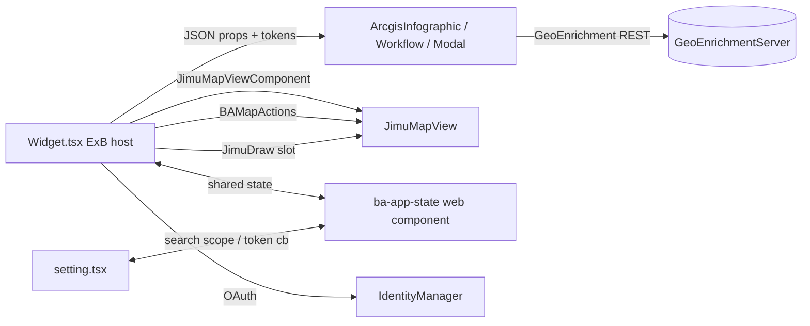

# OTB Widget: ba-infographic

Online widget doc: https://developers.arcgis.com/experience-builder/guide/business-analyst-widget/

> Analysis based on the ACTUAL bundled source under
> `ArcGISExperienceBuilder/client/dist/widgets/ba-infographic/` (top-level, gitignored).
> This is a LARGE widget. `src/runtime/widget.tsx` is ~3800+ lines and
> `src/setting/setting.tsx` is ~4200+ lines; both were read only in part (imports,
> class fields, lifecycle, render, plus targeted methods). Sections marked
> UNVERIFIED were inferred from imports/call sites, not from reading the full
> function body. The `dist/` and `tests/` folders under the widget were ignored
> per instructions.
> The label shown in the ExB widget panel is "Business Analyst" (manifest `label`),
> even though the internal `name` is `ba-infographic`.

## Purpose

The Business Analyst widget displays interactive Business Analyst infographic
reports for a location. A user picks a location (address/place search, a map
click, a drawn point/polygon, or a feature selected in another widget via a
message action) and one or more buffers (rings, drive time, or walk time). The
widget then calls the GeoEnrichment service and renders an infographic report
inside internal Business Analyst Stencil web components
(`@arcgis/business-analyst-components`). It runs in two authoring modes:
- `Preset` (Mode.Preset): the report location/buffers/infographic are fixed in
  settings and the runtime just plays the resulting infographic.
- `Workflow` (Mode.Workflow): the runtime exposes a stepper (Search -> Buffers ->
  Infographic) so the end user drives the analysis.

## Source paths inspected

Root: `ArcGISExperienceBuilder/client/dist/widgets/ba-infographic/`

Fully or substantially read:
- `manifest.json` - full (label, dependency, messageActions, defaultSize)
- `src/config.ts` - full (Config/GeoenrichmentConfig/TravelMode interfaces,
  ViewMode/Mode/InfoBufferType/TravelDirection/TrafficType enums, DEFAULT_TRAVEL_MODE)
- `src/runtime/oauth-util.ts` - full (configureOAuth, register/signIn, collectServiceTokens)
- `src/runtime/projection.ts` - full (BAProjection static math helpers)
- `src/message-actions/select-feature-action.ts` - full
- `src/utils/dbg-log.ts` - full (DbgLog / default export `D`)
- `src/utils/debounce.ts` - full (Debounce class)
- `src/countries.ts` - getCountries / getValidHierarchies / getActiveHierarchyId (top)
- `src/runtime/custom-placeholder.tsx` - imports + props (top)

Read in part (imports + key methods only; bodies too large to read fully):
- `src/runtime/widget.tsx` (~3800+ lines) - imports, enums/interfaces, class
  fields, constructor (defineCustomElements, configureOAuth, getGeoenrichmentServiceUrl),
  componentDidMount/componentWillUnmount/componentDidUpdate, getGeoenrichmentServiceUrl,
  detectBaEnterpriseGeoenrichment, projectGeometry, onInfographicNeedsServiceToken,
  insertBaAppStateServiceComponent, activeViewChangeHandler, render (Preset +
  Workflow branches, ArcgisInfographic / ArcgisInfographicWorkflow /
  ArcgisInfographicModal, JimuMapViewComponent, JimuDraw)
- `src/setting/setting.tsx` (~4200+ lines) - imports, TravelModeOptions,
  onMapWidgetSelected, MapWidgetSelector wiring, TokenProvider/GEClient travel-mode
  fetch, ArcgisBaSearch / ArcgisReportList / UtilitySelector usage, search-scope
  syncing, default-report panel
- `src/runtime/ba-map-actions.ts` - imports + class fields + constructor doc (top)
- `src/runtime/map-search.ts` - imports + class doc + static registry (top)
- `src/ba-app-state.js` - minified web-component (BaAppState) header

Imports-only / referenced (not read in depth):
- `src/runtime/OAuthUtil.ts`, `src/runtime/lib/style.ts`, `src/setting/lib/style.ts`
- `src/setting/components/buffers.tsx`
- `src/BaStateManager.js`, `src/ba-infographic.d.ts`, `src/global.d.ts`

Skipped (low value for this reference):
- `src/runtime/translations/*`, `src/setting/translations/*` (locale JS)
- `src/runtime/assets/*`, `src/setting/assets/*` (svg/gif)
- `dist/` and `chunks/` build output, `node_modules/@arcgis/business-analyst-components/*`

## Architecture overview

The widget is a single `React.PureComponent` (`src/runtime/widget.tsx`) that acts
as a thin ExB host/bridge around Esri's internal Business Analyst Stencil web
components. The heavy lifting (rendering the infographic, running GeoEnrichment,
the workflow stepper UI) lives inside the web components; the widget's job is to:

1. Register the custom elements once (`defineCustomElements(window)`) and pull in
   Calcite (`import 'calcite-components'`).
2. Resolve the GeoEnrichment service URL (from a configured `UseUtility`, else the
   portal's `helperServices.geoenrichment`, else the AGO default), detect
   proxy/on-prem/Enterprise scenarios, and verify `premium:user:geoenrichment` +
   `premium:user:networkanalysis` privileges.
3. Configure OAuth (`configureOAuth`) and provide service tokens on demand
   (`onInfographicNeedsServiceToken` -> `collectServiceTokens`).
4. Bridge the map: bind a `JimuMapView` via `JimuMapViewComponent`, create a
   `BAMapActions` instance to draw location/buffer graphics, and host a `JimuDraw`
   inside the workflow component's `draw-components` slot.
5. Mediate shared state through a `<ba-app-state>` web component
   (`BaAppState`) so that the sandboxed settings panel and the runtime can share
   search scope + a token-required callback.

Data/state passed to the web components is serialized as JSON strings on props
(e.g. `options`, `config`, `selectedFeatureResult`), and results come back as DOM
`CustomEvent`s and prop-change callbacks (`readyCallback`, `onRunInfographic`,
`onBaSearchFeatureChange`, `onBuffersUpdate`).



## Key imports and packages

Grouped by source; file path noted per group.

### `@arcgis/business-analyst-components` (INTERNAL Stencil web components) - the core of the widget
From `src/runtime/widget.tsx`:
- `import { ArcgisInfographic, ArcgisInfographicWorkflow, ArcgisInfographicModal } from '../../node_modules/@arcgis/business-analyst-components/dist/components'`
- `import { defineCustomElements } from '../../node_modules/@arcgis/business-analyst-components/dist/stencil-components/loader'`
- `import { ACLUtils } from '.../dist/stencil-components/dist/collection/ACLUtils'` (util helpers: `hasText`, `isDef`, `notDef`, `queryElement`)
- `import { GEClient } from '.../dist/stencil-components/dist/collection/util/mobile/GEClient'`
- `import type { DrivetimeOptions } from '.../dist/stencil-components/dist/collection/base-util'`

From `src/setting/setting.tsx`:
- `import { ArcgisBaSearch, ArcgisReportList } from '.../@arcgis/business-analyst-components/dist/components'`
- `import { defineCustomElements } from '.../stencil-components/loader'`
- `import { GEClient } from '.../util/mobile/GEClient'`
- `import { TokenProvider } from '.../util/mobile/TokenProvider'`
- `import { ACLUtils } from '.../ACLUtils'`

From `src/runtime/ba-map-actions.ts`:
- `TransportUtil`, `Environments`, `GeocoderClient`, `ACLUtils` (all from the same
  internal `dist/stencil-components/dist/collection/...` tree)

> These deep `node_modules/@arcgis/business-analyst-components/dist/...` imports are
> Esri-internal, undocumented, and version-locked. Treat them as vendor internals.
> See `patterns/internal-esri-component-libraries.md` (UNVERIFIED: intended
> cross-ref; that patterns file does not yet exist in this repo) for the general
> pattern of ExB widgets that wrap private Stencil component libraries and drive
> them via JSON string props + DOM CustomEvents.

### esri / @arcgis/core (ArcGIS Maps SDK for JavaScript)
- `src/runtime/widget.tsx`: `PictureMarkerSymbol` (`esri/symbols/PictureMarkerSymbol`),
  `SimpleFillSymbol` (`esri/symbols/SimpleFillSymbol`), `SpatialReference`
  (`esri/geometry/SpatialReference`), `type Point` (`esri/geometry/Point`);
  projection loaded lazily via `loadArcGISJSAPIModule('esri/geometry/operators/projectOperator')`.
- `src/runtime/ba-map-actions.ts`: `Graphic` (`esri/Graphic`), `GraphicsLayer`
  (`esri/layers/GraphicsLayer`), `PictureMarkerSymbol`, `Circle`
  (`esri/geometry/Circle`), `Point` (`esri/geometry/Point`).
- `src/runtime/map-search.ts`: `Search` (`@arcgis/core/widgets/Search`), `Graphic`
  (`esri/Graphic`), `PictureMarkerSymbol` (`@arcgis/core/symbols/PictureMarkerSymbol`),
  `GraphicsLayer` (`esri/layers/GraphicsLayer`).
- `src/runtime/oauth-util.ts`: `esriId` (`@arcgis/core/identity/IdentityManager`),
  `OAuthInfo` (`@arcgis/core/identity/OAuthInfo`), `type Credential`, `getLocale`
  (`@arcgis/core/intl`).
- `src/message-actions/select-feature-action.ts`: `esri/symbols/support/symbolUtils`
  loaded via `loadArcGISJSAPIModule`.

### jimu-core (ExB framework)
- `src/runtime/widget.tsx`: `React`, `type AllWidgetProps`, `getAppStore`, `jsx`,
  `css`, `SessionManager`, `type IMState`, `type UseUtility`, `UtilityManager`,
  `proxyUtils`, `loadArcGISJSAPIModule`.
- `src/message-actions/select-feature-action.ts`: `AbstractMessageAction`,
  `MessageType`, `type Message`, `type DataRecordsSelectionChangeMessage`,
  `MutableStoreManager`, `type FeatureDataRecord`, `dataSourceUtils`,
  `loadArcGISJSAPIModule`.
- `src/setting/setting.tsx`: `React`, `jsx`, `css`, `getAppStore`, `Immutable`,
  `lodash`, `type ImmutableArray`, `proxyUtils`, `SupportedUtilityType`,
  `type UseUtility`, `SessionManager`.

### jimu-arcgis (map bridge)
- `src/runtime/widget.tsx`: `type JimuMapView`, `JimuMapViewComponent`.

### jimu-ui / jimu-ui advanced
- `src/runtime/widget.tsx`: `JimuDraw`, `JimuDrawCreationMode`,
  `type JimuDrawVisibleElements` from `jimu-ui/advanced/map`; `Container`, `Modal`,
  `ModalBody`, `ModalHeader`, `Paper`, `Button`, `Loading`, `LoadingType` from `jimu-ui`.
- `src/runtime/custom-placeholder.tsx`: `Icon` from `jimu-ui`.
- `src/setting/setting.tsx`: `SettingSection`, `SettingRow`, `MapWidgetSelector`,
  `SidePopper`, `SettingCollapse` from `jimu-ui/advanced/setting-components`;
  `Radio`, `TextArea`, `Select`, `Switch`, `Label`, `Button`, `Icon`, `Checkbox`,
  `Popper`, `NumericInput`, `Tabs`, `Tab` from `jimu-ui`; `ColorPicker` from
  `jimu-ui/basic/color-picker`; `UtilitySelector` from `jimu-ui/advanced/utility-selector`;
  icons from `jimu-icons/*`.

### jimu-for-builder (settings only)
- `src/setting/setting.tsx`: `type AllWidgetSettingProps`, `getAppConfigAction`,
  `helpUtils`.

### Local BA app-state web component
- `src/runtime/widget.tsx` and `src/setting/setting.tsx`:
  `import BaAppState from '../ba-app-state.js'` (a minified `HTMLElement` custom
  element that fronts `BaStateManager.js`, an xstate-style shared store).

### Calcite
- `src/runtime/widget.tsx`: `import 'calcite-components'` - "Needed to pull calcite
  in for ArcGis* components" (the Stencil components depend on Calcite).

## Reusable patterns found

- **JimuMapView + BAMapActions + JimuDraw bridge**: The map is bound only when
  exactly one `useMapWidgetIds` entry exists. `JimuMapViewComponent.onActiveViewChange`
  captures the `JimuMapView`, waits on `jmv.view.when(...)`, then constructs a
  `BAMapActions` helper that owns a `GraphicsLayer` for location/buffer graphics.
  `JimuDraw` is rendered into the workflow component's `<div slot="draw-components">`
  and wired with `onDrawingFinished` + `onJimuDrawCreated`.
- **Wrapping an internal Stencil web-component library**: The widget defines the
  custom elements once (`defineCustomElements(window)`), imports Calcite, and passes
  all data to `<arcgis-infographic>` / `<arcgis-infographic-workflow>` /
  `<arcgis-infographic-modal>` as JSON-string props (`options`, `config`,
  `selectedFeatureResult`), receiving results through DOM CustomEvents and prop
  callbacks (`readyCallback`, `onRunInfographic`, `onBuffersUpdate`,
  `onBaSearchFeatureChange`). Cross-ref `patterns/internal-esri-component-libraries.md`
  (UNVERIFIED path).
- **OAuth token provider**: `src/runtime/oauth-util.ts` centralizes IdentityManager
  registration (`registerOAuthInfos`), sign-in, and `collectServiceTokens(urls)`.
  The widget calls `configureOAuth({ appId:'arcgisonline', popup:true, popupCallbackUrl })`
  in the constructor and exposes `onInfographicNeedsServiceToken` so components can
  request tokens lazily. Settings uses `TokenProvider.setToken(username, token)` +
  `GEClient` to fetch travel modes.
- **BaAppState shared-state module**: `<ba-app-state>` custom element (backed by
  `BaStateManager`) is inserted into the widget's top div so the sandboxed
  settings panel and the runtime can share `searchScope`, `searchScopeLocked`, and
  the `tokenRequiredCallback`. `componentDidUpdate` re-syncs these on every update.
- **SessionManager token access**: `getToken()` caches `SessionManager.getInstance()
  .getMainSession()?.token` and appends it as `&token=` to REST calls.
- **Countries + hierarchy resolution**: `src/countries.ts` fetches
  `.../Geoenrichment/countries?f=pjson` and derives valid data-collection hierarchies
  (`getValidHierarchies`, filtering out `landscape`); the widget picks the default or
  the configured hierarchy and syncs geography levels.
- **select-feature message action**: `src/message-actions/select-feature-action.ts`
  reacts to `DataRecordsSelectionChange`, converts the selected JSAPI graphic
  (`dataSourceUtils.changeToJSAPIGraphic`), resolves its displayed symbol
  (`symbolUtils.getDisplayedSymbol`), and pushes a normalized point/polygon feature
  into the widget's mutable state
  (`MutableStoreManager...updateStateValue('workflowRuntimeSelectedFeatureObject', ...)`).
- **Debounce helper**: `src/utils/debounce.ts` provides an owner-bound debouncer used
  for buffer changes (`workflowBuffersUpdateDelayed`).
- **UtilityManager `UseUtility` config**: the GeoEnrichment endpoint can be overridden
  in settings via `UtilitySelector` and stored as `geoenrichmentConfig.useUtility`.

## Builder vs runtime split

- **Runtime** (`src/runtime/`): `widget.tsx` (host + render), `ba-map-actions.ts`,
  `map-search.ts`, `oauth-util.ts` / `OAuthUtil.ts`, `projection.ts`,
  `custom-placeholder.tsx`, `lib/style.ts`. Renders `ArcgisInfographic*` components,
  binds the map, and resolves tokens/privileges. Uses `AllWidgetProps` + `props.config`.
- **Settings** (`src/setting/`): `setting.tsx` + `components/buffers.tsx` +
  `lib/style.ts`. Uses `AllWidgetSettingProps`, `getAppConfigAction`, and
  `jimu-ui/advanced/setting-components`. Authoring lets the user: pick the map widget
  (`MapWidgetSelector` -> `onMapWidgetSelected` writes `useMapWidgetIds`), choose the
  GeoEnrichment utility (`UtilitySelector`), choose search type/scope, pick preset
  location via `ArcgisBaSearch`, choose default/allowed infographics via
  `ArcgisReportList`, and configure buffers and travel modes (`GEClient.getTravelModes`).
- **Shared**: `src/config.ts` (Config/enums/DEFAULT_TRAVEL_MODE), `src/countries.ts`,
  `src/ba-app-state.js`, `src/BaStateManager.js`, `src/utils/*`. Both sides import
  `BaAppState` to share search-scope/token state across the settings sandbox boundary.

## Lifecycle and cleanup

Constructor (`src/runtime/widget.tsx`):
- Registers `Widget.WidgetRegistry[props.id] = this`.
- `defineCustomElements(window)` (wrapped in try/catch).
- Builds a large `this.state` object, defaulting every `props.config` value (NOTE in
  source: widget is constructed before settings on a fresh app, so new config values
  MUST be defaulted here).
- Creates the `Debounce` instance and the debounced buffer updater.
- Calls `getGeoenrichmentServiceUrl()` (async, not awaited here).
- Calls `configureOAuth({ appId, popup:true, popupCallbackUrl })` with a
  dot-segment-normalized callback URL derived from `props.context.folderUrl`.

`componentDidMount` (async):
- Adds `window` listeners for `ba-app-state-ready`, `selectorPopupOpened`,
  `selectorPopupClosed`.
- Awaits `getGeoenrichmentServiceUrl()`, then `getCountries(...)` and resolves
  hierarchies / geography levels.
- Calls `preloadData()` (`buildInfographicOptions`, `addEventListeners`, `countSteps`,
  tab init) and `updateStandardInfographics(...)`.

`componentDidUpdate`:
- Re-syncs the `<ba-app-state>` service: keeps `tokenRequiredCallback` pointing at
  `onInfographicNeedsServiceToken`, and initializes/updates `searchScope` +
  `searchScopeLocked`.

`componentWillUnmount`:
- Removes the `ba-loading` / `ba-loading-start` / `ba-loading-end` window listeners
  and the `selectorPopupOpened` / `selectorPopupClosed` listeners.
- Clears `_loadingHideTimer` and `_loadingEventTimer` timeouts.
- Sets `_isMounted = false`.

> UNVERIFIED: The added `ba-loading*` listeners are removed in `componentWillUnmount`,
> but the bind + `addEventListener` for those specific events lives in a method not
> read in full (`addEventListeners`). The `ba-app-state-ready` listener added in
> `componentDidMount` is an anonymous arrow and is not explicitly removed on unmount.

## Manifest/config requirements

From `manifest.json`:
- `"dependency": "jimu-arcgis"` and `"settingDependency": "jimu-arcgis"` - required
  for the map bridge (`JimuMapViewComponent`, `JimuDraw`).
- `messageActions`: exposes `selectFeatureAction` (`Select feature`,
  `message-actions/select-feature-action`) so another widget's selection can drive
  the location.
- `properties`: `coverLayoutBackground: true`, `notShareDynamicModules: true`.
- `defaultSize`: `{ width: 550, height: 361 }`.
- `type: "widget"`, `version/exbVersion: 1.20.0`, author Esri Inc.

Config (`src/config.ts`, `IMConfig = ImmutableObject<Config>`), selected keys:
- Mode: `widgetMode` (`Mode.Preset` | `Mode.Workflow`).
- Data source: `geoenrichmentConfig.useUtility` (`GeoenrichmentConfig.useUtility:
  UseUtility`), `selectedCountry` / `sourceCountry`, `selectedHierarchy`,
  `availableHierarchies`, `autoSelectLatestDataSource`.
- Buffers: `bufferUnit`, `bufferSize1..3`, plus workflow/preset ring/drivetime/walktime
  buffer values and units (read via `props.config` in the constructor state defaults).
- Search: `baSearchType`, `appSearchScope`, `appSearchScopeLocked`,
  `searchbarEnabled`, preset/workflow search selected objects.
- Reports: `defaultReport`, `reportList`, `standardInfographicID`,
  `workflowEnableInfographicChoice`.
- Travel modes: `travelModeData` (`TravelMode | string`), `travelDirection`,
  `useTrafficEnabled/Checked`, `trafficType`, `offsetTime/Day/Hr`; default is
  `DEFAULT_TRAVEL_MODE` ("Driving Time", itemId `FEgifRtFndKNcJMJ`).
- Draw toggles: `drawPointEnabled`, `drawPolygonEnabled`.

Runtime also relies on `props.portalSelf.helperServices` for
`geoenrichment`, `geocode`, and `routingUtilities` fallbacks, and on
`props.user.privileges` (`premium:user:geoenrichment`, `premium:user:networkanalysis`).

## Gotchas

- **Map binding is single-map only**: `render()` mounts `JimuMapViewComponent`,
  `BAMapActions`, and `JimuDraw` only when `this.props.useMapWidgetIds?.length === 1`.
  No map selected -> no map graphics/draw. `BAMapActions` is created inside
  `jmv.view.when(...)`, so it is not available synchronously after view change.
- **Deep vendor imports**: everything under
  `node_modules/@arcgis/business-analyst-components/dist/...` is Esri-internal and
  version-pinned to this ExB release; do not treat it as a public API.
- **Calcite is mandatory**: `import 'calcite-components'` in `widget.tsx` is required
  for the Stencil components to render; removing it breaks the infographic UI.
- **JSON-string props**: `options`, `config`, `selectedFeatureResult`,
  `locationAttributes`, etc. are passed to the web components as `JSON.stringify(...)`.
  A malformed object silently breaks the component; the render body wraps parsing in
  try/catch and logs via `pWinSt.log`.
- **`pWinSt` global**: source uses `pWinSt.log/warn/error/trace` (a wrapped console)
  and a global `pWin`-style logger. This is a repo/runtime global, not imported.
- **GE URL detection is heuristic**: `getGeoenrichmentServiceUrl` /
  `detectBaEnterpriseGeoenrichment` fall back to "assume on-premises" on fetch
  failure or 401/403, and use URL substring checks (`sharing/servers`,
  `/appservices/`, `usrsvcs/servers`) to decide if a portal proxy is in play.
- **Privilege gating**: without `premium:user:geoenrichment` AND
  `premium:user:networkanalysis` (and not using a proxy / on-prem GE), the widget
  sets `hasPrivileges=false` and will not run reports.
- **Collapsed render**: when `props.collapsed` is true (Widget Controller), the widget
  renders only a minimal header/icon, not the infographic.
- **Empty render before GE URL**: `render()` returns `''` until
  `state.initializedGEUrl` is true (GE URL resolves asynchronously).
- **Projection is lazy**: `esri/geometry/projection` was removed for ArcGIS core v5;
  `projectGeometry` now lazy-loads `esri/geometry/operators/projectOperator` and calls
  `.load()` before `.execute(...)`. `src/runtime/projection.ts` (`BAProjection`) only
  does Web Mercator <-> geographic math, not datum reprojection.
- **Shared state across the settings sandbox**: search scope + token callback flow
  through the `<ba-app-state>` DOM element, not through Redux; the runtime is the
  mediator (`componentDidUpdate`) because settings is sandboxed.
- **`defineCustomElements` runs in both runtime and settings constructors** - it is
  idempotent but must not throw (wrapped in try/catch in `widget.tsx`).

## Useful snippets and functions

REAL snippets from the actual bundled source.

### Register the internal BA Stencil web components (constructor)
Source: `src/runtime/widget.tsx`
```tsx
import { ArcgisInfographic, ArcgisInfographicWorkflow, ArcgisInfographicModal } from '../../node_modules/@arcgis/business-analyst-components/dist/components'
import { defineCustomElements } from '../../node_modules/@arcgis/business-analyst-components/dist/stencil-components/loader'
import 'calcite-components' // Needed to pull calcite in for ArcGis* components

// ...in constructor:
try {
  defineCustomElements( window )
} catch ( error ) {
  pWinSt.warn( 'Failed to define business analyst custom elements:', error )
}
```

### Configure OAuth with a normalized popup callback URL (constructor)
Source: `src/runtime/widget.tsx`
```tsx
const rawPopupCallbackUrl = this.props.context.folderUrl + 'dist/runtime/assets/oauth-callback.html'
const popupCallbackUrl = this.removeDotDotSegments( rawPopupCallbackUrl )

configureOAuth( {
  appId: "arcgisonline",
  popup: true,
  popupCallbackUrl
} )
```

### OAuth token collection helper
Source: `src/runtime/oauth-util.ts`
```ts
export async function collectServiceTokens ( serviceUrls: string[] ): Promise<HashMap<string>> {
  const serviceTokens: HashMap<string> = {}
  for ( const serviceUrl of serviceUrls ) {
    if ( getServerUrl( serviceUrl ) ) {
      await tryRegisterOAuth( serviceUrl )
    }
    await signIn( serviceUrl )
    serviceTokens[serviceUrl] = getToken( serviceUrl )
  }
  return serviceTokens
}
```

### Lazy service-token callback for the components
Source: `src/runtime/widget.tsx`
```tsx
// Service token handler called from components when they need a service token.
async onInfographicNeedsServiceToken ( context, symbol, serviceUrls ) {
  const serviceTokens = await collectServiceTokens( serviceUrls )
  context.onServiceTokens( symbol, serviceTokens )
}
```

### Session token + token query param
Source: `src/runtime/widget.tsx`
```tsx
getToken () {
  if ( !this.sessionToken ) {
    if ( SessionManager ) {
      this.sessionToken = SessionManager.getInstance()?.getMainSession()?.token
    }
  }
  return this.sessionToken
}

getTokenParam () {
  let tokParam = ''
  const tok = this.getToken()
  if ( tok && ACLUtils.hasText( tok ) ) {
    tokParam = '&token=' + tok
  }
  return tokParam
}
```

### Bind JimuMapView and construct BAMapActions
Source: `src/runtime/widget.tsx`
```tsx
activeViewChangeHandler ( jmv: JimuMapView, context: any ) {
  const self = context
  const forceRender = !this.jimuMapView
  if ( !forceRender ) {
    self.updateState( 'mapViewReady', false )
  }
  this.jimuMapView = jmv
  if ( jmv && jmv.view ) {
    jmv.view.when( function ( event ) {
      self.mapActions = new BAMapActions(
        context.props.id,
        jmv.mapWidgetId,
        self.showSearch,
        window.jimuConfig.hostEnv,
        self.onMapChanges,
        context,
        self.localeString( 'find-address-or-place' ),
        self.geoenrichmentServiceUrl,
        self.state.geocodeUrl
      )
      self.mapActions.allowMapClicks( self.props.config.widgetMode === Mode.Preset && self.props.config.runReportOnClick )
      self.mapActions.showSearch = typeof self.props.config.searchbarEnabled === 'undefined' ? true : self.props.config.searchbarEnabled
      self.mapActions.initialize( jmv.view )
      self.loadPresetSearch()
      if ( forceRender ) {
        self.updateState( 'mapViewReady', true )
      }
    } )
  }
}
```

### Map + draw wiring in render (single-map guard, JimuDraw in slot)
Source: `src/runtime/widget.tsx`
```tsx
{Object.prototype.hasOwnProperty.call( this.props, 'useMapWidgetIds' ) && this.props.useMapWidgetIds && this.props.useMapWidgetIds.length === 1 && (
  <JimuMapViewComponent useMapWidgetId={this.props.useMapWidgetIds?.[0]} onActiveViewChange={e => { this.activeViewChangeHandler( e, this ) }} />
)}
// ...inside the workflow component:
<div slot="draw-components">
  {this.props.useMapWidgetIds?.length === 1 && this.jimuMapView && ( drawPointEnabled || drawPolygonEnabled ) &&
    <JimuDraw
      jimuMapView={this.jimuMapView}
      operatorWidgetId={this.props.id}
      disableSymbolSelector={true}
      drawingOptions={{
        creationMode: JimuDrawCreationMode.Single,
        updateOnGraphicClick: false,
        visibleElements
      }}
      defaultSymbols={{ pointSymbol: drawPointSymbol }}
      uiOptions={{ isHideBgColor: true, isHideBorder: true }}
      onDrawingFinished={( e ) => { this.handleDrawEnd( e ) }}
      onJimuDrawCreated={handleDrawToolCreated}
    />
  }
</div>
```

### Render the preset infographic web component (JSON-string props)
Source: `src/runtime/widget.tsx`
```tsx
<ArcgisInfographic
  id={this.presetInfographicId}
  baStateId={this._baAppStateId}
  env={window.jimuConfig.hostEnv}
  username={igData.username}
  token={token}
  geoenrichmentUrl={this.geoenrichmentServiceUrl ? this.geoenrichmentServiceUrl : null}
  portalUrl={this.state.portalUrl ? this.state.portalUrl : null}
  portalOnlineGEProxy={this.portalOnlineGEProxy}
  locationName={igData.locationName}
  locationAttributes={igData.attributes ? igData.attributes : {}}
  sourceCountry={igData.country}
  selectedHierarchy={_selectedHier}
  options={JSON.stringify( igData.buffers.infographicOptions )}
  langCode={langCode}
  reportId={igData.report}
  useLatestDataSource={this.props.config.autoSelectLatestDataSource}
  standardInfographicID={this.state.stStandardInfographicID}
  readyCallback={( elem ) => { this.onElementReady.bind( this )( elem ) }}
/>
```

### Lazy projection with projectOperator (ArcGIS core v5)
Source: `src/runtime/widget.tsx`
```tsx
async projectGeometry ( geometry: __esri.Geometry | __esri.GeometryUnion, spatialReference: __esri.SpatialReference ): Promise<__esri.Geometry> {
  if ( !geometry ) { return Promise.resolve( null ) }
  if ( geometry.spatialReference?.wkid !== spatialReference?.wkid ) {
    if ( !this._projectionModule || !this._projectionModule.isLoaded() ) {
      this._projectionModule = await loadArcGISJSAPIModule( 'esri/geometry/operators/projectOperator' )
      if ( !this._projectionModule.isLoaded() ) {
        await this._projectionModule.load()
      }
    }
    if ( this._projectionModule && this._projectionModule.isLoaded() ) {
      geometry = this._projectionModule.execute( geometry as __esri.GeometryUnion, spatialReference ) as __esri.Geometry
    }
  }
  return Promise.resolve( geometry )
}
```

### select-feature message action -> mutable widget state
Source: `src/message-actions/select-feature-action.ts`
```ts
export default class selectFeatureAction extends AbstractMessageAction {
  filterMessageDescription ( messageDescription: MessageDescription ): boolean {
    return messageDescription.messageType === MessageType.DataRecordsSelectionChange
  }
  onExecute ( message: Message ): Promise<boolean> | boolean {
    switch ( message.type ) {
      case MessageType.DataRecordsSelectionChange:
        const record = (message as DataRecordsSelectionChangeMessage).records?.[0]
        if ( record ) {
          const feature = ( record as FeatureQueryDataRecord ).feature as __esri.Graphic
          dataSourceUtils.changeToJSAPIGraphic( feature ).then( ( graphic ) => {
            loadArcGISJSAPIModule( 'esri/symbols/support/symbolUtils' ).then( ( symbolUtils ) => {
              symbolUtils.getDisplayedSymbol( graphic ).then( ( symbol ) => {
                // ...build point/polygon selectedFeature...
                MutableStoreManager.getInstance().updateStateValue( this.widgetId, 'workflowRuntimeSelectedFeatureObject', selectedFeature )
              } )
            } )
          } )
        }
        break
    }
    return Promise.resolve( true )
  }
}
```

### Insert the shared BaAppState web component into the widget DOM
Source: `src/runtime/widget.tsx`
```tsx
insertBaAppStateServiceComponent () {
  if ( !this._baAppStateServiceComponent ) {
    const svc = BaAppState.getServiceComponent( this.getWidgetOuterDiv(), this._baAppStateId )
    if ( !svc ) {
      requestAnimationFrame( () => {
        const topDiv = document.getElementById( this._topDivId )
        if ( topDiv ) {
          const topHtml = `<ba-app-state id="${this._baAppStateId}"></ba-app-state>`
          topDiv.insertAdjacentHTML( 'afterbegin', topHtml )
        }
      } )
    } else {
      this._baAppStateServiceComponent = svc
    }
  }
}
```

### Settings: map-widget selection writes useMapWidgetIds
Source: `src/setting/setting.tsx`
```tsx
onMapWidgetSelected = ( useMapWidgetIds: string[] ) => {
  this._mapWidgetId = useMapWidgetIds[0]
  this.props.onSettingChange( { id: this.props.id, useMapWidgetIds } )
  if ( useMapWidgetIds.length ) {
    const appConfigActions = getAppConfigAction()
    // ...reads appConfig.widgets[useMapWidgetIds[0]].config...
  }
}
// render:
<MapWidgetSelector onSelect={self.onMapWidgetSelected} useMapWidgetIds={useMapWidgetIds} />
```

### Settings: fetch travel modes via TokenProvider + GEClient
Source: `src/setting/setting.tsx`
```tsx
TokenProvider.setToken( username, token )
const response = await GEClient.getTravelModes( token, window.jimuConfig.hostEnv, this.state.routingUtilityUrl )
```

### Debounce helper
Source: `src/utils/debounce.ts`
```ts
export default class Debounce {
  private timeoutId: number
  private readonly owner: any
  constructor ( context: any ) { this.owner = context }
  public cancel = () => {
    if ( this.timeoutId ) { clearTimeout( this.timeoutId ); this.timeoutId = undefined }
  }
  public debounce<F extends Function> ( func: F, wait?: number ): F {
    const self = this
    if ( !wait ) { wait = 1000 }
    return <any>function ( context: any, ...args: any[] ) {
      clearTimeout( self.timeoutId )
      self.timeoutId = window.setTimeout( function () { func.apply( self.owner, args ) }, wait )
    }
  }
}
```
