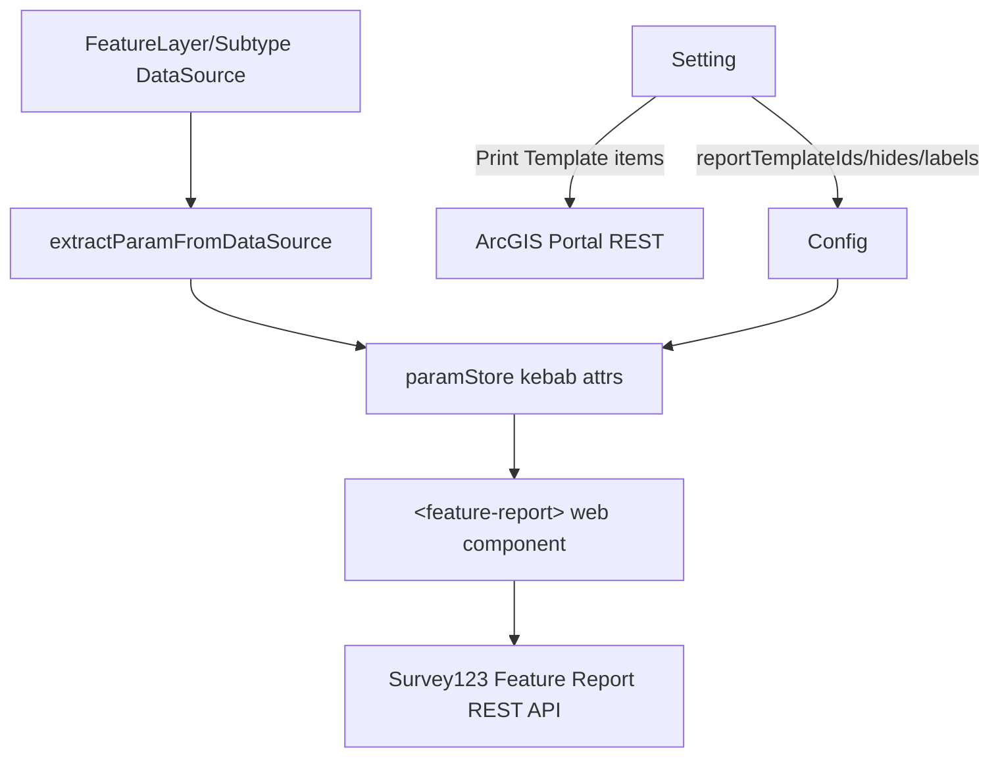

# OTB Widget: common/feature-report

Online widget doc: https://developers.arcgis.com/experience-builder/guide/feature-report-widget/

## Purpose
The Feature Report widget generates printable Word/PDF reports from a feature layer (or a
Survey123 survey associated with that layer) by driving the Survey123 Feature Report REST
service. It renders a Survey123 web component (`<feature-report>`) at runtime that handles
template selection, report options, generation, and download. The builder (setting) side lets
the author pick a feature layer data source, optionally bind a related Survey123 survey, and
create/manage/upload/expression-configure report templates (Print Template portal items) plus
output options (report name, output format, merge files).

The report generation itself is done by the Survey123 backend service; this widget is mostly a
thin ExB/JSAPI/portal-REST integration around Survey123 report templates and jobs.

## Source paths inspected
All under `ArcGISExperienceBuilder/client/dist/widgets/common/feature-report/` (gitignored built
source; read with includeIgnoredFiles). The `dist/` and `tests/` folders were intentionally
ignored per task; the `src/` tree here is the compiled-but-readable TS/TSX source.

- `manifest.json`
- `config.json` (empty `{}` default config)
- `src/config.ts` (Config/IMConfig interface)
- `src/runtime/widget.tsx`
- `src/utils.ts`
- `src/setting/setting.tsx`
- `src/setting/components/config-item.tsx`
- `src/setting/components/template-editor.tsx`
- `src/setting/components/expression-editor.tsx`
- (also present, referenced by setting) `src/setting/components/output-setting-panel.tsx`,
  `create-sample-template.tsx`, `loading.tsx`, `icons/*`

Note: the task template mentions a "version-manager" pattern; UNVERIFIED - no `version-manager`
file or module exists in this widget. The only versioning logic is a local `compareVersion`
helper in `src/utils.ts` used for portal enterprise-version gating (see below).

## Architecture overview
- Runtime (`widget.tsx`) is a class `React.PureComponent`. It does not render report UI itself;
  it renders the Survey123 custom element `<feature-report>` and feeds it a flat
  `paramStore` of kebab-case attributes (survey item id, feature layer url, query parameters,
  template ids, labels, token, client-id, portal-url, api-url, locale, etc.).
- A hidden `DataSourceComponent` drives everything: on data source info change the widget
  extracts the feature layer URL + query (where/objectIds/orderByFields) via
  `extractParamFromDataSource` and stores them in component state, then rebuilds `paramStore`.
- The Survey123 web component bundle is loaded via
  `@arcgis-survey123/feature-report-components/loader` (`defineCustomElements`) with a
  `resourcesUrl` pointing at the widget's own `dist/runtime/report-component/` folder. Calcite
  components are lazily loaded through `moduleLoader.loadModule('../calcite-components/index.js')`.
- Setting (`setting.tsx`) is a large class component that: selects the data source
  (`DataSourceSelector`), discovers related Survey123 items from the layer, lists/creates/edits
  report templates, and opens two `SidePopper` panels (output setting + template editor).
- Most portal/REST/Survey123 heavy lifting lives in `src/utils.ts` (portal item queries,
  relationships, template CRUD, sample template/report jobs, syntax check, download).

Flow (mermaid):



## Key imports and packages
Grouped by concern; file path noted per group.

`src/runtime/widget.tsx`
- jimu-core: `React`, `DataSourceManager`, `DataSourceComponent`, `SessionManager`,
  `getAppStore`, `moduleLoader`, `urlUtils`, types `AllWidgetProps`, `IMState`,
  `IMDataSourceInfo`, `IMUrlParameters`, `QueriableDataSource`, `FeatureLayerDataSource`.
- jimu-ui: `WidgetPlaceholder`.
- Survey123 web component loader: `@arcgis-survey123/feature-report-components/loader`
  (`defineCustomElements`).
- Calcite: `CalciteInputTimeZone` from `calcite-components` (imported for side effect / type
  presence; note the `CalciteInputTimeZone` mention in task).
- local: `../config` (IMConfig), `../utils` (`extractParamFromDataSource`), `./css/style`,
  `../../icon.svg`, translations.

`src/utils.ts`
- jimu-core: `getAppStore`, `SessionManager`, `portalUrlUtils`, `esri`, `CONSTANTS`,
  `DataSourceTypes`, `dataSourceUtils` (via setting), types `QueriableDataSource`,
  `SubtypeSublayerDataSource`, `FeatureLayerDataSource`.
  - Uses the jimu-core `esri` re-export namespace: `esri.restFeatureService.queryFeatures(...)`
    and `esri.restPortal.*` (`getItem`, `getRelatedItems`, `createItem`, `getUserContent`,
    `reassignItem`, `addItemRelationship`, `searchItems`, `updateItem`, `removeItem`,
    `getPortalUrl`). These wrap the ArcGIS REST JS libraries.
- @esri/arcgis-rest-request: type `HTTPMethods`.
- @esri/arcgis-rest-portal: type `ItemRelationshipType` (e.g. `Survey2Service`, `Survey2Data`,
  `Service2Report`).
- `file-saver` (via `require('file-saver')`) for saving generated files.

`src/setting/setting.tsx`
- jimu-core: `React`, `Immutable`, `css`, `jsx`, `DataSourceComponent`, `DataSourceManager`,
  `portalUrlUtils`, `CONSTANTS`, `SupportedServerTypes`, `dataSourceUtils`, types `UseDataSource`,
  `FeatureLayerDataSource`, `IMDataSourceJson`.
- jimu-for-builder: `AllWidgetSettingProps`, `builderAppSync`, `helpUtils`.
- jimu-ui: `Radio`, `Label`, `Select`, `Icon`, `Button`, `Dropdown*`, `Modal*`, `Alert`,
  `Tooltip`, `defaultMessages`.
- jimu-ui/advanced/setting-components: `SettingSection`, `SettingRow`, `SidePopper`.
- jimu-ui/advanced/data-source-selector: `DataSourceSelector`, `AllDataSourceTypes`,
  (in expression-editor) `FieldSelector`.
- jimu-ui/basic/list-tree: `List`, `TreeItemActionType`.
- jimu-icons/outlined/*, jimu-icons/svg/*.
- local components + `../utils`.

Auth: `SessionManager.getInstance()` (`getMainSession`, `getSessionByUrl`) supplies token +
`authentication` credential objects passed into the arcgis-rest calls.

## Reusable patterns found
- Portal item + Feature Report/Print template REST integration: discover a layer's
  `serviceItemId`, then find related Survey123 form items (`Survey2Service`, reverse) and related
  report templates (`Survey2Data` for surveys, `Service2Report` for bare feature services).
  Report templates are portal items of type `Microsoft Word` with typeKeyword `Print Template`.
- Survey123 report templates: template CRUD (create/update/delete portal items, set
  relationships, share, reassign), sample-template generation via Survey123
  `featureReport/createSampleTemplate`, sample-report jobs via
  `featureReport/createSampleReport/submitJob` + `featureReport/jobs/{id}/status` polling, and
  template syntax validation via `featureReport/checkTemplateSyntax`.
- SessionManager auth: every portal REST call builds `authentication` from
  `SessionManager.getSessionByUrl(portalUrl)`, plus a token pulled from the main session for the
  web component and for direct file/data URLs.
- Template/expression editors: `template-editor.tsx` (upload docx, name/snippet, syntax check,
  delete) and `expression-editor.tsx` (a `TextInput` + `FieldSelector` combo that inserts
  `${field}`-style expressions into report name / output settings via `ConfigItem`).
- version gating: `compareVersion` (local semver-ish comparer) gates the Service2Report
  relationship support for ArcGIS Enterprise (`>= 11.5.99` else AGOL) instead of any
  version-manager module.
- Telemetry header pattern: outbound Survey123 requests carry
  `X-Survey123-Request-Source: ExB/FeatureReportWidget` and the web component gets
  `request-source="ExB/FeatureReportWidget"`.

## Builder vs runtime split
- Builder (`setting.tsx` + components): picks data source, resolves survey/service items,
  manages Print Template portal items, edits labels/output options, and writes everything into
  `config` + `useDataSources` via `this.props.onSettingChange({ id, config | useDataSources })`.
  Config keys written include `surveyItemId`, `reportTemplateIds`, `hides`, `mergeFiles`,
  `outputFormat`, `reportName`, `inputFeatureTemplate`, and the various `*Label` overrides.
- Runtime (`widget.tsx`): read-only consumer of `config` + the live data source. It never
  mutates config; it translates config + current query into `<feature-report>` attributes and
  lets the Survey123 component perform generation/download. Auth token is read at render time
  from the main session.

## Lifecycle and cleanup
Runtime:
- `constructor` calls `getClientId()` (reads `SessionManager.getMainSession().clientId` or
  `appConfig.attributes.clientId`).
- `componentDidMount` -> `prepare()` -> `loadCalcite()` (guards with `calciteLoaded` flag).
- `onDataSourceInfoChange` recomputes query params + URL and calls `updateReportParams()`.
- `render` reads token fresh, rebuilds `paramStore`, and (guarded by
  `templateTitleChangedTick`) imperatively calls `node.updateTemplateList()` on the
  `#{id}_report` custom element when a template title changed.
- No explicit `componentWillUnmount`; the `DataSourceComponent` handles its own DS lifecycle.

Setting:
- `componentDidMount`: adds a `click` listener on `rootRef` (used to dismiss alerts), seeds
  state from config (`inputFeatureTemplate`, `surveyItemId`), computes
  `supportService2ReportRelation` via `compareVersion`, and fetches the widget help link with
  `helpUtils.getWidgetHelpLink('feature-report')`.
- `componentWillUnmount`: sets `unmount = true`, removes the click listener, cancels the alert
  timer (`cancelCloseAlertTimer`).
- `reset()` clears config to `{}` and resets all template/survey state when the data source is
  removed or its main data source changes.

## Manifest/config requirements
- `manifest.json`: `name: feature-report`, `type: widget`, `dependency: "jimu-arcgis"`,
  `settingDependency: "jimu-arcgis"`, `version/exbVersion 1.20.0`. `properties`:
  `coverLayoutBackground: true`, `supportAutoSize: false`, `notShareDynamicModules: true`.
  `defaultSize` 300x400. (No explicit `esModules`/CDN dependency entries here; the Survey123 web
  component and calcite are loaded at runtime from the widget's own dist folder / moduleLoader.)
- `config.json` ships empty (`{}`); all defaults come from `src/config.ts` `Config` (all keys
  optional): `surveyItemId`, `hides[]`, `useDataSources`, `mergeFiles`, `reportTemplateIds[]`,
  `reportName`, `outputFormat`, `inputFeatureTemplate`, the `*Label` overrides, `dsType`,
  `timestamp`.
- Requires exactly one feature-oriented data source; supported types:
  `FeatureLayer`, `SubtypeGroupLayer`, `SubtypeSublayer` (see `supportedDsTypes`).
- Requires an authenticated portal session (token) - reports/templates hit
  survey123*.arcgis.com and the portal sharing API.

## Gotchas
- The layer MUST have a service item id. `getServiceItemId` digs through main DS, subtype parent,
  `layer.serviceItemId`, and root DS; if none is found the setting clears the DS and warns
  (`serviceNotAvailable`). Standalone feature layers without an item id are rejected.
- Selection vs query modes diverge in `extractParamFromDataSource`: a selection data view
  (`CONSTANTS.SELECTION_DATA_VIEW_ID`) returns `{ url, objectIds }`; otherwise `{ url, where,
  orderByFields }` with `where` defaulting to `1=1`. Subtype sublayers get an extra
  `subtypeField = subtypeCode` clause ANDed in. On DS change the setting defaults to
  "Selected Features" (selection) mode.
- Survey123 host is environment-derived (`getSurvey123Url`): reads `window.jimuConfig.hostEnv`
  and an optional `env` from the `survey123` query object; maps ExB dev/qa/beta to
  `survey123{env}.arcgis.com`, else `survey123.arcgis.com`. Runtime also injects
  `api-url = https://survey123{env}.arcgis.com/api/featureReport` for dev/qa/beta.
- `hides` interaction: if `reportSetting` is hidden the runtime also force-hides
  `fileOptions`, `reportName`, `saveToAGSAccount`, `outputFormat`. Empty `hide`/`label`/default
  `portal-url` attributes are deleted from `paramStore` before render.
- Enterprise gating: `Service2Report` relationship (report templates on bare feature services)
  needs enterprise `>= 11.5.99`; below that (and AGOL uses survey relationship). Controlled by
  `compareVersion(portalSelf.enterpriseVersion || '11.2', '11.5.99')`.
- Token is read at render each time from the main session; there is no refresh handling in the
  widget itself - a stale/expired session will surface as Survey123 web component errors.
- `pWinSt` (a per-widget logger) is referenced throughout but not imported in the shown source
  (UNVERIFIED source of the symbol; likely injected/global). Treat as logging only.
- Downloads temporarily null out `window.onbeforeunload` (see `startDownload`) to avoid the
  leave-page prompt; multiple files are staggered by 3s.

## Useful snippets and functions

Source: `src/runtime/widget.tsx` - load the Survey123 web component bundle from the widget's
own dist folder.
```tsx
import { defineCustomElements } from '@arcgis-survey123/feature-report-components/loader'
defineCustomElements(window, {
  resourcesUrl: `${urlUtils.getFixedRootPath()}widgets/common/feature-report/dist/runtime/report-component/`
})
```

Source: `src/runtime/widget.tsx` - build the flat kebab-case param store handed to the web
component.
```tsx
updateReportParams = () => {
  const config = this.props.config
  const hides: any[] = [].concat(config.hides) || []
  this.paramStore = {
    'survey-item-id': config.surveyItemId,
    'feature-layer-url': this.state?.featureLayerUrl,
    hide: hides.join(','),
    'merge-files': config.mergeFiles,
    'output-format': config.outputFormat,
    'output-report-name': config.reportName,
    locale: this.props.locale,
    'report-template-ids': (config.reportTemplateIds || []).join(','),
    'query-parameters': this.state?.queryParameters,
    'input-feature-template': config.inputFeatureTemplate,
    'portal-url': this.props.portalUrl || 'https://www.arcgis.com'
  }
  const env = window.jimuConfig.hostEnv as any
  if (['dev', 'qa', 'beta'].includes(env)) {
    this.paramStore['api-url'] = `https://survey123${env}.arcgis.com/api/featureReport`
  }
  // ...hide/label normalization...
  return this.paramStore
}
```

Source: `src/runtime/widget.tsx` - rendering the custom element with token + client id.
```tsx
const token = SessionManager.getInstance().getMainSession()?.token
const clientId = this._clientId || 'experienceBuilder'
content = (
  <div className='widget-featureReport'>
    <feature-report
      {...this.paramStore}
      token={token}
      id={this.props.id + '_report'}
      client-id={clientId}
      request-source="ExB/FeatureReportWidget"
    ></feature-report>
  </div>
)
```

Source: `src/utils.ts` - extract feature-layer URL + query from any supported data source
(selection vs where/orderBy vs subtype).
```ts
export function extractParamFromDataSource (dataSource: FeatureLayerDataSource | SubtypeSublayerDataSource) {
  let url = dataSource.url
  if (dataSource.isDataView) {
    const mainDs: QueriableDataSource = dataSource.getMainDataSource()
    url = mainDs.url
    if (dataSource.dataViewId === CONSTANTS.SELECTION_DATA_VIEW_ID) {
      const records = dataSource.getSelectedRecords()
      const objectIdField = dataSource.getIdField() || 'objectid'
      const objectIds = records.map((r: any) => r.feature.attributes[objectIdField]).join(',')
      return { url, objectIds }
    }
  }
  const query: any = dataSource.getCurrentQueryParams()
  let where = query.where
  if (dataSource.type === DataSourceTypes.SubtypeSublayer) {
    const subTypeWhere = `${dataSource.layer.subtypeField} = ${dataSource.layer.subtypeCode}`
    where = query.where ? `(${query.where}) and ${subTypeWhere}` : subTypeWhere
  }
  return { url, where: where || '1=1', orderByFields: query.orderByFields }
}
```

Source: `src/utils.ts` - session-based request options reused by every portal REST call.
```ts
function getBaseRequestOptions (): any {
  const sessionManager = SessionManager.getInstance()
  const portalUrl = getAppStore().getState().portalUrl
  const portal = portalUrlUtils.getPortalRestUrl(portalUrl)
  return {
    authentication: sessionManager.getSessionByUrl(portalUrl),
    portal: portal
  }
}
```

Source: `src/utils.ts` - count features via the arcgis-rest feature service wrapper exposed on
the jimu-core `esri` namespace.
```ts
const params: any = Object.assign({ url: featureLayerUrl, returnCountOnly: true }, getBaseRequestOptions())
params.params = { where }
return esri.restFeatureService.queryFeatures(params).then((result: any) => result.count)
```

Source: `src/utils.ts` - discover related Survey123 form items from a service item (reverse
`Survey2Service` relationship) via `esri.restPortal`.
```ts
const params = {
  id: serviceItemId,
  relationshipType: 'Survey2Service' as ItemRelationshipType,
  direction: 'reverse' as 'forward' | 'reverse',
  authentication: SessionManager.getInstance().getSessionByUrl(getAppStore().getState().portalUrl)
}
return esri.restPortal.getRelatedItems(params).then((res) => {
  return (res.relatedItems || []).filter(item => {
    const kw = item.typeKeywords || []
    return kw.includes('Survey123') && kw.includes('Form')
  })
})
```

Source: `src/utils.ts` - submit a sample report job and poll status against the Survey123 REST
API (note the telemetry header and job polling loop).
```ts
const url = getSurvey123RestApi() + '/featureReport/createSampleReport/submitJob'
fetch(url, { method: 'POST', headers: telemetryHeaders, body })
  .then(res => res.json())
  .then((res) => {
    const jobId = res.jobId
    const checking = () => checkJobStatus(jobId).then((s) => {
      if (s.jobStatus === 'esriJobSucceeded' || s.jobStatus === 'esriJobPartialSucceeded') {
        resolve(s)
      } else if (s.jobStatus === 'esriJobFailed') {
        resolve(true)
      } else {
        setTimeout(checking, 1500)
      }
    })
    checking()
  })
```

Source: `src/utils.ts` - local semver-ish comparison used for enterprise gating (no
version-manager module).
```ts
// diff = parseInt(segmentsA[i], 10) - parseInt(segmentsB[i], 10)
// returns >0 / 0 / <0 like a comparator; segments split on '.'
```

Source: `src/setting/setting.tsx` - enterprise version gate for Service2Report support.
```tsx
const isPortal = !(portalUrlUtils.isAGOLDomain(this.props.portalUrl))
this.setState({
  supportService2ReportRelation: (!isPortal ||
    (isPortal && compareVersion(this.props.portalSelf?.enterpriseVersion || '11.2', '11.5.99') >= 0))
})
```

Source: `src/setting/setting.tsx` - data source selection wiring (supported types + default to
selection view on change).
```tsx
<DataSourceSelector
  types={this.supportedDsTypes}
  fromDsIds={this.state.allowedDsIds}
  useDataSourcesEnabled mustUseDataSource
  useDataSources={this.props.useDataSources}
  hideDs={this.hideNoneHostedDs}
  closeDataSourceListOnChange
  onChange={this.onDataSourceChange} widgetId={this.props.id}
/>
```

Source: `src/setting/setting.tsx` - on DS change, switch new sources into the selection data
view and clear stale template config.
```tsx
useDss = useDataSources.map(u => ({
  ...u,
  dataSourceId: this.dataSourceManager.getDataViewDataSourceId(u.mainDataSourceId, CONSTANTS.SELECTION_DATA_VIEW_ID),
  dataViewId: CONSTANTS.SELECTION_DATA_VIEW_ID
}))
this.props.onSettingChange({ id: this.props.id, config: this.props.config.set('surveyItemId', null) })
this.props.onSettingChange({ id: this.props.id, useDataSources: useDss })
```

Source: `src/setting/components/expression-editor.tsx` - expression input backed by a
`FieldSelector` for inserting field tokens into report name/output fields.
```tsx
import { FieldSelector } from 'jimu-ui/advanced/data-source-selector'
// TextInput (expression-input) + hidden FieldSelector (custom-field-selector) triggered by a
// BracesOutlined button; onChange writes the composed expression string back to config via ConfigItem.
```
