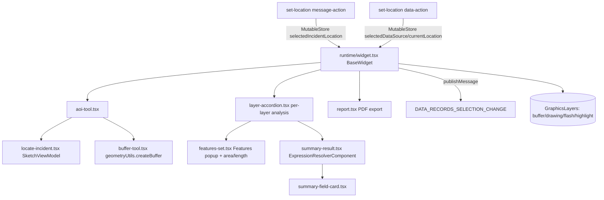

# OTB Widget: arcgis/near-me

Online widget doc: https://developers.arcgis.com/experience-builder/guide/near-me-widget/

> Analysis based on the ACTUAL bundled source under
> `ArcGISExperienceBuilder/client/dist/widgets/arcgis/near-me/` (gitignored).
> This is a LARGE widget (~34 non-translation source files). The architecture
> summary comes first, then the highest-value files are detailed. Sections
> marked UNVERIFIED were inferred from imports/call sites, not from reading the
> full function body (the biggest files, widget.tsx 3145 lines, layer-accordion
> 2714 lines, report 1414 lines, were read only in part).

## Purpose

Near Me lets a user define a location (draw a point/line/polygon, search an
address, use current location, or set location via a data/message action from
another widget) and analyze features from configured map layers that fall
within a buffered search area (or within the current map extent, or across all
features). It supports three per-layer analysis types - Closest, Proximity, and
Summary - and can highlight/clip results on the map, group/sort them, count
them, save the drawn geometry to feature layers, export results as output data
sources, and generate a printable PDF report.

## Source paths inspected

Root: `ArcGISExperienceBuilder/client/dist/widgets/arcgis/near-me/`

Fully or substantially read:
- `manifest.json` (92 lines) - full
- `config.json` (default config) - full
- `src/config.ts` (198 lines) - full (all config interfaces)
- `src/runtime/constant.ts` (65 lines) - full
- `src/version-manager.ts` - header + first upgrader
- `src/tools/builder-operations.ts` - header (translation-key extraction)
- `src/data-actions/set-location-data-action.ts` (104 lines) - full
- `src/message-actions/set-location-message-action.ts` (61 lines) - full
- `src/runtime/components/buffer-tool.tsx` (178 lines) - full
- `src/common/utils.ts` (449 lines) - imports + color/buffer-limit/getAllAvailableLayers/getSearchWorkflow/getOutputDsId/createSymbol
- `src/common/query-feature-utils.ts` (316 lines) - getALLFeatures/getSingleRecord/getQueryParams/getFeaturesCount/getGroupSubGroupFeatures/buildDateWhereClause
- `src/common/highlight-symbol-utils.ts` (326 lines) - getHighLightSymbol + point-symbol logic

Read in part (imports + key methods only; bodies too large to read fully):
- `src/runtime/widget.tsx` (3145 lines) - imports, State/ExtraProps, lifecycle
  (mount/update/unmount), createGraphicsLayers, clear/select message actions,
  geometriesByDsIdFromAction (union/buffer), createHighlightGraphicsForLayer
  (intersect/clip + area/length), main render
- `src/runtime/components/aoi-tool.tsx` (528 lines) - imports, Props/State,
  constructor, componentDidMount
- `src/setting/setting.tsx` (796 lines) - imports + map-selector wiring

Imports-only (to map dependencies and reusable patterns):
- `src/runtime/components/layer-accordion.tsx` (2714 lines)
- `src/runtime/components/report.tsx` (1414 lines)
- `src/runtime/components/summary-result.tsx` (225 lines)
- `src/runtime/components/locate-incident.tsx` (344 lines)
- `src/runtime/components/features-set.tsx` (668 lines)
- `src/runtime/components/summary-field-card.tsx` (126 lines)

Skipped (low value for this reference):
- `src/runtime/translations/*` and `src/setting/translations/*` (locale JS)
- `tests/` (excluded per instructions)
- `src/runtime/lib/style.ts`, `src/setting/lib/style.ts` (emotion CSS)
- `src/setting/constants.ts` and `src/setting/components/*` (11 builder-only
  setting panels: analysis-settings, search-settings, general-settings,
  layers-info, edit-analysis-popper, edit-summary-intersected-field-popper,
  summary-field-popper, color-setting-selector-popper, text-formatter,
  sidepopper-back-arrow) - only setting.tsx entry was inspected

## Architecture overview



Flow:
1. The widget binds one Map widget (`useMapWidgetIds[0]`) via
   `JimuMapViewComponent`. It is a `useMapWidget: false` config default, but the
   binding is added at runtime (see manifest `dependency: jimu-arcgis`).
2. A location is obtained one of four ways: drawn with the AOI/sketch tool,
   address search (`esri/rest/locator`), current-location, or set via the
   `locate` message-action / data-action from another widget (records ->
   geometries stored in the mutable store).
3. If a buffer distance > 0 is set, `geometryUtils.createBuffer` produces the
   search-area polygon. Multiple selected geometries of mixed types are combined
   with `unionOperator` (after buffering points/lines).
4. For each configured layer (`analysisSettings.layersInfo`) the widget queries
   features intersecting the search geometry (or current extent, or all
   features) and renders a `LayerAccordion` panel. Analysis type drives display:
   Closest (nearest feature + approx distance), Proximity (grouped/sorted list),
   Summary (sum/area/length statistics with Arcade expressions).
5. Results can be highlighted/clipped on the map (`intersectionOperator`),
   counted, exported as output data sources, and printed to PDF (`report.tsx`).

## Key imports and packages

Grouped by source file. JSAPI modules are imported via the `esri/*` webpack
alias (declared as `jimu-arcgis` dependency in the manifest).

### `src/runtime/widget.tsx`
- jimu-arcgis: `JimuMapView`, `JimuMapViewComponent`, `geometryUtils`,
  `MapViewManager`
- jimu-core: `BaseWidget`, `AllWidgetProps`, `getAppStore`, `lodash`,
  `DataSourceManager`, `DataSource`, `WidgetState`, `IMState`,
  `DataActionManager`, `Immutable`, `DataSourceTypes`, `ReactResizeDetector`,
  `DataLevel`, `QueryParams`, `QueriableDataSource`, `DataSourceStatus`,
  `dataSourceUtils`, `MessageManager`, `DataRecordsSelectionChangeMessage`,
  `css`, `DataRecordSet`, `DataAction`, `DataSourceComponent`,
  `MultipleDataSourceComponent`, `UrlManager`, `urlUtils`,
  `FeatureLayerDataSource`, `SubtypeGroupLayerDataSource`, `CONSTANTS`
- jimu-ui: `Loading`, `LoadingType`, `WidgetPlaceholder`, `Alert`, `Button`,
  `ConfirmDialog`, `Dropdown`, `DropdownButton`, `DropdownMenu`, `DropdownItem`,
  `Paper`, `Typography`, `Progress`
- jimu-theme: `colorUtils`
- jimu-icons: `RefreshOutlined`, `SaveOutlined`, `TrashOutlined`,
  `ExportOutlined`, `LeftOutlined`, `SelectOptionOutlined`
- esri geometry operators: `unionOperator`, `intersectionOperator`,
  `geodeticAreaOperator`, `areaOperator`, `geodeticLengthOperator`,
  `geodesicProximityOperator`, `lengthOperator`
- esri: `GraphicsLayer` (`esri/layers/GraphicsLayer`), `Graphic` (`esri/Graphic`),
  `FeatureForm` (`esri/widgets/FeatureForm`)

### `src/runtime/components/aoi-tool.tsx`
- jimu-arcgis: `geometryUtils`, `JimuMapView`
- esri: `Graphic`, `Geometry`, `SpatialReference`, `Polygon`, `Extent`,
  `esri/rest/locator` (address search)

### `src/runtime/components/locate-incident.tsx`
- esri: `GraphicsLayer`, `SketchViewModel` (`esri/widgets/Sketch/SketchViewModel`),
  `reactiveUtils` (`esri/core/reactiveUtils`), `Graphic`

### `src/runtime/components/layer-accordion.tsx`
- jimu-core: `DataActionManager`, `DataRecordSet`, `DataSourceManager`,
  `FeatureLayerDataSource`, `FeatureLayerQueryParams`, `OrderRule`,
  `dataSourceUtils`, `JimuFieldType`, `FieldSchema`, `QueriableDataSource`
- esri: `FeatureLayer`, `Graphic`, `esri/core/workers` (offloaded processing),
  operators `intersectionOperator` / `geodeticAreaOperator` / `areaOperator` /
  `geodeticLengthOperator` / `geodesicProximityOperator` / `lengthOperator` /
  `equalsOperator`

### `src/runtime/components/features-set.tsx`
- esri: `Features` (`esri/widgets/Features` - popup-style feature display),
  `reactiveUtils`, `GraphicsLayer`, `Graphic`, operators (area/length/intersect)

### `src/runtime/components/summary-result.tsx`
- jimu-core: `Expression`, `ExpressionResolverComponent`, `QueriableDataSource`,
  `FeatureLayerQueryParams`; jimu-ui: `richTextUtils`; jimu-theme: `colorUtils`

### `src/runtime/components/report.tsx`
- jimu-arcgis: `loadArcGISJSAPIModules`; esri: `reactiveUtils`

### `src/common/*`
- `query-feature-utils.ts`: esri `Geometry`, `SpatialReference`; jimu-core
  `FeatureLayerQueryParams`, `DataRecord`, `utils`
- `highlight-symbol-utils.ts`: esri `Graphic`, `Color`,
  `esri/symbols/support/jsonUtils`
- `utils.ts`: jimu-core `loadArcGISJSAPIModule` (dynamic, for
  `esri/symbols/support/symbolUtils`), `DataSourceManager`, `MapViewManager`

### `src/setting/setting.tsx`
- jimu-for-builder: `BaseWidgetSetting`, `AllWidgetSettingProps`
- jimu-ui/advanced/setting-components: `MapWidgetSelector`,
  `MultipleJimuMapConfig`, `MultipleJimuMapValidateResult`, `SettingRow`,
  `SettingSection`
- jimu-arcgis: `JimuMapView`, `loadArcGISJSAPIModules`, `MapViewManager`

## Reusable patterns found

- **JimuMapView binding**: single `<JimuMapViewComponent useMapWidgetId={...}
  onActiveViewChange={this.onActiveViewChange}>`; the active view is stored in
  `state.jimuMapView` and graphics layers are (re)created on view change.
- **DataSourceComponent / MultipleDataSourceComponent**: `renderDataSourceComponent`
  provides the analysis layers; `MultipleDataSourceComponent` +
  `onDataSourceInfoChange` is used to react to pre-selected records on load
  (URL parameters -> `UrlManager` + `urlUtils.getDataSourceInfosFromUrlParams`).
- **Geometry operators (core analysis engine)**:
  - `unionOperator.executeMany(...)` to merge multiple selected geometries.
  - `geometryUtils.createBuffer(geometry, [distance], unit)` for the search area
    (also used to buffer points/lines before union of mixed geometry types).
  - `intersectionOperator.execute(featureGeom, searchAreaGeom)` to clip result
    features to the buffer.
  - `geodeticAreaOperator` / `areaOperator` and `geodeticLengthOperator` /
    `lengthOperator` to compute clipped area/length (geodesic vs planar chosen
    by spatial reference).
  - `geodesicProximityOperator` (loaded in `componentDidMount`) for Closest /
    approximate-distance calculations. UNVERIFIED exact call site (layer-accordion.tsx).
- **Operator lifecycle**: operators that need it are explicitly loaded before
  use (`geodeticLengthOperator.load()`, `geodeticAreaOperator.load()`,
  `geodesicProximityOperator.load()` in `componentDidMount`).
- **Multi-DS / multi-layer analysis**: each `layersInfo` entry has its own
  `useDataSource` + `analysisInfo`; results become their own output data
  sources via `getOutputDsId(widgetId, analysisType, analysisId)`.
- **set-location message action + data action**: both write to the widget
  mutable store (`MutableStoreManager.updateStateValue`) keys
  `selectedIncidentLocation` / `selectedDataSource` / `currentLocation`, which
  the runtime reads via `mapExtraStateProps` and `mutableStatePropsVersion`.
- **publishMessage DATA_RECORDS_SELECTION_CHANGE**: selecting a result record
  publishes `new DataRecordsSelectionChangeMessage(this.props.id, [record],
  [record.dataSource?.id])` and clears with an empty-records message.
- **GraphicsLayer drawing**: four dedicated layers (`bufferLayer`,
  `drawingLayer`, `flashLayer` with a `bloom` effect, `highlightLayer`), all
  `listMode: 'hide'`, added with `map.addMany([...])`; per-analysis highlight
  layers are pushed into `highlightGraphicsLayers` and reordered to top.
- **Sketch drawing**: `locate-incident.tsx` uses
  `esri/widgets/Sketch/SketchViewModel` + `reactiveUtils` for point/line/polygon
  creation.
- **Feature popup display**: `features-set.tsx` uses `esri/widgets/Features`.
- **Save geometry to layer**: `esri/widgets/FeatureForm` (incident + buffer
  forms) with `applyEdits` to persist the drawn AOI.
- **Symbol rendering in DOM**: `createSymbol` uses
  `esri/symbols/support/symbolUtils.renderPreviewHTML` to render a layer symbol
  into a React ref node.
- **Batch querying**: `getALLFeatures` uses `ds.queryAll(...)`; counts via
  `ds.queryCount`; statistics via `groupByFieldsForStatistics` + `outStatistics`.
  All queries pass `excludeQuery: { widgetId: 'filter-data-record-action', ... }`
  so the widget's own filter action does not recurse.
- **Summary via Arcade**: `summary-result.tsx` resolves `Expression`s with
  `ExpressionResolverComponent`.

## Builder vs runtime split

- **Runtime** (`src/runtime/*`): the `Widget` class, AOI/buffer/locate tools,
  layer accordion, features set, summary result, report, plus common utils.
- **Builder** (`src/setting/*`): `setting.tsx` extends `BaseWidgetSetting`,
  binds the Map widget with `MapWidgetSelector` and `MultipleJimuMapConfig`,
  and delegates to per-section panels (general/search/analysis settings) that
  write into `config.configInfo[dataSourceId]`. Config is keyed per map data
  source id (`initialMapDataSourceID`), so each webmap/webscene DS keeps its own
  `analysisSettings` + `searchSettings`.
- **Shared** (`src/common/*`, `src/config.ts`, `src/version-manager.ts`): types,
  query helpers, symbol helpers used by both sides.
- **Extensions**: `src/tools/builder-operations.ts` implements
  `extensionSpec.BuilderOperationsExtension.getTranslationKey` to expose
  user-entered text (no-results message, prompt text) to the translation system.

## Lifecycle and cleanup

- `componentDidMount`: loads geometry operators; checks mutable-store props for
  an incoming set-location action and kicks off analysis.
- `componentDidUpdate`: reacts to widget open/close/hidden state (deactivate
  sketch tools, optionally clear results when `keepResultsWhenClosed` is false),
  map-widget changes, active-data-source changes, and deep config changes
  (search settings diff triggers geometry reset + requery).
- `componentWillUnmount = () => { this.onClear() }` - single cleanup entry point.
- `createGraphicsLayers` destroys any existing buffer/drawing/flash/highlight
  layers (`.destroy()`) before recreating them, preventing orphaned layers on
  map/view changes.
- AbortControllers (`abortControllerRef`) cancel in-flight queries; queries
  check `signal.aborted` before resolving.

## Manifest/config requirements

- `dependency: "jimu-arcgis"` (map + JSAPI).
- `properties`: `canConsumeDataAction: true`, `canGenerateMultipleOutputDataSources:
  true`, `needHiddenState: true`, `showDescription: true`.
- `publishMessages: ["DATA_RECORDS_SELECTION_CHANGE"]`.
- `messageActions` + `dataActions`: both named `locate` ("Set location"),
  pointing at `message-actions/set-location-message-action` and
  `data-actions/set-location-data-action`.
- `excludeDataActions`: table/elevation-profile/setFilter/addToMap/etc. are
  excluded so they do not appear on Near Me output.
- Default config (`config.json`): `useMapWidget: false`, a `generalSettings`
  block (highlight color, search-area symbol, keepResultsWhenClosed,
  urlParametersEnabled, no-results/prompt text + font style), and an empty
  `configInfo` map populated per data source at design time.

## Gotchas

- **Operators must be loaded**: geodetic/proximity operators are async-loaded in
  `componentDidMount`; calling them before load throws. New code using
  additional operators should follow the same `isLoaded()/load()` guard.
- **Per-data-source config**: `config.configInfo` is keyed by map DS id, not a
  flat list. The data-action falls back to `Object.keys(configInfo)[0]` when
  `initialMapDataSourceID` is missing (first webmap, single map case).
- **Mixed geometry union**: when incoming action geometries have different types,
  points/lines/multipoints are buffered by 0.1 m first, then unioned with
  polygons, so the search area is always a single polygon.
- **Selection-view guard**: message-action select/clear is skipped when the
  record's data source is a selection data view
  (`CONSTANTS.SELECTION_DATA_VIEW_ID`) to avoid feedback loops; `skipDsInfoChange`
  / `skipHighlightRecordsOnMap` flags prevent re-entrant highlighting.
- **Query recursion guard**: every query passes
  `excludeQuery: { widgetId: 'filter-data-record-action', dataSourceId: ds.id }`.
- **Current-map-area disables Set location data action**: `isSupported` returns
  false when `searchByActiveMapArea` is on, when no analysis layers are
  configured, when the DS is NotReady, or when it has no spatial info.
- **Buffer distance caps**: `getMaxBufferLimit` enforces per-unit maxima
  (e.g. miles 1000, meters 1,609,344); `validateMaxBufferDistance` clamps on
  unit change.
- **UNVERIFIED**: the exact Proximity/Closest/Summary computation bodies live in
  `layer-accordion.tsx` (2714 lines, read via imports only) and were not fully
  read; treat those flow details as inferred.

## Useful snippets and functions

Source: `src/runtime/widget.tsx` (componentDidMount - operator loading)
```tsx
componentDidMount = async () => {
  if (!geodeticLengthOperator.isLoaded()) {
    await geodeticLengthOperator.load()
  }
  if (!geodeticAreaOperator.isLoaded()) {
    await geodeticAreaOperator.load()
  }
  if (!geodesicProximityOperator.isLoaded()) {
    await geodesicProximityOperator.load()
  }
  // ...read set-location mutable-store props and start analysis
}
```

Source: `src/runtime/widget.tsx` (createGraphicsLayers - destroy then recreate)
```tsx
createGraphicsLayers = () => {
  if (this.bufferLayer) { this.bufferLayer.destroy() }
  if (this.drawingLayer) { this.drawingLayer.destroy() }
  if (this.flashLayer) { this.flashLayer.destroy() }
  if (this.highlightLayer) { this.highlightLayer.destroy() }
  this.bufferLayer = new GraphicsLayer({ listMode: 'hide' })
  this.drawingLayer = new GraphicsLayer({ listMode: 'hide' })
  this.highlightLayer = new GraphicsLayer({ listMode: 'hide' })
  this.flashLayer = new GraphicsLayer({ listMode: 'hide', effect: 'bloom(0.8, 1px, 0)' })
  this.state.jimuMapView?.view?.map?.addMany([this.bufferLayer, this.drawingLayer, this.flashLayer, this.highlightLayer])
}
```

Source: `src/runtime/widget.tsx` (mixed-type union with pre-buffer of points/lines)
```tsx
let unionGeometry = null
if (uniqueGeometryTypes.length === 1) {
  if (geometryByTypes[uniqueGeometryTypes[0]].length > 1) {
    unionGeometry = unionOperator.executeMany(geometryByTypes[uniqueGeometryTypes[0]]) // union
  } else {
    unionGeometry = geometryByTypes[uniqueGeometryTypes[0]][0]
  }
} else if (uniqueGeometryTypes.length > 1) {
  let pointLineArray = geometryByTypes.point.concat(geometryByTypes.polyline)
  pointLineArray = pointLineArray.concat(geometryByTypes.multipoint)
  const bufferGeometry: any = await geometryUtils.createBuffer(pointLineArray, [0.1], 'meters')
  const allPolygonsArray = bufferGeometry.concat(geometryByTypes.polygon)
  unionGeometry = unionOperator.executeMany(allPolygonsArray) // union
}
```

Source: `src/runtime/widget.tsx` (clip result feature to search area + measure)
```tsx
if (clipFeatures && this.state.aoiGeometries?.incidentGeometry) {
  const clippedGeometry = intersectionOperator.execute(
    feature.geometry,
    (this.state.aoiGeometries.bufferGeometry ?? this.state.aoiGeometries.incidentGeometry) as __esri.GeometryUnion
  )
  if (clippedGeometry) { graphic.geometry = clippedGeometry }
  if (clippedGeometry?.type === 'polygon') {
    const area = this.getArea([record], clippedGeometry, this.state.aoiGeometries.distanceUnit || this.state.searchSettings.distanceUnits || getPortalUnit())
    feature.attributes = { ...graphic.attributes, esriCTClippedInfo: Number(area).toString() }
  } else if (clippedGeometry?.type === 'polyline') {
    const length = this.getLength([record], clippedGeometry, this.state.aoiGeometries.distanceUnit || this.state.searchSettings.distanceUnits || getPortalUnit())
    feature.attributes = { ...graphic.attributes, esriCTClippedInfo: Number(length).toString() }
  }
}
```

Source: `src/runtime/widget.tsx` (buffer-area via geodetic vs planar operator)
```tsx
if (searchByLocation && aoiGeometries.bufferGeometry !== null && aoiGeometries.bufferGeometry.type === 'polygon') {
  const sr = aoiGeometries.bufferGeometry.spatialReference
  // geodeticAreaOperator when SR is geographic/wgs, areaOperator otherwise (see surrounding branch)
  value = geodeticAreaOperator.execute(aoiGeometries.bufferGeometry as __esri.Polygon, { unit: ('square-' + aoiGeometries.distanceUnit) as __esri.AreaUnit })
  // else: value = areaOperator.execute(aoiGeometries.bufferGeometry as __esri.Polygon, { unit: ... })
}
```

Source: `src/runtime/widget.tsx` (publish/clear record-selection message)
```tsx
// select
MessageManager.getInstance().publishMessage(
  new DataRecordsSelectionChangeMessage(this.props.id, [record], [record.dataSource?.id])
)
record.dataSource?.selectRecordsByIds([record.getId()], [record])
// clear
MessageManager.getInstance().publishMessage(
  new DataRecordsSelectionChangeMessage(this.props.id, [], [this.selectedRecord?.dataSource?.id])
)
this.selectedRecord?.dataSource?.clearSelection()
```

Source: `src/runtime/components/buffer-tool.tsx` (buffer generation)
```tsx
getBufferGeometry = async () => {
  if (this.props.geometry) {
    if (this.state.bufferDistance && this.state.distanceUnit && this.state.bufferDistance > 0) {
      const bufferGeometry = await geometryUtils.createBuffer(this.props.geometry, [this.state.bufferDistance], this.state.distanceUnit)
      const firstGeom = Array.isArray(bufferGeometry) ? bufferGeometry[0] : bufferGeometry
      this.props.bufferComplete(firstGeom)
    } else {
      this.props.bufferComplete(null)
    }
  }
}
```

Source: `src/message-actions/set-location-message-action.ts` (action -> mutable store)
```ts
filterMessageDescription (messageDescription: MessageDescription): boolean {
  return messageDescription.messageType === MessageType.DataRecordsSelectionChange ||
    messageDescription.messageType === MessageType.LocationChange
}
// onExecute: group record geometries by ds id, resolve incomplete geometries, then:
MutableStoreManager.getInstance().updateStateValue(this.widgetId, 'selectedIncidentLocation', geometriesByDsId)
// or for a LocationChange point:
MutableStoreManager.getInstance().updateStateValue(this.widgetId, 'currentLocation', new Point((message as LocationChangeMessage).point))
```

Source: `src/data-actions/set-location-data-action.ts` (guard rules)
```ts
const checkForConfiguredAnalysis = configSettings?.analysisSettings?.layersInfo?.length > 0
if (!checkForConfiguredAnalysis) { return Promise.resolve(false) }
if (configSettings?.searchSettings?.searchByActiveMapArea) { return Promise.resolve(false) }
if (!dataSource || dataSource.getStatus() === DataSourceStatus.NotReady) { return Promise.resolve(false) }
const supportSpatialInfo = dataSource?.supportSpatialInfo && dataSource?.supportSpatialInfo()
if (!supportSpatialInfo) { return Promise.resolve(false) }
```

Source: `src/common/query-feature-utils.ts` (build FeatureLayerQueryParams)
```ts
const query: FeatureLayerQueryParams = {}
if (queryGeometry) {
  query.geometry = queryGeometry.toJSON() // toJSON to avoid invalid geometry in request
  query.geometryType = utils.getGeometryType(queryGeometry)
}
query.outFields = outFieldsArr
query.returnGeometry = returnGeometry
query.notAddFieldsToClient = true
```

Source: `src/common/query-feature-utils.ts` (grouped statistics count)
```ts
query.orderByFields = [groupField + ' ' + sortOrder]
query.groupByFieldsForStatistics = [groupField]
query.outStatistics = [{
  onStatisticField: ds.layer.objectIdField,
  outStatisticFieldName: 'feature_count',
  statisticType: 'count'
}]
```

Source: `src/common/utils.ts` (search workflow resolution)
```ts
export const getSearchWorkflow = (searchSettings: SearchSettings): SearchWorkflow => {
  const workflow: SearchWorkflow = { searchByLocation: false, searchCurrentExtent: false, showAllFeatures: false }
  if (searchSettings) {
    const { searchByActiveMapArea, includeFeaturesOutsideMapArea } = searchSettings
    if (searchByActiveMapArea) {
      if (includeFeaturesOutsideMapArea) { workflow.showAllFeatures = true }
      else { workflow.searchCurrentExtent = true }
    } else { workflow.searchByLocation = true }
  }
  return workflow
}
```

Source: `src/common/utils.ts` (output data source id + symbol preview node)
```ts
export const getOutputDsId = (widgetId: string, layerAnalysisType: string, analysisId: string): string =>
  `${widgetId}_output_${layerAnalysisType}_${analysisId}`

// createSymbol: renders a layer symbol into a React ref DOM node
const symbolUtils = await loadArcGISJSAPIModule('esri/symbols/support/symbolUtils')
symbolUtils.getDisplayedSymbol(selectedRecord.feature as __esri.Graphic).then(async (symbol) => {
  await symbolUtils.renderPreviewHTML(symbol as __esri.Symbol, { node: nodeHtml })
})
```

Source: `src/common/highlight-symbol-utils.ts` (geometry-type highlight dispatch)
```ts
export const getHighLightSymbol = (graphic: __esri.Graphic, color?: string): __esri.Graphic => {
  if (!color) { color = '#00FFFF' }
  switch (graphic?.geometry?.type) {
    case 'point':
    case 'multipoint': return getPointSymbol(graphic, color)
    case 'polyline': return getPolyLineSymbol(graphic, color)
    case 'polygon': return getPolygonSymbol(graphic, color)
    default: return null
  }
}
```
