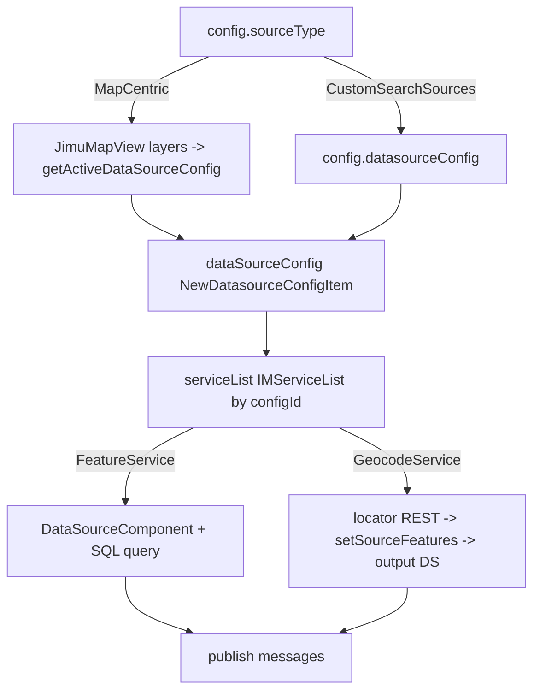

# OTB Widget: common/search

Online widget doc: https://developers.arcgis.com/experience-builder/guide/search-widget/

> Analysis of the ArcGIS Experience Builder OOTB Search widget as shipped in this repo's local runtime (v1.20.0). Source is the compiled/transpiled `dist` copy (gitignored), inspected read-only. All snippets below are copied from that ACTUAL source; anything I could not confirm from source is tagged UNVERIFIED.

## Purpose
The Search widget lets an app user find features and geocoded places from one input box. It supports two mutually exclusive source modes: a map-centric mode that derives searchable sources from a bound Map widget, and a custom-sources mode where the author configures feature-layer data sources and/or geocode (locator) services. Results can be shown in an in-widget result panel or pushed to other widgets via output data sources and framework messages. It publishes selection, record-set, and filter messages so downstream widgets (map, list, table) react to a search.

## Source paths inspected
Root: `ArcGISExperienceBuilder/client/dist/widgets/common/search/`

Inspected (highest value):
- `manifest.json` - publishMessages, properties (`canGenerateMultipleOutputDataSources`), extensions, urlParameters.
- `src/config.ts` - full config/type surface (SourceType, SearchServiceType, service list item shapes).
- `src/runtime/widget.tsx` - top-level orchestration, JimuMapView bridge, service-list building.
- `src/runtime/component/create-datasource.tsx` - dynamic `DataSourceComponent` creation per source.
- `src/runtime/component/search.tsx` (partial: imports + message-publishing region ~lines 1-120, 670-720) - message publishing.
- `src/runtime/utils/utils.ts` (partial: message action region ~lines 340-410) - `publishRecordCreatedMessageAction`.
- `src/runtime/utils/search-service.ts` - feature-layer query/suggest/SQL helpers.
- `src/runtime/utils/locator-service.ts` - geocode addressToLocations / suggest / reverse geocode / current location.
- `src/utils/geocode-utils.ts` (partial) - world-geocoder URL detection.
- `src/setting/setting.tsx` - settings composition.
- `src/setting/utils/util.ts` (grep) - `messageActionUtils` usage for map actions.
- `src/version-manager.ts` (partial) - config upgraders.

Skipped given size (noted, not read in full):
- `src/runtime/component/suggestion-list.tsx`, `result-list.tsx`, `location-and-recent-searches.tsx`, `utility-remind.tsx`, `search-setting.tsx`, `resultPopper/index.tsx` - UI rendering detail; only their roles are summarized.
- `src/runtime/utils/convert-SR.ts`, `utils/utils.ts` (bulk) - large helper file; only message + status helpers inspected.
- `src/setting/component/*` - settings sub-panels (data setting, arrangement, result options, placeholder).
- `src/tools/app-config-operations.ts`, `builder-operations.ts` - confirmed present via grep, class shape only.
- `dist/`, `translations/`, `assets/`, tests - excluded per instructions.

## Architecture overview
This is a multi-source search, not a single-service widget. Two source modes are gated by `config.sourceType` (`SearchServiceType`... actually `SourceType`):

- MapCentric: requires a bound Map widget (`useMapWidgetIds[0]`). On active-view change the widget reads `config.dataSourceConfigWithMapCentric[viewId]`, optionally merges default world-geocoder config, and builds an active data-source config from the map's layers via `getActiveDataSourceConfig(jimuMapView, config, defaultGeocodeDataConfigs)`.
- CustomSearchSources: uses `config.datasourceConfig` (an array of `SearchDataConfig`) directly.

Both modes funnel into one internal shape: `dataSourceConfig` (array of `NewDatasourceConfigItem`, each carrying `enable`) -> `serviceList` (`IMServiceList`, keyed by `configId`). Each service list item is one of two variants:
- `SearchServiceType.FeatureService` -> queries an EXB `DataSource` with SQL.
- `SearchServiceType.GeocodeService` -> calls an ArcGIS locator REST service and writes results into a dynamically created output feature data source.

`create-datasource.tsx` renders one `DataSourceComponent` per active service item, so data sources are created/queried reactively as the service list changes. `search.tsx` owns the input, suggestions, result popper, and the message publishing. The widget also honors a `search_status` URL parameter to restore enabled sources and last search text.



## Key imports and packages
Grouped by concern; file path shown per group.

Framework core (`jimu-core`):
- `src/runtime/widget.tsx`: `React, css, jsx, AllWidgetProps, Immutable, DataSourceStatus, UtilityManager, ViewVisibilityContext, PageVisibilityContext, hooks`.
- `src/runtime/component/create-datasource.tsx`: `DataSourceComponent, Immutable, DataSourceStatus`.
- `src/runtime/component/search.tsx`: `MessageManager, DataRecordsSelectionChangeMessage, DataRecordSetChangeMessage, DataSourceFilterChangeMessage, RecordSetChangeType, AppMode, ReactRedux, IMState, hooks, QueriableDataSource`.
- `src/runtime/utils/utils.ts`: `DataSourceManager, MessageManager, DataRecordSetChangeMessage, RecordSetChangeType, getAppStore, urlUtils, UrlManager, dataSourceUtils, loadArcGISJSAPIModules`.
- `src/runtime/utils/search-service.ts`: `DataSourceManager, dataSourceUtils, QueriableDataSource, FeatureLayerDataSource, QueryParams, ClauseLogic, SqlExpression`.

Map bridge (`jimu-arcgis`):
- `src/runtime/widget.tsx`: `JimuMapViewComponent, JimuMapView`.
- `src/runtime/utils/locator-service.ts` and `search-service.ts`: `loadArcGISJSAPIModules`, `JimuMapView` (type).

ArcGIS Maps SDK modules (loaded lazily, geocoding is REST):
- `src/runtime/utils/locator-service.ts`: `loadArcGISJSAPIModules(['esri/rest/locator', 'esri/geometry/SpatialReference'])`; calls `locator.addressToLocations`, `locator.suggestLocations`, `locator.locationToAddress`. This is the geocoding REST surface (esri/rest/locator wraps the geocode server request).
- `src/version-manager.ts`: `loadArcGISJSAPIModules(['esri/request'])` to probe a locator's `capabilities` (Suggest support) via a raw REST request.

UI / builder:
- `src/runtime/component/search.tsx`: `jimu-ui` (`TextInput, Button, Link, Loading, LoadingType`), `jimu-icons` (`SearchOutlined`), `jimu-theme` (`useTheme`).
- `src/config.ts`: types re-exported from `jimu-ui/advanced/setting-components` (`SearchSuggestionConfig, SearchGeocodeDataConfig, SearchLayerDataConfig, SearchDataConfig, DataSourceConfigWithMapCentric`).
- `src/setting/setting.tsx`: `AllWidgetSettingProps` from `jimu-for-builder`.
- `src/setting/utils/util.ts`: `AppMessageManager, getAppConfigAction` (`jimu-for-builder`); `messageActionUtils` from `jimu-ui/advanced/builder-components`.

REST types:
- `src/config.ts`: `ISpatialReference` re-exported from `@esri/arcgis-rest-feature-service`.

## Reusable patterns found

- JimuMapView binding (only in MapCentric mode). `renderMapContent` mounts `JimuMapViewComponent` with `useMapWidgetId={useMapWidgetIds?.[0]}` and `onActiveViewChange`. Active-view change is tracked to detect map swaps:
  ```tsx
  // src/runtime/widget.tsx
  const handleActiveViewChange = (jimuMapView: JimuMapView): void => {
    jimuMapViewChangedRef.current = jimuMapViewRef.current?.id !== jimuMapView?.id;
    jimuMapViewRef.current = jimuMapView;
    setJimuMapView(jimuMapView);
  };
  ```

- Multi-source search. All configs are normalized to one `serviceList` keyed by `configId`, discriminated by `searchServiceType`. `initServiceList` skips disabled items and dispatches to `initDatasourceList` (feature) or `initGeocodeList` (geocode).

- Dynamic output data source creation (`create-datasource.tsx`). One `DataSourceComponent` is rendered per active source. Feature sources bind a real `useDataSource` with a computed SQL `query`; geocode sources bind the pre-created OUTPUT data source and write candidates into it. For layer sources, a local data source id (`localId`) is used so filtering does not mutate the shared main DS:
  ```tsx
  // src/runtime/component/create-datasource.tsx (FeatureService branch)
  <DataSourceComponent
    useDataSource={Immutable(useDataSource)}
    query={layerHadSendQuery ? query : null}
    onDataSourceInfoChange={info => { handleRecordChange(serviceListItem, configId); }}
    onSelectionChange={selection => { onSelectionChange(selection, configId); }}
    onDataSourceCreated={ds => { localId && ds.setListenSelection(true); }}
    onDataSourceStatusChange={status => { handleDsStatusChange(configId, status); }}
    onCreateDataSourceFailed={err => { handleDsStatusChange(configId, DataSourceStatus.CreateError); }}
    localId={localId}
    widgetId={!localId ? id : null}
  />
  ```

- Geocoding service (REST via esri/rest/locator). Address search, suggestions, and reverse geocode all lazy-load the SDK locator module. Candidates are converted to graphics and pushed into a feature output DS with `setSourceFeatures`:
  ```ts
  // src/runtime/utils/locator-service.ts
  return locator.addressToLocations(geocodeURL, params, { query: {} }).then(response => {
    response = response.sort((a, b) => { return b.score - a.score; });
    response = response.filter((item) => { return !!item?.location; });
    reportUtilitySuccess(useUtility?.utilityId);
    return response;
  }, err => {
    pWinSt.error(err.message);
    const isReportUtilityState = checkIsReportUtilityState(useUtility?.utilityId, err);
    reportUtilityState(useUtility?.utilityId, err);
    return isReportUtilityState ? err : [];
  });
  ```
  Reverse geocode / current location:
  ```ts
  // src/runtime/utils/locator-service.ts
  export const getCurrentLocation = (onSuccess, onError) => {
    if (navigator.geolocation) {
      const options = { enableHighAccuracy: true, timeout: 3000, maximumAge: 10000 };
      navigator.geolocation.getCurrentPosition(onSuccess, onError, options);
    } else {
      onError && onError();
    }
  };
  // getCurrentAddress(...) -> locator.locationToAddress(geocodeURL, { location, outSpatialReference }, { query: {} })
  ```

- publishMessage. Three message types are declared in the manifest and published from source:
  - `DATA_RECORDS_SELECTION_CHANGE` via `new DataRecordsSelectionChangeMessage(id, [], datasourceIds)` (search.tsx `clearSelectRecordAndAction`).
  - `DATA_RECORD_SET_CHANGE` via `new DataRecordSetChangeMessage(...)` (search.tsx clear/remove; `publishRecordCreatedMessageAction` in utils/utils.ts for created records, including an `extent` payload for zoom-to).
  - `DATA_SOURCE_FILTER_CHANGE` via `new DataSourceFilterChangeMessage(id, datasourceIds, clearFilterDataSourceIds)` (search.tsx `publishDataFilterAction`).
  ```ts
  // src/runtime/utils/utils.ts (publishRecordCreatedMessageAction)
  const dataRecordSetChangeMessage = new DataRecordSetChangeMessage(widgetId, recordSetChangeType, outputRecordResult);
  if (extent) { dataRecordSetChangeMessage.extent = extent; }
  MessageManager.getInstance().publishMessage(dataRecordSetChangeMessage);
  ```

- canGenerateMultipleOutputDataSources. `manifest.json` sets `properties.canGenerateMultipleOutputDataSources: true`; each geocode source owns its own `outputDataSourceId`, so one widget instance can emit several output DS. Feature-layer output data sources are declared through the same mechanism.

- Suggestion config. `config extends SearchSuggestionConfig` (from `jimu-ui/advanced/setting-components`), giving `maxSuggestions`, `isShowRecentSearches`, `recentSearchesMaxNumber`, `allowSearchSourceSelection`, `enableFiltering`. Feature suggestions use `dataSourceUtils.querySuggestions`; geocode suggestions use `locator.suggestLocations` gated by the service's `isSupportSuggest` capability.

- version-manager. `Widget.versionManager = versionManager`; `VersionManager extends BaseVersionManager` with dated upgraders (e.g. 1.9.0 backfills geocode `displayFields`; 1.10.0 probes locator `capabilities` to persist `isSupportSuggest`).

- Local recent searches. Persisted under `RECENT_SEARCHES_KEY = 'recent_searches'` (config.ts), capped by `MAX_RECENT_SEARCHES`.

## Builder vs runtime split
- Runtime: `src/runtime/**` (`widget.tsx`, `component/*`, `utils/*`). Reads config, binds JimuMapView, creates data sources, queries services, publishes messages.
- Builder/settings: `src/setting/**`. `setting.tsx` composes `CustomSearchDataSetting`, `SearchResultSetting`, `ArrangementStyleSetting`, and a `Placeholder` (shown when MapCentric but no map bound and not Express mode). `src/setting/utils/util.ts` wires map message actions (Show-on-map / Zoom-to) through `messageActionUtils`, `AppMessageManager`, and `getAppConfigAction`.
- Extensions (manifest `extensions`): `tools/app-config-operations` (`AppConfigOperationsExtension`) and `tools/builder-operations` (`BuilderOperationsExtension`) hook the app-config lifecycle (e.g. adding/removing output data sources and default message actions).
- Version upgraders (`src/version-manager.ts`) run on config load and can be async (they call SDK modules / REST).

## Lifecycle and cleanup
- Config-driven init: the main `useEffect` in `widget.tsx` reacts to `[config, jimuMapView, useMapWidgetIds]`. When not MapCentric it clears `jimuMapView`; when MapCentric with a map it shows loading and rebuilds the active config.
- View / page visibility: rendering is wrapped in `ViewVisibilityContext.Consumer` and `PageVisibilityContext.Consumer`, and those flags are passed into `SearchInput` (`isInCurrentView`, `isWidgetInCurrentPage`) to avoid acting when hidden.
- Output DS message cleanup: `outputDsIdsRef` tracks current output DS ids. When the service list changes, `clearDataRecordSetChangeMessageWhenOutputDsChange` publishes a `RecordSetChangeType.Remove` `DataRecordSetChangeMessage` for the OLD ids so downstream widgets drop stale records:
  ```ts
  // src/runtime/component/search.tsx
  const dataRecordSetChangeMessage = new DataRecordSetChangeMessage(id, RecordSetChangeType.Remove, outputDsIdsRef.current);
  MessageManager.getInstance().publishMessage(dataRecordSetChangeMessage);
  ```
- Selection cleanup on re-search: `clearSelectRecordAndAction` publishes an empty `DataRecordsSelectionChangeMessage`, deselects records on the previously selected DS (`ds.selectRecordsByIds([])`), and resets output DS status.
- Utility health reporting: locator failures call `UtilityManager.getInstance().reportUtilityState(...)` (and `reportUtilitySuccess` on success) so the app tracks broken geocode utilities and sign-in errors.
- Timers: several `useRef` timeout handles exist in `search.tsx` (e.g. `clearSearchValueTimeoutRef`, `inputBlurTimeoutRef`, `confirmSearchByInUrlSearchTextTimeout`). UNVERIFIED whether every one is cleared on unmount (the cleanup region of `search.tsx` was not fully read).

## Manifest/config requirements
From `manifest.json`:
- `publishMessages`: `DATA_RECORDS_SELECTION_CHANGE` (BOTH_DATA_SOURCE), `DATA_RECORD_SET_CHANGE` (OUTPUT_DATA_SOURCE), `DATA_SOURCE_FILTER_CHANGE` (BOTH_DATA_SOURCE).
- `properties`: `hasSettingPage: true`, `canGenerateMultipleOutputDataSources: true`, `defaultInControllerUx: "offPanel"`, `canCrossLayoutBoundary: true`.
- `defaultSize`: `{ width: 400, height: 34, autoHeight: true }`.
- `urlParameters`: `search_status` (restore enabled sources + text).
- `extensions`: `appConfigOperations` -> `tools/app-config-operations`; `builderOperations` -> `tools/builder-operations`.

Key `config.ts` fields: `sourceType` (`SourceType.MapCentric | CustomSearchSources`), `dataSourceConfigWithMapCentric` (per map view id), `datasourceConfig: SearchDataConfig[]`, `searchResultView` (`Result_Panel | Other_Widgets`), `arrangementStyle` (`Style1..3`), `searchResultStyle` (`Classic | Compact`), `resultMaxNumber`, `isAutoSelectFirstResult`, `linkParam`, `autoCollapseOnSelection`, plus inherited `SearchSuggestionConfig` (`maxSuggestions`, `isShowRecentSearches`, `recentSearchesMaxNumber`, `allowSearchSourceSelection`, `enableFiltering`).

Constants (`config.ts`): `DEFAULT_MAX_RESULT = 6`, `MAX_RESULT = 1000`, `MAX_SUGGESTION = 1000`, `MAX_RECENT_SEARCHES = 6`, `DEFAULT_SPATIAL_REFERENCE = { wkid: 4326 }`, `DEFAULT_GEOCODE_KEY = 'default_geocode'`.

## Gotchas
- `1=1` / `1=0` / `2=2` sentinel `where` clauses are load-order workarounds, not literal filters. Geocode output DS is loaded with `where: '2=2'` specifically because `1=1` collides with the framework's data-filtering detection when the same DS id runs two queries; changing these strings can break record loading (see the inline comments in `create-datasource.tsx` and `locator-service.ts`).
- Feature searches use a `localId` so per-widget filtering does not mutate the shared main data source, and require `ds.setListenSelection(true)` on `onDataSourceCreated` to receive selection changes.
- `allowSearchSourceSelection === false` forces every source enabled and hides the source-selection UI; several helpers special-case the strict `=== false` check (Immutable can yield `undefined`).
- Geocode suggestions only fire when the service's `isSupportSuggest` is true; that flag is derived from the locator's REST `capabilities` and backfilled by the 1.10.0 upgrader, so older configs may need the upgrade to show suggestions.
- MapCentric mode is inert without a bound Map widget: the settings panel shows a `Placeholder` and runtime clears the config.
- Geocoding does NOT use `@esri/arcgis-rest-*` for queries; it lazy-loads the SDK `esri/rest/locator` module. Only the `ISpatialReference` type comes from `@esri/arcgis-rest-feature-service`. Do not assume a REST-JS client is present.
- The output-DS remove message must fire with the OLD output ds ids before switching; forgetting it leaves stale records in the map/list.

## Useful snippets and functions

Building the discriminated service list (source: `src/runtime/widget.tsx`):
```tsx
const initServiceList = (newDatasourceConfig) => {
  let newServiceList = Immutable({});
  newDatasourceConfig?.asMutable({ deep: true })?.forEach(configItem => {
    if (!configItem?.enable) return false;
    const { configId } = configItem;
    let newDatasourceListItem;
    if (configItem?.searchServiceType === SearchServiceType.GeocodeService) {
      newDatasourceListItem = initGeocodeList(configItem);
    } else {
      newDatasourceListItem = initDatasourceList(configItem);
    }
    newServiceList = newServiceList.setIn([configId], newDatasourceListItem);
  });
  setServiceList(newServiceList);
};
```

Merging repeated-layer SQL with OR and pushing to the main DS (source: `src/runtime/utils/search-service.ts`):
```ts
sqlExpression = dataSourceUtils.getMergedSQLExpressions(sqlItem?.asMutable({ deep: true }), useDataSource, ClauseLogic.Or);
where = sqlExpression.sql;
const query = Immutable({ outFields: outputFields, where, sqlExpression, returnGeometry: true });
(useDataSource as QueriableDataSource).updateQueryParams(query, id);
```

Writing geocode candidates into a feature output DS (source: `src/runtime/utils/locator-service.ts`):
```ts
const { extent, graphics } = getGraphicsByLocatorResult(newResponse, defaultAddressFieldName);
const featureLayerDs = outputDs as FeatureLayerDataSource;
const popupTemplate = getPopupTemplateOfGeocodeDs(geocodeItem?.displayFields, label);
const setSourceFeaturesOption = { id: `${outputDataSourceId}_layer`, geometryType: 'point', fullExtent: extent };
if (popupTemplate) { setSourceFeaturesOption.popupTemplate = popupTemplate; }
await featureLayerDs.setSourceFeatures(graphics, setSourceFeaturesOption);
```

Loading paged feature records for the result list (source: `src/runtime/utils/search-service.ts`):
```ts
export const loadDsRecords = (serviceListItem, resultMaxNumber, localId?) => {
  const dsId = serviceListItem?.useDataSource?.dataSourceId;
  if (!checkIsDsCreated(dsId, localId)) return Promise.resolve({});
  const dataSource = getDatasource(dsId, localId) as QueriableDataSource;
  const dsManager = DataSourceManager.getInstance();
  const localDsId = localId ? dsManager.getLocalDataSourceId(dsId, localId) : null;
  const records = dataSource?.getRecordsByPage && dataSource?.getRecordsByPage(1, resultMaxNumber);
  return Promise.resolve({ records, configId: serviceListItem.configId, dsId, localDsId, layerDsIdActuallyUsed: localDsId || dsId, isGeocodeRecords: false });
};
```

Publishing a filter change (source: `src/runtime/component/search.tsx`):
```ts
const clearFilter = !(searchText?.trim());
const clearFilterDataSourceIds = clearFilter ? datasourceIds : [];
MessageManager.getInstance().publishMessage(new DataSourceFilterChangeMessage(id, datasourceIds, clearFilterDataSourceIds));
```
