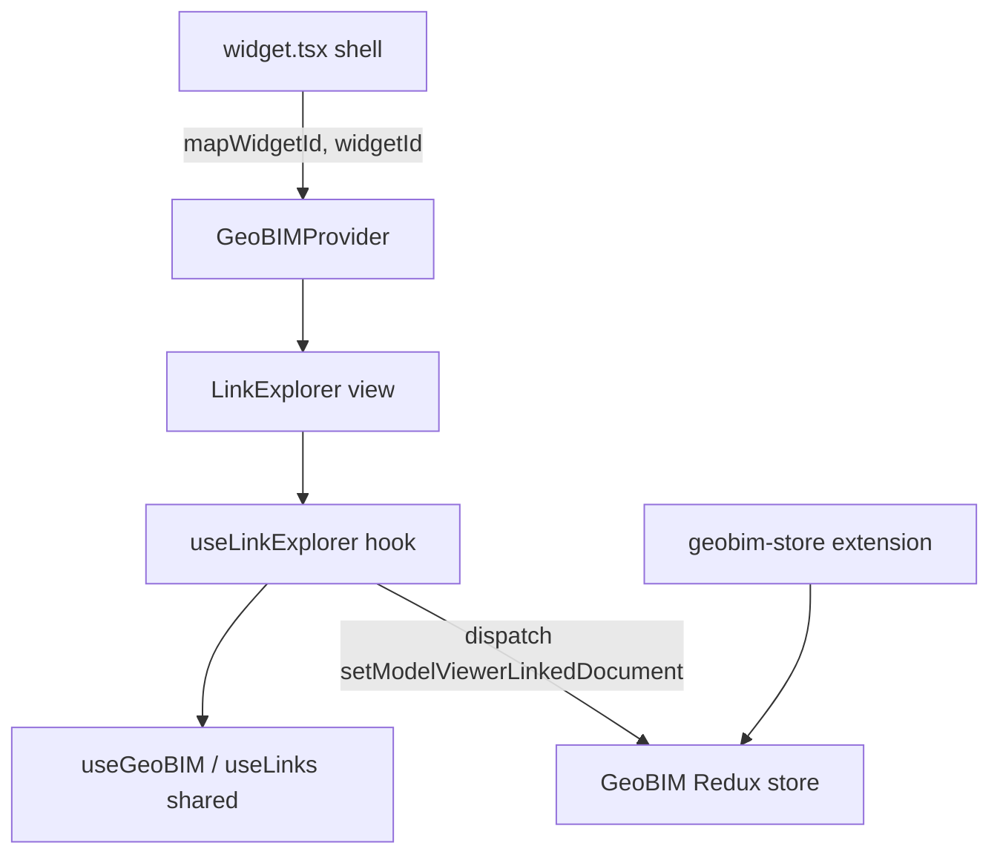

# OTB Widget: geobim/link-explorer

Online widget doc: https://developers.arcgis.com/experience-builder/guide/link-explorer-widget/

## Purpose
Displays the Autodesk Construction Cloud (ACC) documents linked to the feature(s)
currently selected in a bound Map/Scene widget. When a feature is selected, the
widget resolves its linked BIM documents (via the GeoBIM shared code and store)
and renders them as a clickable list. Clicking a document can push that document
plus its BIM element ids to an optional model/document viewer widget for display.

This is a "container-style" GeoBIM card: thin widget shell + shared-code provider
+ Redux store extension doing the heavy lifting.

## Source paths inspected
- ArcGISExperienceBuilder/client/dist/widgets/geobim/link-explorer/manifest.json
- ArcGISExperienceBuilder/client/dist/widgets/geobim/link-explorer/config.json
- ArcGISExperienceBuilder/client/dist/widgets/geobim/link-explorer/src/config.ts
- ArcGISExperienceBuilder/client/dist/widgets/geobim/link-explorer/src/runtime/widget.tsx
- ArcGISExperienceBuilder/client/dist/widgets/geobim/link-explorer/src/runtime/components/link-explorer.tsx
- ArcGISExperienceBuilder/client/dist/widgets/geobim/link-explorer/src/runtime/hooks/use-link-explorer.tsx
- ArcGISExperienceBuilder/client/dist/widgets/geobim/link-explorer/src/runtime/styles.ts
- ArcGISExperienceBuilder/client/dist/widgets/geobim/link-explorer/src/extensions/geobim-store.ts
- ArcGISExperienceBuilder/client/dist/widgets/geobim/link-explorer/src/setting/setting.tsx

Note: the requested `use-tree-node` hook does not exist in this widget. The
runtime hook is `use-link-explorer.tsx`. UNVERIFIED: `use-tree-node` may belong
to a different GeoBIM widget.

## Architecture overview
Layered, with almost all real logic delegated to `widgets/shared-code/geobim`:

1. `widget.tsx` (shell) - resolves the bound map widget id from
   `useMapWidgetIds[0]`, shows a `WidgetPlaceholder` until a map is bound, then
   wraps the inner UI in `<GeoBIMProvider mapWidgetId=... widgetId=...>` and
   renders `<LinkExplorer>`.
2. `components/link-explorer.tsx` (view) - consumes `useLinkExplorer` +
   `useGeoBIM`, renders header, auth/permission gates (`ApsLogIn`,
   `UserTypeNotPermissible`), loading spinner, the document list, and a
   multiple-selection warning `Alert`.
3. `hooks/use-link-explorer.tsx` (local state controller) - reads shared GeoBIM
   state (`useGeoBIM`, `useLinks`, `useMultipleSelectionWarning`), computes the
   widget title from the selected feature, tracks selection deltas, and
   dispatches document selection to the model viewer via Redux.
4. `extensions/geobim-store.ts` (Redux) - re-exports `GeoBIMStoreExtension` from
   shared code; registered through the manifest `REDUX_STORE` extension point.
5. `setting/setting.tsx` (builder) - map widget picker + feature service error
   hints + document viewer widget picker.



## Key imports and packages
Grouped by source; file path noted per group.

From `jimu-core`:
- `React`, `type AllWidgetProps` - widget.tsx
- `React`, `type IMThemeVariables` - components/link-explorer.tsx
- `type IMState`, `React`, `ReactRedux` - hooks/use-link-explorer.tsx
- `css`, `type IMThemeVariables`, `type SerializedStyles` - styles.ts
- `React` - setting/setting.tsx
- `type ImmutableObject` - config.ts

From `jimu-ui`:
- `Paper`, `WidgetPlaceholder` - widget.tsx
- `Alert`, `Loading`, `Surface`, `Typography` - components/link-explorer.tsx

From `jimu-for-builder`:
- `type AllWidgetSettingProps` - setting/setting.tsx

From `jimu-ui/advanced/setting-components`:
- `SettingSection`, `SettingRow`, `MapWidgetSelector` - setting/setting.tsx

From `redux`:
- `type Dispatch` - hooks/use-link-explorer.tsx

From `widgets/shared-code/geobim` (the shared GeoBIM library - most logic):
- widget.tsx: `defaultSharedMessages`, `GeoBIMProvider`, `useSharedMessages`
- components/link-explorer.tsx: `type IDocument`, `type defaultSharedMessages`,
  `geoBIMWidgetContainerStyle`, `widgetHeaderStyle`, `loadingContainerStyle`,
  `useGeoBIM`, `selectionWarningStyle`, `ApsLogIn`, `UserTypeNotPermissible`
- hooks/use-link-explorer.tsx: `type IFeatureDocumentLinks`, `getFeatureTitle`,
  `type IDocument`, `setModelViewerLinkedDocument`, `type ActionTypes`,
  `modelViewerDisabledSelector`, `useLinks`, `useGeoBIM`,
  `type defaultSharedMessages`, `areRecordArraysEqual`,
  `type GraphicDataRecord`, `useMultipleSelectionWarning`,
  `areFeatureDocumentLinksEqual`
- styles.ts: `ExBThemeSpacing`
- extensions/geobim-store.ts: `GeoBIMStoreExtension`
- setting/setting.tsx: `defaultSharedMessages`, `DocumentViewerWidgetList`,
  `FeatureServiceErrors`, `useSharedMessages`
- config.ts: `type DOCUMENT_VIEWER_WIDGET_ID_CONFIG_KEY`

Redux store: registered via the manifest extension point (see below); the widget
uses `ReactRedux.useDispatch` / `ReactRedux.useSelector` against the GeoBIM store.

## Reusable patterns found
- GeoBIMProvider: `widget.tsx` wraps inner UI in
  `<GeoBIMProvider mapWidgetId={currentMapWidgetId} widgetId={widgetId}>` so
  every GeoBIM widget shares the same context/store keyed by map + widget id.
- Feature-linked documents: `useLinks()` returns
  `{ featureDocumentLinks, linksLoading, linksInitialized }`; the view maps
  `featureDocumentLinks.documents` into a clickable list.
- useSharedMessages: both `widget.tsx` and `setting.tsx` build an
  `i18nMessage(id, values)` helper that merges `defaultSharedMessages.default`
  with the widget's local `defaultMessages` (local wins) and delegates to
  `translateMessage`. Comment in source notes this is a stopgap until the
  framework loads shared strings itself.
- Optional document-viewer widget integration: `config.modelViewerWidgetId`
  (config key = `DOCUMENT_VIEWER_WIDGET_ID_CONFIG_KEY`) is picked in settings via
  `DocumentViewerWidgetList`; at runtime `setModelViewerLinkedDocument(...)`
  pushes the selected document + bim ids to that widget through the store, but
  only when the id is set and `modelViewerDisabledSelector` is false.
- geobim-store REDUX: the manifest declares a `REDUX_STORE` extension that
  re-exports `GeoBIMStoreExtension`; this backs `useGeoBIM`/`useLinks` and the
  cross-widget dispatch.
- requireLicense Autodesk: `manifest.json` sets `"requireLicense": "Autodesk"`,
  gating the widget behind an Autodesk/ACC license.
- Auth + permission gating: view renders `UserTypeNotPermissible` when
  `!userHasPermission && geoBIMInitialized`, or `ApsLogIn` when not
  `apsAuthenticated`, before showing the document list.

Cross-ref: patterns/container-shared-code.md for the shared-code + provider +
store-extension container pattern used across GeoBIM widgets.

## Builder vs runtime split
- Builder (`setting/setting.tsx`): uses `AllWidgetSettingProps<IMConfig>`,
  `SettingSection`/`SettingRow`, `MapWidgetSelector` (with `autoSelect`), the
  shared `FeatureServiceErrors` diagnostics component, and
  `DocumentViewerWidgetList` to choose the optional viewer widget. Persists the
  map binding via `onSettingChange({ id, useMapWidgetIds })`.
- Runtime (`src/runtime/*`): reads `useMapWidgetIds`, `config`, `theme`,
  `widgetId`, `manifest`, wraps UI in `GeoBIMProvider`, and renders the live
  document list + viewer dispatch. No direct `onSettingChange`; runtime only
  reads config.

## Lifecycle and cleanup
- No `React.useEffect` and no explicit teardown in this widget's own code.
- Selection change handling is done with the "derive-during-render + setState"
  pattern (not effects): the hook compares `prevSelectedFeatures` vs
  `selectedFeatures` with `areRecordArraysEqual`, and
  `featureDocumentLinks` vs `currentFeatureDocumentLinks` with
  `areFeatureDocumentLinksEqual`, calling setState only when they differ. It
  deliberately ignores deselection (null links with no warning) to avoid
  flicker.
- All persistent/shared state and any map/APS subscriptions live in
  `GeoBIMProvider` and the GeoBIM Redux store (shared code), so cleanup is owned
  there, not in this widget. UNVERIFIED: exact subscription teardown lives in
  `widgets/shared-code/geobim` (not inspected here).

## Manifest/config requirements
From `manifest.json`:
- `"type": "widget"`, `"version"`/`"exbVersion": "1.20.0"`.
- `"dependency": "jimu-arcgis"` (needs the ArcGIS Maps SDK / map context).
- `"requireLicense": "Autodesk"`.
- `"properties": { "showDescription": true }`.
- `"defaultSize": { "width": 450, "height": 350 }`.
- Extension:
  ```json
  "extensions": [
    { "name": "GeoBIM Store", "point": "REDUX_STORE", "uri": "extensions/geobim-store" }
  ]
  ```
- `publishMessages` / `messageActions` are empty; cross-widget coupling is via
  the shared Redux store, not the message bus.

Config (`config.json` + `config.ts`):
- Single field `modelViewerWidgetId` (default `""`). The interface keys it off
  `DOCUMENT_VIEWER_WIDGET_ID_CONFIG_KEY` imported from shared code, so the string
  literal `"modelViewerWidgetId"` is defined centrally.

## Gotchas
- MapWidgetSelector returns an array but only one id is used
  (`useMapWidgetIds?.[0]`); the source comments confirm only one map id is
  returned. UNVERIFIED assumptions about multi-map support will break.
- Settings will NOT save unless you pass the id: source comment in
  `onMapWidgetSelected` warns `onSettingChange({ id, useMapWidgetIds })` must
  include `id` even though it is undocumented.
- The config key is not a plain string in code - it comes from
  `DOCUMENT_VIEWER_WIDGET_ID_CONFIG_KEY`; do not hardcode `modelViewerWidgetId`
  in TS, import the constant.
- i18n: local `defaultMessages` is spread AFTER `defaultSharedMessages.default`
  so local keys intentionally override shared ones; ordering matters.
- Document dispatch is a no-op when `modelViewerWidgetId` is empty or
  `modelViewerDisabledSelector` is true - clicking a document silently does
  nothing if no viewer is configured/enabled.
- `requireLicense: "Autodesk"` means the widget is unavailable without the
  license; do not copy this into non-GeoBIM widgets.
- The custom list items in `styles.ts` disable ExB focus outline
  (`outline: '0px !important'`) and reimplement a focus border; keep this in mind
  for accessibility when reusing.

## Useful snippets and functions

Source: src/runtime/widget.tsx (provider gate + placeholder)
```tsx
const currentMapWidgetId = useMapWidgetIds?.[0]
const appConfigured = !!currentMapWidgetId

return (
  <Paper shape="none" className="jimu-widget widget-link-explorer">
    {!appConfigured && (
      <WidgetPlaceholder
        icon={linkExplorerIcon}
        name={i18nMessage('widgetTitle')}
      />
    )}
    {appConfigured && (
      <GeoBIMProvider mapWidgetId={currentMapWidgetId} widgetId={widgetId}>
        <LinkExplorer i18nMessage={i18nMessage} theme={theme} config={config} />
      </GeoBIMProvider>
    )}
  </Paper>
)
```

Source: src/runtime/widget.tsx (shared-messages i18n helper)
```tsx
const { translateMessage } = useSharedMessages(intl, manifest.translatedLocales)

const i18nMessage = useCallback((id, values) => {
  // NOTE: defaultMessages is last to ensure it takes priority over defaultSharedMessages
  const defaultLocaleMessages = {
    ...defaultSharedMessages.default,
    ...defaultMessages,
  }
  return translateMessage(id, defaultLocaleMessages, values)
}, [translateMessage])
```

Source: src/runtime/hooks/use-link-explorer.tsx (derive-during-render selection tracking)
```tsx
// ignore deselection events (null links with no multiple-selection warning)
if (
  !areFeatureDocumentLinksEqual(featureDocumentLinks, currentFeatureDocumentLinks) &&
  (featureDocumentLinks !== null || multipleFeatureSelectionWarning)
) {
  setCurrentFeatureDocumentLinks(featureDocumentLinks)
}

if (!areRecordArraysEqual(prevSelectedFeatures, selectedFeatures)) {
  setPrevSelectedFeatures(selectedFeatures)
  if (selectedFeatures.length === 1) {
    const selectedFeature: __esri.Graphic = selectedFeatures[0].feature
    // ...compute "Layer: Feature" title via getFeatureTitle(selectedFeature)
  }
}
```

Source: src/runtime/hooks/use-link-explorer.tsx (dispatch to optional viewer widget)
```tsx
const setDocumentSelection = useCallback(
  (document: IDocument | null, bimIds: string[] | null): void => {
    if (modelViewerWidgetId == null || modelViewerWidgetId === '' || isModelViewerDisabled) {
      return
    }
    setModelViewerLinkedDocument(modelViewerWidgetId, document, bimIds, dispatch)
  },
  [modelViewerWidgetId, isModelViewerDisabled, dispatch],
)
```

Source: src/runtime/components/link-explorer.tsx (auth/permission gates + list)
```tsx
{showUserPermissionDenied && (
  <UserTypeNotPermissible /* ...i18n props... */ theme={theme} />
)}
{!apsAuthenticated && !showUserPermissionDenied && (
  <ApsLogIn /* ...i18n props... */ theme={theme} />
)}
{apsAuthenticated && !showUserPermissionDenied && (
  <div css={documentLinkList(theme)}>
    {widgetLoading && <div css={loadingContainerStyle(theme)}><Loading /></div>}
    {!widgetLoading && renderDocumentList()}
  </div>
)}
```

Source: src/setting/setting.tsx (map binding + must include id)
```tsx
const onMapWidgetSelected = (newUseMapWidgetIds: string[]): void => {
  // NOTE: settings will NOT be saved without supplying the ID!
  onSettingChange({ id, useMapWidgetIds: newUseMapWidgetIds })
}

<MapWidgetSelector
  autoSelect={true}
  onSelect={onMapWidgetSelected}
  useMapWidgetIds={useMapWidgetIds}
/>
<DocumentViewerWidgetList noWidgetsText={i18nMessage('geobimNoneSetting')} widgetId={id} />
```

Source: src/extensions/geobim-store.ts (Redux store re-export)
```ts
import { GeoBIMStoreExtension } from 'widgets/shared-code/geobim'
export default GeoBIMStoreExtension
```

Source: src/config.ts (config key comes from shared constant)
```ts
import type { ImmutableObject } from 'jimu-core'
import type { DOCUMENT_VIEWER_WIDGET_ID_CONFIG_KEY } from 'widgets/shared-code/geobim'

export interface Config {
  [DOCUMENT_VIEWER_WIDGET_ID_CONFIG_KEY]: string
}
export type IMConfig = ImmutableObject<Config>
```
