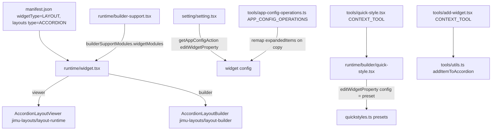

# OTB Widget: layout/accordion

Online widget doc: https://developers.arcgis.com/experience-builder/guide/accordion-widget/

## Purpose
The Accordion is a LAYOUT (container) widget. It hosts child widgets as collapsible
panels, each with a header row that expands/collapses its content. It supports single
open panel (exclusive) mode or multiple open panels, per-panel styling, a variable
header (icons, toggle position, colors), quick-style presets, and a builder-only
"add widget" flow to drop children into the accordion layout.

Its manifest self-describes as "the widget used in developer guide", so it doubles as
the canonical reference implementation for a custom ACCORDION layout container.

## Source paths inspected
- ArcGISExperienceBuilder/client/dist/widgets/layout/accordion/manifest.json
- ArcGISExperienceBuilder/client/dist/widgets/layout/accordion/src/config.ts
- ArcGISExperienceBuilder/client/dist/widgets/layout/accordion/src/quickstyles.ts
- ArcGISExperienceBuilder/client/dist/widgets/layout/accordion/src/runtime/widget.tsx
- ArcGISExperienceBuilder/client/dist/widgets/layout/accordion/src/runtime/builder-support.tsx
- ArcGISExperienceBuilder/client/dist/widgets/layout/accordion/src/runtime/util.ts
- ArcGISExperienceBuilder/client/dist/widgets/layout/accordion/src/runtime/builder/quick-style.tsx
- ArcGISExperienceBuilder/client/dist/widgets/layout/accordion/src/setting/setting.tsx
- ArcGISExperienceBuilder/client/dist/widgets/layout/accordion/src/tools/quick-style.tsx
- ArcGISExperienceBuilder/client/dist/widgets/layout/accordion/src/tools/add-widget.tsx
- ArcGISExperienceBuilder/client/dist/widgets/layout/accordion/src/tools/app-config-operations.ts
- ArcGISExperienceBuilder/client/dist/widgets/layout/accordion/src/tools/utils.ts

Not inspected in depth (exist but out of scope): src/tools/add-widget-component.tsx,
src/setting/header-setting.tsx, src/setting/expanded-items.tsx, translations/, dist/,
assets/. UNVERIFIED where those are referenced below.

## Architecture overview
The widget is a thin shell. `render()` picks a layout component and hands it the
widget's single layout:
- Runtime (viewer): `AccordionLayoutViewer` from `jimu-layouts/layout-runtime`.
- Builder: `AccordionLayoutBuilder` from `jimu-layouts/layout-builder`, obtained via
  `builderSupportModules.widgetModules.AccordionLayoutBuilder` (see builder-support.tsx).

All the real container behavior (rendering child items as panels, expand/collapse,
drag/drop in builder) lives in the framework layout components, not in this widget.
The widget config only drives styling and expand behavior; the layout JSON (type
ACCORDION, declared in manifest `layouts`) holds the child items.



## Key imports and packages
Grouped by concern; file path noted per group.

Runtime shell - src/runtime/widget.tsx
- `React`, `AllWidgetProps`, `jsx` from `jimu-core`
- `AccordionLayoutViewer` from `jimu-layouts/layout-runtime`
- `Paper`, `WidgetPlaceholder` from `jimu-ui`
- `Config` from `../config`; `IconImage` from `../../icon.svg`

Builder support module - src/runtime/builder-support.tsx
- `AccordionLayoutBuilder` from `jimu-layouts/layout-builder`
- `QuickStyle` from `./builder/quick-style`
- default export object consumed as `builderSupportModules.widgetModules`

Container helper - src/runtime/util.ts
- `IMAppConfig`, `LayoutParentType` from `jimu-core`

Setting panel - src/setting/setting.tsx
- `React`, `jsx`, `css`, `Immutable`, `lodash` from `jimu-core`
- `AllWidgetSettingProps`, `getAppConfigAction` from `jimu-for-builder`
- `DistanceUnits`, `FourSidesUnit`, `CollapsablePanel`, `LinearUnit`, `styleUtils`,
  `Label`, `Radio`, `Checkbox` from `jimu-ui`
- `Padding`, `InputUnit`, `BorderSetting`, `BorderRadiusSetting` from
  `jimu-ui/advanced/style-setting-components`
- `SettingRow`, `SettingSection` from `jimu-ui/advanced/setting-components`
- `ThemeColorPicker` from `jimu-ui/basic/color-picker`
- `getTheme2`, `colorUtils` from `jimu-theme`
- `UppercaseOutlined` from `jimu-icons/outlined/editor/uppercase`
- local `HeaderSetting`, `ExpandedItems`

Quick-style tool (CONTEXT_TOOL) - src/tools/quick-style.tsx
- `extensionSpec`, `appActions`, `getAppStore`, `LayoutContextToolProps`, `i18n`,
  `BrowserSizeMode` from `jimu-core`
- `defaultMessages` from `jimu-ui`
- `appBuilderSync`, `builderAppSync` from `jimu-for-builder`
- `QuickStyle` from `../runtime/builder/quick-style`; `isInController` from `../runtime/util`
- `BrushOutlined` from `jimu-icons/svg/outlined/editor/brush.svg`

Quick-style panel - src/runtime/builder/quick-style.tsx
- `React`, `ReactRedux`, `classNames`, `jsx`, `css`, `IMState`, `Immutable`, `hooks`
  from `jimu-core`
- `Button`, `Icon` from `jimu-ui`
- `ToolSettingPanelProps` from `jimu-layouts/layout-runtime`
- `getAppConfigAction` from `jimu-for-builder`
- `quickStyles` from `../../quickstyles`; local style1..4 svg icons

Add-widget tool (CONTEXT_TOOL) - src/tools/add-widget.tsx
- `extensionSpec`, `getAppStore`, `LayoutContextToolProps`, `i18n`, `BrowserSizeMode`,
  `LayoutItemConstructorProps`, `IMAppConfig` from `jimu-core`
- `defaultMessages` from `jimu-ui`
- `PlusOutlined`, `PlusFilled` from `jimu-icons/svg/.../editor/plus.svg`
- `AddWidgetComponent` from `./add-widget-component`
- `appBuilderSync` from `jimu-for-builder`
- `isLayoutItemAccepted`, `addItemToAccordion`, `widgetToolbarStateChange` from `./utils`

Add-widget helpers - src/tools/utils.ts
- `LayoutItemType`, `LayoutItemConstructorProps`, `getAppStore`, `appActions`,
  `WidgetType`, `AppMode`, `IMState` from `jimu-core`
- `addItemToLayout` from `jimu-layouts/layout-builder`
- `builderAppSync`, `getAppConfigAction` from `jimu-for-builder`
- `LayoutItemSizeModes` from `jimu-layouts/layout-runtime`

App config operations (APP_CONFIG_OPERATIONS) - src/tools/app-config-operations.ts
- `DuplicateContext`, `extensionSpec`, `IMAppConfig` from `jimu-core`; `Config` from `../config`

## Reusable patterns found
- widgetType LAYOUT with an ACCORDION layout: manifest declares
  `"widgetType": "LAYOUT"` and a `layouts` entry `{ name: DEFAULT, type: ACCORDION }`.
  This makes the widget a container that the framework fills from layout JSON.
- Viewer vs Builder layout swap: `render()` uses `AccordionLayoutViewer` in the viewer
  and `builderSupportModules.widgetModules.AccordionLayoutBuilder` in the builder,
  gated by `window.jimuConfig.isInBuilder`. See runtime/widget.tsx.
- builderSupportModules: manifest `properties.hasBuilderSupportModule: true` plus
  runtime/builder-support.tsx default-exporting `{ AccordionLayoutBuilder, QuickStyle }`.
  The framework injects this via the `builderSupportModules` prop only in the builder,
  keeping the builder-only layout code out of the runtime bundle.
- quickstyles.ts presets: an array of 4 full config objects (gap, padding, header
  icons/colors, panel border/padding, singleMode, showToggleAll, useQuickStyle: 1..4).
  Selecting a preset writes the whole `config` at once (see quick-style panel snippet).
- CONTEXT_TOOL quick-style: tools/quick-style.tsx implements
  `extensionSpec.ContextToolExtension`, returns the `QuickStyle` panel from
  `getSettingPanel()` on wide screens and publishes a side panel on Small screens.
- CONTEXT_TOOL add-widget: tools/add-widget.tsx lets builders pick a child widget;
  `isLayoutItemAccepted` filters items (blocks Section/Layout in Express mode) and
  `addItemToAccordion` inserts the chosen item into the accordion's DEFAULT layout.
- APP_CONFIG_OPERATIONS: tools/app-config-operations.ts implements
  `AppConfigOperationsExtension.afterWidgetCopied` to remap `config.expandedItems`
  (which store child widget ids) through the `contentMap` when a page is copied, so
  expand-on-load still points at the copied children. `widgetWillRemove` is a no-op.
- forbidOneByOneEffect + supportAutoSize: manifest `properties` set
  `supportAutoSize: true` (container can auto-size to content) and
  `forbidOneByOneEffect: true` (opt out of the one-by-one load animation, appropriate
  for a container that renders many children). `hasBuilderSupportModule: true` enables
  the builder module split above.
- Controller-aware tool visibility: `isInController` (runtime/util.ts) hides the
  quick-style and add-widget tools when the accordion sits inside a Controller widget.
- Cross-reference: see patterns/container-shared-code.md for the shared container
  conventions (layout viewer/builder split, context tools, builderSupportModules)
  that this widget follows. (UNVERIFIED - confirm that file path in your skill tree.)

## Builder vs runtime split
- Runtime bundle: runtime/widget.tsx imports only `AccordionLayoutViewer`. The builder
  layout is never statically imported by the runtime.
- Builder bundle: builder-support.tsx imports `AccordionLayoutBuilder` and the
  `QuickStyle` panel; it is loaded only in the builder because manifest sets
  `hasBuilderSupportModule: true`, and the widget reads it from the injected
  `builderSupportModules` prop.
- Settings and tools (setting.tsx, tools/*, runtime/builder/quick-style.tsx) run in the
  builder and mutate app config via `getAppConfigAction()`.
- Guards used to distinguish contexts: `window.jimuConfig.isInBuilder`,
  `window.jimuConfig.isBuilder`, `window.isExpressBuilder`, and `state.browserSizeMode`
  (BrowserSizeMode.Small triggers side-panel instead of inline panel).

## Lifecycle and cleanup
- The widget is a `React.PureComponent` with only `render()`; no componentDidMount /
  WillUnmount and no subscriptions to tear down. State/behavior live in framework
  layout components.
- App-config-level lifecycle is handled through the APP_CONFIG_OPERATIONS extension:
  - `afterWidgetCopied`: remaps `expandedItems` child ids via `contentMap` during page
    copy.
  - `widgetWillRemove`: returns appConfig unchanged (no cleanup needed here).
- Context tools maintain a small `isOpenInSidePanel` flag and call
  `widgetToolbarStateChange` (via appActions / builderAppSync) to sync toolbar state
  when a side panel closes.

## Manifest/config requirements
Manifest (manifest.json):
- `"type": "widget"`, `"widgetType": "LAYOUT"`.
- `layouts`: `[{ "name": "DEFAULT", "label": "Default", "type": "ACCORDION" }]`.
- `properties`: `supportAutoSize: true`, `forbidOneByOneEffect: true`,
  `hasBuilderSupportModule: true`.
- `extensions`:
  - `quick-style` at point `CONTEXT_TOOL`, uri `tools/quick-style`.
  - `add-widget` at point `CONTEXT_TOOL`, uri `tools/add-widget`.
  - `appConfigOperations` at point `APP_CONFIG_OPERATIONS`, uri `tools/app-config-operations`.
- `defaultSize`: `{ width: 300, height: 500 }`.
- version/exbVersion 1.20.0.

Config (src/config.ts, interface `Config`):
- `useQuickStyle?: number` - which preset (1..4) is active.
- `gap?: number`, `padding?: { number: number[]; unit: string }`.
- `header?: HeaderConfig` - expand/collapse `IconResult`s, `togglePosition`,
  `showWidgetIcon`, `widgetIconSize/Color`, `textStyle`, `padding`, border* fields,
  `borderRadius`, `collapsedColor`, `expandedColor`.
- `panel?: { padding, backgroundColor, textColor, border*, borderRadius }`.
- `singleMode?: boolean` (exclusive open), `showToggleAll?: boolean`,
  `expandedItems?: string[]` (child widget ids expanded on load).

## Gotchas
- Do not statically import the builder layout in runtime code. Use
  `builderSupportModules.widgetModules.AccordionLayoutBuilder` and check for null; the
  widget renders a "No layout component!" fallback if it is missing.
- `expandedItems` holds child widget ids, not indexes. Any copy/duplicate flow must
  remap them (that is exactly what afterWidgetCopied does); forgetting this breaks
  expand-on-load in copied pages.
- Selecting a quick style overwrites the entire `config` object (editWidgetProperty on
  `'config'`), so any prior manual header/panel tweaks are replaced by the preset.
- Express mode / Small screen branching: setting.tsx hides Layout, Header and Panel
  sections when `window.isExpressBuilder`; tools open a side panel instead of an inline
  panel when `browserSizeMode === BrowserSizeMode.Small`. Test both.
- Tool state reads must pick the right store slice: use
  `state.appStateInBuilder ?? state` (see getAppState in the tools). Reading the wrong
  slice yields stale config in the builder.
- Border vs per-side border are mutually exclusive: handlers set `border` and strip
  `borderTop/Left/Right/Bottom` (and vice-versa) to avoid conflicting styles.
- `switchToWidget`/child add is gated by `isLayoutItemAccepted`, which blocks Section
  and nested Layout widgets in Express mode.

## Useful snippets and functions

Viewer/builder layout swap and container render.
Source: src/runtime/widget.tsx
```tsx
render (): React.JSX.Element {
  const { layouts, id, intl, builderSupportModules } = this.props
  const LayoutComponent = !window.jimuConfig.isInBuilder
    ? AccordionLayoutViewer
    : builderSupportModules.widgetModules.AccordionLayoutBuilder

  if (LayoutComponent == null) {
    return (
      <div style={{ display: 'flex', justifyContent: 'center', alignItems: 'center' }}>
        No layout component!
      </div>
    )
  }
  const layoutName = Object.keys(layouts)[0]

  return (
    <Paper variant='flat' transparent className='widget-foldable-layout d-flex w-100 h-100'>
      <LayoutComponent
        layouts={layouts[layoutName]} isInWidget style={{
          overflow: 'auto',
          minHeight: 'none'
        }}
      >
        <WidgetPlaceholder
          icon={IconImage} widgetId={id}
          style={{ border: 'none', height: '100%', pointerEvents: 'none', position: 'absolute' }}
          name={intl.formatMessage({ id: 'tips', defaultMessage: defaultMessages.tips })}
        />
      </LayoutComponent>
    </Paper>
  )
}
```

Builder support module (only loaded in builder).
Source: src/runtime/builder-support.tsx
```tsx
import { AccordionLayoutBuilder } from 'jimu-layouts/layout-builder'
import { QuickStyle } from './builder/quick-style'

export default { AccordionLayoutBuilder, QuickStyle } as {
  AccordionLayoutBuilder: typeof AccordionLayoutBuilder
  QuickStyle: typeof QuickStyle
}
```

Detect whether the container sits inside a Controller widget.
Source: src/runtime/util.ts
```ts
export function isInController (layoutId: string, appConfig: IMAppConfig): boolean {
  const layoutJson = appConfig.layouts[layoutId]
  if (layoutJson.parent?.type === LayoutParentType.Widget) {
    const parentWidgetId = layoutJson.parent.id
    const parentWidgetJson = appConfig.widgets[parentWidgetId]
    return parentWidgetJson.uri === 'widgets/common/controller/'
  }
  return false
}
```

Applying a quick-style preset writes the whole config at once.
Source: src/runtime/builder/quick-style.tsx
```tsx
const handleQuickStyleChange = React.useCallback((type: number) => {
  const appConfigAction = getAppConfigAction()
  const config = Immutable(quickStyles.length >= type ? quickStyles[type - 1] : quickStyles[0])
  appConfigAction.editWidgetProperty(widgetId, 'config', config).exec()
}, [widgetId])
```

CONTEXT_TOOL that returns a builder panel on wide screens, side panel on Small.
Source: src/tools/quick-style.tsx
```ts
visible (props: LayoutContextToolProps) {
  const { layoutId } = props
  const appConfig = this.getAppState().appConfig
  return !window.isExpressBuilder && !isInController(layoutId, appConfig)
}

getSettingPanel () {
  const state = this.getAppState()
  if (!window.jimuConfig.isInBuilder || state.browserSizeMode === BrowserSizeMode.Small) {
    return null
  }
  return QuickStyle
}
```

Add a chosen child into the accordion's DEFAULT layout, honoring its default size.
Source: src/tools/utils.ts
```ts
export const addItemToAccordion = async (widgetId: string, item: LayoutItemConstructorProps) => {
  let appState: IMState
  if (window.jimuConfig.isBuilder) {
    appState = getAppStore().getState().appStateInBuilder
  } else {
    appState = getAppStore().getState()
  }
  const appConfig = appState.appConfig
  const widgetJson = appConfig.widgets[widgetId]
  const layoutId = widgetJson.layouts.DEFAULT[appState.browserSizeMode]
  const { layoutInfo, updatedAppConfig } = await addItemToLayout(appConfig, item, layoutId)
  const appConfigAction = getAppConfigAction(updatedAppConfig)
  if (item.manifest?.defaultSize) {
    const { width, height, autoHeight } = item.manifest.defaultSize
    if (autoHeight) {
      appConfigAction.editLayoutItemProperty(layoutInfo, 'setting.autoProps.height', LayoutItemSizeModes.Auto)
    }
    if (height) {
      appConfigAction.editLayoutItemProperty(layoutInfo, 'bbox.height', `${height}px`, true)
    }
    if (width) {
      appConfigAction.editLayoutItemProperty(layoutInfo, 'bbox.width', `${width}px`, true)
    }
    if (!width && !height) {
      appConfigAction.editLayoutItemProperty(layoutInfo, 'bbox', { }, true)
    }
  }
  appConfigAction.adjustOrderOfItem(layoutInfo, null, true).exec()
}
```

APP_CONFIG_OPERATIONS: remap expanded child ids on page copy.
Source: src/tools/app-config-operations.ts
```ts
afterWidgetCopied (sourceWidgetId, sourceAppConfig, destWidgetId, destAppConfig, contentMap?) {
  if (!contentMap) { // not a page copy; linkage unchanged
    return destAppConfig
  }
  const widgetJson = sourceAppConfig.widgets[sourceWidgetId]
  const config: Config = widgetJson?.config
  let newAppConfig = destAppConfig
  if (config.expandedItems?.length > 0) {
    const expandedItems = config.expandedItems.map((expandWidgetId) => contentMap[expandWidgetId])
    newAppConfig = newAppConfig.setIn(['widgets', destWidgetId, 'config', 'expandedItems'], expandedItems)
  }
  return newAppConfig
}
```

Single vs multiple open mode toggles (reset expandedItems on switch).
Source: src/setting/setting.tsx
```tsx
useSingleMode = (): void => {
  const appConfigAction = getAppConfigAction()
  appConfigAction.editWidgetProperty(this.props.id, 'config.singleMode', true)
    .editWidgetProperty(this.props.id, 'config.expandedItems', [])
    .exec()
}

useMultipleMode = (): void => {
  const appConfigAction = getAppConfigAction()
  appConfigAction.editWidgetProperty(this.props.id, 'config.singleMode', false)
    .editWidgetProperty(this.props.id, 'config.expandedItems', [])
    .exec()
}
```

Mutually exclusive border vs per-side border on the panel.
Source: src/setting/setting.tsx
```tsx
handlePanelBorderChange = (value) => {
  const appConfigAction = getAppConfigAction()
  const widgetJson = appConfigAction.appConfig.widgets[this.props.id]
  const panelConfig = widgetJson?.config?.panel ?? Immutable({})
  appConfigAction.editWidgetProperty(
    this.props.id,
    'config.panel',
    panelConfig.set('border', value).without('borderLeft').without('borderRight').without('borderTop').without('borderBottom')
  ).exec()
}
```
