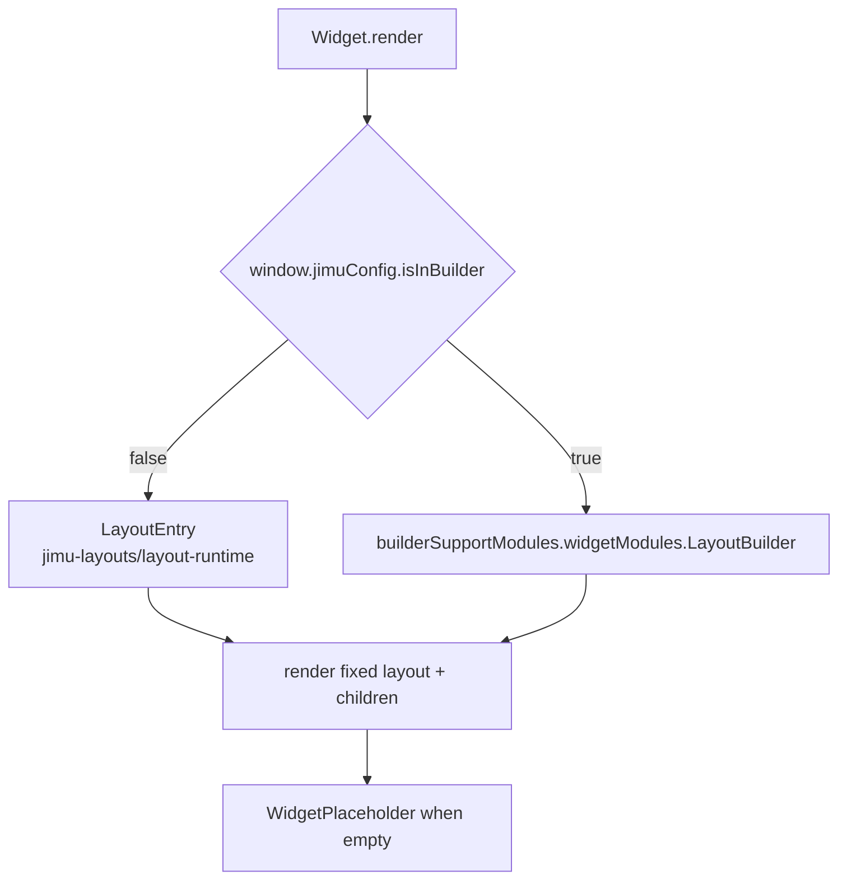

# OTB Widget: layout/fixed

Online widget doc: https://developers.arcgis.com/experience-builder/guide/fixed-panel-widget/

## Purpose
The Fixed Panel widget is a LAYOUT-type container widget. It hosts a single fixed
(absolute-position) layout into which other widgets can be dropped and freely
positioned. Unlike a normal widget, it does not render domain content of its own;
it delegates rendering of its child layout to the ExB layout system (runtime
viewer in the live app, layout builder in the builder). It ships with the
developer guide and is the canonical minimal example of a custom layout widget.

## Source paths inspected
- ArcGISExperienceBuilder/client/dist/widgets/layout/fixed/manifest.json
- ArcGISExperienceBuilder/client/dist/widgets/layout/fixed/src/runtime/widget.tsx
- ArcGISExperienceBuilder/client/dist/widgets/layout/fixed/src/runtime/builder-support.tsx
- ArcGISExperienceBuilder/client/dist/widgets/layout/fixed/src/runtime/translations/default.ts
- ArcGISExperienceBuilder/client/dist/widgets/layout/fixed/src/runtime/assets/icon.svg

Note: source root is gitignored (client/dist); inspected via ignored-file grep.
There is NO setting.tsx and NO config.ts for this widget (hasConfig false,
hasSettingPage false).

## Architecture overview
Two rendering paths selected at runtime by a single flag:
- Live app (viewer): renders `LayoutEntry` from `jimu-layouts/layout-runtime`.
- Builder: renders `builderSupportModules.widgetModules.LayoutBuilder`, which is
  supplied by the widget's own builder-support module (`LayoutBuilder` from
  `jimu-layouts/layout-builder`).

The widget picks the first layout key from `props.layouts` and passes that
layout definition to the chosen layout component. A `WidgetPlaceholder` is
rendered as the layout's child so an empty panel shows guidance text/icon.



## Key imports and packages
Grouped by source file.

runtime/widget.tsx:
- `React`, `AllWidgetProps`, `jsx` from `jimu-core`
- `LayoutEntry` from `jimu-layouts/layout-runtime`
- `defaultMessages` from `./translations/default`
- `WidgetPlaceholder` from `jimu-ui`
- `IconImage = require('./assets/icon.svg')` (SVG asset)

runtime/builder-support.tsx:
- `LayoutBuilder` from `jimu-layouts/layout-builder`

Notes:
- `jimu-layouts/layout-runtime` provides `LayoutEntry` (viewer path).
- `jimu-layouts/layout-builder` provides `LayoutBuilder` (builder path), exposed
  through the manifest's `hasBuilderSupportModule: true` and consumed at runtime
  as `builderSupportModules.widgetModules.LayoutBuilder`.

## Reusable patterns found
- widgetType LAYOUT with a FIXED (absolute-position) layout: `manifest.type` is
  `widget`, `widgetType` is `LAYOUT`, and `layouts` declares a single entry of
  `type: "FIXED"`. This is what lets other widgets be dropped and freely placed.
- FixedLayoutViewer/Builder split via `LayoutEntry` (runtime) vs `LayoutBuilder`
  (builder), selected by `window.jimuConfig.isInBuilder`. The builder module is
  provided by the widget's own builder-support default export and injected as
  `builderSupportModules`.
- NO config / NO setting: `hasConfig: false`, `hasSettingPage: false`. The widget
  reads nothing from `props.config`; all state is the layout definition passed via
  `props.layouts`.
- Placeholder-when-empty: a `WidgetPlaceholder` child gives the empty container a
  visible drop target with icon and localized `tips` message.
- Cross-ref: see patterns/container-shared-code.md for shared container widget
  patterns (layout selection, builder-support wiring, placeholder usage).

## Builder vs runtime split
- Runtime (viewer): `window.jimuConfig.isInBuilder === false` -> `LayoutComponent`
  is `LayoutEntry`.
- Builder: `window.jimuConfig.isInBuilder === true` -> `LayoutComponent` is
  `builderSupportModules.widgetModules.LayoutBuilder`.
- `builder-support.tsx` default-exports `{ LayoutBuilder }`. The manifest opts in
  with `hasBuilderSupportModule: true`, and ExB threads that module into the
  runtime widget props as `builderSupportModules`.
- Defensive guard: if the resolved `LayoutComponent` is null the widget renders a
  centered "No layout component!" fallback instead of crashing.

## Lifecycle and cleanup
- Implemented as a `React.PureComponent` with only a `render` method.
- No `componentDidMount` / `componentWillUnmount`, no subscriptions, timers,
  handles, or async work -> nothing to clean up.
- All lifecycle/cleanup for child widgets and the layout itself is handled by the
  ExB layout components (`LayoutEntry` / `LayoutBuilder`), not by this widget.

## Manifest/config requirements
From manifest.json:
- `name: "fixed"`, `label: "Fixed Panel"`, `type: "widget"`,
  `widgetType: "LAYOUT"`.
- `version` / `exbVersion`: `1.20.0`.
- `properties`:
  - `hasSettingPage: false`
  - `supportAutoSize: false`
  - `hasConfig: false`
  - `hasBuilderSupportModule: true`  (required so `LayoutBuilder` is available)
- `layouts`: single entry `{ name: "DEFAULT", label: "Default", type: "FIXED" }`.
- `defaultSize`: `{ width: 400, height: 400 }`.
- No `dependencies` block and no ArcGIS JSAPI usage.

## Gotchas
- Do not read `props.config` here; there is no config schema (`hasConfig: false`).
- The layout is picked as `Object.keys(layouts)[0]` - the widget assumes exactly
  one layout key. Adding more layouts would require changing this selection logic.
- The builder path depends entirely on `builderSupportModules.widgetModules
  .LayoutBuilder` being present; forgetting `hasBuilderSupportModule: true` (or a
  broken builder-support default export) yields the "No layout component!"
  fallback in the builder.
- `WidgetPlaceholder` is passed `icon={IconImage}` where `IconImage` comes from
  `require('./assets/icon.svg')`; the SVG must resolve through the SVG loader.
- `supportAutoSize: false`: the panel is sized by `defaultSize` / user sizing, not
  by content.
- UNVERIFIED: exact prop contracts of `LayoutEntry` and `LayoutBuilder` (beyond
  `layouts`, `isInWidget`, `style`, and children) are defined in the jimu-layouts
  packages, not in this widget's source.

## Useful snippets and functions
Source: ArcGISExperienceBuilder/client/dist/widgets/layout/fixed/src/runtime/widget.tsx
```tsx
/** @jsx jsx */
import { React, type AllWidgetProps, jsx } from 'jimu-core'
import { LayoutEntry } from 'jimu-layouts/layout-runtime'
import defaultMessages from './translations/default'
import { WidgetPlaceholder } from 'jimu-ui'

const IconImage = require('./assets/icon.svg')

export default class Widget extends React.PureComponent<AllWidgetProps<unknown>> {
  render (): React.JSX.Element {
    const { layouts, id, intl, builderSupportModules } = this.props
    const LayoutComponent = !window.jimuConfig.isInBuilder
      ? LayoutEntry
      : builderSupportModules.widgetModules.LayoutBuilder

    if (LayoutComponent == null) {
      return (
        <div style={{ display: 'flex', justifyContent: 'center', alignItems: 'center' }}>
          No layout component!
        </div>
      )
    }
    const layoutName = Object.keys(layouts)[0]

    return (
      <div className='widget-fixed-layout d-flex w-100 h-100'>
        <LayoutComponent
          layouts={layouts[layoutName]} isInWidget style={{
            overflow: 'auto',
            minHeight: 'none'
          }}
        >
          <WidgetPlaceholder
            icon={IconImage} widgetId={id}
            style={{
              border: 'none'
            }}
            message={intl.formatMessage({ id: 'tips', defaultMessage: defaultMessages.tips })}
          />
        </LayoutComponent>
      </div>
    )
  }
}
```

Source: ArcGISExperienceBuilder/client/dist/widgets/layout/fixed/src/runtime/builder-support.tsx
```tsx
import { LayoutBuilder } from 'jimu-layouts/layout-builder'
export default { LayoutBuilder }
```

Source: ArcGISExperienceBuilder/client/dist/widgets/layout/fixed/src/runtime/translations/default.ts
```ts
export default {
  _widgetLabel: 'Fixed Panel',
  widgetProperties: 'Widget properties',
  widgetFunctions: 'Widget functions',
  widgetName: 'widget name:',
  widgetProps: 'widget properties:',
  tips: 'Fixed Panel'
}
```

Source: ArcGISExperienceBuilder/client/dist/widgets/layout/fixed/manifest.json (excerpt)
```json
{
  "name": "fixed",
  "label": "Fixed Panel",
  "type": "widget",
  "widgetType": "LAYOUT",
  "properties": {
    "hasSettingPage": false,
    "supportAutoSize": false,
    "hasConfig": false,
    "hasBuilderSupportModule": true
  },
  "layouts": [
    { "name": "DEFAULT", "label": "Default", "type": "FIXED" }
  ],
  "defaultSize": { "width": 400, "height": 400 }
}
```
