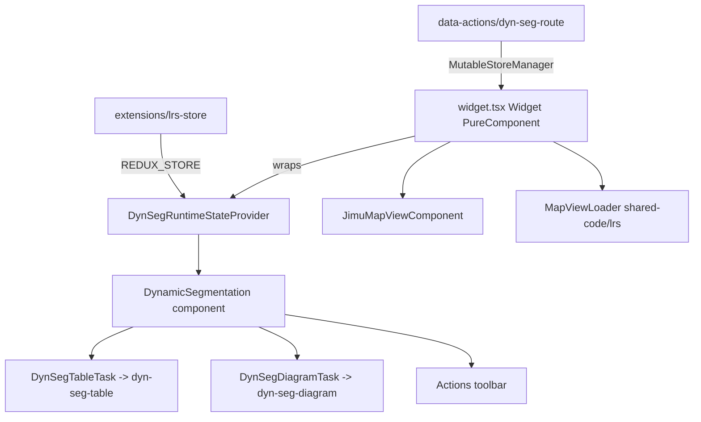

# OTB Widget: lrs/dynamic-segmentation

Online widget doc: No dedicated core-widget doc page (LRS = ArcGIS Location Referencing solution). See https://developers.arcgis.com/experience-builder/guide/widgets-overview/ . UNVERIFIED exact page.

This is the largest widget in the LRS family. It is authored by "Esri Solutions" and ships under `widgets/lrs/dynamic-segmentation`. It renders a dynamically segmented view (table or diagram/SLD) of LRS events along a route range and supports inline editing back to the network/event feature services.

## Purpose

Given a route location (route id + from/to measure) the widget queries LRS attribute sets, builds an in-memory feature layer of segmented event records, and displays them either as an editable table or as a straight-line-diagram (SLD). It supports:

- Consuming a route/measure from a data action (`dynSeg`) sent by other widgets or feature layers.
- Table and diagram (SLD) display modes with a ruler, sidebar track list, and per-segment edit popups.
- Inline editing, field calculation, hide-fields, discard-edits, export, zoom, and save flows.
- Conflict prevention (branch versioning) awareness when the network service has it enabled.
- Multiple output data sources (segmented "sld" output) for downstream widgets.

## Source paths inspected

Source root (gitignored build output; read with includeIgnoredFiles, ignore `dist/` and `tests/`):
`ArcGISExperienceBuilder/client/dist/widgets/lrs/dynamic-segmentation/`

- `manifest.json`
- `config.json`
- `src/config.ts`
- `src/constants.ts`
- `src/common/utils.ts`
- `src/common/use-data-source-exist.tsx` (listed, not deep-read)
- `src/data-actions/dyn-seg-route.ts`
- `src/extensions/lrs-store.ts`
- `src/runtime/widget.tsx`
- `src/runtime/state/index.tsx` (DynSegRuntimeStateProvider)
- `src/runtime/lib/style.ts` (listed)
- `src/runtime/components/dynamic-segmentation.tsx` (imports read)
- `src/runtime/components/loader.tsx`, `toast.tsx` (listed)
- `src/runtime/components/actions/*` (actions, discardEdits, display, export, fieldCalcPopup, fieldCalculator, hideFields, map-interact, save, zoom)
- `src/runtime/components/diagram/*` (dyn-seg-diagram, dyn-seg-diagram-task, resizer, edit-popup/*, header/*, sidebar/*, sld/*)
- `src/runtime/components/table/*` (dyn-seg-cell, dyn-seg-header, dyn-seg-row, dyn-seg-table, dyn-seg-table-task)
- `src/runtime/utils/diagram-utils.ts`, `edit-utils.ts`, `feature-layer-utils.ts`, `map-utils.ts`, `service-utils.ts`, `table-utils.ts`, `iconUtils.tsx`
- `src/setting/setting.tsx`, `default-settings.tsx`, `layer-config.tsx`

## Architecture overview

Class-based root widget (`React.PureComponent`) wraps a functional component tree in a dedicated React context/reducer store.



- `widget.tsx`: owns `JimuMapView`, a highlight `GraphicsLayer`, per-view settings resolution, and conflict-prevention polling. It resolves `lrsLayers` from either config (`Layer` mode) or the live `MapViewLoader` result (`Map` mode).
- `DynSegRuntimeStateProvider` (`state/index.tsx`): local `useReducer` context holding records, pending edits, selection, display type, route info, highlight layer, output data sources, and conflict flag. This is NOT Redux; it is a widget-scoped context store.
- `data-actions/dyn-seg-route.ts`: `AbstractDataAction` that translates a selected feature/record into a `RouteInfoFromDataAction` (routeId, name, from/to measure) and pushes it via `MutableStoreManager` mutable state props.
- `extensions/lrs-store.ts`: registers the shared LRS Redux store extension (REDUX_STORE point).
- `setting/*`: builder UI driven by shared `LrsLoader` supporting both `Map` and `Layer` modes and per-map-view settings.

## Key imports and packages

Grouped by source; file path noted.

From `jimu-core` (`src/runtime/widget.tsx`):
`React, jsx, AllWidgetProps, DataSourceManager, DataSource, IMState, getAppStore, WidgetState, ImmutableArray, Immutable, ImmutableObject`.

From `jimu-arcgis` (`src/runtime/widget.tsx`, `dynamic-segmentation.tsx`):
`JimuMapView, JimuMapViewComponent, MapViewManager`.

Direct JSAPI (esri alias) (`src/runtime/widget.tsx`):
`import GraphicsLayer from 'esri/layers/GraphicsLayer'` - direct default import of a JSAPI class (not lazy). See patterns/arcgis-core-vs-esri-alias.md.

Lazy JSAPI load (`src/data-actions/dyn-seg-route.ts`):
`loadArcGISJSAPIModules(['esri/geometry/Polyline'])` from `jimu-core` - deferred module load inside the data action.

From `widgets/shared-code/lrs` (multiple files) - the shared LRS container library:
`checkConflictPrevention, findFirstArcgisMapWidgetId, getConfigValue, getModeType, isDefined, isInWidgetController, LrsLayerType, MapViewLoader, ModeType, LrsLayer, LrsStoreExtension, NetworkInfo, AttributeSets, MapViewConfig, findNetworkInfoFromMapViewsConfig, isConflictPreventionEnabled, getAttributeSets, getDefaultAttributeSet, lrsDefaultMessages, LrsLoader, EmptyPlaceholder, GetUnits, queryRouteIdOrName, useLrsDate, useVmsManager, IntellisenseTextInput, getRouteFromEndMeasures, RoutePickerPopup, RouteInfo, getInitialRouteInfoState, getDateWithTZOffset, getDataSourceById, waitTime`.

From `jimu-for-builder` (`src/runtime/widget.tsx`, `setting.tsx`):
`getAppConfigAction`, `SettingChangeFunction`, `AllWidgetSettingProps`.

From `jimu-ui` / advanced / theme:
`Paper, WidgetPlaceholder, Icon, Label, Select, hooks, defaultMessages` (jimu-ui); `SettingRow, SettingSection` (jimu-ui/advanced/setting-components); `getTheme, styled` via `jimu-theme` (`dynamic-segmentation.tsx`, `lib/style.ts`).

Calcite (`src/runtime/components/dynamic-segmentation.tsx`):
`CalcitePanel, CalcitePopover` from `calcite-components`.

Redux extension (`src/extensions/lrs-store.ts`):
`LrsStoreExtension` from `widgets/shared-code/lrs`, re-exported as the widget's REDUX_STORE extension.

Third-party (`src/data-actions/dyn-seg-route.ts`, `dynamic-segmentation.tsx`):
`round` from `lodash-es`.

## Reusable patterns found

- **Widget-scoped reducer/context store** (`DynSegRuntimeStateProvider`, `useDynSegRuntimeState`, `useDynSegRuntimeDispatch` in `src/runtime/state/index.tsx`): a `React.useReducer` provider wrapping the whole runtime tree. String-typed action reducer (`SET_RECORDS`, `SET_EDITS`, `RESET_STATE`, etc.). `RESET_STATE` intentionally preserves display/map view/highlight/output/networkDS/conflict flags. Use this pattern instead of Redux when the state is purely widget-local and does not need cross-widget messaging.
- **Data action provider** (`dynSeg` in `manifest.json` -> `src/data-actions/dyn-seg-route.ts`): `AbstractDataAction` with `isSupported` + `onExecute`. It validates a single record set at `DataLevel.Records`, resolves the origin network data source, finds `networkInfo` from either `widgetJson.config.lrsLayers` or `findNetworkInfoFromMapViewsConfig`, and on execute pushes `selectedNetworkDataSource` + `routeLocationParams` via `MutableStoreManager.getInstance().updateStateValue(this.widgetId, ...)`. Widget reads these back through `mapExtraStateProps`.
- **excludeDataActions** (`manifest.json`): explicitly blocks noisy/irrelevant actions (`near-me.*`, `setFilter`, `dataStatistics`, `relatedData`, `directions.*`, `elevation-profile-dev.*`) so its own consumed data-action surface stays clean.
- **canGenerateMultipleOutputDataSources + canConsumeDataAction** (`manifest.json` `properties`): the widget both consumes actions and emits multiple output data sources (segmented `sld` outputs threaded through `outputDataSources`).
- **Map vs Layer mode with per-view settings** (`config.ts`, `common/utils.ts`, `setting.tsx`): `ModeType.Map` uses live `MapViewLoader`/`settingsPerView[jimuMapViewId]`; `ModeType.Layer` uses `config.lrsLayers`. `constructSettingsPerView`, `setValuesForView`, and `resetConfig` centralize defaults.
- **Ruler/diagram/feature-layer/table utils split** (`src/runtime/utils/*`): clear separation - `diagram-utils` (track/SLD geometry math, M<->X mapping, PNG trimming), `feature-layer-utils` (build in-memory `FeatureLayer`, clone fields, subtype layers), `map-utils` (measure-to-geometry, highlight graphics, zoom), `service-utils` (attribute-set params + query), `table-utils` (field info, subtype/contingent values, pending-edit keys), `edit-utils` (cell edits, conflict prevention, lock info).
- **Shared LRS container library** (`widgets/shared-code/lrs`): manifest-level shared code consumed by all LRS widgets (loaders, store extension, layer types, config helpers). See patterns/container-shared-code.md.

## Builder vs runtime split

- Builder (`src/setting/*`): `setting.tsx` drives everything through the shared `LrsLoader` (mode selector, map widget selection, layer selection, reset). On layer/map-view changes it queries attribute sets and conflict-prevention state, computes default line/point attribute sets and default diagram scale (`getNetworkDefaultScale`), and persists via `onSettingChange`. Uses a `useRef` semaphore (`isRunning`) to serialize async `handleMapViewsConfigUpdated` calls. `LayerConfig` and `DefaultSettings` are conditionally rendered subpanels.
- Runtime (`src/runtime/*`): resolves effective `lrsLayers` from mode, computes per-view config via `getConfigValue`, and renders `DynamicSegmentation` only when `hasConfig` (network + event layers present), otherwise a `WidgetPlaceholder`.
- Runtime also writes back to config: `setSettingsPerView` calls `getAppConfigAction().editWidgetConfig(...)` to persist runtime-derived `settingsPerView`, blurring the usual builder-only-writes rule.

## Lifecycle and cleanup

`widget.tsx` (class component):

- `componentDidMount`: seeds state from mutable state props (data-action results), detects widget-controller placement (`isInWidgetController`), calls `setSettingsPerView`, and sets a parent `.widget-renderer` z-index of `21` so popups float above layout widgets.
- `componentDidUpdate`: recreates the highlight `GraphicsLayer` when `jimuMapView` changes; re-reads data-action mutable props only when the widget state is `Opened`; refreshes settings when `activeLrsLayers` change; polls `checkConflictPrevention(lrsUrl)` and stores the boolean.
- `componentWillUnmount`: `removeGraphicLayer()` (calls `removeAll()` + `destroy()` on the GraphicsLayer and nulls state) and resets the z-index override.
- `createGraphicLayer`: adds a `new GraphicsLayer({ listMode: 'hide' })` to `jimuMapView.view.map`; always removes the previous one first.
- `waitForChildDataSourcesReady`: awaits `whenAllJimuLayerViewLoaded()` then ensures child data sources are created before setting the active view.

## Manifest/config requirements

From `manifest.json`:

- `dependency: "jimu-arcgis"` and `notSupportAGOL: true` (enterprise LRS services only).
- `properties: { canConsumeDataAction: true, canGenerateMultipleOutputDataSources: true }`.
- `dataActions`: one provider `dynSeg` -> `data-actions/dyn-seg-route`, icon `runtime/assets/icons/placeholder-table.svg`.
- `extensions`: `{ name: "LRS Store", point: "REDUX_STORE", uri: "extensions/lrs-store" }`.
- `excludeDataActions`: array of blocked actions (see patterns above).
- `defaultSize: { width: 600, height: 400 }`; `version`/`exbVersion` `1.20.0`.

From `config.json` (default persisted config): `mode: "MAP"`, `defaultDisplayType: "Table"`, `attributeInputType: "LineOnly"`, color defaults `#65adff`, `allowEditing: true`, `allowMerge: false`, `defaultDiagramScale: 3`, `showEventStatistics: false`, empty `lrsLayers`/`attributeSets`.

Config shape (`src/config.ts`): `Config` includes `lrsLayers`, display/attribute settings, highlight colors, `mode?: ModeType`, `mapViewsConfig[jimuMapViewId]`, and `settingsPerView[jimuMapViewId]` (per-view `SettingsPerView`). `IMConfig = ImmutableObject<Config>`.

## Gotchas

- `GraphicsLayer` is imported directly from the `esri/*` alias (not lazily), so the widget hard-depends on the JSAPI being present; `jimu-arcgis` dependency in the manifest is what wires that up. Other JSAPI classes (e.g. `Polyline`) are loaded lazily via `loadArcGISJSAPIModules` inside the data action - be consistent with whichever pattern the surrounding file uses.
- The runtime writes config back with `getAppConfigAction().editWidgetConfig` (`setSettingsPerView`). This runs at runtime, not just in the builder; do not assume config is immutable at runtime for this widget.
- `RESET_STATE` in the reducer is NOT a full reset - it preserves several fields (display, jimuMapView, highlightLayer, highlightColor, outputDataSources, currentRouteInfo, networkDS, conflictPreventionEnabled) and forces `isLoading: true`.
- Data-action support checks are strict: single data set, exactly one record, `DataLevel.Records`, resolvable `networkInfo`, and a non-empty route id field - otherwise `isSupported` returns false silently.
- `getAppConfig` in the data action branches on `window.jimuConfig.isBuilder` (`appStateInBuilder.appConfig` vs `appConfig`). Reuse this when reading config from a data action that may run in builder preview.
- The widget sets a z-index of `21` on the ancestor `.widget-renderer` and clears it on unmount; if you clone this widget, keep the unmount cleanup or you will leak stacking-context overrides onto layout widgets (grid).
- Mode resolution appears twice (`widget.tsx` render and `componentDidUpdate`): `!config.mode || config.mode === ModeType.Map` uses live `activeLrsLayers`, otherwise `config.lrsLayers`. Missing `mode` is treated as Map.

## Useful snippets and functions

Source: `src/runtime/state/index.tsx` - widget-scoped reducer store + hooks.

```tsx
const DynSegRuntimeStateContext = React.createContext<DynSegRuntimeState | undefined>(undefined)
const DynSegRuntimeDispatchContext = React.createContext<React.Dispatch<any> | undefined>(undefined)

export const DynSegRuntimeStateProvider = (props: DynSegRuntimeStateProviderProps) => {
  const { defaultState, children } = props
  const [state, dispatch] = React.useReducer(reducer, defaultState || initialState)
  return <DynSegRuntimeStateContext.Provider value={state}>
    <DynSegRuntimeDispatchContext.Provider value={dispatch}>
      {children}
    </DynSegRuntimeDispatchContext.Provider>
  </DynSegRuntimeStateContext.Provider>
}

export const useDynSegRuntimeState = () => React.useContext(DynSegRuntimeStateContext)
export const useDynSegRuntimeDispatch = () => React.useContext(DynSegRuntimeDispatchContext)
```

Source: `src/runtime/widget.tsx` - read data-action results via `mapExtraStateProps`.

```tsx
static mapExtraStateProps = (state: IMState, props: AllWidgetProps<IMConfig>): ExtraProps => {
  return {
    routeLocationParams: props?.mutableStateProps?.routeLocationParams,
    selectedNetworkDataSource: props?.mutableStateProps?.selectedNetworkDataSource
  }
}
```

Source: `src/runtime/widget.tsx` - highlight GraphicsLayer lifecycle (direct esri alias import).

```tsx
removeGraphicLayer (): void {
  if (isDefined(this.state.highlightGraphicLayer)) {
    this.state.highlightGraphicLayer.removeAll()
    this.state.highlightGraphicLayer.destroy()
    this.setState({ highlightGraphicLayer: null })
  }
}

createGraphicLayer (): void {
  if (isDefined(this.state.jimuMapView)) {
    this.removeGraphicLayer()
    const newGraphicLayer = new GraphicsLayer({ listMode: 'hide' })
    this.state.jimuMapView.view?.map.add(newGraphicLayer)
    this.setState({ highlightGraphicLayer: newGraphicLayer })
  }
}
```

Source: `src/runtime/widget.tsx` - persist runtime-derived per-view settings back to config.

```tsx
setSettingsPerView = async () => {
  const { config } = this.props
  const isRuntime = !isDefined(config.settingsPerView?.[this.state.activeMapViewId])
  let settingPerView = config.settingsPerView?.[this.state.activeMapViewId] || constructSettingsPerView()
  if (this.state.activeLrsLayers && this.state.activeLrsLayers.length > 0) {
    settingPerView = await setValuesForView(settingPerView, this.state.activeLrsLayers, isRuntime)
    this.setState({ settingPerView })
    const newConfig = config.setIn(['settingsPerView', this.state.activeMapViewId], settingPerView)
    getAppConfigAction().editWidgetConfig(this.props.id, newConfig).exec()
  }
}
```

Source: `src/data-actions/dyn-seg-route.ts` - push route/measure to the widget via MutableStoreManager and lazy-load Polyline.

```ts
const featureQuery: FeatureLayerQueryParams = ({
  returnGeometry: true,
  returnM: true,
  where: `${networkDS.getIdField()} = ${objectId}`
})

await featureDS.query(featureQuery).then(async (response) => {
  if (response.records.length > 0) {
    await loadArcGISJSAPIModules(['esri/geometry/Polyline']).then(modules => {
      const Polyline = modules[0]
      const geometry = new Polyline(response.records[0].getGeometry())
      const firstPoint = geometry.getPoint(0, 0)
      const lastIdx = geometry.paths[geometry.paths.length - 1].length - 1
      const lastPoint = geometry.getPoint(geometry.paths.length - 1, lastIdx)
      routeParams.fromMeasure = round(firstPoint.m, networkInfo.measurePrecision)
      routeParams.toMeasure = round(lastPoint.m, networkInfo.measurePrecision)
      MutableStoreManager.getInstance().updateStateValue(this.widgetId, 'selectedNetworkDataSource', networkDS)
      MutableStoreManager.getInstance().updateStateValue(this.widgetId, 'routeLocationParams', routeParams)
    })
  }
})
```

Source: `src/data-actions/dyn-seg-route.ts` - builder-aware app config accessor.

```ts
function getAppConfig () {
  return window.jimuConfig.isBuilder
    ? getAppStore().getState()?.appStateInBuilder?.appConfig
    : getAppStore().getState()?.appConfig
}
```

Source: `src/extensions/lrs-store.ts` - re-export the shared LRS Redux store extension.

```ts
import { LrsStoreExtension } from 'widgets/shared-code/lrs'
export default LrsStoreExtension
```

Source: `src/common/utils.ts` - default per-view settings + unit-based default scale.

```ts
export function constructSettingsPerView () {
  const settingsPerView: SettingsPerView = {
    defaultDisplayType: DisplayType.Table,
    attributeInputType: AttributeInputType.LineOnly,
    defaultPointAttributeSet: '',
    defaultLineAttributeSet: '',
    attributeSets: { attributeSet: [] },
    mapHighlightColor: '#65adff',
    tableHighlightColor: '#65adff',
    defaultDiagramScale: 3,
    showEventStatistics: false,
    allowMerge: false,
    allowEditing: true,
    defaultNetwork: ''
  }
  return Immutable(settingsPerView)
}

export function getNetworkDefaultScale (defaultUnit: string): number {
  switch (defaultUnit) {
    case 'esriMiles': { return 3 }
    case 'esriFeet': { return 15840 }
    case 'esriMeters': { return 4828 }
    case 'esriKilometers': { return 4.828 }
    // ...other units...
    default: { return 3 }
  }
}
```

Cross-references:
- patterns/container-shared-code.md - shared `widgets/shared-code/lrs` container library.
- patterns/arcgis-core-vs-esri-alias.md - direct `esri/*` import vs `loadArcGISJSAPIModules`.
- ../../ootb-widget-index.md - OTB widget catalog entry.
