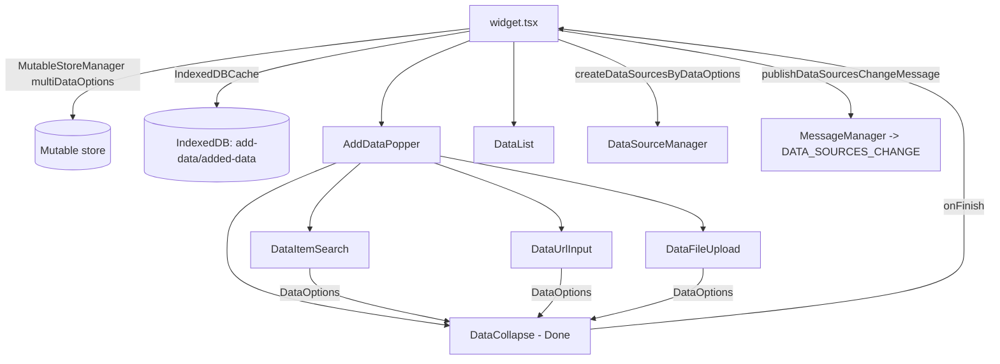

# OTB Widget: common/add-data

Online widget doc: https://developers.arcgis.com/experience-builder/guide/add-data-widget/

## Purpose

Lets an app end user add data at runtime by three routes: search ArcGIS content (portal items), enter a service URL, or upload a local file. Each added item becomes a runtime ExB data source (created in-browser, not persisted to the app config) and is announced to the rest of the app via a `DATA_SOURCES_CHANGE` message so other widgets (Map, Table, Chart, etc.) can consume it. Added data is cached per widget instance in IndexedDB so it survives page reloads at runtime.

Source of truth for the description (manifest.json):
> "This is the widget which allows you to add data by searching for layers in ArcGIS content, entering URLs, or uploading local files."

## Source paths inspected

Widget root: `ArcGISExperienceBuilder/client/dist/widgets/common/add-data/` (gitignored; read with includeIgnoredFiles). All paths below are relative to that root.

- `manifest.json` - name, publishMessages, excludeDataActions, properties, builderOperations extension.
- `config.json` - empty `{}` (no default config values shipped).
- `src/config.ts` - `Config` / `IMConfig` / `ItemCategoryInfo` interfaces.
- `src/utils.ts` - item-category defaults + hooks (`useItemCategoriesInfo`, `useNeedHideItemCategories`, `useCuratedIndex`, `getDefaultLabel`).
- `src/version-manager.ts` - single 1.12.0 upgrader.
- `src/runtime/widget.tsx` - top-level runtime widget, IndexedDB init, add/remove/change handlers.
- `src/runtime/types.ts` - `DataOptions`, `LayerInFeatureCollection`, `FeatureCollection`.
- `src/runtime/utils.ts` - data source create/update/destroy from `DataOptions`, message publishing, export-setting sync.
- `src/runtime/kml-utils.ts` - KML feature-collection group-layer handling and caches.
- `src/runtime/components/data-list.tsx` - list UI, rename, per-item data actions.
- `src/runtime/components/add-data-popper/index.tsx` - popper/tabs shell, state per tab.
- `src/runtime/components/add-data-popper/data-item-search.tsx` - search tab (ItemSelector).
- `src/runtime/components/add-data-popper/data-url-input.tsx` - URL tab (ArcGIS/WMS/WMTS/WFS/KML/CSV/GeoJSON).
- `src/runtime/components/add-data-popper/data-file-upload.tsx` - file tab (analyze/generate REST, KML service).
- `src/runtime/components/add-data-popper/data-collapse.tsx` - staged pending-items bar with Done.
- `src/setting/setting.tsx` - builder settings panel.
- `src/tools/builder-operations.ts` - BUILDER_OPERATIONS extension (i18n translation keys).

Not read in depth (UNVERIFIED, inspect if needed): `src/runtime/components/add-data-popper/wfs-layer-popper.tsx`, `wms-layer-popper.tsx`, `resizer-tooltip.tsx`, `src/setting/components/search-config-item.tsx`, `translations/*`, `assets/*`, `dist/` (built output, ignored).

## Architecture overview



Core flow:
1. Each tab builds `DataOptions` objects (a `dataSourceJson` plus `order`, and optionally a `restLayer` for uploaded feature-collection layers).
2. While staged in the popper, `DataCollapse` eagerly creates data sources (with `publishMessage=false`) so the preview works; on Done, `onFinish` bubbles the final list to `widget.tsx`.
3. `widget.tsx` persists the list to the mutable store + IndexedDB and calls `createDataSourcesByDataOptions(..., publishMessage=true)`, which registers the data sources with `DataSourceManager` and publishes `DATA_SOURCES_CHANGE`.
4. `DataList` renders added items with live status from `state.dataSourcesInfo`, plus rename and data-action controls.

## Key imports and packages

jimu-core (all files):
- `MutableStoreManager` - `widget.tsx`, `utils.ts` (per-widget runtime state `multiDataOptions`).
- `DataSourceManager` - `runtime/utils.ts`, `kml-utils.ts` (create/update/destroy data sources).
- `DataSourcesChangeMessage`, `MessageManager`, `DataSourcesChangeType` - `runtime/utils.ts` (publish `DATA_SOURCES_CHANGE`).
- `indexedDBUtils` (`IndexedDBCache`) - `widget.tsx`, `setting/setting.tsx` (offline cache of added data).
- `loadArcGISJSAPIModules` / `loadArcGISJSAPIModule` - `runtime/utils.ts`, `kml-utils.ts`, `data-file-upload.tsx` (lazy JSAPI load).
- `Immutable`, `DataSourceTypes`, `SupportedLayerServiceTypes`, `ExportFormat`, `ServiceManager` - `runtime/utils.ts`.
- `dataSourceUtils` (`dataSourceJsonCreator`, `getChildDataSourceId`, `convertFieldToJimuField`, `getDsIcon`, `getDsTypeString`, `isSupportedArcGISService`) - `data-url-input.tsx`, `data-item-search.tsx`, `data-file-upload.tsx`, `data-list.tsx`.
- `esri` (`esri.restPortal.getItem`), `requestUtils.requestWrapper` - `data-url-input.tsx` (vector tile style item lookup).
- `moduleLoader.loadModule('jimu-core/jszip')` - `data-file-upload.tsx` (read `.prj` from zipped shapefile).
- `getAppStore` - `data-file-upload.tsx` (portal flags, locale, portalUrl).
- `BaseVersionManager` - `version-manager.ts`.
- `focusElementInKeyboardMode`, `ReactRedux`, `IMState`, `WidgetState`, `AppMode` - various (a11y + runtime state selectors).

jimu-data-source:
- `FeatureLayerDataSourceConstructorOptions` (type) - `runtime/utils.ts` (client-side FeatureLayer data sources for uploaded files).

jimu-ui and subpaths:
- `jimu-ui` - `Paper`, `Tabs`/`Tab`, `FloatingPanel`, `MobilePanel`, `Alert`, `Button`, `Loading`, `TextInput`, `DataActionList`, `Select`, `CollapsablePanel`, `UrlInput`, `Dropdown*`.
- `jimu-ui/basic/item-selector` - `ItemSelector`, `ItemCategory`, `ItemTypeCategory` (search tab + settings).
- `jimu-ui/advanced/setting-components` - `SettingSection`, `SettingRow` (settings).
- `jimu-ui/basic/list-tree` - `List`, `TreeItemActionType` (drag-sortable category list in settings).
- `jimu-ui/basic/copy-button` - `CopyButton` (URL tab sample URL).

jimu-for-builder:
- `AllWidgetSettingProps` (type) - `setting/setting.tsx`.
- `builderSupportModules.jimuForBuilderLib.getAppConfigAction` - `widget.tsx` (persist panel size to config while in builder).

jimu-theme: `useTheme` - `data-file-upload.tsx`, `data-list.tsx`.

esri JSAPI (via `loadArcGISJSAPIModules`, never static-imported):
- `esri/layers/FeatureLayer`, `esri/Graphic`, `esri/layers/support/Field`, `esri/renderers/support/jsonUtils` - `runtime/utils.ts`, `kml-utils.ts` (build client-side feature layers from feature sets).
- `esri/layers/GroupLayer` - `kml-utils.ts` (KML group layer tree).
- `esri/request` - `data-file-upload.tsx` (analyze/generate/KML REST calls).

@esri/arcgis-rest-* (type-only imports):
- `@esri/arcgis-rest-feature-service` (`IFeatureSet`, `ILayerDefinition`) - `runtime/types.ts`.
- `@esri/arcgis-rest-portal` (`IItem`) - `data-url-input.tsx`.

## Reusable patterns found

Runtime data source creation from files / URL / portal item:
- Every route converges on a `DataOptions` object: `{ dataSourceJson, order, restLayer? }` (`runtime/types.ts`).
- `createDataSourcesByDataOptions(multiDataOptions, widgetId, config, publishMessage = true)` in `runtime/utils.ts` is the single funnel. It lazy-loads JSAPI only when a `restLayer` exists, wraps each `dataSourceJson` with `Immutable(...)`, calls `DataSourceManager.getInstance().createDataSource(o)`, waits for child data sources (`childDataSourcesReady()`), then publishes the change message.
- Uploaded files with feature data build a client-side `FeatureLayer` (source = `Graphic.fromJSON` per feature) and pass it as `layer` in `FeatureLayerDataSourceConstructorOptions`. Layer capabilities are captured before `layer.load()` and restored afterwards (JSAPI mutates them on load).
- Data source ids are unique + time-stamped: `getNextAddedDataId(widgetId, order)` => `add-data-${widgetId}-${order}-${Date.now()}` (`runtime/utils.ts`), to avoid collisions when two items are added while one is still loading.
- Single-layer feature services are special-cased to create a FeatureLayer (not FeatureService) data source so "set filter" / "view in table" actions work (`getLayerInfoFromSingleLayerFeatureService` in `runtime/utils.ts`, used by both search and URL tabs).

DATA_SOURCES_CHANGE publishMessage:
- Declared in `manifest.json` `publishMessages: ["DATA_SOURCES_CHANGE"]`.
- Emitted by `publishDataSourcesChangeMessage(widgetId, type, dataSources)` in `runtime/utils.ts` using `new DataSourcesChangeMessage(...)` + `MessageManager.getInstance().publishMessage(...)`.
- Types used: `Create` (on final add), `Remove` (on delete / destroy). Note: staged creation inside `DataCollapse` passes `publishMessage=false` so previews do not spam the app.

MutableStoreManager + IndexedDB caching:
- `multiDataOptions` (the source of truth for the list) lives in the mutable store: `MutableStoreManager.getInstance().updateStateValue(id, 'multiDataOptions', multiDataOptions)` and is read back from `props.mutableStateProps.multiDataOptions` (`widget.tsx`).
- Persistent cache: `new indexedDBUtils.IndexedDBCache(id, 'add-data', 'added-data')`. On mount, `init()` then `getAll()` rehydrates and recreates data sources. `putAll` / `put` / `deleteAll` mirror add/remove/change. Cleaned up with `cache.current.close()` on unmount.
- Caching is runtime-only: `const useCache = !window.jimuConfig.isInBuilder` (`widget.tsx`). In the settings panel, changing config `clear()`s the cache (`setting/setting.tsx`).

KML / file upload handling:
- File tab supports CSV, GeoJSON, Shapefile (.zip), KML, GPX, File Geodatabase (.zip). Zip files prompt the user to pick the type (`SupportedZipFileTypes`), with per-type max size + `MaxFileNumber = 30` and `MAX_RECORD_COUNT = 4000` (`data-file-upload.tsx`).
- Non-KML files: REST `.../sharing/rest/content/features/analyze` then `.../generate` via `esri/request` to produce a feature collection; shapefile projection WKID is extracted from the `.prj` inside the zip using jszip.
- KML files: posted to a KML service (`getKmlServiceUrl()` -> portal `/sharing/kml` or `https://utility{env}.arcgis.com/sharing/kml`) and converted into a nested `GroupLayer` `dataSourceJson` tree mirroring KML folders; leaf feature layers carry embedded `layerDefinition`/`featureSet` data.
- `kml-utils.ts` maintains module-level caches (`featureCollectionItemDataByGroupId`, `featureCollectionLayerDataByChildId`) so heavy feature data can be stripped before `Immutable()` and rehydrated on demand (child DS creation, add-to-map). `clearFeatureCollectionCache` empties them on destroy.

excludeDataActions:
- `manifest.json` lists actions this widget's data should NOT expose: `arcgis-map.showOnMap`, `arcgis-map.showPopup`, `arcgis-map.addMarker`, `elevation-profile.*`, `table.viewInTable`, `directions.PlanRoute`, `relatedData`. This trims the data-action menu shown by `DataActionList` in `data-list.tsx`.
- `properties.canConsumeDataAction: true` lets the widget consume actions; `coverLayoutBackground: true` covers the layout background.

version-manager:
- `version-manager.ts` has one upgrader at `1.12.0`: when search is enabled but `itemCategoriesInfo` is missing, it seeds `getDefaultItemCategoriesInfo()`. Attached via `Widget.versionManager = versionManager` in `widget.tsx`.

## Builder vs runtime split

- Runtime (`src/runtime/**`): the interactive widget - popper tabs, list, data source creation, IndexedDB, message publishing. No app-config writes except panel-size persistence (below).
- Settings (`src/setting/setting.tsx`): toggles for the three add routes (`disableAddBySearch|Url|File`), the searchable item categories/tabs (drag-sortable `List` of `ItemCategoryInfo`, curated collections, data-type restriction via `displayedItemTypeCategories`), rename toggle (`disableRenaming`), export settings (`disableExport`, `notAllowedExportFormat`), and empty-list placeholder text. Writes config via `onSettingChange` and clears the IndexedDB cache on any change.
- Tools (`src/tools/builder-operations.ts`): a `BUILDER_OPERATIONS` extension (`getTranslationKey`) so custom category labels and placeholder text become translatable resource strings.
- Cross-boundary: at runtime, resizing the floating panel persists `panelSize` back into widget config, but only in builder, using `builderSupportModules.jimuForBuilderLib.getAppConfigAction().editWidgetConfig(id, newConfig).exec()` (`widget.tsx` `handlePanelResizeStop`).

## Lifecycle and cleanup

- Mount (`widget.tsx` useEffect): create `IndexedDBCache`, `init()`, and if runtime, load cached `DataOptions`, recreate data sources, and populate the mutable store. Cleanup returns `() => cache.current.close()`.
- Add (`onAddData`): `putAll` to cache, `createDataSourcesByDataOptions(..., publishMessage=true)`, append to `multiDataOptions`.
- Remove (`onRemoveData`): `deleteAll` from cache, filter list, `publishDataSourcesChangeMessage(..., Remove, ...)`. Note the DS instance is removed from the manager mainly through `DataCollapse`/`destroyDataSourcesById`; the widget-level remove publishes the Remove message.
- Change/rename (`onChangeData`): `put` to cache, `updateDataSourcesByDataOptions([...])`, update list.
- `destroyDataSourcesById` (`runtime/utils.ts`): clears KML caches, removes `setFilter` mutable state, and calls `DataSourceManager.getInstance().destroyDataSource(id)`.
- Popper close (`add-data-popper/index.tsx`): resets the three per-tab staging arrays; also auto-closes when the controller widget state is `Closed`, on page change, or (non-mobile) when `hidePopper` is set.
- Export settings changes trigger `updateExportSettingForDataSources` via `hooks.useUpdateEffect` so already-added data sources pick up new export options.

## Manifest/config requirements

manifest.json essentials:
- `type: "widget"`, `version`/`exbVersion` `1.20.0`.
- `publishMessages: ["DATA_SOURCES_CHANGE"]` - required for other widgets to react to newly added data.
- `excludeDataActions: [...]` - see list above.
- `properties: { canConsumeDataAction: true, coverLayoutBackground: true }`.
- `extensions: [{ name: "builderOperations", point: "BUILDER_OPERATIONS", uri: "tools/builder-operations" }]`.
- `defaultSize: { width: 400, height: 400 }`.
- No `dependencies` block for `jimu-arcgis`/`arcgis-maps-sdk` in the manifest - JSAPI is pulled at runtime via `loadArcGISJSAPIModules`, so no manifest dependency is declared. (UNVERIFIED whether the host app implicitly provides it; inspect the app-level config if replicating in a custom widget.)

config.ts (`Config`) fields, all optional: `disableAddBySearch`, `disableAddByUrl`, `disableAddByFile`, `placeholderText`, `itemCategoriesInfo` (`ItemCategoryInfo[]`), `disableRenaming`, `displayedItemTypeCategories` (`ItemTypeCategory[]`), `disableExport`, `notAllowedExportFormat` (`ExportFormat[]`), `panelSize` (`Size`). Shipped `config.json` is empty `{}` (defaults are computed in code, e.g. `useItemCategoriesInfo`).

## Gotchas

- The list source of truth is the mutable store (`multiDataOptions`), not widget config - added data is runtime state, never written to the saved app config.
- IndexedDB caching only runs at runtime (`!window.jimuConfig.isInBuilder`); in builder there is no reload persistence and changing settings clears the cache.
- Group layers cannot be added by URL: `data-url-input.tsx` throws `cannotBeAddedError` if a URL resolves to `DataSourceTypes.GroupLayer` (no proper JSAPI layer can be built without the map service layer). KML uploads do produce group layers via `kml-utils.ts`.
- Uploaded FeatureLayer capabilities are reset by JSAPI on `load()`; the code snapshots `sourceJSON.capabilities` before load and restores it after (`runtime/utils.ts`).
- KML upload strips heavy `data` off child dataSourceJsons before `Immutable()` and stashes it in module-level maps; forgetting `clearFeatureCollectionCache` on destroy would leak. Add-to-map rebuilds a fresh `GroupLayer` per call via `createJSAPILayerByDataSource`.
- URLs are forced to https (`replace(/^http:/, 'https:')`) and only `https` scheme is accepted (`SupportedSchemes`).
- File analyze/generate uses portal REST endpoints derived from `portalUrl`; KML uses a separate ArcGIS Online/portal KML utility service that varies by `window.jimuConfig.hostEnv` (dev/qa/prod).
- `pWinSt.error(...)` is used as the logger throughout (e.g. `widget.tsx`, `data-file-upload.tsx`); it is a global, not an import in these files. (UNVERIFIED origin; inspect the build/global setup if you need to reuse it.)
- `restrictEnterpriseOnly` local-storage flag hides Public + Living Atlas categories (`src/utils.ts` `useNeedHideItemCategories`).

## Useful snippets and functions

Source: `src/runtime/utils.ts` - publish DATA_SOURCES_CHANGE.
```ts
export function publishDataSourcesChangeMessage (widgetId: string, type: DataSourcesChangeType, dataSources: DataSource[]) {
  const dataSourcesChangeMessage = new DataSourcesChangeMessage(widgetId, type, dataSources)
  MessageManager.getInstance().publishMessage(dataSourcesChangeMessage)
}
```

Source: `src/runtime/utils.ts` - create runtime data sources from DataOptions (lazy JSAPI + client-side FeatureLayer for uploads).
```ts
export async function createDataSourcesByDataOptions (multiDataOptions: DataOptions[], widgetId: string, config: IMConfig, publishMessage = true): Promise<DataSource[]> {
  if (!multiDataOptions || multiDataOptions.length === 0) {
    return Promise.resolve([])
  }

  let FeatureLayer: typeof __esri.FeatureLayer
  let Graphic: typeof __esri.Graphic
  let Field: typeof __esri.Field
  let jsonUtils: typeof __esri.supportJsonUtils
  if (multiDataOptions.some(o => o.restLayer)) {
    const apiModules = await loadArcGISJSAPIModules(['esri/layers/FeatureLayer', 'esri/Graphic', 'esri/layers/support/Field', 'esri/renderers/support/jsonUtils'])
    FeatureLayer = apiModules[0]
    Graphic = apiModules[1]
    Field = apiModules[2]
    jsonUtils = apiModules[3]
  }

  const dataOptions = addExportSettingsForDataOptions(multiDataOptions, config)
  // ...builds DataSourceConstructorOptions, then:
  return Promise.allSettled(dataSourceConstructorOptions.map(async (o) => {
    const ds = await DataSourceManager.getInstance().createDataSource(o)
    if (ds.isDataSourceSet() && !ds.areChildDataSourcesCreated()) {
      await ds.childDataSourcesReady()
    }
    return ds
  }))
    .then(res => res.filter(r => r.status === 'fulfilled').map(r => (r as unknown as PromiseFulfilledResult<DataSource>).value))
    .then(dataSources => {
      if (publishMessage && dataSources.length > 0) {
        publishDataSourcesChangeMessage(widgetId, DataSourcesChangeType.Create, dataSources)
      }
      return dataSources
    })
}
```
(Note: the real function also handles KML group layers and export-setting sync; trimmed above for readability - see the file for the full body.)

Source: `src/runtime/utils.ts` - collision-safe runtime data source id.
```ts
export function getNextAddedDataId (widgetId: string, order: number): string {
  // Use time stamp since if one data is loading ... the data source id could be duplicated.
  return `add-data-${widgetId}-${order}-${new Date().getTime()}`
}
```

Source: `src/runtime/utils.ts` - destroy + clean up.
```ts
export function destroyDataSourcesById (ids: string[], widgetId: string, publishMessage = true): Promise<void> {
  const dataSources = ids.map(id => getDataSource(id)).filter(ds => !!ds)
  if (publishMessage && dataSources.length > 0) {
    publishDataSourcesChangeMessage(widgetId, DataSourcesChangeType.Remove, dataSources)
  }
  return Promise.resolve().then(() => {
    clearFeatureCollectionCache(dataSources)
    ids.forEach(id => {
      MutableStoreManager.getInstance().updateStateValue('setFilter', id, null)
      DataSourceManager.getInstance().destroyDataSource(id)
    })
  })
}
```

Source: `src/runtime/widget.tsx` - IndexedDB init + rehydrate on mount.
```ts
useEffect(() => {
  cache.current = new indexedDBUtils.IndexedDBCache(id, 'add-data', 'added-data')
  useCache && cache.current.init().then(async () => {
    const cachedDataOptions = await cache.current.getAll() as DataOptions[]
    if (cachedDataOptions.length > 0) {
      setIsLoading(true)
      createDataSourcesByDataOptions(cachedDataOptions, id, config).catch(err => {
        pWinSt.error('Failed to create data source', err)
      }).finally(() => { setIsLoading(false) })
      setMultiDataOptions(cachedDataOptions.sort((d1, d2) => d1.order - d2.order))
    }
  }).catch(err => { pWinSt.error('Failed to read cache.', err) })
  return () => { cache.current.close() }
}, [id, setMultiDataOptions])
```

Source: `src/runtime/widget.tsx` - store list in the mutable store.
```ts
const setMultiDataOptions = useCallback((multiDataOptions: DataOptions[]) => {
  MutableStoreManager.getInstance().updateStateValue(id, 'multiDataOptions', multiDataOptions)
}, [id])
```

Source: `src/runtime/components/add-data-popper/data-file-upload.tsx` - analyze then generate a feature collection from an uploaded file.
```ts
// 1. analyze to get publishParameters
const analyzeUrl = `${portalUrl}/sharing/rest/content/features/analyze`
fileInfo.data.set('analyzeParameters', JSON.stringify({ targetSR: sourceSR, enableGlobalGeocoding: true, sourceLocale: getAppStore().getState().appContext?.locale ?? 'en' }))
const analyzeResponse = await esriRequest(analyzeUrl, { body: fileInfo.data, method: 'post' })
publishParameters = analyzeResponse?.data?.publishParameters

// 2. generate features from the file
const generateUrl = `${portalUrl}/sharing/rest/content/features/generate`
fileInfo.data.set('publishParameters', JSON.stringify({ ...publishParameters, name: fileInfo.name, maxRecordCount: MAX_RECORD_COUNT, targetSR: sourceSR }))
const generateResponse = await esriRequest(generateUrl, { body: fileInfo.data, method: 'post' })
return generateResponse?.data?.featureCollection as FeatureCollection
```

Source: `src/runtime/components/add-data-popper/data-url-input.tsx` - build a dataSourceJson from a non-ArcGIS URL type.
```ts
if (Object.keys(NonArcGISServiceUrlTypeToDsType).some(t => t === urlType)) {
  const wfsOptions = urlType === SupportedUrlTypes.WFS ? options : null
  return {
    id: dsId,
    type: NonArcGISServiceUrlTypeToDsType[urlType], // CSV | GeoJSON | KML | WFS | WMS | WMTS
    sourceLabel: wfsOptions?.layerName || url.split('?')[0].split('/').filter(c => !!c).reverse()[0],
    url,
    query: wfsOptions?.query,
    layerId: options?.layerId
  }
}
```

Source: `src/runtime/components/add-data-popper/data-item-search.tsx` - create dataSourceJson from a selected portal item.
```ts
async function getDsJsonFromItem (dsId: string, item: IItemWithPortalUrl): Promise<DataSourceJson> {
  // single-layer feature service -> FeatureLayer DS so filter/view-in-table work
  if (item.type === JimuSupportedItemTypes.FeatureService && item.url && /^(http(s)?:)?\/\//.test(item.url)) {
    const serviceUrl = item.url.split('?')[0].replace(/^http:/, 'https:').replace(/\/$/, '')
    const serviceDefinition = await ServiceManager.getInstance().fetchServiceInfo(serviceUrl).then(res => res.definition)
    // ...resolve url + layerDefinition, then:
    return dataSourceJsonCreator.createDataSourceJsonByLayerDefinition(dsId, layerDefinition, url)?.merge(dsJsonPartial)?.asMutable({ deep: true })
  }
  return Promise.resolve(dataSourceJsonCreator.createDataSourceJsonByItemInfo(dsId, item, item.portalUrl).asMutable({ deep: true }))
}
```

Source: `src/version-manager.ts` - config upgrader.
```ts
class VersionManager extends BaseVersionManager {
  versions = [{
    version: '1.12.0',
    description: 'Allow to configure curated filter',
    upgrader: (oldConfig: IMConfig) => {
      if (!oldConfig.disableAddBySearch && !oldConfig.itemCategoriesInfo) {
        return oldConfig.set('itemCategoriesInfo', getDefaultItemCategoriesInfo())
      }
      return oldConfig
    }
  }]
}
```

Source: `src/tools/builder-operations.ts` - expose config strings for translation (BUILDER_OPERATIONS).
```ts
export default class BuilderOperations implements extensionSpec.BuilderOperationsExtension {
  id = 'add-data-builder-operation'
  widgetId: string
  getTranslationKey (appConfig: IMAppConfig): Promise<extensionSpec.TranslationKey[]> {
    const { itemCategoriesInfo, placeholderText } = appConfig.widgets[this.widgetId].config as IMConfig
    const keys: extensionSpec.TranslationKey[] = []
    // pushes keys for each custom category label + placeholderText
    return Promise.resolve(keys)
  }
}
```
