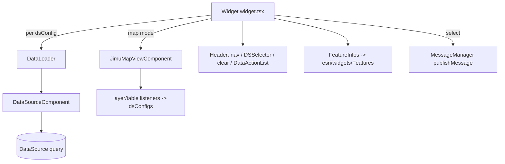

# OTB Widget: arcgis/feature-info

Online widget doc: https://developers.arcgis.com/experience-builder/guide/feature-info-widget/

## Purpose
Displays popup-style feature information (title, fields, media, attachments, last-edit
info) for one or more data sources. It can either:
- pull data from a selected Map widget (map-driven mode, `config.useMapWidget = true`), building a
  data source per visible operational layer / table on the fly, or
- read from explicitly configured data sources (`config.dsConfigs`, `config.useMapWidget = false`).
It renders the record with the ArcGIS Maps SDK `esri/widgets/Features` widget, supports feature
navigation (prev/next + count), a data-source selector dropdown when multiple sources are present,
clear-selection, and per-record data actions. Selecting a feature publishes a
`DataRecordsSelectionChangeMessage`. The manifest describes it as "the widget used in developer
guide", so treat it as a reference sample rather than a hardened production widget.

## Source paths inspected
Root: `ArcGISExperienceBuilder/client/dist/widgets/arcgis/feature-info/` (gitignored; read with includeIgnoredFiles).
- [manifest.json](../../../../../../../../ArcGISExperienceBuilder/client/dist/widgets/arcgis/feature-info/manifest.json) - name, publishMessages, extensions, excludeDataActions, properties.
- `config.json` - empty `{}` (no seeded config; defaults come from `utils.getDefaultConfig`).
- `src/config.ts` - `Config`/`IMConfig`, `DSConfig`, `ContentConfig`, `StyleConfig`, enums `StyleType`, `FontSizeType`.
- `src/utils.ts` - default config/factories, supported types, JSAPI FeatureLayer load, cached layer-object promises.
- `src/version-manager.ts` - three upgraders (1.1.0, 1.15.0, 1.16.0).
- `src/runtime/widget.tsx` - main class widget (state machine, map listeners, header, content, messages).
- `src/runtime/components/data-loader.tsx` - `DataLoader` + `DataSourceComponent`, paging/index/objectId query buffer.
- `src/runtime/components/ds-selector.tsx` - `DSSelector` dropdown.
- `src/runtime/components/features-info.tsx` - `FeatureInfos` (active variant, `esri/widgets/Features`).
- `src/runtime/components/feature-info.tsx` - `FeatureInfo` (unused single-feature variant, `esri/widgets/Feature`).
- `src/runtime/components/features-info-component.tsx` - alternate variant (imported-but-commented in widget.tsx).
- `src/setting/setting.tsx` - main settings (map vs data mode, DS list, style, options).
- `src/setting/ds-setting.tsx` - per-DS settings (`DataSourceSelector`, content options, label).
- `src/extensions/app-config-operations.ts` - `afterWidgetCopied` DS remapping.
- `src/extensions/builder-operations.ts` - `getTranslationKey` for ML translation.
- `src/message-actions/display-feature-action.ts` - writes selected record to MutableStore.
Skipped: `dist/`, `tests/`, `translations/`, `assets/`, `lib/style-*.ts` (styling only), icon.svg.

## Architecture overview
Class component (`React.PureComponent`) orchestrator in `widget.tsx`:
- Holds transient refs (`currentData`, `previousData`, `dataSource`, map-view listeners) as instance fields, not state, to avoid re-render churn.
- One invisible `DataLoader` is rendered per DS config (`getDataSourceContent`); only the `active` one drives `currentData`. Each `DataLoader` wraps a `DataSourceComponent` and owns a paging buffer that maps index -> record and objectId -> record.
- In map mode, a `JimuMapViewComponent` reports the active view; layer/table create/remove/visibility listeners synthesize `dsConfigsOfMapView` + `useDataSourcesOfMapView` dynamically.
- The header (`getHeaderContent`) composes feature navigation, DS selector (`DSSelector`), clear-selection button, and a `DataActionList` dropdown.
- The body (`getFeatureInfoContent`) is a small state machine over `loadDataStatus` (`CreateError` -> inaccessible alert, `NotReady` -> output-not-generated warning, data present -> `FeatureInfos`, else -> no-data message).
- `FeatureInfos` bridges to the JSAPI `esri/widgets/Features` widget imperatively (create in `componentDidMount`, sync graphic/map/view/timezone/visibleElements in `componentDidUpdate`, `destroy` on unmount).



## Key imports and packages
Grouped by source file (import -> from):

widget.tsx (`src/runtime/widget.tsx`)
- `React, Immutable, jsx, MessageManager, DataRecordsSelectionChangeMessage, DataSourceStatus, uuidv1, esri, getAppStore, appConfigUtils, DataSourceManager` and types `AllWidgetProps, IMUseDataSource, DataSource, ArcGISQueriableDataSource, MapDataSource, FeatureLayerDataSource, IMState, Timezone` -> `jimu-core`
- `JimuMapView, JimuMapViewComponent, JimuLayerView, MapViewManager` -> `jimu-arcgis`
- `Button, WidgetPlaceholder, DataActionList, DataActionListStyle, defaultMessages, Alert` -> `jimu-ui`
- `ClearSelectionGeneralOutlined` -> `jimu-icons/outlined/editor/clear-selection-general`
- `IMConfig, FontSizeType, DSConfig` -> `../config`; `versionManager` -> `../version-manager`; `getDefaultConfig, createDefaultDSConfig, createDefaultUseDataSource, isSupportedDataType` -> `../utils`

data-loader.tsx (`src/runtime/components/data-loader.tsx`)
- `React, DataSource, FeatureLayerQueryParams, DataSourceComponent, IMUseDataSource, QueriableDataSource, IMDataSourceInfo, DataSourceStatus, DataRecord, QueryParams, lodash, CONSTANTS, ClauseLogic, ClauseOperator, dataSourceUtils, ArcGISQueryParams` -> `jimu-core`
- `getLayerObject` -> `../../utils`

features-info.tsx (`src/runtime/components/features-info.tsx`)
- `React, DataSource, Timezone, dataSourceUtils` -> `jimu-core`
- `loadArcGISJSAPIModules, MapViewManager` -> `jimu-arcgis` (loads `esri/widgets/Features`)

utils.ts (`src/utils.ts`)
- `Immutable, DataSource, DataSourceManager, uuidv1, AllDataSourceTypes, UseDataSource, JSAPILayerTypes, CONSTANTS, SessionManager` -> `jimu-core`
- `loadArcGISJSAPIModules` -> `jimu-arcgis` (loads `esri/layers/FeatureLayer`)
- `DistanceUnits` -> `jimu-ui`

setting.tsx (`src/setting/setting.tsx`)
- `React, Immutable, getAppStore, DataSourceManager, observeStore` and types `IMState, DataSourceJson, UseDataSource, DataSource, IMDataSourceInfo, DataSourceStatus` -> `jimu-core`
- `Button, ButtonGroup, Dropdown*, TextArea, DistanceUnits, Alert, Select, Switch, Radio, Label, Checkbox` -> `jimu-ui`
- `ThemeColorPicker` -> `jimu-ui/basic/color-picker`
- `SettingSection, SettingRow, SidePopper, MapWidgetSelector` -> `jimu-ui/advanced/setting-components`
- `InputUnit` -> `jimu-ui/advanced/style-setting-components`
- `List, TreeItemActionType` -> `jimu-ui/basic/list-tree`
- `AllWidgetSettingProps, builderAppSync` -> `jimu-for-builder`

ds-setting.tsx (`src/setting/ds-setting.tsx`)
- `React, Immutable, DataSourceComponent, DataSourceManager` and types `UseDataSource, FeatureLayerDataSource, SceneLayerDataSource, IMDataSourceJson` -> `jimu-core`
- `Checkbox, TextInput` -> `jimu-ui`; `SettingSection, SettingRow` -> `jimu-ui/advanced/setting-components`
- `DataSourceSelector` -> `jimu-ui/advanced/data-source-selector`

extensions + message-actions
- `dataSourceUtils` and types `DuplicateContext, extensionSpec, IMAppConfig` -> `jimu-core` (app-config-operations.ts)
- `extensionSpec, IMAppConfig` -> `jimu-core`; `defaultMessages as jimuUIMessage` -> `jimu-ui` (builder-operations.ts)
- `AbstractMessageAction, MessageType, Message, DataRecordsSelectionChangeMessage, MutableStoreManager, MessageDescription` -> `jimu-core` (display-feature-action.ts)

## Reusable patterns found
- JimuMapView binding: `<JimuMapViewComponent useMapWidgetId={useMapWidgetIds[0]} onActiveViewChange={...} />`; `MapViewManager.getInstance().getJimuMapViewById(id)`; iterate `getAllJimuLayerViews()` / `getJimuTables()`; register/unregister `addJimuLayerViewCreatedListener`, `addJimuLayerViewRemovedListener`, `addJimuLayerViewsVisibleChangeListener` (and remove the previous view's listeners on active-view change).
- DataSourceComponent + data loading: `DataLoader` wraps `DataSourceComponent` with `onDataSourceCreated`, `onDataSourceInfoChange`, `onCreateDataSourceFailed`. It does not use `query` prop directly; instead it calls `dataSource.query(...)`, `queryCount(...)`, `queryById(...)` against a paging buffer. Note: this widget uses `DataSourceComponent`, not the `useDataSource` hook.
- publishMessage: selecting/clearing a record calls `MessageManager.getInstance().publishMessage(new DataRecordsSelectionChangeMessage(this.props.id, records, [dataSourceId]))` (declared in manifest `publishMessages`).
- Dynamic DS from map layers: `createDefaultUseDataSource(dataSource)` + `createDefaultDSConfig(dataSourceId, title)` build config/useDataSource entries at runtime from `jimuLayerView.createLayerDataSource()`, gated by `isSupportedDataType`.
- CONFIG_OPERATION extensions: `APP_CONFIG_OPERATIONS` (`app-config-operations.ts`) remaps `dsConfigs[].useDataSourceId` via `dataSourceUtils.mapUseDataSource` in `afterWidgetCopied` (duplicate handling); `widgetWillRemove` is a no-op passthrough. `BUILDER_OPERATIONS` (`builder-operations.ts`) exposes `noDataMessage` and each `dsConfigs[].label` as translation keys via `getTranslationKey`.
- display-feature message action: `display-feature-action.ts` extends `AbstractMessageAction`, filters `DataRecordsSelectionChange`, and writes the first record to `MutableStoreManager.getInstance().updateStateValue(widgetId, 'displayFeatureActionValue.record', record)`. UNVERIFIED whether this action is actually active: the manifest `messageActions` array is empty and no `messageActions` entry references this file (inspect manifest.json and search for `displayFeatureActionValue` consumers).
- version-manager field migrations: `BaseVersionManager` subclass with upgraders that reshape flat title/fields/media/attachments/lastEditInfo booleans into `dsConfigs[].contentConfig`, add `styleType`/`fontSizeType`, and flip `useMapWidget` to false (see Gotchas).

## Builder vs runtime split
- Runtime (`src/runtime/`): `widget.tsx` + components render feature info and publish selection messages; no builder-only imports.
- Builder (`src/setting/`): `setting.tsx` toggles map mode vs data mode via `Radio` -> `onRadioChange`, using `MapWidgetSelector` (map mode) or a DS list + `SidePopper` -> `DSSetting` (data mode). `DSSetting` uses `DataSourceSelector` (`types = supportedDsTypes`, `mustUseDataSource`, `isMultiple = newAddFlag`, `isBatched`) to pick sources and probes popup/layer capabilities via `getFeatureLayer`. Settings writes go through `this.props.onSettingChange({ id, config, useDataSources, useMapWidgetIds })`; `getUseDataSourcesByDSConfig` rebuilds `useDataSources` from the DS list.
- Config plumbing: both `Widget` and `Setting` expose `static getFullConfig` merging `getDefaultConfig()`; `Widget.mapExtraStateProps` derives `dataSourceWidgetLabelInfos` (for output-DS warnings) and `timezone` from `state.appConfig`.

## Lifecycle and cleanup
- `constructor` seeds state from `config.dsConfigs[0]`; instance fields hold non-render data.
- `componentDidUpdate` reconciles the current DS config, resets when data becomes invalid, and reacts to `stateProps.currentDSConfigId` changes pushed from settings.
- Map listeners: on `onActiveViewChange` the widget removes the previous `JimuMapView`'s three listeners before attaching new ones, preventing listener leaks across map switches.
- JSAPI Features widget: `FeatureInfos.createFeature()` calls `this.destroyFeature()` (guards `!destroyed` then `destroy()`) before creating a new `Features` instance; graphics are set via `setTimeout(..., 1)` to avoid a blank render race after setting map/view. Note: there is no explicit `componentWillUnmount` destroy in `features-info.tsx` (inspect for leaks -> UNVERIFIED whether the `Features` instance is destroyed on widget unmount).
- `DataLoader` uses a `countOfQueryGraphics` counter to discard stale async query results and clears its buffer on where/mode/version changes.

## Manifest/config requirements
- `manifest.json`: `type: widget`, `dependency: "jimu-arcgis"`, `publishMessages: ["DATA_RECORDS_SELECTION_CHANGE"]`, `messageActions: []`.
- `properties`: `coverLayoutBackground: true`, `flipIcon: true`, `canConsumeDataAction: true`.
- `excludeDataActions`: `arcgis-map.addToMap`, `directions.PlanRoute`, `arcgis-map.showPopup`.
- `extensions`: `appConfigOperations` -> `APP_CONFIG_OPERATIONS` (`extensions/app-config-operations`); `builderOperations` -> `BUILDER_OPERATIONS` (`extensions/builder-operations`).
- `defaultSize`: 400x400.
- Runtime config type `IMConfig` (`config.ts`): `useMapWidget`, `limitGraphics`, `maxGraphics`, `noDataMessage`, `styleType` (`StyleType`), `style` (`StyleConfig`), `dsNavigator`, `featureNavigator`, `showCount`, `clearSelection`, `dsConfigs` (`DSConfig[]` with per-DS `contentConfig`).
- Defaults come from `utils.getDefaultConfig()` since `config.json` is empty `{}`.

## Gotchas
- Empty `config.json`: default config is code-driven (`getDefaultConfig`), not JSON. `getDefaultConfig` sets `useMapWidget: true` and includes an extra `dsConfigsOfMapWidget: []` field that is not part of the `Config` interface in `config.ts` (UNVERIFIED usage; inspect `config.ts` vs `utils.ts`).
- `useMapWidget` default conflict: `getDefaultConfig()` returns `true`, but version-manager 1.16.0 forces existing configs to `false`. New vs upgraded widgets can start in different modes.
- Two/three near-duplicate feature components exist (`feature-info.tsx`, `features-info.tsx`, `features-info-component.tsx`) plus two `lib/style-features-info*` files; only `FeatureInfos` from `features-info.tsx` and `getStyle` from `lib/style-features-info` are wired in `widget.tsx` (others are commented imports). Do not edit the wrong variant.
- Heavy use of `// @ts-expect-error` around JSAPI internals (`features.view`, `features.map`, `graphic.uid`, `popupTemplate` assignment) - these depend on `esri/widgets/Features` private-ish behavior and can break on SDK upgrades.
- `getDefaultMessageContent` runs `config.noDataMessage` through `new esri.Sanitizer().sanitize(...)` then injects with `dangerouslySetInnerHTML`; sanitizer is required because the value is authored HTML.
- `message-actions/display-feature-action.ts` is present but not declared in `manifest.json` (`messageActions: []`) - likely dead/sample code (see Reusable patterns). Confirm before relying on it.
- `builder-operations.ts` has a copy-paste `id = 'filter-builder-operation'` (not feature-info specific); harmless but misleading.
- Map mode builds data sources lazily and asynchronously (`createLayerDataSource().then(...)`), so `dsConfigs`/current selection can briefly be empty during view/layer changes; the widget defensively nulls `currentData`/`dataSource`.

## Useful snippets and functions

Publish selection message (source: `src/runtime/widget.tsx`)
```tsx
selectGraphic () {
  const record = this.currentData?.record
  if (record && this.dataSource) {
    MessageManager.getInstance().publishMessage(new DataRecordsSelectionChangeMessage(this.props.id, [record], [this.dataSource.id]))
    const selectedRecordIds = this.dataSource.getSelectedRecordIds()
    const recordId = record.getId()
    if (!selectedRecordIds.includes(recordId)) {
      (this.dataSource as FeatureLayerDataSource).queryById(recordId).then((record) => {
        this.dataSource.selectRecordsByIds([recordId], [record])
      })
    }
  }
}
```

Bind active map view and (de)register layer listeners (source: `src/runtime/widget.tsx`)
```tsx
onActiveViewChange = (jimuMapView: JimuMapView) => {
  this.currentData = null; this.dataSource = null
  this.dsConfigsOfMapView = []; this.useDataSourcesOfMapView = []
  this.onDataSourceStatusChanged(DataSourceStatus.Loaded)
  if (!jimuMapView) { this.setState({ jimuMapViewId: null }); return }
  const loadedJimuLayerViews = jimuMapView.getAllJimuLayerViews()
  // ... build dsConfigs for visible, supported layers ...
  if (this.prevJimuMapView) {
    this.jimuLayerViewCreatedListener && this.prevJimuMapView.removeJimuLayerViewCreatedListener(this.jimuLayerViewCreatedListener)
    this.jimuLayerViewRemovedListener && this.prevJimuMapView.removeJimuLayerViewRemovedListener(this.jimuLayerViewRemovedListener)
    this.jimuLayerViewsVisibleChangedListener && this.prevJimuMapView.removeJimuLayerViewsVisibleChangeListener(this.jimuLayerViewsVisibleChangedListener)
  }
  this.prevJimuMapView = jimuMapView
  this.jimuLayerViewCreatedListener = (lv: JimuLayerView) => { this.onJimuLayerViewCreate(lv, loadedJimuLayerViews) }
  jimuMapView.addJimuLayerViewCreatedListener(this.jimuLayerViewCreatedListener)
  // ... removed + visibility listeners ...
  jimuMapView.whenJimuMapViewLoaded().then(() => { this.onJimuMapViewLoaded(jimuMapView) })
  this.setState({ jimuMapViewId: jimuMapView.id })
}
```

DataLoader wraps DataSourceComponent (source: `src/runtime/components/data-loader.tsx`)
```tsx
render () {
  return (
    <DataSourceComponent
      useDataSource={this.props.useDataSource}
      widgetId={this.props.widgetId}
      onDataSourceCreated={this.onDataSourceCreated}
      onDataSourceInfoChange={this.onDataSourceInfoChange}
      onCreateDataSourceFailed={this.onCreateDataSourceFailed}
    />
  )
}
```

Paged query against a data source (source: `src/runtime/components/data-loader.tsx`)
```tsx
const query = {
  outFields: ['*'],
  notAddFieldsToClient: true,
  returnGeometry: true,
  page: Math.floor(start / this.dataBuffer.pagingNum) + 1,
  pageSize: this.dataBuffer.pagingNum
}
return this.dataSource.query(query)
```

Factories for dynamic map-driven config (source: `src/utils.ts`)
```ts
export function createDefaultUseDataSource (dataSource) {
  return Immutable({
    dataSourceId: dataSource.id,
    mainDataSourceId: dataSource.getMainDataSource()?.id,
    dataViewId: dataSource.dataViewId,
    rootDataSourceId: dataSource.getRootDataSource()?.id
  } as UseDataSource)
}

export function isSupportedDataType (dataSource): boolean {
  return supportedDsTypes.includes(dataSource?.type) && !dataSource?.dataSourceJson?.isHidden && dataSource?.getSchema()?.fields
}
```

Create/destroy the JSAPI Features widget (source: `src/runtime/components/features-info.tsx`)
```tsx
createFeature () {
  const p = this.Features ? Promise.resolve() : loadArcGISJSAPIModules(['esri/widgets/Features']).then(m => { [this.Features] = m })
  return p.then(() => {
    this.destroyFeature()
    this.features = new this.Features({
      container: this.featureContainerRef.current,
      visible: true,
      features: [this.props.graphic],
      // @ts-expect-error
      defaultPopupTemplateEnabled: true,
      visibleElements: { actionBar: false, closeButton: false }
    })
  }).then(() => { this.setState({ loadStatus: LoadStatus.Fulfilled }) })
}
```

Duplicate-time DS remap extension (source: `src/extensions/app-config-operations.ts`)
```ts
afterWidgetCopied (sourceWidgetId, sourceAppConfig, destWidgetId, destAppConfig, contentMap?) {
  if (!contentMap) return destAppConfig
  const widgetJson = sourceAppConfig.widgets[sourceWidgetId]
  const widgetConfig: IMConfig = widgetJson?.config
  if (widgetConfig?.dsConfigs) {
    const newDSConfigs = widgetConfig.dsConfigs.map(dsConfig => {
      const useDataSource = widgetJson.useDataSources.find(u => u.dataSourceId === dsConfig.useDataSourceId)
      const mappingInfo = dataSourceUtils.mapUseDataSource(contentMap, useDataSource)
      return (mappingInfo.isChanged && mappingInfo.useDataSource)
        ? dsConfig.set('useDataSourceId', mappingInfo.useDataSource.dataSourceId) : dsConfig
    })
    return destAppConfig.setIn(['widgets', destWidgetId, 'config', 'dsConfigs'], newDSConfigs)
  }
  return destAppConfig
}
```

Translation-key extension for ML strings (source: `src/extensions/builder-operations.ts`)
```ts
getTranslationKey (appConfig: IMAppConfig): Promise<extensionSpec.TranslationKey[]> {
  const keys: extensionSpec.TranslationKey[] = []
  const config = appConfig.widgets[this.widgetId].config as IMConfig
  if (config.noDataMessage) {
    keys.push({ keyType: 'value', key: `widgets.${this.widgetId}.config.noDataMessage`, label: { key: 'noDataMessage', enLabel: message.noDataMessage }, valueType: 'textarea' })
  }
  config.dsConfigs?.forEach((dsConfig, index) => {
    keys.push({ keyType: 'value', key: `widgets.${this.widgetId}.config.dsConfigs[${index}].label`, label: { key: 'dataLabelForML', enLabel: message.dataLabelForML }, valueType: 'text' })
  })
  return Promise.resolve(keys)
}
```

Version-manager field migration (source: `src/version-manager.ts`)
```ts
{
  version: '1.15.0',
  upgrader: (oldConfig, widgetId) => {
    const widgetConfig = getAppStore().getState()?.appConfig?.widgets[widgetId]
    const useDataSource = widgetConfig?.useDataSources && widgetConfig.useDataSources[0]
    const newConfig = oldConfig.asMutable()
    newConfig.dsConfigs = useDataSource ? [{
      id: 'default_data_source_config',
      useDataSourceId: useDataSource.dataSourceId,
      contentConfig: { title: oldConfig.title, fields: oldConfig.fields, media: oldConfig.media, attachments: oldConfig.attachments, lastEditInfo: oldConfig.lastEditInfo }
    }] : []
    ;['title', 'fields', 'media', 'attachments', 'lastEditInfo'].forEach(k => delete newConfig[k])
    return Immutable(newConfig)
  }
}
```
