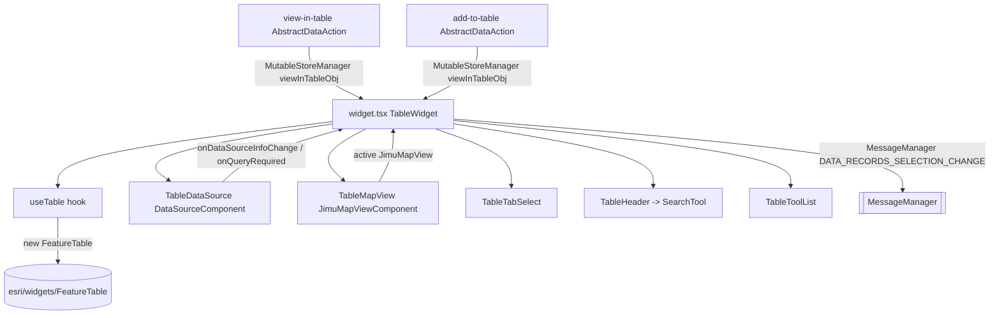

# OTB Widget: common/table

Online widget doc: https://developers.arcgis.com/experience-builder/guide/table-widget/

## Purpose
The `table` widget renders an interactive attribute table over one or more feature-capable data sources. It wraps the ArcGIS Maps SDK for JavaScript `FeatureTable` widget (`esri/widgets/FeatureTable`) and adds ExB-native behavior on top: multi-layer tabs, per-layer overrides of general settings, text search with suggestions, map-extent filtering, selection sync (highlight in/out), auto refresh, editing, related records / attachments, CSV export, column show/hide, freeze columns, and paging (scroll or paged).

It has two authoring modes (`config.tableMode`):
- `MAP` (`TableModeType.Map`) - table follows a bound Map widget's layers via `JimuMapView` / `JimuLayerView`.
- `LAYER` (`TableModeType.Layer`) - table is configured against explicitly selected data sources (no map required).

It also ships two data actions that let OTHER widgets push records into a table at runtime: `viewInTable` (record-level selection view) and `addToTable` (data-source-level new tab).

## Source paths inspected
Root: `ArcGISExperienceBuilder/client/dist/widgets/common/table/` (gitignored; read with includeIgnoredFiles). Read in full or in part:
- `manifest.json` - widget metadata, dataActions, extensions, properties.
- `config.json` - default runtime config values.
- `src/config.ts` - `Config` / `IMConfig`, `LayersConfig`, all enums.
- `src/runtime/widget.tsx` - main runtime component (read end to end).
- `src/runtime/components/table-data-source.tsx` - `DataSourceComponent` wrapper + ds info/query watchers.
- `src/runtime/components/table-map-view.tsx` - `JimuMapViewComponent` + layer-view listeners + extent watch.
- `src/runtime/components/use-table.ts` - `useTable` hook, constructs / destroys the JSAPI `FeatureTable`.
- `src/runtime/components/table-header.tsx` - search box + suggestion popper.
- `src/runtime/components/search-tool.tsx` - `TextInput`-based search UI (towed / inline).
- `src/runtime/components/table-tab-select.tsx` - Tabs / Select tab switcher.
- `src/runtime/components/utils.ts` - suggestions, timezone, `constructTableTemplate` (partial read of top).
- `src/runtime/utils.ts` - `getGlobalTableTools`, `getPrivilege`, array helpers.
- `src/runtime/style.ts` - emotion `getStyle` (partial read).
- `src/utils/index.ts` - `constructConfig`, `getDataSourceById`, `getTableDataSource`, supported ds types (partial read).
- `src/data-actions/view-in-table.ts` + `view-in-table-setting.tsx` - `AbstractDataAction` + setting.
- `src/data-actions/add-to-table.ts` + `add-to-table-setting.tsx` (setting header only).
- `src/setting/setting.tsx` - settings root (mode + general + arrangement).
- `src/setting/components/layer-config-ds.tsx`, `layer-config-field.tsx` (header), `arrangement-style.tsx` (header).

Not read (UNVERIFIED - inspect if needed): `src/version-manager.ts`; `src/tools/app-config-operations.ts`; `src/tools/builder-operations.ts`; `src/runtime/components/table-tool-list.tsx`, `table-total-selection.tsx`, `auto-refresh-loading.tsx`, `empty-table-placeholder.tsx`; the rest of `src/runtime/components/utils.ts` (incl. full `constructTableTemplate`, `getTableColumnsFields`, `getHonorWebmapUsedFields`); most `src/setting/components/*` (`general-settings`, `layer-config`, `layer-list`, `layer-mode-setting`, `map-mode-setting`, `table-map-layers`, `table-options`, `table-search`, `table-tools`, `empty-placeholder`, `layer-mode-tool`, `map-mode-tool`, `utils.ts`); `translations/*`; `assets/*`.

## Architecture overview

- `widget.tsx` is the orchestrator. It computes `allLayersConfig` = configured layers + data-action tables + runtime tables, tracks `activeTabId`, and derives the active `dataSource` from Redux via `DataSourceManager`.
- `useTable` owns the imperative JSAPI `FeatureTable` instance (create/destroy, events, template, highlight, paging). It returns `[table, tableLoaded, usedDsId, attributeTableTemplate]`.
- `TableDataSource` (a `DataSourceComponent`) is a headless subscription that reports ds status, selection, source-version, gdbVersion, time extent, and widget-query changes back up.
- `TableMapView` (a `JimuMapViewComponent`) resolves the active `JimuMapView`, listens for layer-view create/remove/visibility, and watches the map extent for the extent filter.

## Key imports and packages
Grouped by package; file each came from.

jimu-core (framework core; runtime + data + redux + message + JSAPI loader):
- `src/runtime/widget.tsx`: `React, ReactRedux, hooks, AllWidgetProps, IMState, classNames, CONSTANTS, lodash, appActions, getAppStore, MutableStoreManager, DataSourceManager, MessageManager, DataRecordsSelectionChangeMessage, QueriableDataSource, ClauseValuePair, QueryParams, appConfigUtils, DataRecord, FeatureLayerDataSource, TimeExtent, dataSourceUtils, Immutable, QueryScope, WidgetState, loadArcGISJSAPIModule, DataSourceTypes, DataSourceStatus`.
- `src/runtime/components/table-data-source.tsx`: `DataSourceComponent, QueryRequiredInfo, IMDataSourceInfo, DataSourceStatus, CONSTANTS`.
- `src/runtime/components/use-table.ts`: `DataRecord, FeatureDataRecord, dataSourceUtils, CONSTANTS, ReactRedux, IMState`.
- `src/utils/index.ts`: `DataSourceTypes, DataSourceManager, JSAPILayerTypes, dataSourceUtils` and typed ds interfaces (`FeatureLayerDataSource, SceneLayerDataSource, BuildingComponentSubLayerDataSource, OrientedImageryLayerDataSource, SubtypeSublayerDataSource, ImageryLayerDataSource`).
- `src/data-actions/*.ts`: `AbstractDataAction, DataRecordSet, DataLevel, MutableStoreManager, appActions, getAppStore, utils`.

jimu-arcgis (map/JSAPI bridge - declared as manifest `dependency`):
- `src/runtime/components/table-map-view.tsx`: `JimuLayerView, JimuMapView, JimuMapViewComponent`.
- `src/runtime/widget.tsx`, `use-table.ts`: `type JimuMapView`.
- `src/runtime/components/utils.ts`: `JimuLayerView, JimuMapView, JimuTable`.

esri (ArcGIS Maps SDK for JavaScript, aliased `esri/*`):
- `src/runtime/components/use-table.ts`: `FeatureTable` (`esri/widgets/FeatureTable`), `reactiveUtils` (`esri/core/reactiveUtils`).
- `src/runtime/widget.tsx`: `reactiveUtils`, `Polygon` (`esri/geometry/Polygon`); buffer operators loaded lazily via `loadArcGISJSAPIModule('esri/geometry/operators/geodesicBufferOperator' | '.../bufferOperator')`.
- `src/runtime/components/utils.ts`: `TableTemplate` (`esri/widgets/FeatureTable/support/TableTemplate`).
- `src/runtime/components/table-header.tsx`: `esri.Sanitizer` (from jimu-core `esri`).

jimu-ui (themed UI): `Paper, WidgetPlaceholder` (widget.tsx); `Button, Popper, TextInput` (search); `Tab, Tabs, Select` (tabs); `Radio, Label, ConfirmDialog, Checkbox, NumericInput, Icon, Tooltip` (setting). Advanced: `SettingSection, SettingRow` from `jimu-ui/advanced/setting-components`; `FieldSelector, dataComponentsUtils` from `jimu-ui/advanced/data-source-selector`; `Tree` family from `jimu-ui/basic/list-tree`.

jimu-theme: `Global, useTheme` (widget.tsx); `getAppThemeVariables, colorUtils` (style.ts); `useTheme` (settings, search).

jimu-icons: `CloseOutlined, SearchOutlined, ArrowLeftOutlined, VisibleOutlined, InvisibleOutlined`.

jimu-for-builder: `AllWidgetSettingProps` (setting.tsx).

jimu-layouts: `LayoutItemSizeModes` from `jimu-layouts/layout-runtime` (widget.tsx, used to detect auto height/width).

Third-party: `@esri/arcgis-rest-portal` (`IItem`) in `runtime/components/utils.ts`.

Calcite tokens in `style.ts` / global CSS: theme system tokens are used, e.g. `theme.sys.color.divider.secondary`, `theme.sys.color.action.default`, `theme.ref.palette.neutral[300|600]`, `theme.sys.color.primary.light`, and CSS vars `var(--sys-color-surface-paper-text)` / `var(--sys-color-surface-overlay-text)` in `search-tool.tsx`. `getGlobalTableTools` (in `runtime/utils.ts`) themes JSAPI/Calcite internals via `.esri-button-menu__item`, `.esri-popover--open`, `.esri-date-picker__calendar` selectors.

## Reusable patterns found
- DataSourceComponent as a headless subscription (`table-data-source.tsx`): a single `<DataSourceComponent>` drives all data reactions through `onDataSourceInfoChange` and `onQueryRequired`; no records rendered directly there. `useDataSource` is passed as `Immutable(useDataSource)`; a runtime `dataSource` prop is used instead for data-action tables.
- `notAutoLoadUsedFieldsData` (manifest `properties`): the widget opts out of ExB auto-loading of used-field data because it drives its own JSAPI `FeatureTable` queries. Pairs with `constructConfig` storing chosen fields in `useDataSource.fields`.
- DATA_RECORDS_SELECTION_CHANGE (manifest `publishMessages`): selection is broadcast via `MessageManager.getInstance().publishMessage(new DataRecordsSelectionChangeMessage(id, records, [dataSource.id]))`, then mirrored to the ds with `dataSource.selectRecordsByIds(...)` / `clearSelection()` (`tableSelectAsyncDs`, `resetTable` in widget.tsx).
- Data actions with `settingUri` (manifest `dataActions`): `viewInTable` and `addToTable` each declare `uri` + `settingUri` + `icon`. Runtime classes extend `AbstractDataAction` (`isSupported` + `onExecute`); their per-instance config (`isViewInSameSheet` / `isAddInSameSheet`) is edited by the `*-setting.tsx` `DataActionSettingProps` components. `manifest.excludeDataActions` blocks `table.addToTable` and `arcgis-map.addToMap` from appearing on the table's own output.
- MutableStoreManager cross-widget state (data-actions -> runtime): data actions write `viewInTableObj` (record-carrying) via `MutableStoreManager.getInstance().updateStateValue(this.widgetId, 'viewInTableObj', ...)`; the runtime reads it from `props.mutableStateProps.viewInTableObj` and `runtimeTableObj`, and clears both on unmount. Active-tab handoff goes through `appActions.widgetStatePropChange(this.widgetId, 'dataActionActiveObj', {...})`.
- Multi-DS tabs (`table-tab-select.tsx` + widget.tsx): `allLayersConfig` merges configured layers + data-action + runtime tables; horizontal mode uses `Tabs/Tab` (closeable only for data-action tabs), dropdown mode uses `Select`. Switching tab resets `tableShowColumns` and dispatches `activeTabId` to widget state.
- Calcite / JSAPI theming via emotion `Global`: `<Global styles={getGlobalTableTools(theme)} />` injects themed overrides for the embedded FeatureTable's Calcite chrome.
- Per-layer override of general settings (`usedConfig` memo in widget.tsx): when `curLayerConfig.overrideGeneralSettings` is true, a whitelist of keys is taken from the layer config; otherwise the widget-level general settings win.
- Lazy JSAPI module loading: `loadArcGISJSAPIModule(...)` for buffer operators (only when an extent/buffer filter is needed) instead of static import.

## Builder vs runtime split
- Runtime entry: `src/runtime/widget.tsx` (`export default TableWidget`, with `TableWidget.versionManager = versionManager`). Consumes `AllWidgetProps<IMConfig>`.
- Settings entry: `src/setting/setting.tsx` (`AllWidgetSettingProps<IMConfig>`). Chooses `Layer` vs `Map` mode (`TableModeType`), renders `LayerModeSetting` / `MapModeSetting`, `ArrangementStyle`, `GeneralSettings`; switching mode shows a `ConfirmDialog` and resets `layersConfig` / `mapViewsConfig` / extent flags.
- Builder-only hooks: manifest `extensions` register `APP_CONFIG_OPERATIONS` (`tools/app-config-operations`) and `BUILDER_OPERATIONS` (`tools/builder-operations`). UNVERIFIED contents - inspect `src/tools/*.ts`.
- `window.jimuConfig.isInBuilder` is checked in `table-data-source.tsx` to force loading state and treat source-version changes as reloads while authoring. `window.isExpressBuilder` gates empty-config placeholders in `setting.tsx`.
- Data-action settings are builder-side too: `view-in-table-setting.tsx` / `add-to-table-setting.tsx` use `DataActionSettingProps` + `SettingSection`/`SettingRow`.

## Lifecycle and cleanup
- `useTable.destroyTable()` removes all bound JSAPI handles (`cell-click`, `cell-dblclick`, `cell-keydown`, hover/hover-out), calls `tableRef.current.destroy()`, and clears the container's `innerHTML`. It runs on unmount and whenever the active data source id changes.
- Reactive watchers (`reactiveUtils.watch`) for `table.state` (-> `tableLoaded`), edit state, `relatedTable`, and `isQueryingOrSyncing` are all removed in the effect cleanup. A columns-visibility watcher in widget.tsx and a scale-range/`isLayerVisibleForRendering` watcher in useTable are likewise removed.
- `TableMapView` adds/removes `addJimuLayerViewsVisibleChangeListener`, `addJimuLayerViewCreatedListener`, `addJimuLayerViewRemovedListener` on the active `JimuMapView`, and removes the extent `reactiveUtils.watch` handle on cleanup; a 50ms `setTimeout` guards double `updateLayersConfig` calls.
- On unmount widget.tsx clears MutableStore keys: `viewInTableObj` and `runtimeTableObj` set back to `{}`.
- Editing sync: `tableUsedLayer.on('edits', updateDataSourceEvent)` (or the subtype parent group layer) updates the ds via `buildRecord` + `afterUpdateRecord` / `afterDeleteRecordsByIds`; the handle is removed when the layer changes. `isSelfEditing` ref prevents a self-edit from triggering a re-render loop.
- SQL/geometry updates wait for `table.isQueryingOrSyncing` to go idle (via a watch) before assigning `definitionExpression` / `filterGeometry`, because FeatureTable blanks if updated mid-query.

## Manifest/config requirements
From `manifest.json`:
- `dependency: "jimu-arcgis"` (required to use maps / JSAPI).
- `properties`: `coverLayoutBackground: true`, `canConsumeDataAction: true`, `notAutoLoadUsedFieldsData: true`, `needActiveState: true`.
- `publishMessages: ["DATA_RECORDS_SELECTION_CHANGE"]`; `messageActions: []`.
- `dataActions`: `viewInTable` and `addToTable`, each with `uri`, `settingUri`, `icon`.
- `excludeDataActions`: `["table.addToTable", "arcgis-map.addToMap"]`.
- `extensions`: `appConfigOperations` (`APP_CONFIG_OPERATIONS` -> `tools/app-config-operations`), `builderOperations` (`BUILDER_OPERATIONS` -> `tools/builder-operations`).
- `defaultSize`: 600 x 400.

Default `config.json` values: `tableMode: "MAP"`, `arrangeType: "TABS"`, `pagingStyle: "SCROLL"`, `pageSize: 50`, `respectMapRange: false`, `enableSelect: true`, `selectMode: "SINGLE"`, `enableRefresh: true`, `enableDelete: false`, `enableShowHideColumn: true`, `showCount: true`, `enableMapExtentFilter: true`, `defaultExtentFilterEnabled: false`, `enableRelatedRecords: false`, `enableAttachments: false`, plus `columnSetting` (`responsiveType: "FIXED"`, `columnWidth: 200`, `wrapText: false`, `textAlign: "start"`) and `headerFontSetting` (`fontSize: 14`, `bold: false`, empty colors). `layersConfig: []`, `mapViewsConfig: {}`.

Config types live in `src/config.ts`: `Config`/`IMConfig`, `LayersConfig`, `MapViewConfig`/`MapViewsConfig`, enums `TableModeType`, `TableArrangeType`, `LocationType`, `AlignModeType`, `SelectionModeType`, `LayerHonorModeType`, `ResponsiveType`, `PagingType`, `TableDataActionType`, and interfaces `ColumnSizing`, `HeaderAttrs`, `TableFieldsSchema`.

## Gotchas
- The FeatureTable is imperative and must not be updated while querying: guard with `table.isQueryingOrSyncing` (see `updateGeometryAndSql`) or the table flashes blank.
- Highlight/selection can be reset by the API after a definitionExpression/geometry change; the code sets `needToUpdateHighlight.current = true` and re-syncs in a later effect rather than immediately.
- Subtype sublayers: `definitionExpression` must be set on the PARENT layer (`table.layer.parent`), and edit events bind to the parent subtype group layer, not the sublayer.
- `notAutoLoadUsedFieldsData` means the widget is responsible for its own field loading; do not assume used-field data is pre-loaded.
- Map mode vs layer mode diverge substantially: in map mode the layer comes from a matching `JimuLayerView` / `JimuTable` on the active view when possible, else a JSAPI layer is created from the ds; in layer mode a JSAPI layer is always created from the ds.
- Data-action tables carry cloned records in `MutableStore` (`viewInTableObj[id].records`) and are cleared on tab close and on unmount; runtime tables (`runtimeTableObj`) are wiped when `tableMode` becomes `LAYER`.
- `enableMapExtentFilter` (feature available) is distinct from `defaultExtentFilterEnabled` (on by default); the runtime `mapFilterEnabled` = both true. Message-action extent filters on the same ds are detected and take precedence to avoid double filtering (`updateViewExtent`).
- Search suggestions only fire when `searchText.length >= 3` (`getSearchSuggestions` returns false below 3), and suggestion HTML is passed through `esri.Sanitizer` before `dangerouslySetInnerHTML`.
- `arrangement-style.tsx` (as read) contains a stray non-ASCII char in a CSS block (`.arrange_container {ß`) - do not copy verbatim; verify before reuse.

## Useful snippets and functions

Constructing / configuring the JSAPI FeatureTable.
Source: `src/runtime/components/use-table.ts`
```ts
tableRef.current = new FeatureTable({
  container,
  layer: tableUsedLayer as any,
  ...(activeView?.view ? { view: activeView.view } : {}),
  ...(maxCount ? { maxSize: maxCount } : {}),
  paginationEnabled: pagingStyle === PagingType.Multiple,
  pageSize: pageSize || 50,
  attachmentsEnabled: enableAttachments,
  relatedRecordsEnabled: enableRelatedRecords,
  visibleElements: {
    columnDescriptions: false,
    header: false,
    menu: false,
    menuItems: { clearSelection: false, refreshData: false, toggleColumns: false },
    selectionColumn: false
  },
  menuConfig: { items: [] },
  multiSortEnabled: true,
  editingEnabled: layerEditable,
  timeZone: getTimezone(dataSource),
  filterGeometry: initGeometry
})
```

Full teardown of the imperative table.
Source: `src/runtime/components/use-table.ts`
```ts
const destroyTable = React.useCallback(() => {
  if (tableHoverRef.current?.remove) tableHoverRef.current.remove()
  if (tableHoverOutRef.current?.remove) tableHoverOutRef.current.remove()
  if (tableClickRef.current?.remove) tableClickRef.current.remove()
  if (tableDblClickRef.current?.remove) tableDblClickRef.current.remove()
  if (tableKeyDownRef.current?.remove) tableKeyDownRef.current.remove()
  if (tableRef.current && !tableRef.current.destroyed) {
    tableRef.current.destroy()
    tableRef.current = null
  }
  if (tableContainer.current) {
    tableContainer.current.innerHTML = ''
  }
}, [tableContainer])
```

Headless DataSourceComponent wiring.
Source: `src/runtime/components/table-data-source.tsx`
```tsx
return <DataSourceComponent
  widgetId={widgetId}
  useDataSource={Immutable(useDataSource)}
  dataSource={dataActionDataSource}
  onDataSourceCreated={onDataSourceCreated}
  onCreateDataSourceFailed={onCreateDataSourceFailed}
  onDataSourceInfoChange={handleDataSourceInfoChange}
  onQueryRequired={handleQueryRequired}
/>
```

Publishing selection and mirroring it to the data source.
Source: `src/runtime/widget.tsx`
```ts
const tableSelectAsyncDs = React.useCallback((selectedIds: Array<string | number>) => {
  if (!dataSource) return
  const syncSqlResult = (records) => {
    MessageManager.getInstance().publishMessage(
      new DataRecordsSelectionChangeMessage(id, records, [dataSource.id])
    )
    if (records.length > 0) {
      dataSource.selectRecordsByIds(records.map(record => record.getId()), records)
    } else {
      dataSource.clearSelection()
    }
  }
  if (selectedIds?.length > 0) {
    dataSource.query({
      objectIds: selectedIds,
      returnGeometry: true,
      outFields: ['*'],
      notAddFieldsToClient: true
    } as QueryParams, { scope: QueryScope.InAllData }).then(result => {
      const records = result?.records
      if (records) syncSqlResult(records)
    })
  } else {
    syncSqlResult([])
  }
}, [dataSource, id])
```

Binding to the active JimuMapView and its layer-view events.
Source: `src/runtime/components/table-map-view.tsx`
```tsx
React.useEffect(() => {
  if (!jimuMapView || !jimuMapView.view) return
  jimuMapView.addJimuLayerViewsVisibleChangeListener(visibleChangedListener)
  jimuMapView.addJimuLayerViewCreatedListener(viewCreatedListener)
  jimuMapView.addJimuLayerViewRemovedListener(viewRemovedListener)
  const oldJimuMapView = jimuMapView
  return () => {
    if (oldJimuMapView) {
      oldJimuMapView.removeJimuLayerViewsVisibleChangeListener(visibleChangedListener)
      oldJimuMapView.removeJimuLayerViewCreatedListener(viewCreatedListener)
      oldJimuMapView.removeJimuLayerViewRemovedListener(viewRemovedListener)
    }
  }
}, [jimuMapView, viewCreatedListener, viewRemovedListener, visibleChangedListener])

return <JimuMapViewComponent
  useMapWidgetId={mapWidgetId}
  onActiveViewChange={handleActiveViewChange}
/>
```

Data action (view-in-table) writing cross-widget state.
Source: `src/data-actions/view-in-table.ts`
```ts
viewInTableObj[newItemId] = { daLayerItem, records: copyRecords }
MutableStoreManager.getInstance().updateStateValue(this.widgetId, 'viewInTableObj', viewInTableObj)

getAppStore().dispatch(
  appActions.widgetStatePropChange(this.widgetId, 'dataActionActiveObj', { activeTabId: newItemId, dataActionTable: true })
)
return true
```

Data action support gate.
Source: `src/data-actions/view-in-table.ts`
```ts
isSupported (dataSets: DataRecordSet[], dataLevel: DataLevel): Promise<boolean> {
  if (dataSets.length > 1) return Promise.resolve(false)
  let isActionSupported = true
  const { dataSource, records } = dataSets[0]
  const typeIsLayer = supLayerTypes.includes(dataSource.type as any)
  // ...record-level checks, cluster/aggregate check omitted...
  return Promise.resolve(isActionSupported && dataSource.getStatus() !== DataSourceStatus.NotReady)
}
```

Per-layer override of general settings.
Source: `src/runtime/widget.tsx`
```ts
const usedConfig = React.useMemo(() => {
  const override = curLayerConfig?.overrideGeneralSettings
  const usedWidgetConfig = {
    enableRelatedRecords, enableAttachments, columnSetting, headerFontSetting,
    enableSelect, selectMode, enableRefresh, enableDelete, enableShowHideColumn, showCount
  }
  if (!curLayerConfig) return usedWidgetConfig
  const usedKeys = ['enableRelatedRecords', 'enableAttachments', 'columnSetting', 'headerFontSetting',
    'enableSelect', 'selectMode', 'showCount', 'enableRefresh', 'enableDelete', 'enableShowHideColumn']
  const filteredObj = Object.keys(curLayerConfig).reduce((acc, key) => {
    if (usedKeys.includes(key)) acc[key] = curLayerConfig[key]
    return acc
  }, usedWidgetConfig)
  return override ? filteredObj : { /* widget-level general settings */ }
}, [/* general settings + curLayerConfig */])
```

Theming the embedded FeatureTable/Calcite chrome via emotion Global.
Source: `src/runtime/utils.ts`
```ts
export function getGlobalTableTools (theme: IMThemeVariables): SerializedStyles {
  return css`
    .esri-button-menu__item .esri-button-menu__item-label{ padding: 4px 15px !important; }
    .table-action-option .table-action-option-close button{
      :hover { color: ${theme.sys.color.action.default}; }
      float: right;
    }
    .esri-popover--open{
      z-index: 1005 !important;
      .esri-date-picker__calendar{ background-color: ${theme.sys.color.action.default}; }
    }
  `
}
```

Edit-permission check (privilege via jimu-core `privilegeUtils`).
Source: `src/runtime/utils.ts`
```ts
export const getPrivilege = async () => {
  const exbAccess = await privilegeUtils.checkExbAccess(privilegeUtils.CheckTarget.Experience)
  return exbAccess?.capabilities?.canEditFeature
}
```

Building a layer config from a data source (used by settings + data actions).
Source: `src/utils/index.ts`
```ts
export const constructConfig = (currentDs, isMapMode?, getNewConfigId?, originalDs?): LayersConfig => {
  const allFields = currentDs.getSchema()
  // honor popup field-maps, cap columns at 50, persist chosen fields on useDataSource.fields
  const useDataSource = {
    dataSourceId: useDs.id,
    mainDataSourceId: useDs.getMainDataSource()?.id,
    dataViewId: useDs.dataViewId,
    rootDataSourceId: useDs.getRootDataSource()?.id
  } as UseDataSource
  const curIMUseDsWithFields = Immutable(useDataSource).set('fields', usedFields)
  return { id: configId, name: currentDs.getLabel(), useDataSource: curIMUseDsWithFields.asMutable({ deep: true }), /* ...defaults... */ }
}
```
