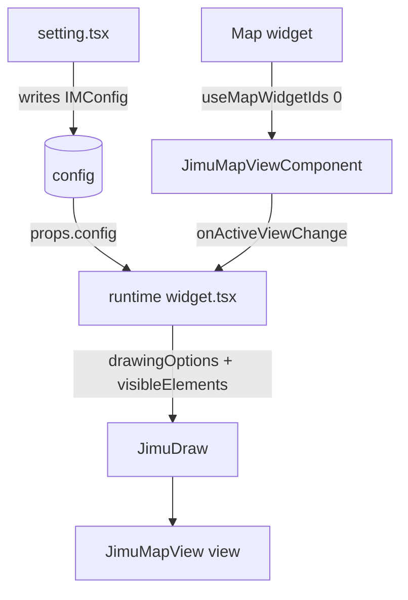

# OTB Widget: arcgis/draw

Online widget doc: https://developers.arcgis.com/experience-builder/guide/draw-widget/

> Source-grounded card built from the compiled OTB source under
> `ArcGISExperienceBuilder/client/dist/widgets/arcgis/draw/`. This tree is
> gitignored; it was read with includeIgnoredFiles. `dist/` (bundled output) and
> `tests/` were intentionally skipped. Items I could not confirm from source are
> tagged `UNVERIFIED` with the file that raised the question.

## Purpose

The `draw` widget lets an end user sketch graphics (point, polyline, polygon,
rectangle, circle, freehand line/area, and custom text) on an associated Map or
Scene, optionally with live measurements, snapping, tooltips, segment labels,
3D elevation effects, and import/export. It is a thin ExB shell around the
`JimuDraw` advanced-map component: nearly all interactive drawing behavior lives
in `JimuDraw`, and the widget's job is to translate its `config` into `JimuDraw`
props and to bridge the selected Map widget's `JimuMapView`. The manifest
`description` ("This is the widget used in developer guide") reflects its origin
as the canonical developer-guide sample.

## Source paths inspected

- `manifest.json`
- `config.json` (default config values)
- `src/config.ts` (Config interface, enums)
- `src/version-manager.ts`
- `src/runtime/widget.tsx`
- `src/setting/setting.tsx`
- `src/setting/components/draw-tools-selector.tsx`
- `src/setting/components/effect-3d-selector.tsx`
- `src/setting/components/measurements-units-selector.tsx`
- `src/setting/components/measurements-decimal-places.tsx` (referenced from setting.tsx; not read in full)
- `src/setting/components/draw-options/index.tsx`
- `src/setting/components/draw-options/snapping-option.tsx`
- `src/setting/components/wip-draw-modes-selector.tsx` (WIP, commented out in setting.tsx; not read)

Skipped by instruction: `dist/`, `tests/`.

## Architecture overview

- Runtime (`src/runtime/widget.tsx`) is a function component. It holds one piece
  of local state that matters, `currentJimuMapView`, set from
  `JimuMapViewComponent.onActiveViewChange`. Until a view exists it renders a
  `WidgetPlaceholder`; once a view exists it renders `<JimuDraw>`.
- The runtime derives a `JimuDrawVisibleElements` object and a `drawingOptions`
  object purely from `props.config` on every render (no reducer, no store). Most
  of the file is config-to-prop mapping logic (which snapping toggles are shown,
  whether the settings menu is shown, etc.).
- Settings (`src/setting/setting.tsx`) is a `React.PureComponent` that composes
  several purpose-built sub-components. It reads `jimuMapViews` (via
  `JimuMapViewComponent.onViewsCreate`) so it can detect whether any 3D view is
  present and enable 3D-only options.
- There is no data source dependency. The only external binding is the Map
  widget id in `useMapWidgetIds[0]`.



## Key imports and packages

Grouped by source file. Import notes call out the interesting advanced-map and
jimu-arcgis pieces.

Runtime `src/runtime/widget.tsx`:
- `jimu-core`: `React`, `jsx`, `AllWidgetProps`, `useIntl`, `classNames`,
  `WidgetState`
- `jimu-arcgis`: `JimuMapViewComponent`, `JimuMapView` (type), `SnappingUtils`
- `jimu-ui`: `WidgetPlaceholder`
- `jimu-ui/advanced/map`: `JimuDraw`, `JimuDrawCreationMode` (type),
  `JimuDrawVisibleElements` (type), `SnappingMode`, `JimuDrawCreatedDescriptor`
  (type). This is the core reusable draw component and its config surface.
- local: `../config` (`IMConfig`, `DrawingTool`, `Arrangement`),
  `../version-manager`, `./style`, `./translations/default`, `../../icon.svg`

Config `src/config.ts`:
- `jimu-core`: `ImmutableObject` (type)
- `jimu-ui/advanced/map`: `MeasurementsUnitsInfo`, `DrawingElevationMode3D`,
  `MeasurementsPropsInfo`, `DrawOptionsInfo` (all types). `DrawOptionsInfo` is
  the shape persisted under `config.drawOptions`.

Setting `src/setting/setting.tsx`:
- `jimu-core`: `React`, `jsx`, `classNames`, `polished`, `ImmutableObject`,
  `Immutable`
- `jimu-ui/advanced/setting-components`: `MapWidgetSelector`, `SettingSection`,
  `SettingRow`
- `jimu-ui`: `Button`, `Icon`, `Switch`, `Label`, `defaultMessages`,
  `CollapsablePanel`, `Tooltip`
- `jimu-arcgis`: `JimuMapView` (type), `JimuMapViewComponent`
- `jimu-for-builder`: `AllWidgetSettingProps` (type), `getAppConfigAction`
- `jimu-ui/advanced/map`: `MeasurementsUnitsInfo`, `DrawingElevationMode3D`,
  `MDecimalPlaces`, `DrawOptionsInfo` (types), `SnappingMode` (value)
- `jimu-icons/outlined/application/click` (`ClickOutlined`),
  `jimu-icons/outlined/suggested/info` (`InfoOutlined`)

draw-options `src/setting/components/draw-options/index.tsx`:
- `jimu-core`: `Immutable`, `ImmutableObject`, `IMThemeVariables`, `useIntl`,
  `defaultMessages as jimuCoreMessages`, `css`
- `jimu-ui`: `Checkbox`, `Label`, `Select`, `Option`, `Switch`, `Tooltip`,
  `Button`, `defaultMessages`, `AdvancedSelect`, `AdvancedSelectItem`
- `jimu-theme`: `useTheme`
- `jimu-ui/advanced/map`: `DrawOptionsInfo` (type), `SnappingMode`
- `jimu-arcgis`: `JimuMapView` (type), `SnappingUtils` (used for
  `getAllSnappingLayerItems` and `useGetTipsForSnappingOptions`)
- `jimu-ui/advanced/setting-components`: `SettingRow`

snapping-option `src/setting/components/draw-options/snapping-option.tsx`:
- `jimu-ui/advanced/map`: `DrawOptionsInfo` (type), `SnappingMode`
- `jimu-ui`: `Checkbox`, `Label`, `Switch`, `Tooltip`, `Button`,
  `defaultMessages`; `jimu-ui/advanced/setting-components`: `SettingRow`

draw-tools-selector `src/setting/components/draw-tools-selector.tsx`:
- `jimu-ui`: `Switch`, `Label`, `defaultMessages`
- local `../../config`: `DrawingTool`
- `jimu-icons/outlined/gis/*` (`pin-esri`, `polyline`, `polygon`, `rectangle`,
  `circle`, `freehand-line`, `freehand-area`) and
  `jimu-icons/outlined/brand/widget-text`

effect-3d-selector `src/setting/components/effect-3d-selector.tsx`:
- `jimu-ui`: `Radio`, `Label`; `jimu-ui/advanced/setting-components`:
  `SettingSection`, `SettingRow`
- `jimu-ui/advanced/map`: `DrawingElevationMode3D` (imported as a value/enum here)

measurements-units-selector `src/setting/components/measurements-units-selector.tsx`:
- `jimu-ui`: `Checkbox`, `Label`, `Tabs`, `Tab`, `defaultMessages`
- `jimu-ui/advanced/map`: `JimuSymbolType`, `MeasurementsUnitsInfo` (type),
  `useMeasurementsUnitsInfos` (hook returning default unit list)
- `jimu-ui/advanced/setting-components`: `SettingRow`

## Reusable patterns found

### JimuDraw creation modes (continuous vs update)

`config.drawMode` is a `DrawMode` enum (`continuous` | `update`, `src/config.ts`)
and is passed straight through as `JimuDraw.drawingOptions.creationMode`, cast to
`JimuDrawCreationMode`:

```tsx
// src/runtime/widget.tsx
drawingOptions={{
  creationMode: props.config.drawMode as unknown as JimuDrawCreationMode,
  ...
}}
```

`continuous` keeps the active tool armed for repeated sketches; `update` lets the
user edit an existing graphic. UNVERIFIED (src/config.ts): the widget's Settings
UI does not expose a control to change `drawMode` (the `wip-draw-modes-selector`
is commented out), so in practice this stays at the `config.json` default
`continuous` unless edited in the JSON.

### JimuDrawVisibleElements built from config

The runtime constructs `visibleElements.createTools` by testing membership in
`config.drawingTools`, then computes which snapping controls and the settings
menu are visible. See the snippet in "Useful snippets and functions".

### SnappingMode config (Flexible vs Prescriptive)

`SnappingMode` (from `jimu-ui/advanced/map`) drives conditional UI in both the
setting panel and the runtime visible-elements logic:
- Flexible: individual snapping toggles (geometry guides, feature-to-feature,
  grid) are shown with per-item "default enabled" checkboxes.
- Prescriptive: those per-item toggles are forced off in the runtime, and the
  setting renders them as simple checkboxes instead of switches
  (`snapping-option.tsx`).

Grid snapping is additionally disabled entirely in Prescriptive mode
(`snappingGridEnabledState` in the runtime).

### 3D elevation effect

`config.drawingElevationMode3D` (`DrawingElevationMode3D`:
`relative-to-ground` | `relative-to-scene` | `on-the-ground`, default
`on-the-ground` per `config.json`) is passed to
`drawingOptions.drawingElevationMode3D`. The `Effect3DSelector` radio group is
only rendered in Settings when `state.have3dViews` is true (i.e. at least one
associated view has `view.type === '3d'`).

### Measurements units and decimal places

`config.measurementsInfo` (a `MeasurementsPropsInfo`) plus
`config.measurementsUnitsInfos` (array of `MeasurementsUnitsInfo`) are passed to
`JimuDraw.measurementsInfo` / `measurementsUnitsInfos`. The unit selector seeds
its state from `useMeasurementsUnitsInfos()` and merges any per-unit overrides
from config, grouped by `JimuSymbolType` (Point / Polyline / Polygon) tabs.
`decimalPlaces` (`MDecimalPlaces`: `{ point, line, area }`) is edited by
`MeasurementsDecimalPlaces`.

### version-manager upgrades (1.12 / 1.16)

Two upgraders in `src/version-manager.ts`:
- `1.12.0` "support decimal places in measurements": sets
  `measurementsInfo` to a default `{ decimalPlaces: { point: 5, line: 3,
  area: 3 } }`.
- `1.16.0` "support text": sets `layerListMode` to `LayerListMode.Hide` so
  older configs display drawings grouped/hidden by default.

## Builder vs runtime split

- Builder (`setting.tsx` + `components/`): map selection
  (`MapWidgetSelector`), arrangement (Panel vs Toolbar, which also flips the
  widget's `inControllerUx` property via `getAppConfigAction`), tool selection,
  measurements enable + units + decimals, draw settings (tooltip, segment
  labels, snapping mode + per-mode toggles + default snapping layers via
  `AdvancedSelect`), and advanced settings (layer list mode, import/export
  switches, 3D elevation mode). All writes go through
  `props.onSettingChange({ id, config })` (or `getAppConfigAction` for the
  arrangement case).
- Runtime (`widget.tsx`): consumes that config read-only and renders `JimuDraw`.
  It never mutates config; all per-render objects (`visibleElements`,
  `drawingOptions`) are derived locally.

Notable builder-only behavior: `handleArrangementChange` writes BOTH `config`
and the widget property `inControllerUx` (`offPanel` for Toolbar, `inPanel` for
Panel) through a chained `getAppConfigAction().editWidgetProperty(...).exec()`.

## Lifecycle and cleanup

- `currentJimuMapView` comes from `JimuMapViewComponent.onActiveViewChange`;
  the placeholder shows whenever it is null.
- Snapping feature sources are resolved asynchronously in a `useEffect` keyed on
  `[currentJimuMapView, config.drawOptions?.defaultSnappingLayers]` via
  `SnappingUtils.getSnappingFeatureSourcesCollection`, stored in state and fed to
  `snappingOptions.featureSources`.
- Grid snapping enablement is recomputed in a `useEffect` keyed on
  `config.drawOptions`.
- Auto-width is recomputed in a `useEffect` keyed on
  `[controllerWidgetId, autoWidth, config.arrangement]` (Toolbar arrangement
  forces auto-width when inside a widget controller).
- Cleanup / interrupt: the widget captures `completeOperation` from
  `onJimuDrawCreated` (`JimuDrawCreatedDescriptor`) into a ref, then a
  `useEffect` keyed on `widgetState` calls it when the widget becomes
  `WidgetState.Hidden` so an in-progress sketch is completed/stopped when the
  containing panel closes. There is no explicit graphic-layer teardown in the
  widget; `JimuDraw` owns that.

## Manifest/config requirements

- `manifest.json`: `type: "widget"`, `dependency: "jimu-arcgis"` (required for
  `JimuMapViewComponent` / `SnappingUtils`), `version` and `exbVersion`
  `1.20.0`, `author` "Esri R&D Center Beijing".
- `properties`: `coverLayoutBackground: true`, `needHiddenState: true` (the
  hidden state is what drives the `completeOperation` interrupt above).
- `defaultSize`: 468 x 446 with `autoWidth` and `autoHeight` true.
- No `publishMessages`, `messageActions`, or data-source dependency.
- Requires an associated Map widget id in `useMapWidgetIds[0]`; without it the
  runtime only shows a placeholder and the setting shows a "select map" hint.
- Default config (`config.json`): `arrangement: "Panel"`,
  `drawMode: "continuous"`, six default tools (point, polyline, polygon,
  rectangle, circle, text; note freehand tools are NOT on by default),
  `layerListMode: "hide"`, measurements disabled, `drawingElevationMode3D:
  "on-the-ground"`, and a `drawOptions` block with `snappingMode: "Flexible"`.

## Gotchas

- Freehand tools exist in the `DrawingTool` enum and selector but are absent from
  the default `drawingTools` in `config.json`; they must be turned on explicitly.
- `Multipoint` in the `DrawingTool` enum is commented out (`src/config.ts`), so
  do not expect a multipoint tool.
- `drawMode` has no shipped Settings control (WIP selector is commented out); it
  is effectively config-only.
- Segment labels: in the runtime, `_segmentLabelFlag` is forced false for 2D
  views (`currentJimuMapView?.view?.type === '2d'`), and the segment-label
  toggle in Settings is only rendered when `have3dViews` is true. Segment labels
  are a Scene/3D-oriented feature here.
- The settings-menu (gear) visibility in the runtime is computed and can be
  hidden entirely; see `setVisibleElementsSettingsMenu`. In Prescriptive mode it
  depends only on tooltips/segment-label being on.
- `snappingOptions` is cast to `__esri.SnappingOptions`; several nested enabled
  flags require BOTH the "enabled" and "default enabled" config flags to be true
  (e.g. `selfEnabled` = `geometryGuidesEnabled && defaultGeometryGuidesEnabled`).
- Arrangement changes have a side effect on the widget's `inControllerUx`
  property, not just `config`. Do not assume it only writes config.
- `getDrawOptions()` in Settings supplies a full default `drawOptions` object
  (via `Immutable(...)`) when `config.drawOptions` is undefined, so older configs
  without that block still render.

## Useful snippets and functions

Visible elements + snapping controls derived from config:

```tsx
// src/runtime/widget.tsx
const visibleElements = {} as JimuDrawVisibleElements
visibleElements.createTools = {
  point: props.config.drawingTools.includes(DrawingTool.Point),
  polyline: props.config.drawingTools.includes(DrawingTool.Polyline),
  polygon: props.config.drawingTools.includes(DrawingTool.Polygon),
  rectangle: props.config.drawingTools.includes(DrawingTool.Rectangle),
  circle: props.config.drawingTools.includes(DrawingTool.Circle),
  customText: props.config.drawingTools.includes(DrawingTool.Text),
  freehandPolyline: props.config.drawingTools.includes(DrawingTool.FreehandPolyline),
  freehandPolygon: props.config.drawingTools.includes(DrawingTool.FreehandPolygon)
}
```

Async resolution of snapping feature sources:

```tsx
// src/runtime/widget.tsx
const [snappingFeatureSourcesCollectionState, setSnappingFeatureSourcesCollectionState] =
  React.useState<__esri.Collection>(null)
React.useEffect(() => {
  const _updateSnappingFeatureSourcesState = async () => {
    const snappingFeatureSourcesCollection = await SnappingUtils.getSnappingFeatureSourcesCollection(
      currentJimuMapView, props.config.drawOptions?.defaultSnappingLayers)
    setSnappingFeatureSourcesCollectionState(snappingFeatureSourcesCollection)
  }
  _updateSnappingFeatureSourcesState()
}, [currentJimuMapView, props.config.drawOptions?.defaultSnappingLayers])
```

Interrupt an in-progress sketch when the widget hides:

```tsx
// src/runtime/widget.tsx
const completeOperation = React.useRef<() => Promise<void>>(null)
const handleDrawToolCreated = React.useCallback((jimuDrawToolsRef: JimuDrawCreatedDescriptor) => {
  completeOperation.current = jimuDrawToolsRef.completeOperation
}, [])
React.useEffect(() => {
  const isHidden = (widgetState === WidgetState.Hidden)
  if (isHidden && (typeof completeOperation.current === 'function')) {
    completeOperation.current()
  }
}, [widgetState])
```

Core JimuDraw wiring (drawingOptions + uiOptions + measurements):

```tsx
// src/runtime/widget.tsx
<JimuDraw
  jimuMapView={currentJimuMapView}
  operatorWidgetId={props.id}
  isDisplayCanvasLayer={props.config.isDisplayCanvasLayer}
  onJimuDrawCreated={handleDrawToolCreated}
  drawingOptions={{
    creationMode: props.config.drawMode as unknown as JimuDrawCreationMode,
    visibleElements: visibleElements,
    layerListMode: props.config.layerListMode,
    updateOnGraphicClick: true,
    drawingElevationMode3D: props.config.drawingElevationMode3D,
    snappingOptions: {
      enabled: isSnappingEnableFlag,
      selfEnabled: (props.config.drawOptions?.geometryGuidesEnabled && props.config.drawOptions?.defaultGeometryGuidesEnabled),
      featureEnabled: (props.config.drawOptions?.featureToFeatureEnabled && props.config.drawOptions?.defaultFeatureToFeatureEnabled),
      gridEnabled: snappingGridEnabledState,
      featureSources: snappingFeatureSourcesCollectionState
    } as __esri.SnappingOptions,
    tooltipOptions: { enabled: (props.config.drawOptions?.tooltipEnabled && props.config.drawOptions?.defaultTooltipEnabled) },
    labelOptions: { enabled: (props.config.drawOptions?.segmentLabelEnabled && props.config.drawOptions?.defaultSegmentLabelEnabled) },
    enableImport: props.config.drawOptions?.enableImport,
    enableExport: props.config.drawOptions?.enableExport
  }}
  uiOptions={{
    arrangement: props.config.arrangement,
    isAutoWidth: isAutoWidthState,
    isAutoHeight: props.autoHeight,
    isShape: false
  }}
  measurementsInfo={props.config.measurementsInfo.asMutable() as any}
  measurementsUnitsInfos={props.config.measurementsUnitsInfos.asMutable()}
></JimuDraw>
```

Arrangement change writing both config and a widget property (builder side):

```tsx
// src/setting/setting.tsx
handleArrangementChange = (arrangement: Arrangement): void => {
  const newConfig = this.props.config.set('arrangement', arrangement)
  if (arrangement === Arrangement.Toolbar) {
    getAppConfigAction().editWidgetProperty(this.props.id, 'inControllerUx', 'offPanel')
      .editWidgetProperty(this.props.id, 'config', newConfig)
      .exec()
  } else {
    getAppConfigAction().editWidgetProperty(this.props.id, 'inControllerUx', 'inPanel')
      .editWidgetProperty(this.props.id, 'config', newConfig)
      .exec()
  }
}
```

Snapping-layer picker (builder) using SnappingUtils + AdvancedSelect:

```tsx
// src/setting/components/draw-options/index.tsx
const allSnappingLayerItemsState = React.useMemo(() => {
  return SnappingUtils.getAllSnappingLayerItems(props.jimuMapViews)
}, [props.jimuMapViews])
// ...
<AdvancedSelect
  size='sm' isMultiple
  disabled={props.jimuMapViews.length === 0}
  staticValues={allSnappingLayerItemsState}
  selectedValues={selectedSnappingLayersState}
  onChange={onSnappingLayersChange}
/>
```

version-manager upgraders:

```ts
// src/version-manager.ts
versions = [{
  version: '1.12.0',
  description: 'support decimal places in measurements #13051',
  upgrader: (oldConfig) => {
    oldConfig = oldConfig.setIn(['measurementsInfo'], {
      decimalPlaces: { point: 5, line: 3, area: 3 }
    })
    return oldConfig
  }
}, {
  version: '1.16.0',
  description: 'support text #14881',
  upgrader: (oldConfig) => {
    oldConfig = oldConfig.setIn(['layerListMode'], LayerListMode.Hide)
    return oldConfig
  }
}]
```
