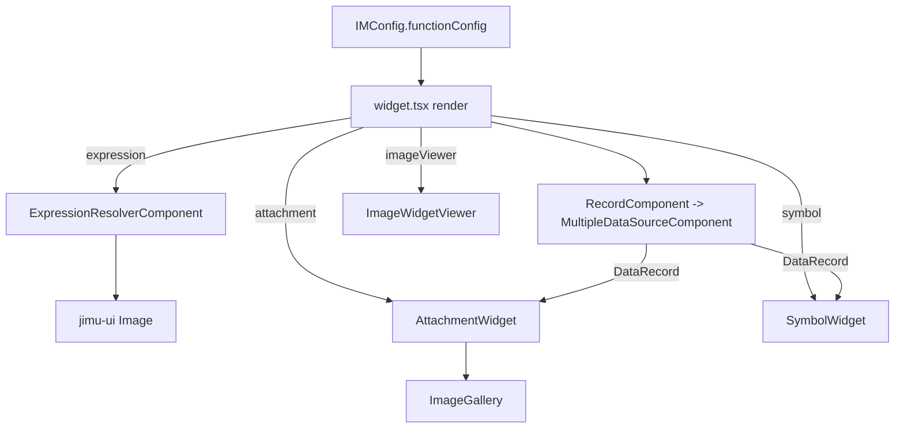

# OTB Widget: common/image

Online widget doc: https://developers.arcgis.com/experience-builder/guide/image-widget/

## Purpose

The Image widget displays a single image (or a gallery of images) from one of three
sources: an uploaded/static asset, a static URL, or a data-driven dynamic URL. It supports
data binding through expressions, feature attachments, and feature symbols; optional link
behavior; crop/fill/quality rendering modes; layout aspect-ratio integration; and an
optional full-screen image viewer. It is a repeatable widget (works inside List/repeat
contexts).

## Source paths inspected

All under `ArcGISExperienceBuilder/client/dist/widgets/common/image/` (gitignored vendor
source; `dist/` build output and `tests/` were ignored per instructions):

- `manifest.json`
- `config.json` (default config values)
- `src/config.ts` (config types, enums)
- `src/runtime/widget.tsx` (main runtime class)
- `src/runtime/components/attachment-widget.tsx`
- `src/runtime/components/symbol-widget.tsx`
- `src/runtime/components/record-component.tsx`
- `src/runtime/components/image-widget-viewer.tsx`
- `src/runtime/components/image-gallery.tsx`
- `src/setting/setting.tsx`
- `src/setting/predefined-configs.ts`
- `src/setting/components/` (alttext-setting, tooltip-setting, shape-selector, dynamicurl-setting) [not fully read]

UNVERIFIED: `src/runtime/components/utils.ts`, `src/runtime/builder/`,
`src/runtime/builder-support.tsx`, and `tools/` extension entry points were not opened in
detail. The extension list below is read straight from `manifest.json`.

## Architecture overview

- `src/runtime/widget.tsx` is a class component (`React.PureComponent`) that holds all
  render state (resolved `src`, `altText`, `toolTip`, `linkUrl`, plus their expressions,
  `record`, `attachmentInfos`, crop-widget size).
- Three data-driven code paths are selected from config in `render()`:
  - Expression path -> `<Image>` fed by `ExpressionResolverComponent` output.
  - Attachment path -> `<AttachmentWidget>` (queries feature attachments, shows
    `<ImageGallery>`).
  - Symbol path -> `<SymbolWidget>` (fetches feature symbol preview HTML).
- `RecordComponent` (wrapped with `withRepeatedDataSource`) drives the single `DataRecord`
  used by the attachment and symbol paths, via `MultipleDataSourceComponent`.
- `ImageWidgetViewer` overlays a full-screen viewer button when `imageViewer` is enabled.
- `src/setting/setting.tsx` is a class component that writes `functionConfig` /
  `styleConfig` and wires `DataSourceSelector`, `ImageSelector`, `LinkSelector`, and the
  dynamic-URL sub-settings.



## Key imports and packages

Grouped by source file, with the packages each pulls from.

`src/config.ts`
- `jimu-core`: `Expression`, `IMUseDataSource`, `LinkParam` (types)
- `jimu-ui`: `FourSidesUnit`, `BorderStyle`, `BoxShadowStyle`, `ImageParam`, `ImageFillMode`,
  `ImageDisplayQualityMode` (types)
- `seamless-immutable`: `ImmutableObject`

`src/runtime/widget.tsx`
- `jimu-core`: `React`, `Immutable`, `LinkType`, `RepeatedDataSource`,
  `ExpressionResolverComponent`, `ExpressionResolverErrorCode`, `Size`, `getAppStore`,
  `LinkTarget`, `css`, `AllWidgetProps`, `DataRecord`, `ReactResizeDetector`, `IMExpression`,
  `ExpressionPartType`, `LinkResult`, `AttachmentInfo`, `IMUrlParameters`, `IMState`,
  `BrowserSizeMode`, `classNames`, `ImmutableObject`
- `jimu-ui`: `Link`, `Image`, `ImageFillMode`, `CropType`
- `jimu-layouts/layout-runtime`: `utils as layoutUtils` (aspect-ratio parsing)
- local: `../config`, `./components/*`

`src/runtime/components/record-component.tsx`
- `jimu-core`: `MultipleDataSourceComponent`, `DataSourceManager`, `withRepeatedDataSource`,
  `RepeatedDataSource`, `CONSTANTS`, `UseDataSource`, `IMUseDataSource`, `DataSource`,
  `IMDataSourceInfo`, `DataRecord`, `ImmutableArray`, `Immutable`, `React`

`src/runtime/components/attachment-widget.tsx`
- `jimu-core`: `React`, `AttachmentInfo`, `IMState`, `useIntl`, `ReactRedux`,
  `ImmutableObject`, `DataRecord`, `FeatureDataRecord`, `hooks`

`src/runtime/components/symbol-widget.tsx`
- `jimu-core`: `React`, `css`, `hooks`, `DataRecord`, `FeatureDataRecord`

`src/runtime/components/image-widget-viewer.tsx`
- `jimu-core`: `css`, `hooks`, `React`
- `jimu-ui`: `Button`, `ImageViewer`, `defaultMessages as jimuUIMessages`
- `jimu-theme`: `styled`
- `jimu-icons/outlined/application/fullscreen-view`: `FullscreenViewOutlined`

`src/runtime/components/image-gallery.tsx`
- `jimu-core`: `BrowserSizeMode`, `IntlShape`, `React`, `AttachmentInfo`, `classNames`, `css`
- `jimu-ui`: `Button`, `Image`, `ImageDots`, `Loading`, `LoadingType`, `ImageProps`
- `jimu-icons/outlined/directional/left` and `.../right`: `LeftOutlined`, `RightOutlined`

`src/setting/setting.tsx`
- `jimu-core`: `React`, `IMState`, `IMThemeVariables`, `SerializedStyles`, `ImmutableArray`,
  `IMUseDataSource`, `Immutable`, `ImmutableObject`, `css`, `Expression`, `UseDataSource`,
  `expressionUtils`, `CONSTANTS`, `DataSourceManager`, `DataSourceTypes`, `ExpressionPartType`,
  `IMLinkParam`
- `jimu-for-builder`: `builderAppSync`, `AllWidgetSettingProps`
- `jimu-ui/advanced/setting-components`: `SettingSection`, `SettingRow`, `LinkSelector`
- `jimu-ui`: `Select`, `ImageParam`, `CropParam`, `ImageFillMode`, `Slider`, `NumericInput`,
  `Tabs`, `Tab`, `Tooltip`, `imageUtils`, `Switch`, `ImageDisplayQualityMode`
- `jimu-ui/advanced/resource-selector`: `ImageSelector`
- `jimu-ui/advanced/data-source-selector`: `DataSourceSelector`

## Reusable patterns found

- Multi-source image input: `ImgSourceType` enum (`ByUpload`, `ByStaticUrl`, `ByDynamicUrl`)
  drives whether the runtime uses a static `imageParam.url` or a data-driven source. The
  static-vs-dynamic branch is centralized in `checkIsStaticSrc()`.
- `srcExpression` (an `IMExpression`) resolved at runtime via `ExpressionResolverComponent`;
  when no explicit expression exists, one is synthesized from a static URL string
  (see `getSrcExpression`).
- ATTACHMENT sub-widget: `AttachmentWidget` filters a `FeatureDataRecord`'s
  `attachmentInfos` by `attachmentTypes` (png/jpeg/gif/bmp/svg+xml/webp), or lazily calls
  `dataRecord.queryAttachments(...)`. Uses a `requestIdRef` guard to drop stale async
  results. Feeds an `<ImageGallery>` when multiple attachments exist.
- SYMBOL sub-widget: `SymbolWidget` calls `dataRecord.fetchSymbolPreviewHTML()` and injects
  the returned HTML element into a ref'd div; scaled by `symbolScale` via a `transform:
  scale()` CSS rule. Also request-id guarded.
- DataSourceManager data-driven record: `RecordComponent` resolves a single record from the
  selected data source (handling selection data views via
  `CONSTANTS.SELECTION_DATA_VIEW_ID` / `DATA_VIEW_ID_FOR_NO_SELECTION`) and pushes it up via
  `onRecordChange`. It debounces updates with a 50ms `setTimeout` and tracks
  `previousDsId`/`previousRecordId` to avoid redundant callbacks.
- Crop / fill / quality modes: `<Image>` receives `imageFillMode` (`ImageFillMode`),
  `cropParam` (with `CropType`), and `quality` (`imageDisplayQualityMode` /
  `ImageDisplayQualityMode`). The builder crop tool only opens when fill mode is not `Fit`.
- Aspect ratio integration: `mapExtraStateProps` reads the layout item setting
  (`heightMode === 'ratio'` + `aspectRatio`) and `getStyle()` applies
  `aspect-ratio: layoutUtils.parseAspectRatio(aspectRatio)` to the `img` when not cropped.
- `mapExtraStateProps` also pulls `queryObject` and `browserSizeMode` from redux state into
  props (`ExtraProps`).
- Optional viewer: `ImageWidgetViewer` + `jimu-ui` `ImageViewer`, styled via `jimu-theme`
  `styled(Button)`.

## Builder vs runtime split

- Runtime code lives under `src/runtime/` and is the default export widget class.
- Settings UI lives under `src/setting/` (`setting.tsx`, `predefined-configs.ts`,
  `components/`). It uses `jimu-for-builder` (`AllWidgetSettingProps`, `builderAppSync`) and
  advanced setting components (`SettingSection`, `SettingRow`, `LinkSelector`,
  `ImageSelector`, `DataSourceSelector`).
- The manifest declares four extensions (see below): two `CONTEXT_TOOL` entries
  (`chooseshape`, `croptool`), plus `APP_CONFIG_OPERATIONS` and `BUILDER_OPERATIONS`. The
  runtime also references `builderSupportModules.widgetModules.WidgetInBuilder` to render the
  in-builder crop widget (`hasBuilderSupportModule: true` in manifest).

## Lifecycle and cleanup

- `widget.tsx`
  - `constructor` seeds state from config (`toolTip`, `altText`, `src`, `linkUrl`) and, when
    `useDataSourcesEnabled`, the four expressions.
  - `componentDidMount` sets `__unmount = false`.
  - `componentDidUpdate` re-syncs state when `config` or `useDataSourcesEnabled` change,
    branching on static vs expression vs attachment/symbol.
  - `componentWillUnmount` sets `__unmount = true` and, if the widget was removed from
    appConfig, deletes its entry in the module-level `imageWidgetSizeMap`.
  - `onCropWidgetResize` early-returns when `__unmount` is true (guards async resize
    callbacks).
- `RecordComponent`
  - `componentWillUnmount` clears its debounce `timer` (`window.clearTimeout`) and calls
    `onRecordChange(null)`.
- `AttachmentWidget` / `SymbolWidget`
  - Use `requestIdRef` counters so out-of-order async responses (attachment query / symbol
    fetch) are ignored; they compare `isSameRecord(record, prevRecord)` to skip no-op runs.
- `ImageGallery`
  - Adds passive `touchstart`/`touchmove`/`touchend` listeners in `componentDidMount` and
    removes them in `componentWillUnmount`.

## Manifest/config requirements

From `manifest.json`:
- `type: widget`, `version`/`exbVersion` `1.20.0`, `defaultSize` 300x300.
- `properties`: `hasSettingPage: true`, `supportRepeat: true`,
  `hasBuilderSupportModule: true`.
- `extensions`:
  - `chooseshape` -> `CONTEXT_TOOL` -> `tools/chooseshape`
  - `croptool` -> `CONTEXT_TOOL` -> `tools/croptool`
  - `appConfigOperations` -> `APP_CONFIG_OPERATIONS` -> `tools/app-config-operations`
  - `builderOperations` -> `BUILDER_OPERATIONS` -> `tools/builder-operations`

From `config.json` (defaults): `functionConfig` = `{ altText: '', toolTip: '', linkParam:
{}, scale: 'Fit', imageParam: {}, imageDisplayQualityMode: 'ORIGINAL' }`, empty
`styleConfig`. Note the default `scale: 'Fit'` key is not part of the `FunctionConfig` type
in `config.ts` (which uses `imageFillMode`); UNVERIFIED whether legacy `scale` is migrated
by `app-config-operations`.

Config types (`src/config.ts`):
- Enums: `ImgSourceType` (`BYUPLOAD`/`BYSTATICURL`/`BYDYNAMICURL`), `DynamicUrlType`
  (`EXPRESSION`/`ATTACHMENT`/`SYMBOL`).
- `FunctionConfig` fields include `srcExpression`, `altTextExpression`, `toolTipExpression`,
  `linkParam`, `imageFillMode`, `imgSourceType`, `imageParam`, `symbolScale`,
  `dynamicUrlType`, `isSelectedFromRepeatedDataSourceContext`,
  `useDataSourceForMainDataAndViewSelector`, `imageDisplayQualityMode`, `imageViewer`,
  `altTextWithAttachmentName`, `toolTipWithAttachmentName`.

Supported data source types for binding (`setting.tsx` `supportedTypes`): `FeatureLayer`,
`SceneLayer`, `BuildingComponentSubLayer`, `OrientedImageryLayer`, `ImageryLayer`,
`SubtypeGroupLayer`, `SubtypeSublayer`.

## Gotchas

- Static-vs-dynamic detection treats a missing `imgSourceType` as static
  (`checkIsStaticSrc` returns true when `imgSourceType` is falsy). New configs without an
  explicit source type render as static.
- The expression path synthesizes a string expression that can resolve to the literal
  string `'null'`; the runtime explicitly maps `'null'` back to `''` in
  `onSrcExpResolveChange`/`onToolTip.../onAltText...`.
- Attachment filtering is limited to a fixed MIME allow-list; other image types (e.g.
  `image/tiff`) are silently dropped.
- Symbol scaling is applied purely with CSS `transform: scale()`; large `symbolScale`
  values can overflow the container.
- The in-builder crop widget only mounts when `imageFillMode !== ImageFillMode.Fit`, the
  image is inline-editing, `src` is truthy, and (for repeats) the repeated record index is
  0. Do not assume the crop tool always renders.
- `imageWidgetSizeMap` is a module-level singleton keyed by `id + '-' + layoutId`; it is
  only cleaned up in `componentWillUnmount` when the widget no longer exists in appConfig.
- `RecordComponent` debounces record updates by 50ms; consumers should not expect a
  synchronous record on mount.
- `symbol-widget.tsx` calls `hooks.usePrevious<DataRecord>(null)` (previous seeded from
  `null`, not from `record`); the effect relies on `isSameRecord` for change detection.
  UNVERIFIED whether this is intentional versus the attachment widget's
  `hooks.usePrevious(record)`.
- The settings `componentDidUpdate` force-resets `imageDisplayQualityMode` to `Original`
  when the current image/format cannot use display quality
  (`imageUtils.canUseImageDisplayQuality`).

## Useful snippets and functions

Source: `src/runtime/widget.tsx` (redux state -> props, aspect ratio + browser size)
```tsx
static mapExtraStateProps = (state: IMState, props: AllWidgetProps<IMConfig>): ExtraProps => {
  const appConfig = state.appConfig
  const { layouts } = appConfig
  const { layoutId, layoutItemId } = props
  const layout = layouts[layoutId]
  const layoutItemSetting = layout?.content?.[layoutItemId]?.setting || {}
  const useAspectRatio = layoutItemSetting.heightMode === 'ratio' && layoutItemSetting.aspectRatio != null
  return {
    useAspectRatio,
    aspectRatio: layoutItemSetting.aspectRatio,
    queryObject: state.queryObject,
    browserSizeMode: state.browserSizeMode
  }
}
```

Source: `src/runtime/widget.tsx` (aspect-ratio css via layout-runtime utils)
```tsx
getStyle () {
  const { aspectRatio, useAspectRatio } = this.props
  const cropParam = this.props.config.functionConfig.imageParam?.cropParam
  const cropPixel = cropParam?.cropPixel
  const cropType = cropParam?.cropType
  const noCrop = !cropPixel || !cropType || cropType === CropType.Real

  return css`
    ${noCrop && useAspectRatio && `img {
      aspect-ratio: ${layoutUtils.parseAspectRatio(aspectRatio)};
    }`}
    .widget-image-link {
      display: block;
      padding: 0;
      border: none;
      width: 100%;
      height: 100%;
      outline-offset: -2px !important;
      border-radius: unset;
    }
  `
}
```

Source: `src/runtime/widget.tsx` (branch selection for the three data-driven paths)
```tsx
const isDynamic = imgSourceType === ImgSourceType.ByDynamicUrl
const isAttachment = dynamicUrlType === DynamicUrlType.Attachment && isDataSourceUsed
const isSymbol = dynamicUrlType === DynamicUrlType.Symbol && isDataSourceUsed
const isExpression = isDynamic && (!dynamicUrlType || dynamicUrlType === DynamicUrlType.Expression) && isDataSourceUsed
const isAttachmentSymbol = isAttachment || isSymbol
const notAttachmentSymbol = !isAttachmentSymbol
```

Source: `src/runtime/widget.tsx` (jimu-ui Image with fill/crop/quality)
```tsx
<Image
  src={src}
  title={toolTip}
  alt={altText}
  fadeInOnLoad
  imageFillMode={imageFillMode}
  isAutoHeight={autoHeight}
  isAutoWidth={autoWidth}
  quality={imageDisplayQualityMode}
  originalWidth={originalWidth}
  fileFormat={fileFormat}
  cropParam={cropParam}
  showBrokenPlaceholder={true}
  className={classNames({ 'd-none': srcExpression && !src })}
/>
```

Source: `src/runtime/widget.tsx` (ExpressionResolverComponent wiring)
```tsx
{isExpression &&
  <ExpressionResolverComponent
    useDataSources={useDataSources} expression={this.getSrcExpression()}
    onChange={this.onSrcExpResolveChange} widgetId={id}
  />
}
```

Source: `src/runtime/widget.tsx` (Link wrapping via jimu-ui Link + LinkType)
```tsx
if (linkTo && linkTo?.linkType !== LinkType.None) {
  renderResult = (
    <Link to={linkTo} target={target} queryObject={queryObject} className='widget-image-link' unstyled>
      {imageContent}
    </Link>
  )
} else {
  renderResult = imageContent
}
```

Source: `src/runtime/components/record-component.tsx` (single-record resolution with selection views)
```tsx
getSingleRecord = () => {
  if (this.props.isSelectedFromRepeatedDataSourceContext) {
    const repeatedDataSource = this.props.repeatedDataSource
    const record = Array.isArray(repeatedDataSource)
      ? (repeatedDataSource)[0]?.record
      : (repeatedDataSource)?.record
    if (!record || (record as any).fake) {
      return null
    }
    return record
  } else {
    if (!this.props.useDataSource) {
      return null
    }
    const dsId = this.props.useDataSource.dataSourceId
    const isSelectionDataView = dsId.split('-').reverse()[0] === CONSTANTS.SELECTION_DATA_VIEW_ID
    if (isSelectionDataView) {
      const ds = DataSourceManager.getInstance().getDataSource(dsId)
      let record = ds?.getRecords()[0]
      if (!record) {
        const dataViewForNoSelection = ds?.getMainDataSource().getDataView(CONSTANTS.DATA_VIEW_ID_FOR_NO_SELECTION)
        record = dataViewForNoSelection?.getRecords()[0]
      }
      return record
    } else {
      const ds = DataSourceManager.getInstance().getDataSource(dsId)
      const record = ds?.getRecords()[0]
      return record
    }
  }
}
```

Source: `src/runtime/components/record-component.tsx` (MultipleDataSourceComponent + withRepeatedDataSource)
```tsx
render () {
  const useDataSources = this.addDataViewForNoSelection(this.props.useDataSource)
  return (
    <MultipleDataSourceComponent
      useDataSources={useDataSources}
      onDataSourceCreated={this.onDataSourceCreated}
      onDataSourceInfoChange={this.onDataSourceInfoChange}
      queries={this.getQueries(useDataSources)}
      widgetId={this.props.widgetId}
    />
  )
}
// ...
export const RecordComponent = withRepeatedDataSource(_RecordComponent)
```

Source: `src/runtime/components/attachment-widget.tsx` (attachment query with stale-response guard)
```tsx
const attachmentTypes = ['image/png', 'image/jpeg', 'image/gif', 'image/bmp', 'image/svg+xml', 'image/webp']
// ...
const currentRequestId = ++requestIdRef.current
const resolveExpressions = async () => {
  const dataRecord = record as FeatureDataRecord
  let attachmentInfos: AttachmentInfo[]
  if (dataRecord && dataRecord.attachmentInfos) {
    attachmentInfos = dataRecord.attachmentInfos.filter(info => attachmentTypes.includes(info.contentType))
  } else if (dataRecord && dataRecord.queryAttachments) {
    attachmentInfos = await dataRecord.queryAttachments(attachmentTypes)
  } else {
    attachmentInfos = []
  }
  if (requestIdRef.current === currentRequestId) {
    setAttachmentInfos(attachmentInfos)
    onChange && onChange(attachmentInfos)
  }
}
```

Source: `src/runtime/components/symbol-widget.tsx` (fetch symbol preview HTML)
```tsx
const dataRecord = record as FeatureDataRecord
if (!dataRecord?.fetchSymbolPreviewHTML) return
requestIdRef.current += 1
const currentRequestId = requestIdRef.current
setSymbolElement(null)
dataRecord.fetchSymbolPreviewHTML().then((result) => {
  if (requestIdRef.current === currentRequestId) {
    setSymbolElement(result)
  }
})
```

Source: `src/runtime/components/image-widget-viewer.tsx` (styled viewer button + jimu-ui ImageViewer)
```tsx
const ViewerButton = styled(Button)(css`
  position: absolute;
  z-index: 1;
  top: 8px;
  right: 8px;
  border-radius: 50%;
`)
// ...
<ImageViewer srcList={srcList} defaultIndex={defaultIndex} isOpen={showViewer} onClose={handleClose} />
```

Source: `src/setting/setting.tsx` (DataSourceSelector binding toggle)
```tsx
<DataSourceSelector
  types={this.supportedTypes} useDataSourcesEnabled={this.getIsDataSourceUsed()}
  useDataSources={this.props.useDataSources} onToggleUseDataEnabled={this.onToggleUseDataEnabled}
  onChange={this.onDataSourceChange} widgetId={this.props.id}
/>
```

Source: `src/setting/setting.tsx` (ImageSelector for static upload/url)
```tsx
<ImageSelector
  buttonClassName='text-dark d-flex justify-content-center btn-browse'
  widgetId={this.props.id} buttonLabel={this.formatMessage('imageSet')} buttonSize='sm'
  onChange={this.onResourceChange} imageParam={imageParam}
  aria-describedby='image-selected-name'
  trigger={this.displayQualityTrigger.current}
/>
```

Source: `src/setting/setting.tsx` (source-type / dynamic-url switching writes config)
```tsx
imgSourceTypeChanged = (imgSourceType: ImgSourceType) => {
  let functionConfig = this.props.config.functionConfig || Immutable({})
  functionConfig = functionConfig.set('dynamicUrlType', null)
  functionConfig = functionConfig.set('imgSourceType', imgSourceType)
  functionConfig = functionConfig.set('srcExpression', null)
  functionConfig = functionConfig.set('imageParam', this.resetImageParam(this.props.config.functionConfig.imageParam))
  this.props.onSettingChange({
    id: this.props.id,
    config: this.props.config.set('functionConfig', functionConfig)
  })
}
```

Source: `src/setting/predefined-configs.ts` (predefined shape masks -> borderRadius)
```ts
const shapes = {
  square: { borderRadius: { number: [0], unit: 'px' }, thumbUrl: require('./assets/shape_square.svg') },
  capsule: { borderRadius: { number: [10, 10, 10, 10], unit: '%' }, thumbUrl: require('./assets/shape_capsule.svg') },
  round: { borderRadius: { number: [50, 50, 50, 50], unit: '%' }, thumbUrl: require('./assets/shape_round.svg') }
}
const PreDefinedConfigs = { shapes }
```
