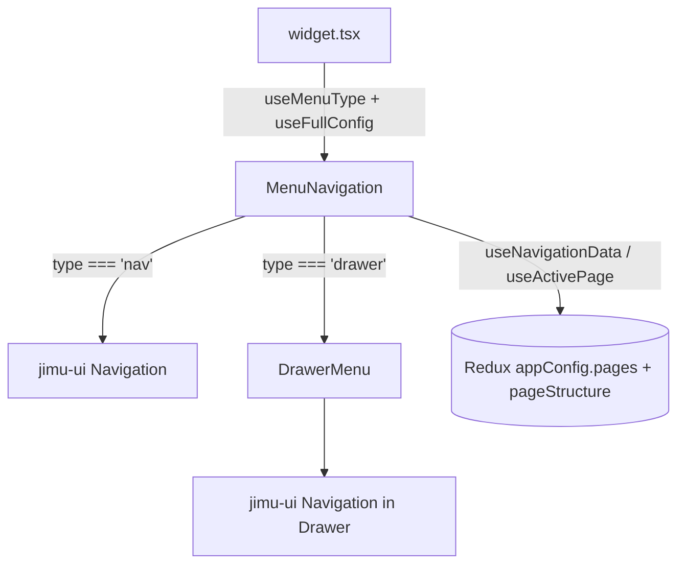

# OTB Widget: common/menu

Online widget doc: https://developers.arcgis.com/experience-builder/guide/menu-widget/

## Purpose

The Menu widget renders app page navigation. It reads the app's `pageStructure` and
`pages` from the Redux store and turns them into a navigation control. Three presentation
types are supported (see `MenuType` in `src/config.ts`):

- `HORIZONTAL` -> a horizontal `Navigation` (nav bar).
- `VERTICAL` -> a vertical `Navigation` (side list).
- `ICON` -> a hamburger `Button` that opens a `Drawer` containing a vertical `Navigation`.

It supports page links, external web links, and folders (submenus), plus a "standard"
style set (gap, text alignment, icon toggle, submenu expand mode) and an "advanced" style
override (per-state colors, borders, border radius, drawer paper background, nav arrow
colors). Note the manifest describes it as "the widget used in developer guide", so it also
doubles as the canonical sample widget.

## Source paths inspected

- ArcGISExperienceBuilder/client/dist/widgets/common/menu/manifest.json
- ArcGISExperienceBuilder/client/dist/widgets/common/menu/src/config.ts
- ArcGISExperienceBuilder/client/dist/widgets/common/menu/src/utils.ts
- ArcGISExperienceBuilder/client/dist/widgets/common/menu/src/runtime/widget.tsx
- ArcGISExperienceBuilder/client/dist/widgets/common/menu/src/runtime/menu-navigation.tsx
- ArcGISExperienceBuilder/client/dist/widgets/common/menu/src/runtime/drawer-menu.tsx
- ArcGISExperienceBuilder/client/dist/widgets/common/menu/src/runtime/utils.ts
- ArcGISExperienceBuilder/client/dist/widgets/common/menu/src/setting/setting.tsx
- ArcGISExperienceBuilder/client/dist/widgets/common/menu/src/setting/utils.ts
- (config.json, version-manager.ts, translations/, dist/, and tests/ present but not the focus per request; dist/ + tests/ ignored)

## Architecture overview

Runtime data flows top-down through three layers:

1. `widget.tsx` (entry): resolves the effective `MenuType` from config, merges type-specific
   defaults over the saved config (`useFullConfig`), then renders a single `MenuNavigation`.
2. `menu-navigation.tsx` (dispatcher + styling): pulls live page data from the store
   (`useNavigationData`, `useActivePage`), computes theme-aware and advanced CSS, and renders
   either a `Navigation` (`type === 'nav'`) or a `DrawerMenu` (`type === 'drawer'`).
3. `drawer-menu.tsx` (icon variant): a stateful open/close `Drawer` wrapping a vertical
   `Navigation`, auto-closing when the current page changes.

`src/utils.ts` holds shared config helpers (defaults, `useMenuType`, `useFullConfig`) used by
both runtime and setting. `src/runtime/utils.ts` holds store selectors, store-to-nav-data
mapping, and the emotion/css style generators.



## Key imports and packages

grouped by source; note the jimu-core hooks and jimu-theme helpers.

- jimu-core (widget.tsx): `hooks`, `React`, `AllWidgetProps`.
  - `hooks.useTranslation(...)` is the i18n hook used throughout.
- jimu-core (menu-navigation.tsx): `React`, `jsx`, `css`, `hooks`, `type ThemeNavType`,
  `type ThemePaper`, `type ImmutableObject`, `type IMThemeVariables`.
- jimu-core (drawer-menu.tsx): `React`, `jsx`, `hooks`, `ReactRedux`, `type IMState`,
  `type IMIconResult`, `type ThemePaper`, `type ImmutableObject`.
- jimu-core (runtime/utils.ts): `React`, `ReactRedux`, `css`, `polished`, `Immutable`,
  `PageType`, `LinkType`, `BrowserSizeMode`, `type IMState`, `type IMPageJson`,
  `type PageJson`, `type ImmutableArray`, `type ImmutableObject`, `type LinkTarget`,
  `type ThemeNavType`, `type ThemePaper`, `type ThemeButtonStylesByState`.
- jimu-ui (menu-navigation.tsx / drawer-menu.tsx): `Navigation`, `type NavigationProps`,
  `type NavigationVariant`, `Button`, `Icon`, `Drawer`, `PanelHeader`,
  `type AnchorDirection`. Also `utils`, `type NavigationItem`, `type IconButtonStyles` used
  in runtime/utils.ts.
- jimu-theme (menu-navigation.tsx): `getThemeModule`, `mapping`; (runtime/utils.ts):
  `getBoxStyles`. `useTheme2` and `styled` are NOT used by this widget's runtime; the setting
  uses `useTheme2`. No `styled` usage found - navigation styling is done with `css` template
  literals + emotion `jsx` pragma, not `styled`. [UNVERIFIED that styled is unused elsewhere;
  grep of the inspected files shows only `css`/`jsx`, no `styled` import.]
- jimu-for-builder (setting/utils.ts): `getAppConfigAction`.
- jimu-ui/advanced/setting-components (setting.tsx): `SettingSection`, `SettingRow`.
- jimu-ui/advanced/style-setting-components (setting.tsx): `InputUnit`,
  `NavStyleSettingByState`, `TextAlignment`, `BorderRadiusSetting`, `type ComponentState`.
- jimu-ui/advanced/resource-selector (setting.tsx): `IconPicker`.
- jimu-ui/basic/color-picker (setting.tsx): `ThemeColorPicker`.
- jimu-theme (setting.tsx): `useTheme2`.
- jimu-layouts/layout-runtime (setting/utils.ts): `LayoutItemSizeModes`.

## Reusable patterns found

- MenuType Icon/Vertical/Horizontal switch: a single enum drives which underlying primitive
  renders. `useMenuType` derives the enum from `config.type` + `config.vertical`;
  `getEssentialDefaultWidgetConfigByType` / `getFullDefaultWidgetConfigByType` map the enum
  back to concrete config. Good template for "one widget, several visual modes".
- Drawer menu variant: `DrawerMenu` is a self-contained open/close pattern - local
  `useState(false)`, a `toggle`, a trigger `Button` with an `Icon`, and a `Drawer` with a
  `PanelHeader` close. It subscribes to `state.appRuntimeInfo.currentPageId` and closes on
  navigation.
- Page navigation from the store: `useNavigationData` reads `appConfig.pages` +
  `appConfig.pageStructure`, filters hidden pages, and maps each page to a `NavigationItem`
  with a `linkType` (`Page` / `WebAddress` / `None` for folder), `value`, `icon`, `target`,
  and nested `subs`. `useActivePage` returns a predicate comparing item page id to the current
  page id.
- useTranslation: `hooks.useTranslation(defaultMessage, jimuiDefaultMessage)` merges the
  widget's own messages with shared jimu-ui messages; used for both runtime aria-labels and
  setting labels.
- Themed nav styling: instead of `styled`, the widget builds emotion `css` via memoized hooks
  (`useNavAdvanceStyle`, `useDrawerAdvanceStyle`, `useNavigationStyleForDrawerMenu`) and reads
  raw theme variables through `getThemeModule(theme.uri)` + `mapping.whetherIsNewTheme(...)`
  to branch old-theme vs new-theme CSS.

## Builder vs runtime split

- Runtime (`src/runtime/*`): renders navigation from live store state. It does not write
  config; it only reads `appConfig.pages`, `appConfig.pageStructure`,
  `appRuntimeInfo.currentPageId`, and `browserSizeMode`.
- Setting (`src/setting/*`): edits `IMConfig` via `onSettingChange({ id, config })`. It uses
  Immutable helpers (`_config.set`, `.setIn`, `.without`) to add/remove keys and keep the
  config minimal (defaults are stripped rather than persisted - see
  `onStandardContentChange` removing a key when the value equals the default).
- Setting-only side effect: `changeAutoSizeAndDefaultSize` (setting/utils.ts) reaches into the
  builder app state (`appStateInBuilder`) and calls
  `getAppConfigAction().editLayoutItemProperty(...)` to adjust the widget's auto-size and
  default size when the type changes (Icon/Vertical/Horizontal each get different auto vs
  custom width/height). This is a good example of a setting mutating layout, not just widget
  config.
- Shared code (`src/utils.ts`, `src/config.ts`): imported by both sides so defaults and type
  derivation stay in sync.

## Lifecycle and cleanup

- No manual subscriptions or timers to tear down. All store access is via
  `ReactRedux.useSelector` / `useState` + `useEffect`, which React cleans up automatically.
- `DrawerMenu` uses `React.useEffect(() => { setOpen(false) }, [currentPageId])` to close the
  drawer on navigation; no cleanup function is required since it only sets state.
- `useNavigationData` recomputes and `setData` on `[pages, pageStructure]` changes; there is
  no listener to remove.
- No JSAPI modules are loaded, so there are no map/view handles to `remove()`.

## Manifest/config requirements

From manifest.json:

- `name: "menu"`, `type: "widget"`, `version` / `exbVersion` `1.20.0`.
- `properties.hasSettingPage: true` (widget ships a setting panel).
- `defaultSize`: `{ width: 300, height: 50, autoHeight: true }` (auto height by default; the
  setting adjusts auto/custom sizing per type).
- Large `translatedLocales` list (40+ locales).
- No `dependencies` declared - the widget uses only jimu framework packages and does not load
  ArcGIS JS API modules or external CDN resources, so no manifest `dependencies` entry is
  needed. [Verify against config.json if adapting.]

Config shape (`src/config.ts`): `IMConfig = ImmutableObject<MenuNavigationProps>`. Key fields:
`type` (`'nav' | 'drawer'`), `vertical`, `menuStyle` (`ThemeNavType`: default/underline/pills),
`advanced`, `standard` (gap, textAlign, showIcon, submenuMode, anchor, icon), `variant`,
`paper`, `navArrowColor`. The persisted config is intentionally sparse; runtime fills gaps via
`useFullConfig`.

## Gotchas

- Do not assume the saved config is complete. Always merge with type defaults
  (`useFullConfig`) before rendering; the setting deliberately strips default-valued keys.
- `type` in config is the low-level primitive (`'nav'` vs `'drawer'`), while `MenuType`
  (Icon/Vertical/Horizontal) is a UI-facing abstraction derived from `type` + `vertical`. Do
  not conflate them.
- Old-theme vs new-theme branching: `menu-navigation.tsx` reads raw theme module variables via
  `getThemeModule(theme?.uri)` and `mapping.whetherIsNewTheme(...)`. Styling assumptions differ
  between theme generations; changing colors may need both branches.
- Small-device behavior: `useAnchor` forces the drawer `anchor` to `'full'` when
  `browserSizeMode === Small`, and `useNavigationStyleForDrawerMenu` changes min/max width.
- `changeAutoSizeAndDefaultSize` only acts on `LayoutType.FixedLayout` and reaches into the
  builder iframe (`APP_FRAME_NAME_IN_BUILDER`) to measure the parent element; it is a
  builder-time concern and silently returns if layout/layoutItem are missing.
- Folder pages produce `linkType = LinkType.None` and `value = '#'`; they are containers for
  `subs`, not clickable destinations.
- `fullConfig.asMutable()` is passed to `MenuNavigation` in widget.tsx - the child expects a
  plain (mutable) object spread, while several props inside are still `ImmutableObject`.

## Useful snippets and functions

Source: src/runtime/widget.tsx

```tsx
const Widget = (props: MenuProps) => {
  const { config, theme } = props
  const translate = hooks.useTranslation(jimuiDefaultMessage)
  const menuType = useMenuType(config)
  const fullConfig = useFullConfig(config, menuType, translate)
  return (
    <div className='widget-menu jimu-widget'>
      <MenuNavigation {...fullConfig.asMutable()} theme={theme} />
    </div>
  )
}
```

Source: src/utils.ts (derive the UI menu type, and merge defaults over saved config)

```ts
export const useMenuType = (config: IMConfig) => {
  return React.useMemo(() => {
    return config.type === 'drawer'
      ? MenuType.Icon
      : config.vertical
        ? MenuType.Vertical
        : MenuType.Horizontal
  }, [config.type, config.vertical])
}

export const useFullConfig = (config: IMConfig, menuType: MenuType, translate: (id: string, values?: any) => string) => {
  return React.useMemo(() => {
    return getFullDefaultWidgetConfigByType(menuType, translate).merge(config, { deep: true })
  }, [config, menuType, translate])
}
```

Source: src/runtime/utils.ts (build NavigationItem[] from store pages)

```ts
export const useNavigationData = (): NavigationItem[] => {
  const [data, setData] = useState<NavigationItem[]>([])
  const pages = useSelector((state: IMState) => state?.appConfig?.pages)
  const pageStructure = useSelector(
    (state: IMState) => state?.appConfig?.pageStructure
  )

  useEffect(() => {
    const data = getMenuNavigationData(pageStructure, pages)
    setData(data as any)
  }, [pages, pageStructure])

  return data
}

export const useActivePage = () => {
  const currentPageId = useSelector(
    (state: IMState) => state?.appRuntimeInfo?.currentPageId
  )
  return React.useCallback(
    (item: NavigationItem) => {
      return getPageId(item) === currentPageId
    },
    [currentPageId]
  )
}
```

Source: src/runtime/utils.ts (map a page to a NavigationItem, incl. link type/value)

```ts
const getMenuNavigationItem = (page: IMPageJson): ImmutableObject<NavigationItem> => {
  const linkType = getLinkType(page)
  const value = getLinkValue(page)
  const icon = page.icon || icons[page.type]
  return Immutable({
    linkType,
    value,
    icon:
      Object.prototype.toString.call(icon) === '[object Object]'
        ? icon
        : utils.toIconResult(icon, page.type, 16),
    target: page.openTarget as LinkTarget,
    name: page.label
  })
}
```

Source: src/runtime/drawer-menu.tsx (drawer open/close, auto-close on navigation)

```tsx
export const DrawerMenu = (props: DrawerMenuProps) => {
  const [open, setOpen] = React.useState(false)
  const { icon, anchor, advanced, type, variant, paper, vertical, ...others } = props
  const toggle = () => { setOpen(open => !open) }
  const currentPageId = ReactRedux.useSelector(
    (state: IMState) => state.appRuntimeInfo.currentPageId
  )
  React.useEffect(() => {
    setOpen(false)
  }, [currentPageId])
  // ... Button trigger + Drawer(PanelHeader + Navigation)
}
```

Source: src/runtime/menu-navigation.tsx (nav vs drawer dispatch)

```tsx
{type === 'nav' && (
  <Navigation
    role={vertical ? 'menu' : 'menubar'}
    data={data}
    vertical={vertical}
    isActive={isActive}
    showTitle={true}
    isUseNativeTitle={true}
    scrollable
    right={true}
    {...others}
    type={menuStyle}
    aria-label={translate('_widgetLabel')}
  />
)}
{type === 'drawer' && (
  <DrawerMenu data={data} advanced={advanced} variant={variant} paper={paper}
    type={menuStyle} vertical={vertical} isActive={isActive} scrollable={false}
    icon={icon} anchor={anchor} {...others} />
)}
```

Source: src/setting/setting.tsx (strip-default config update pattern)

```tsx
const onStandardContentChange = (key: keyof MenuNavigationStandard, value: any) => {
  let standard = _config.standard || Immutable({} as any)
  if (value === getDefaultValueForStandardContent(key)) {
    standard = standard.without(key)
  } else {
    standard = standard.set(key, value)
  }
  onSettingChange({
    id,
    config: Object.keys(standard).length
      ? _config.set('standard', standard)
      : _config.without('standard')
  })
}
```

Source: src/setting/utils.ts (setting mutates layout auto-size via builder action)

```ts
getAppConfigAction()
  .editLayoutItemProperty(
    layoutInfo,
    'setting.autoProps',
    {
      width: isHorizontal ? LayoutItemSizeModes.Custom : LayoutItemSizeModes.Auto,
      height: isVertical ? LayoutItemSizeModes.Custom : LayoutItemSizeModes.Auto
    }
  )
```
