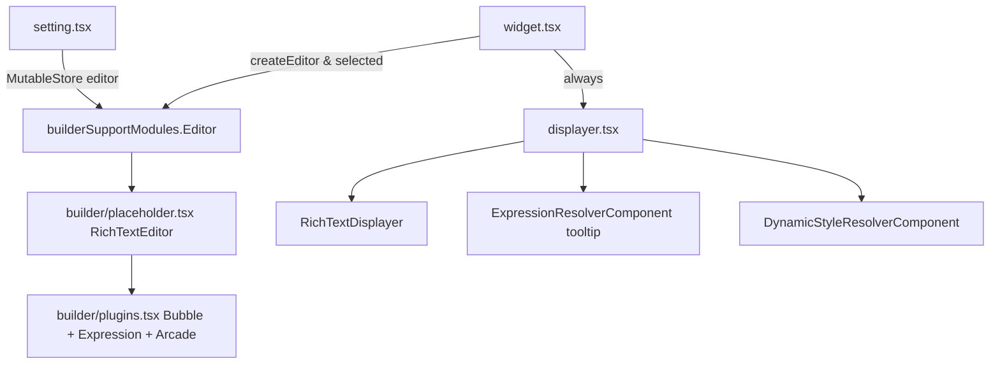

# OTB Widget: common/text

Online widget doc: https://developers.arcgis.com/experience-builder/guide/text-widget/

## Purpose
The Text widget renders rich text (HTML) authored in a Quill-based rich-text editor. It supports:
- Inline editing on the canvas (double click to edit) with a floating format toolbar (Bubble).
- Dynamic content via ExB Expressions embedded as `<exp>` tags in the HTML (attributes, statistics, static values).
- Arcade content embedded as `<arcade>` tags for value/style output.
- Conditional/Arcade driven dynamic styling of the whole text block (text color, background) via `DynamicStyleConfig`.
- A tooltip driven by an Expression.
- Use inside the List (repeat) widget, where only the first record is editable and the rest are display-only.

It is also the widget used in the Esri developer guide as the canonical "extend base widget" example, so its structure is deliberately illustrative.

## Source paths inspected
All under `ArcGISExperienceBuilder/client/dist/widgets/common/text/` (gitignored, compiled `dist` copy; the `.ts/.tsx` sources are present alongside the build output):
- [manifest.json](ArcGISExperienceBuilder/client/dist/widgets/common/text/manifest.json)
- [config.json](ArcGISExperienceBuilder/client/dist/widgets/common/text/config.json)
- `src/config.ts`
- `src/consts.ts`
- `src/version-manager.ts`
- `src/runtime/widget.tsx`
- `src/runtime/displayer.tsx`
- `src/runtime/builder-support.tsx`
- `src/runtime/builder/editor.tsx`
- `src/runtime/builder/placeholder.tsx`
- `src/runtime/builder/plugins.tsx`
- `src/runtime/builder/utils.ts`
- `src/setting/setting.tsx`
- `src/setting/editor-plugins/` (index.ts, rich-formats-clear.tsx, rich-text-formats.tsx)
- `src/utils/index.ts`
- `src/tools/inline-editing.tsx`
- `src/tools/expression.tsx`
- `src/tools/arcade.tsx`
- `src/tools/app-config-operations.ts`
- `src/tools/builder-operations.ts` (referenced by manifest; not deep-read)

UNVERIFIED: `src/tools/builder-operations.ts` internals were not opened; only its manifest registration was confirmed.

## Architecture overview
- `runtime/widget.tsx` is the entry component (`AllWidgetProps<IMConfig>`). It decides between an editable rich-text editor and a read-only displayer, wires dynamic content/style side effects, and pushes edits back into the app config.
- The heavy rich-text-editor code is NOT loaded at runtime for viewers. It lives in the builder-support module (`runtime/builder-support.tsx`), exposed to `widget.tsx` through `props.builderSupportModules`. This keeps the editor out of the runtime bundle.
- `runtime/displayer.tsx` renders read-only content via `RichTextDisplayer` from jimu-ui, plus the tooltip resolver, dynamic-style resolver, and a scroll "fade" indicator.
- `setting/setting.tsx` is the settings panel: data source selection, wrap toggle, tooltip expression, placeholder text, rich-text format controls (color/clear), and the dynamic-style builder switch.
- `tools/*` register CONTEXT_TOOL extensions (inline-editing toggle, expression panel, arcade panel) and an APP_CONFIG_OPERATIONS extension (copy/data-source-change fixups).
- `version-manager.ts` upgrades old configs.



## Key imports and packages
Grouped by source file. Note the rich-text-editor, styled theming, and resolver components are the interesting reuse targets.

runtime/widget.tsx:
- jimu-core: `React, classNames, AllWidgetProps, IMState, RepeatedDataSource, appActions, AppMode, Immutable, ReactRedux, IntlShape, IMExpressionMap, expressionUtils, ExpressionMap, MutableStoreManager, getAppStore, hooks, appConfigUtils, jsx, css, DynamicStyleWidgetPreviewRepeatedRecordInfo, IMArcadeContentConfigMap, IMArcadeContentConfig, ImmutableArray, UseDataSource, dynamicStyleUtils`
- jimu-theme: `styled`
- jimu-ui: `Popper, richTextUtils, StyleState, defaultMessages, ShiftOptions, FlipOptions`
- jimu-ui/advanced/rich-text-editor: `Editor` (type only)
- local: `IMConfig` (../config), `Displayer` (./displayer), `versionManager` (../version-manager), `hasSameDataSourceFields` (../utils)

runtime/displayer.tsx:
- jimu-core: `React, polished, IMExpression, ExpressionResolverComponent, expressionUtils, DynamicStyleResolverComponent, IMDynamicStyleConfig, IMDynamicStyle`
- jimu-icons/outlined/directional/down-double: `DownDoubleOutlined`
- jimu-theme: `styled, useTheme`
- jimu-ui: `RichTextDisplayer, RichTextDisplayerProps, Scrollable, ScrollableRefProps, StyleSettings, StyleState, styleUtils`

runtime/builder-support.tsx:
- local: `Editor` (./builder/editor), `* as builderUtils` (./builder/utils); default export `{ Editor, builderUtils }`

runtime/builder/editor.tsx:
- jimu-core: `React, appConfigUtils, jsx, ImmutableArray, UseDataSource, WidgetInitResizeCallback`
- jimu-ui/advanced/rich-text-editor: `Editor as EditorType, RenderPlugin`
- jimu-theme: `CSSObject`
- local: `EditorPlaceholder` (./placeholder), `TextPlugins` (./plugins), `getInvalidDataSourceIds` (./utils)

runtime/builder/placeholder.tsx:
- jimu-core: `React, appActions, focusElementInKeyboardMode, getAppStore, hooks`
- jimu-ui/advanced/rich-text-editor: `RichTextEditorProps, Editor, Sources, RichTextEditor, DeltaValue, richTextEditorUtils, RichSelection, UnprivilegedEditor`
- jimu-ui: `ModalOverlayIdContext`
- local: `normalizeLineSpace, replacePlaceholderTextContent` (../../utils), `ZeroWidthSpace` (../../consts)

runtime/builder/plugins.tsx:
- jimu-core: `React, IMState, appActions, getAppStore, ReactRedux, ImmutableArray, UseDataSource, WidgetInitResizeCallback, hooks, BrowserSizeMode, ArcadeContentCapability, DynamicStyleType, Immutable`
- jimu-ui/advanced/rich-text-editor: `Bubble, RichExpressionBuilderPopper, RichPluginRequiredProps`
- jimu-theme: `ThemeSwitchComponent`
- jimu-for-builder: `appBuilderSync`

setting/setting.tsx:
- jimu-core: `React, Immutable, IMState, UseDataSource, ReactRedux, Expression, getAppStore, DataSourceTypes, hooks, IMDynamicStyleConfig, DynamicStyleType, IMDynamicStyleTypes, appConfigUtils, dynamicStyleUtils`
- jimu-for-builder: `builderAppSync, AllWidgetSettingProps`
- jimu-ui/advanced/setting-components: `SettingRow, SettingSection`
- jimu-ui/advanced/rich-text-editor: `RichTextFormatKeys, Editor`
- jimu-ui: `Switch, defaultMessages, richTextUtils, TextArea`
- jimu-ui/advanced/data-source-selector: `DataSourceSelector`
- jimu-ui/advanced/expression-builder: `ExpressionInput, ExpressionInputType`
- jimu-ui/advanced/dynamic-style-builder: `DynamicStyleBuilderSwitch`
- local: `RichFormatClear, RichTextFormats` (./editor-plugins), `replacePlaceholderTextContent` (../utils)

tools/inline-editing.tsx / expression.tsx / arcade.tsx:
- jimu-core: `extensionSpec, appActions, getAppStore, LayoutContextToolProps, i18n` (+ `Immutable` in expression/arcade)
- jimu-ui: `defaultMessages`
- jimu-icons/svg/... : outlined + filled icons (edit / data / code)
- jimu-for-builder: `builderAppSync`

tools/app-config-operations.ts:
- jimu-core: `Immutable, expressionUtils, dataSourceUtils, Expression, DuplicateContext, extensionSpec, IMAppConfig, LinkParam, IMExpression, dynamicStyleUtils, IMWidgetJson, ArcadeContentConfig, arcadeContentUtils, UseDataSource, ImmutableArray`
- jimu-ui: `richTextUtils, utils`

## Reusable patterns found

### 1. Expression resolution for a runtime string (tooltip)
`ExpressionResolverComponent` (jimu-core) resolves an `Expression` against `useDataSources` and calls back with the resolved string. Rendered only when the tooltip is a non-plain-string expression; a plain single-string expression is read synchronously via `expressionUtils`.
Source: `src/runtime/displayer.tsx`.

### 2. Dynamic style driven by condition or Arcade
`DynamicStyleResolverComponent` (jimu-core) takes `dynamicStyleConfig` + `useDataSources` and returns an `IMDynamicStyle`. The widget converts it to CSS via `styleUtils.toCSSStyle` and applies it with `!important` on the styled root. Config is authored with `DynamicStyleBuilderSwitch` (jimu-ui/advanced/dynamic-style-builder) in settings.
Source: `src/runtime/displayer.tsx`, `src/setting/setting.tsx`.

### 3. Rich-text editor lazy-loaded via builderSupportModules
The editor and its plugins are only pulled in through `props.builderSupportModules.widgetModules.Editor` (declared by `hasBuilderSupportModule: true` + `builder-support.tsx`). Runtime viewers never load Quill. `getAppConfigAction` is also read from `builderSupportModules.jimuForBuilderLib`.
Source: `src/runtime/widget.tsx`, `src/runtime/builder-support.tsx`.

### 4. Editor plugins (Bubble format bar, expression popper, arcade panel)
`TextPlugins` renders `Bubble` (floating format toolbar), `RichExpressionBuilderPopper` (insert `<exp>`), and publishes the Arcade panel to the builder via `appBuilderSync.publishShowTextArcadePanelBuilder`. Small-screen mode routes the expression panel to a side panel with `appBuilderSync.publishSidePanelToApp`.
Source: `src/runtime/builder/plugins.tsx`.

### 5. Inline editing coordination
Editability is computed from `appMode` (Design/Express), whether the widget is `selected`, and `isInlineEditing`. The editor instance is shared with the settings panel through `MutableStoreManager.updateStateValue(id, 'editor', editor)`; settings reads it back via `window._appWindow._mutableStoreManager.getStateValue([id, 'editor'])` keyed on `widgetsMutableStateVersion`.
Source: `src/runtime/widget.tsx`, `src/setting/setting.tsx`, `src/tools/inline-editing.tsx`.

### 6. Placeholder tag structure requirement
Placeholder must be a nested tag structure with the text innermost, e.g. `<p><strong>foo</strong></p>` (correct) not `<p>foo<strong>bar</strong></p>` (wrong). `replacePlaceholderTextContent` swaps only the plain-text content while preserving the tag wrapper.
Source: `src/config.ts` (Config JSDoc), `src/utils/index.ts`.

### 7. Repeat/List awareness
`RepeatType` (None/Main/Sub) is derived from `repeatedDataSource.recordIndex`. Only Main (index 0) gets an editor; Sub records are display-only. Dynamic-style preview record index is synced through `appActions.changeDynamicStylePreviewRepeatedRecordInfo`.
Source: `src/runtime/widget.tsx`.

### 8. Resource URL round-tripping
Text is processed with `appConfigUtils.processResourceUrl` for display and `appConfigUtils.restoreResourceUrl` before saving, so embedded resource references survive edit cycles.
Source: `src/runtime/widget.tsx`, `src/runtime/builder/editor.tsx`.

### 9. Copy / data-source-change fixups
`AppConfigOperation.afterWidgetCopied` remaps expressions, arcade, links, tooltip, and dynamic style when the widget (and its data sources) are duplicated; `useDataSourceWillChange` rewrites `useDataSources`.
Source: `src/tools/app-config-operations.ts`.

## Builder vs runtime split
- Runtime bundle (always loaded): `widget.tsx`, `displayer.tsx`, config/consts/version-manager, and the read-only jimu-ui pieces (`RichTextDisplayer`, resolvers).
- Builder-support module (loaded only in builder / when editing): `builder-support.tsx` re-exports `builder/editor.tsx`, `builder/placeholder.tsx`, `builder/plugins.tsx`, `builder/utils.ts`. Accessed through `props.builderSupportModules`.
- Settings module: `setting/setting.tsx` + `setting/editor-plugins/*` run in the builder side panel.
- Extensions: `tools/*` register into CONTEXT_TOOL / APP_CONFIG_OPERATIONS / BUILDER_OPERATIONS points (see manifest `extensions`).
- Manifest flags gating this split: `hasSettingPage`, `supportInlineEditing`, `supportRepeat`, `hasBuilderSupportModule`.

## Lifecycle and cleanup
- `unMountingRef` guards `onEditorComplete` / `handleExpressionChange` so config writes never fire after unmount.
- `onEditorCreate` / `onEditorDestroy` push/clear the editor instance into the mutable store (`MutableStoreManager`).
- `displayer.tsx` clears its tooltip leave-delay `setTimeout` (`timeoutRef`) on hover enter to avoid stale fade state.
- `widget.tsx` resets `isInlineEditing` to false when `appMode` becomes `AppMode.Run`, and hides expression/arcade panels when inline editing stops or there is no data source.
- `plugins.tsx` registers resize handlers via `onInitResizeHandler` to hide/reposition the Bubble and expression popper.

UNVERIFIED: `placeholder.tsx` paste-matcher add/remove (`addPasteMatcher`/`removePasteMatcher`) cleanup wiring was only partially read; confirm the effect teardown removes the matcher.

## Manifest/config requirements
manifest.json:
- `properties`: `hasSettingPage: true`, `supportInlineEditing: true`, `supportRepeat: true`, `hasBuilderSupportModule: true`.
- `extensions`: `inline-editing` (CONTEXT_TOOL), `expression` (CONTEXT_TOOL), `arcade` (CONTEXT_TOOL), `appConfigOperations` (APP_CONFIG_OPERATIONS), `builderOperations` (BUILDER_OPERATIONS).
- `defaultSize`: 360 x 70.

config (Config interface in `src/config.ts`):
- `text: string` (HTML, required)
- `placeholder?: string` (nested-tag HTML, see gotcha)
- `style?: { wrap?, color?, enableDynamicStyle, dynamicStyleConfig? }`
- `tooltip?: Expression`
- `WidgetState`: `showExpression`, `isInlineEditing`, `showArcade`, `canAddArcadeContent`.

Default config.json:
```json
{ "text": "<p></p>", "placeholder": "Double click to edit text", "style": { "wrap": true } }
```

## Gotchas
- Placeholder MUST be nested tags with text innermost (`<p><strong>foo</strong></p>`), otherwise `replacePlaceholderTextContent` (plain-text replace) breaks the markup. Documented in `config.ts` and `utils/index.ts`.
- Placeholder text is only editable when the app type is `Web Experience Template` (`placeholderEditable` check in settings).
- Zero-width no-break spaces (`\uFEFF`, `ZeroWidthSpace`) are injected during editing to preserve style, and stripped for runtime display: `propValue.replace(/\ufeff/g, '')` in `displayer.tsx`. Do not assume the stored text equals the displayed text.
- Dynamic styles are applied with `!important` (see `importantize`) so they override inline text formatting; background props are split out from general props in the styled root.
- `color` precedence: dynamic style color wins, else config `style.color`.
- In a List, only the record at index 0 (`RepeatType.Main`) is editable; the rest render read-only. Do not assume every instance can edit.
- Editor is shared with settings via the mutable store, keyed on `widgetsMutableStateVersion[id].editor`; settings reads it through `window._appWindow._mutableStoreManager`. If that version does not bump, settings shows no format controls (`editor != null` gate).
- Expression tools (`text-expression`, `text-arcade`) are disabled unless a data source is bound AND `useDataSourcesEnabled` is true.

## Useful snippets and functions

Source: `src/runtime/displayer.tsx` (tooltip + dynamic-style resolvers, read-only display)
```tsx
<Scrollable ref={syncScrollState} version={version}>
  <RichTextDisplayer
    widgetId={widgetId}
    repeatedDataSource={repeatedDataSource}
    useDataSources={useDataSources}
    value={value}
    placeholder={placeholder}
  />
</Scrollable>
{
  (!isTextTooltip && tooltip) && <ExpressionResolverComponent
    useDataSources={useDataSources} expression={tooltip} widgetId={widgetId}
    onChange={handleTooltipResolved}
  />
}
<DynamicStyleResolverComponent
  widgetId={widgetId}
  useDataSources={useDataSources}
  dynamicStyleConfig={dynamicStyleConfig}
  onChange={handleArcadeChange}
/>
```

Source: `src/runtime/displayer.tsx` (convert resolved dynamic style to CSS)
```tsx
const handleArcadeChange = (style: IMDynamicStyle): void => {
  if (!style) {
    onArcadeChange?.({})
  } else {
    const styleConfig = style.asMutable({ deep: true })
    if (styleConfig?.border) {
      Object.assign(styleConfig, styleConfig.border)
    }
    if (styleConfig?.borderRadius) {
      styleConfig.borderRadius.number = styleConfig.borderRadius.number.map((num) => num === null ? 0 : num) as [number, number, number, number]
    }
    const cssProps = styleUtils.toCSSStyle(styleConfig as StyleSettings) as React.CSSProperties
    onArcadeChange?.(cssProps)
  }
}
```

Source: `src/runtime/widget.tsx` (editor lazy-loaded from builderSupportModules; share instance with settings)
```tsx
const getAppConfigAction = builderSupportModules?.jimuForBuilderLib.getAppConfigAction
const RichEditor = builderSupportModules?.widgetModules.Editor
const builderUtils = builderSupportModules?.widgetModules.builderUtils

const onEditorCreate = (editor: Editor): void => {
  MutableStoreManager.getInstance().updateStateValue(id, 'editor', editor)
}
const onEditorDestroy = (): void => {
  MutableStoreManager.getInstance().updateStateValue(id, 'editor', null)
}

const onEditorComplete = (value: string, placeholder: string): void => {
  if (unMountingRef.current) return
  if (!isInBuilder) return
  getAppConfigAction().editWidget({ id, config: config.set('text', value).set('placeholder', placeholder) }).exec()
}
```

Source: `src/runtime/widget.tsx` (apply dynamic styles with !important on styled root)
```tsx
const dynamicStyleProps = React.useMemo(() => {
  const importantize = (value: string | undefined | number) => value ? `${value} !important` : undefined
  return {
    color: importantize(styles.color),
    fontStyle: importantize(styles.fontStyle),
    fontWeight: importantize(styles.fontWeight),
    fontSize: importantize(styles.fontSize),
    textDecoration: importantize(styles.textDecoration),
    backgroundColor: importantize(styles.backgroundColor),
    backgroundImage: importantize(styles.backgroundImage),
    backgroundPosition: importantize(styles.backgroundPosition),
    backgroundRepeat: importantize(styles.backgroundRepeat),
    backgroundSize: importantize(styles.backgroundSize),
  }
}, [styles])
```

Source: `src/runtime/widget.tsx` (extract expressions + arcades from rich text)
```tsx
let expressions = richTextUtils.getAllExpressions(text)
expressions = expressions != null ? expressions : Immutable({}) as IMExpressionMap
expressions = expressions.merge((tooltip != null ? { tooltip } : {}) as ExpressionMap)
const arcades = richTextUtils.getArcades(text)
setArcadeContentConfigs(arcades)
```

Source: `src/utils/index.ts` (preserve placeholder tags, replace only text)
```ts
export const replacePlaceholderTextContent = (placeholder: string, textContent: string) => {
  const plaintext = richTextUtils.getHTMLTextContent(placeholder)
  return placeholder.replace(plaintext?.trim(), textContent)
}
```

Source: `src/setting/setting.tsx` (dynamic-style builder switch wiring)
```tsx
<DynamicStyleBuilderSwitch
  widgetId={id}
  disabled={isInlineEditing}
  useDataSources={propUseDataSources}
  expressions={expressions}
  widgetDynamicContentCapability='multiple'
  useIconsForArcade={false}
  config={dynamicStyleConfig}
  onChange={onDynamicStyleBuilderConfigChange}
  switchChecked={enableDynamicStyle}
  onSwitchChange={handleDynamicStyleSwitchChange}
  conditionStyleTypes={TEXT_CONDITION_DYNAMIC_STYLE_OPTIONS}
  arcacdeStyleTypes={TEXT_ARCADE_DYNAMIC_STYLE_OPTIONS}
/>
```

Source: `src/setting/setting.tsx` (read shared editor instance from mutable store)
```tsx
React.useEffect(() => {
  const mutableStoreManager = window._appWindow._mutableStoreManager
  const editor = mutableStoreManager?.getStateValue([id, 'editor']) ?? null
  setEditor(editor)
}, [mutableStateVersion, id])
```

Source: `src/runtime/builder-support.tsx` (full file: builder-support module shape)
```ts
import { Editor } from './builder/editor'
import * as builderUtils from './builder/utils'
export default { Editor, builderUtils }
```

Source: `src/version-manager.ts` (config upgrader pattern)
```ts
class VersionManager extends BaseVersionManager {
  versions = [{
    version: '1.13.0',
    description: 'Remove useless line-height: normal;',
    upgrader: (oldConfig: IMConfig) => {
      let html = oldConfig.text ?? ''
      if (html.includes('line-height: normal;')) {
        html = html.replace(/line-height: normal;/gm, 'line-height: 1.2;')
        return oldConfig.set('text', html)
      }
      return oldConfig
    }
  }, {
    version: '1.17.0',
    description: 'Complete the default config',
    upgrader: (oldConfig: IMConfig) => {
      let config = oldConfig
      if (!config.text) config = config.set('text', defaultConfig.text)
      if (!config.placeholder) config = config.set('placeholder', defaultConfig.placeholder)
      if (!config.style) config = config.set('style', defaultConfig.style)
      return config
    }
  }]
}
```
