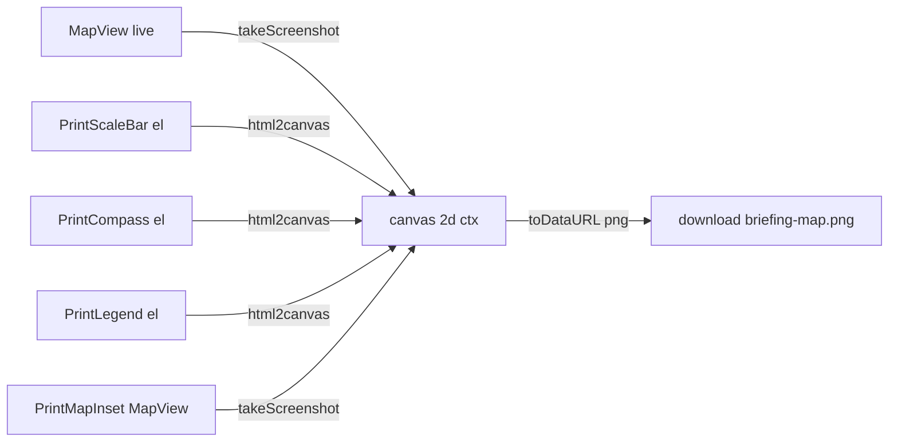

# briefing-tool - Print composition (map + overlays -> image)

> Sample: `ArcGISExperienceBuilder/sdk-resources/widgets/briefing-tool` (exbVersion **1.17.0**).
> Source dir: `src/runtime/components/print/`.
> Vendor libs (NOT jimu, versions approx): `@arcgis/core` widgets (ScaleBar/Compass/Legend, MapView), `@arcgis/map-components` (arcgis-scale-bar/legend/basemap-gallery), `@esri/calcite-components` / `calcite-components`, `html2canvas`. From this sample's internal Artifactory registry (see `internal-registry-and-assets.md`), so exact web-component versions differ from the repo's 1.20 SDK. Treat all non-jimu signatures below as **approx** and re-validate before lifting.

## Concept

The Print panel composes a single downloadable PNG from **a live JSAPI `MapView` plus four overlay widgets** (scale bar, compass, legend, map inset). It is not a layout engine: it takes a raster screenshot of the map, then rasterizes each DOM overlay separately and paints them onto a `<canvas>` at the corner the user picked, stacking multiple overlays in the same corner without overlap.

Flow:

1. Sub-components (`PrintScaleBar` / `PrintCompass` / `PrintMapInset` / `PrintLegend`) each create a **detached DOM element** and a JSAPI widget bound to the main `MapView`, and expose imperative getters via `forwardRef` + `useImperativeHandle`.
2. `print.tsx` (orchestrator) holds a `ref` to each, moves their elements into a hidden preview container (`#PrintTestDiv`), and positions them by corner with stacking logic.
3. On Print, `takeScreenshotWithWidgets` (in `utils.tsx`) calls `view.takeScreenshot()` for the map, `html2canvas()` for each overlay, composites them, and returns an `{ data, dataUrl, width, height }` object. The orchestrator triggers a browser download of `dataUrl`.



## Orchestrator (print.tsx): refs to sub-components + corner placement/stacking

The orchestrator keeps a `ref` per sub-component and reads their DOM elements through the imperative handles. It never renders the overlays into the React tree; they live in a hidden `#PrintTestDiv` appended under the ExB map container.

```tsx
// print.tsx
const printScaleBarRef = useRef<PrintScaleBarHandle>(null);
const printCompassRef  = useRef<PrintCompassHandle>(null);
const printMapInsetRef = useRef<PrintMapInsetHandle>(null);
const printLegendRef   = useRef<PrintLegendHandle>(null);

// Sub-components are rendered (they only render their Calcite settings UI);
// their overlay DOM elements are managed imperatively.
<PrintCompass  ref={printCompassRef} />
<PrintScaleBar ref={printScaleBarRef} />
<PrintMapInset ref={printMapInsetRef} />
<PrintLegend   ref={printLegendRef} />
```

Placement is driven entirely by `printConfig`. When a corner selection changes, an effect re-reads each element and re-applies computed CSS so items sharing a corner stack instead of overlapping:

```tsx
// print.tsx - reposition on corner change, with stacking
useEffect(() => {
  if (panel === Panel.PRINT && divRef.current) {
    const elementPositions = [
      { ref: printScaleBarRef.current?.getScaleBarElement(), type: "scaleBar" },
      { ref: printCompassRef.current?.getCompassElement(),   type: "compass" },
      { ref: printMapInsetRef.current?.getMapInsetElement(),  type: "mapInset" },
    ];
    elementPositions.forEach(({ ref, type }) => {
      if (ref && divRef.current?.contains(ref)) {
        const styles = getPositionStyles(type as MapElementType, printConfig);
        applyPositionStyles(ref, styles);
      }
    });
  }
}, [printConfig.activeItemScaleBar, printConfig.activeItemCompass,
    printConfig.activeItemMapInset, printConfig.activeItemLegend, panel,
    printConfig.scaleBarActive, printConfig.compassActive,
    printConfig.mapInsetActive, printConfig.legendActive]);
```

An auto-relocation effect prevents the legend from landing on an occupied corner:

```tsx
// print.tsx - move legend off a corner taken by scaleBar/compass/mapInset
useEffect(() => {
  if (printConfig.legendActive && printConfig.activeItemLegend) {
    const availableCorners = getAvailableLegendCorners(printConfig);
    if (!availableCorners.includes(printConfig.activeItemLegend)) {
      setPrintConfig((prev) => ({
        ...prev,
        activeItemLegend: availableCorners[0] || "Bottom left",
      }));
    }
  }
}, [printConfig.legendActive, printConfig.activeItemLegend,
    printConfig.compassActive, printConfig.activeItemCompass,
    printConfig.scaleBarActive, printConfig.activeItemScaleBar,
    printConfig.mapInsetActive, printConfig.activeItemMapInset]);
```

Print handler wires the refs straight into the compositor and downloads the result:

```tsx
// print.tsx
const handlePrint = async () => {
  setPrinting(true);
  const validation = validatePrintSettings(printConfig.aspectRatio || "4x6",
                                           printConfig.inputCustomAspectRatio || "");
  if (!validation.isValid) { setPrinting(false); return; }

  const ss = (await takeScreenshotWithWidgets(
    mapView, mapView,
    printConfig.scaleBarActive, printConfig.compassActive, printConfig.legendActive,
    printConfig.selectedLegendItems || [], printConfig.mapInsetActive,
    printConfig.activeItemScaleBar, printConfig.activeItemCompass,
    printConfig.activeItemLegend, printConfig.activeItemMapInset,
    printScaleBarRef, printCompassRef, printLegendRef, printMapInsetRef,
  )) as __esri.Screenshot;

  const link = document.createElement("a");
  link.href = ss.dataUrl;
  link.download = "briefing-map.png";
  link.click();
  setPrinting(false);
};
```

**Corner selection contract:** each overlay owns an `activeItem<X>` field on `printConfig` whose value is one of the four `Corner` strings: `"Top left" | "Top right" | "Bottom left" | "Bottom right"` (see the printConfig table below).

## forwardRef + useImperativeHandle sub-components

Every overlay is a `forwardRef` component that takes **no props** (all data comes from `useWidgetContext()`), and exposes imperative getters so the parent can reach the detached DOM element and the underlying JSAPI widget. Here is the full `PrintScaleBar` handle pattern:

```tsx
// PrintScaleBar.tsx
export interface PrintScaleBarHandle {
  getScaleBarElement: () => HTMLElement | undefined;
  getScaleBarWidget: () => ScaleBar | undefined;
}

const PrintScaleBar = forwardRef<PrintScaleBarHandle>((_, ref) => {
  const { panel, mapView, printConfig, setPrintConfig } = useWidgetContext();
  const { activeItemScaleBar = null, scaleBarActive = true } = printConfig;
  const isActive = panel === Panel.PRINT && scaleBarActive;

  const scaleBarRef = useRef<HTMLElement>();          // detached DOM element
  const scaleBarWidgetRef = useRef<ScaleBar>();       // JSAPI widget instance

  useImperativeHandle(ref, () => ({
    getScaleBarElement: () => scaleBarRef.current,
    getScaleBarWidget: () => scaleBarWidgetRef.current,
  }));

  // Create the element + JSAPI widget once mapView exists (reuse if already in DOM)
  useEffect(() => {
    if (!mapView) return;
    const existing = document.querySelector(".scaleBarTest") as HTMLElement;
    if (!existing) {
      scaleBarRef.current = document.createElement("div");
      scaleBarRef.current.className = "scaleBarTest";
      scaleBarWidgetRef.current = new ScaleBar({
        view: mapView as __esri.MapView,
        unit: "dual", style: "ruler",
        container: scaleBarRef.current,
      });
    } else {
      scaleBarRef.current = existing;  // reuse; do not recreate widget
    }
  }, [mapView]);

  return (/* Calcite settings block: toggle + placement <select> */);
});
PrintScaleBar.displayName = "PrintScaleBar";
```

The four handle interfaces:

| Component | Handle interface | Getters |
| --- | --- | --- |
| `PrintScaleBar` | `PrintScaleBarHandle` | `getScaleBarElement()`, `getScaleBarWidget()` |
| `PrintCompass` | `PrintCompassHandle` | `getCompassElement()`, `getCompassWidget()` |
| `PrintLegend` | `PrintLegendHandle` | `getLegendElement()`, `getLegendWidget()` |
| `PrintMapInset` | `PrintMapInsetHandle` | `getMapInsetElement()`, `getMapView()` |

Note `PrintCompass` differs: on reuse it clears the container (`innerHTML = ""`) and **recreates** the `Compass` widget (the compass must be rebuilt), whereas the scale bar is left intact.

## Reacting to async vendor re-renders: per-component MutationObserver (recompose without teardown)

The JSAPI scale-bar and legend widgets render (and re-render) their inner DOM **asynchronously** and repeatedly (on scale change, layer change, etc.). The sub-components attach a `MutationObserver` to the overlay element so they can re-read / re-format the freshly rendered DOM without tearing down the observer or the widget.

The standard guard: **disconnect before mutating, reconnect after**, to avoid an infinite observe->mutate->observe loop:

```tsx
// PrintScaleBar.tsx - keep dual-unit labels in sync across async re-renders
const observerOptions: MutationObserverInit = {
  childList: true, subtree: true, characterData: true,
  attributes: true, attributeFilter: ["style"],
};

const syncScaleBarLabels = () => {
  observer?.disconnect();                 // stop observing while we edit DOM
  try {
    /* re-read .esri-scale-bar__* nodes and adjust imperial label/width */
  } finally {
    if (scaleBarRef.current) observer.observe(scaleBarRef.current, observerOptions);
  }
};

observer = new MutationObserver(() => { syncScaleBarLabels(); });
observer.observe(scaleBarRef.current, observerOptions);
const timeoutId = setTimeout(syncScaleBarLabels, 200);  // initial pass after first render

return () => { clearTimeout(timeoutId); observer.disconnect(); };  // cleanup on unmount
```

`PrintLegend` uses the same recompose-without-teardown pattern (~L380), and an explicit note (~L429): a **separate** effect re-applies formatting-only params **without tearing down the MutationObserver**, so lightweight config changes (rename/reorder/sizes/border) do not force the observer to be rebuilt:

```tsx
// PrintLegend.tsx (~L380) - observe legend re-renders; recompose, do not destroy
const observer = new MutationObserver(() => {
  observer.disconnect();
  cleanupLegendStructure(legendElement);                     // 1. flatten sublayers
  const { entries, keys } = stampLegendSections(legendElement); // 2. stamp titles/idx
  if (/* entries or keys changed */) {
    setPrintConfig({ legendRenderedEntries: entries, legendRenderedEntryKeys: keys });
  }
  applyLegendFormatting(legendElement, printConfigRef.current); // 3. rename/reorder/size
  observer.observe(legendElement, { childList: true, subtree: true });
});
// initial pass is delayed 300ms to let the Legend widget render first
const timeoutId = setTimeout(() => { /* same 3 steps */ }, 300);
observer.observe(legendElement, { childList: true, subtree: true });
return () => { clearTimeout(timeoutId); observer.disconnect(); };

// PrintLegend.tsx (~L429) - re-apply formatting only, WITHOUT tearing down the observer
useEffect(() => {
  if (!legendElementRef.current || !isActive || selectedLegendItems.length === 0) return;
  applyLegendFormatting(legendElementRef.current, printConfig);
}, [legendLayerNames, legendLayerOrder, legendColumnCount, legendTextSize,
    legendSymbolSize, legendConsolidateSymbols, legendHiddenSymbols, legendTitle,
    /* ...title styling, border, per-layer overrides... */]);
```

`PrintMapInset` uses an observer for a different reason: `#PrintTestDiv` is created by `print.tsx` on a later tick, so the inset waits for it to appear:

```tsx
// PrintMapInset.tsx - wait for #PrintTestDiv to be created by print.tsx
observer = new MutationObserver(() => {
  const el = document.getElementById("PrintTestDiv");
  if (el) { setPrintTestDiv(el); observer?.disconnect(); }
});
observer.observe(document.body, { childList: true, subtree: true });
return () => observer?.disconnect();
```

The two useful patterns to lift: (a) disconnect->mutate->reconnect to avoid feedback loops; (b) a delayed initial pass (`setTimeout` 200-300ms) because the vendor widget has not painted yet on the first tick.

## Map inset: secondary MapView + basemap gallery + fromJSON restore

`PrintMapInset` builds a **second live `MapView`** (the overview map) into its own detached div, draws a red AOI rectangle showing the main map's extent, offers an `arcgis-basemap-gallery`, and watches the main view's `extent`/`rotation` to stay in sync. Saved-layout state is restored via `Basemap.fromJSON` / `Extent.fromJSON`.

```tsx
// PrintMapInset.tsx - create the secondary MapView (restore saved state if present)
const createMapView = (containerDiv: HTMLDivElement): MapView => {
  let defBasemap = mainView.map.basemap;
  if (mapInsetBasemapJSON) {
    try { defBasemap = Basemap.fromJSON(mapInsetBasemapJSON); }   // restore saved basemap
    catch (e) { console.warn("Failed to restore saved inset basemap", e); }
  }
  const duplicateMap = new Map({ basemap: defBasemap });

  let defRectExtent = mainView.extent as __esri.Extent;
  if (mapInsetExtentJSON) {
    try { defRectExtent = Extent.fromJSON(mapInsetExtentJSON); }  // restore saved extent
    catch (e) { console.warn("Failed to restore saved inset extent", e); }
  } else {
    const aoi = getAoiPolygon();                                   // else derive from AOI
    if (aoi?.extent) { const e = aoi.extent.clone().expand(3); if (isValidExtent(e)) defRectExtent = e; }
  }

  return new MapView({
    map: duplicateMap,
    spatialReference: mainView.spatialReference,
    container: containerDiv,
    extent: defRectExtent,
    rotation: mapInsetRotation ?? 0,
    constraints: { rotationEnabled: false, snapToZoom: false /* + inherited min/maxZoom */ },
    ui: { components: [] },                                        // no default UI chrome
  });
};

// Keep the inset in sync with the main map
duplicateMapView.when(() => {
  updateAoiRectangle(duplicateMapView);
  mainView.watch("extent",   () => updateAoiRectangle(duplicateMapView));
  mainView.watch("rotation", (r) => { duplicateMapView.rotation = r; updateAoiRectangle(duplicateMapView); });
});
```

A separate effect re-applies persisted `mapInsetBasemapJSON` / `mapInsetExtentJSON` / `mapInsetRotation` to an already-initialized inset when a saved layout loads. Basemap gallery source is a `PortalBasemapsSource` scoped to `config.basemapGroupId`:

```tsx
// PrintMapInset.tsx - basemap gallery bound to the inset view + portal group
const initializeBaseMapGallery = (mapView: MapView): void => {
  const gallery = document.createElement("arcgis-basemap-gallery") as HTMLArcgisBasemapGalleryElement;
  // @ts-ignore  (web-component property, typed loosely)
  gallery.view = mapView;
  gallery.autoDestroyDisabled = true;
  setupBaseMapGallerySource(gallery);            // new PortalBasemapsSource({ portal, query:{ id: basemapGroupId } })
  setPrintConfig({ mapInsetBasemapGallery: gallery });
};
```

The red AOI rectangle is projected from the print area's screen rect through `mainView.toMap(...)` into a `Polygon`, drawn on a dedicated `GraphicsLayer("rectangleOverlay")` that is removed/re-added on each update.

## Rasterization: html2canvas compositing (utils.tsx)

`takeScreenshotWithWidgets` is the compositor. The **map** is captured via the JSAPI `view.takeScreenshot({ area, format:"png", quality:100 })` cropped to the print area rect; each **DOM overlay** is rasterized with `html2canvas` and the resulting `<canvas>` images are painted onto one 2D context, then exported with `canvas.toDataURL("image/png")`.

```tsx
// utils.tsx - capture map to canvas, then overlays via html2canvas
const printRect = printDiv.getBoundingClientRect();
const ss = await view.takeScreenshot({
  area: {
    x: printRect.x - (view.padding.left ?? 0),
    y: printRect.y - (view.padding.top ?? 0) - printDiv.parentElement.getBoundingClientRect().top,
    width: printRect.width, height: printRect.height,
  },
  format: "png", quality: 100,
});

const canvas = document.createElement("canvas");
canvas.width = ss.data.width; canvas.height = ss.data.height;
const ctx = canvas.getContext("2d");
ctx.putImageData(ss.data, 0, 0);                    // draw the map raster first

// Legend: strip the CSS transform scale so html2canvas captures at full size,
// then downscale the captured canvas to 50%.
const originalTransform = legendEl.style.transform;
legendEl.style.transform = "none";
const fullScaleCanvas = await html2canvas(legendEl, { backgroundColor: null, scale: 1 });
legendEl.style.transform = originalTransform;       // restore

// Scale bar / compass: transparent background, scale 1
const scaleBarCanvas = await html2canvas(scaleBarEl, { backgroundColor: null, scale: 1 });
const compassCanvas  = await html2canvas(compassEl,  { backgroundColor: null, scale: 1 });

// Map inset: it is a live MapView, so use takeScreenshot (NOT html2canvas)
const dupScreenshot = await duplicateMapView.takeScreenshot({ format: "png", quality: 1 });
```

Overlays are grouped by corner and stacked. A mutable `cornerOffsets` accumulator advances along the corner as each element is drawn, so multiple overlays in one corner do not overlap:

```tsx
// utils.tsx - getCoordsForPlacementStacked advances the offset per draw
case "Bottom right":
  x = canvasWidth  - widgetWidth  - cornerOffsets[placement].x;
  y = canvasHeight - widgetHeight - cornerOffsets[placement].y;
  cornerOffsets[placement].y += widgetHeight + spacing;  // stack upward
  break;

// For top corners the group is reversed so the compass sits closest to the corner
Object.keys(cornerGroups).forEach((corner) => {
  if (corner.startsWith("Top")) cornerGroups[corner].reverse();
});

cornerGroups.flat().forEach((element) => {
  const { x, y } = getCoordsForPlacementStacked(element.corner, element.canvas.width,
    element.canvas.height, canvas.width, canvas.height, 10, cornerOffsets);
  ctx.drawImage(element.canvas, x, y);
  if (element.needsBorder) { ctx.strokeStyle = "black"; ctx.lineWidth = 1;
    ctx.strokeRect(x, y, element.canvas.width, element.canvas.height); }  // map-inset border
});

returnObj = { data: ctx.getImageData(0,0,canvas.width,canvas.height),
              dataUrl: canvas.toDataURL("image/png"),
              width: canvas.width, height: canvas.height };
```

`html2canvas` options actually used: `{ backgroundColor: null, scale: 1 }` (transparent background so overlays composite cleanly; `scale:1` because the compositor manages its own downscaling for the legend). The compositor also **waits for the compass calcite-icon to finish rendering** (polls `getBoundingClientRect()` width/height + `visibility`) before capturing, since the icon paints late.

## Standalone print document (print.html + CDN Calcite)

`src/runtime/assets/print.html` is a **standalone HTML print surface** (opened as its own document), independent of the ExB app bundle. It loads Calcite and the ArcGIS SDK from the **public CDN** (not the internal Artifactory registry the widget build uses), and auto-invokes `window.print()`:

```html
<!-- src/runtime/assets/print.html -->
<script type="module" src="https://js.arcgis.com/calcite-components/3.0.3/calcite.esm.js"></script>
<link rel="stylesheet" href="https://js.arcgis.com/4.32/esri/themes/light/main.css" />
<script src="https://js.arcgis.com/4.32/"></script>
<script type="module" src="https://js.arcgis.com/map-components/4.32/arcgis-map-components.esm.js"></script>
<script>
  const allowedOrigins = ["http://localhost", "https://localhost",
                          "https://fdt.esrigc.com", "http://fdt.esrigc.com"];
  window.onload = function () {
    setTimeout(() => {
      document.title = document.title + " " + new Date().getTime(); // unique saved-pdf name
      window.print();
    }, 2000);
  };
</script>
```

Note the pinned public versions: Calcite **3.0.3**, ArcGIS **4.32**, map-components **4.32** - separate from the widget's internal 4.33 stack. It also validates `postMessage` origins against an allow-list.

## printConfig contract (what drives the composition)

Defined in `src/runtime/context.tsx` as `IPrintConfig` (a `useReducer` slice; `setPrintConfig(partial)` merges). Key fields:

| Field | Type | Default | Drives |
| --- | --- | --- | --- |
| `aspectRatio` | `string` | `"4x6"` | print size preset (or `"custom"`) |
| `inputCustomAspectRatio` | `string` | `""` | `"WxH"` when custom |
| `scaleBarActive` | `boolean` | `true` | scale bar on/off |
| `compassActive` | `boolean` | `true` | compass on/off |
| `compassStyle` | `string` | `"compass"` | compass icon variant |
| `mapInsetActive` | `boolean` | `true` | map inset on/off |
| `legendActive` | `boolean` | `true` | legend on/off |
| `activeItemScaleBar` | `Corner \| null` | `"Bottom left"` | scale bar corner |
| `activeItemCompass` | `Corner \| null` | `"Bottom left"` | compass corner |
| `activeItemMapInset` | `Corner \| null` | `"Bottom right"` | map inset corner |
| `activeItemLegend` | `Corner \| null` | `"Top left"` | legend corner (auto-moved if occupied) |
| `selectedLegendItems` | `string[]` | `[]` | layer IDs shown in legend |
| `selectedLegendItemTitles` | `string[]` | `[]` | parallel titles |
| `mapInsetMapView` | `MapView \| null` | `null` | **live** inset view (NOT serializable) |
| `mapInsetBasemapGallery` | `HTMLArcgisBasemapGalleryElement \| null` | `null` | live gallery element |
| `mapInsetBasemapJSON` | `any` (BasemapProperties) | `null` | restore via `Basemap.fromJSON` |
| `mapInsetExtentJSON` | `any` (ExtentProperties) | `null` | restore via `Extent.fromJSON` |
| `mapInsetRotation` | `number` | `0` | inset rotation |

Legend customization fields (30+, all optional):

| Field | Type | Default |
| --- | --- | --- |
| `legendBackgroundOpacity` | `number` | `1` |
| `legendLayerNames` | `Record<string,string>` | `{}` |
| `legendLayerOrder` | `string[]` | `[]` |
| `legendColumnCount` | `number` | `1` |
| `legendTextSize` | `number` | `10` |
| `legendSymbolSize` | `number` | `1` |
| `legendConsolidateSymbols` | `boolean` | `false` |
| `legendHiddenSymbols` | `Record<string,string[]>` | `{}` |
| `legendRenderedEntries` | `string[]` | `[]` (read from DOM) |
| `legendRenderedEntryKeys` | `string[]` | `[]` (parallel keys) |
| `legendTitle` | `string` | `""` |
| `legendTitleBold` | `boolean` | `true` |
| `legendTitleUnderline` | `boolean` | `false` |
| `legendTitleItalic` | `boolean` | `false` |
| `legendTitleFontSize` | `number` | `16` |
| `legendMaxWidth` | `number` | `0` (unbounded) |
| `legendMaxHeight` | `number` | `0` (unbounded) |
| `legendLayerTextSize` | `Record<string,number>` | `{}` (per-section) |
| `legendLayerSymbolSize` | `Record<string,number>` | `{}` (per-section) |
| `legendSymbolNames` | `Record<string,Record<string,string>>` | `{}` (per-symbol rename) |
| `legendBorderWidth` | `number` | `0` |
| `legendBorderColor` | `string` | `"#000000"` |

`Corner = "Top left" | "Top right" | "Bottom left" | "Bottom right"`. The legend UI is `LegendFormatPanel.tsx` (renames/reorders/sizes/consolidate/hidden/title styling/border) which writes these fields; `applyLegendFormatting` in `utils.tsx` reads them back onto the rendered legend DOM.

## Gotchas

- **Async re-render timing.** Vendor scale-bar/legend DOM paints after the first React tick and re-renders repeatedly. The initial format pass is delayed (`setTimeout` 200-300ms) and a `MutationObserver` recomposes on later renders. Without the delay you format an empty widget; without disconnect/reconnect you get an infinite loop.
- **html2canvas + WebGL map canvas.** The map is a WebGL canvas - `html2canvas` cannot rasterize it reliably, so the map (and the inset MapView) are captured with the JSAPI `takeScreenshot()` instead; only plain-DOM overlays go through `html2canvas`.
- **CORS.** `takeScreenshot()` taints the WebGL canvas if any layer/basemap tiles are served without CORS headers, causing a security error on read-back. Ensure services send `Access-Control-Allow-Origin`. `print.html` also restricts `postMessage` to an origin allow-list.
- **Live SDK objects are not serializable.** `mapInsetMapView` and `mapInsetBasemapGallery` are **live** objects held in `printConfig` and must NOT be persisted; only `mapInsetBasemapJSON` / `mapInsetExtentJSON` / `mapInsetRotation` are serializable and restored via `*.fromJSON` (see `session-and-widget-communication.md` and `internal-registry-and-assets.md`).
- **Transform-scale trap.** The legend preview uses a CSS `transform` scale; `html2canvas` captures the pre-transform box, so the code temporarily sets `transform: "none"`, captures, restores, then downscales the resulting canvas to 50%.
- **1.17 drift.** This sample predates the repo's 1.20 SDK and pulls `@arcgis/*` web components + Calcite + `html2canvas` from an internal Artifactory registry at 4.33.x, while `print.html` uses public CDN 4.32 / Calcite 3.0.3. Versions and web-component member types differ from the repo - re-validate before lifting.

## Lift-into-repo

- **Code-style:** authored TS/JS in this repo must use `&&` short-circuit guard calls, always-semicolons, if-bodies on their own line, and plain hyphens (no em/en dashes) - see `code-style.instructions.md`. The sample uses different conventions; normalize on lift.
- **Disconnect observers on unmount.** Each `MutationObserver` returns a cleanup that `disconnect()`s; keep that. Also `destroy()` the inset `MapView` and JSAPI widgets on unmount (the sample destroys the legend widget but is looser about the inset view - tighten it).
- **Validate vendor versions.** Confirm `@arcgis/map-components`, `@arcgis/core`, and `html2canvas` versions against the repo's SDK (1.20) before reusing; the 1.17 internal-registry pins will not match. Re-check `takeScreenshot`, `Basemap.fromJSON`, `Extent.fromJSON`, and basemap-gallery web-component APIs against installed `.d.ts`.
- **CORS + tainted canvas.** Test the export path end-to-end against your real services; a single non-CORS tile source breaks `takeScreenshot`.

## See also

- [session-and-widget-communication.md](session-and-widget-communication.md) - how `printConfig` (minus live objects) is persisted/restored with layouts.
- [context-and-state.md](context-and-state.md) - the `useReducer` `printConfig` state slice and `setPrintConfig` merge semantics.
- [internal-registry-and-assets.md](internal-registry-and-assets.md) - internal Artifactory registry, asset-path wiring, web-component import styles.
- [09-demos-complex.md](../09-demos-complex.md) - briefing-tool overview card.
