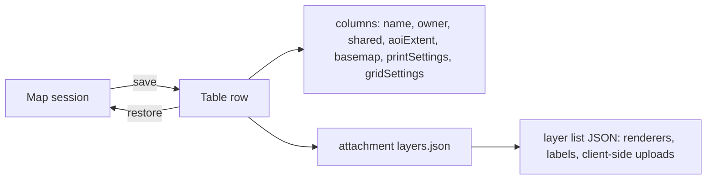

# briefing-tool - Session save/restore + widget communication

> Source: `ArcGISExperienceBuilder/sdk-resources/widgets/briefing-tool/` (SDK sample, **exbVersion 1.17.0**).
> jimu signatures verified against the 1.20 `.d.ts` under `ArcGISExperienceBuilder/client/**`. ArcGIS Maps SDK (`@arcgis/core` / `__esri`) calls are marked **(arcgis approx)** where not verifiable against a jimu `.d.ts`.
> Code-style note: the sample source below is quoted verbatim; it does not follow this repo's authored code-style rules (semicolons, hyphens). Apply repo style when lifting.

This sample lets a user save a whole "layout" (a working session of the map) to a feature-service **table**, list saved layouts, and restore one. It also demonstrates three reusable cross-widget communication patterns. The heavy lifting lives in one component, `LayoutManager`, which is portalled into a DOM node owned by a different widget so that it visually appears as a standalone floating widget.

Key files:
- `src/runtime/components/layout-manager/layout-manager.tsx` - save / update / delete / list / restore.
- `src/runtime/components/layout-manager/layer_utils.ts` - serialize / deserialize the operational layer list to/from JSON.
- `src/runtime/widget.tsx` - MutationObserver + `createPortal`, and the grid-overlay warm-up.
- `src/config.ts` - the table URL and the table field-name mapping.

---

## Session persistence model: feature-table row (metadata + JSON blobs) + attachment (layers)

A saved layout is **one row** in a feature-service table plus **one attachment** on that row:

| Table field (config key)            | Holds                                      | Format                          |
| ----------------------------------- | ------------------------------------------ | ------------------------------- |
| `layoutName`                        | user-facing name of the layout             | string                          |
| `username`                          | owner (used for scoping)                   | string                          |
| `shared`                            | whether other users can load it            | `"true"` / `"false"` string     |
| `aoiName`                           | AOI display name                           | string                          |
| `aoiExtent`                         | map extent + rotation                      | JSON string (`Extent.toJSON` + `mapRotation`) |
| `basemap`                           | active basemap                             | JSON string (`Basemap.toJSON`)  |
| `printSettings`                     | print/layout config (live objects stripped) | JSON string (`serializePrintConfig`) |
| `gridSettings`                      | grid-overlay widget settings               | JSON string (owned by another widget) |
| `objectId` / `globalId`             | identity + attachment linkage              | service-managed                 |
| **attachment** `layers.json`        | the full operational **layer** list         | JSON blob (`layer_utils`)       |

Design rationale: small, queryable metadata (name, owner, shared, extent, basemap) lives in **columns** so a cheap `queryFeatures` can list layouts without downloading everything; the large, variable-size **layer** definition (renderers, labels, uploaded client-side features) lives in an **attachment** fetched only when a layout is actually opened.

The field names are indirected through config so the physical table can use any column names:

```ts
// src/config.ts
layoutManagerElementId: string;   // DOM id the LayoutManager portals into
layoutManagerTableUrl: string;    // feature-service TABLE endpoint
layoutManagerTableFields: {
  username: string;
  layoutName: string;
  aoiName: string;
  aoiExtent: string;
  basemap: string;
  printSettings: string;
  gridSettings: string;
  shared: string;
};
```



---

## Saving a layout (attributeDict + attachment)

`handleSaveLayout` builds a flat attribute dictionary of JSON strings and serializes the layer list to a `Blob`. Note every geometry/basemap/print value is captured via `toJSON()` at save time, and `mapRotation` is folded into the extent JSON.

```ts
// layout-manager.tsx (~L520-541) - inside handleSaveLayout
const layerResult = await layerUtils.getLayerJson(mapView);
// Surface any truncation warnings to the user
for (const warning of layerResult.warnings) {
  dispatchAlert({ type: "warning", message: warning });
}
const newLayersJsonStr = JSON.stringify(layerResult.layers);
const layersDefJsonBlob = new Blob([newLayersJsonStr], { type: "application/json" });

const attributeDict: { [key: string]: string | number | boolean | null } = {};
attributeDict[config.layoutManagerTableFields.username]   = userName;
attributeDict[config.layoutManagerTableFields.layoutName] = saveLayoutName;
attributeDict[config.layoutManagerTableFields.aoiName]    = aoi;
const aoiExtentData = mapView?.extent?.toJSON();
if (aoiExtentData) {
  aoiExtentData.mapRotation = mapView?.rotation ?? 0;
}
attributeDict[config.layoutManagerTableFields.aoiExtent]     = aoiExtentData ? JSON.stringify(aoiExtentData) : null;
attributeDict[config.layoutManagerTableFields.basemap]       = JSON.stringify(mapView?.map?.basemap?.toJSON());
attributeDict[config.layoutManagerTableFields.printSettings] = JSON.stringify(serializePrintConfig(printConfig));
attributeDict[config.layoutManagerTableFields.gridSettings]  = gridSettingsJson;
attributeDict[config.layoutManagerTableFields.shared]        = saveLayoutShared ? "true" : "false";
```

The row + attachment are written together in a **single `applyEdits`** with `globalIdUsed: true`, using a client-generated `globalId` to link the attachment to the new feature and `rollbackOnFailureEnabled` so a partial save cannot leave a row without its layers:

```ts
// layout-manager.tsx - doSaveAction
const newGlobalId = uuidv4();
attributeDict[featureLayer.globalIdField] = newGlobalId;

const edits = new Graphic({ attributes: attributeDict });
const result = await featureLayer.applyEdits(
  {
    addFeatures: [edits],
    addAttachments: [{ feature: edits, attachment: { globalId: newGlobalId, name: "layers.json", data: layersDefJsonBlob } }]
  },
  { globalIdUsed: true, rollbackOnFailureEnabled: true }
); // (arcgis approx)
```

The update path (`doUpdateAction`) diffs attributes and only rewrites the attachment when the serialized layer JSON actually changed (size check first, then content compare), and it can `updateAttachments` / `deleteAttachments` + `addAttachments` depending on whether the old attachment has a populated `globalId`.

---

## Listing layouts (user + shared query)

`getLayouts` returns the current user's layouts **plus** any shared ones, requesting only the light columns needed to render the list:

```ts
// layout-manager.tsx - getLayouts
await featureLayer.load();
const result = await featureLayer.queryFeatures({
  where: `(${config.layoutManagerTableFields.username}='${userName}') or (${config.layoutManagerTableFields.shared}='true')`,
  outFields: [`${featureLayer.objectIdField},${featureLayer.globalIdField},${config.layoutManagerTableFields.layoutName},
    ${config.layoutManagerTableFields.username},${config.layoutManagerTableFields.shared}`],
  orderByFields: [`${config.layoutManagerTableFields.layoutName} ASC`],
  returnGeometry: false,
}); // (arcgis approx)
```

The `username` comes from either the injected `user` prop or `portal.user.username`. Warning: `userName` is interpolated straight into the `where` clause, so it is SQL-injectable if the username is ever attacker-controlled; when lifting, parameterize or escape.

---

## serializePrintConfig: strip live SDK objects before JSON

The print config holds **live** SDK/DOM handles (`mapInsetMapView`, `mapInsetBasemapGallery`) that cannot be JSON-serialized. `serializePrintConfig` copies only an allow-list of primitive keys, then snapshots the live inset map's basemap/extent/rotation via `toJSON()` at save time:

```ts
// layout-manager.tsx (~L80-101)
function serializePrintConfig(config: IPrintConfig): Partial<IPrintConfig> {
  const serializable: Partial<IPrintConfig> = {};
  for (const key of SERIALIZABLE_PRINT_KEYS) {          // explicit allow-list of primitive keys
    if (key in config && config[key] !== undefined) {
      (serializable as any)[key] = config[key];
    }
  }
  // Capture live map inset values from the MapView at save time
  if (config.mapInsetMapView) {
    try {
      const mv = config.mapInsetMapView;
      if (mv.map?.basemap) { serializable.mapInsetBasemapJSON = mv.map.basemap.toJSON(); }
      if (mv.extent)       { serializable.mapInsetExtentJSON  = mv.extent.toJSON(); }
      if (mv.rotation != null) { serializable.mapInsetRotation = mv.rotation; }
    } catch (e) {
      console.warn("(layout-manager) Failed to capture map inset state:", e);
    }
  }
  return serializable;
}
```

The lesson: never `JSON.stringify` a config that mixes plain data with live SDK views/widgets - keep an explicit serializable key allow-list and convert live objects to JSON snapshots.

---

## Restoring a layout (extent/basemap/aoi/print/grid + layers)

`handleLoadLayout` queries the single row (`outFields: ["*"]`) and restores each concern in a **fixed order**: extent, basemap, grid, layers, then print settings last (so legend layer IDs resolve against layers already on the map).

```ts
// layout-manager.tsx - handleLoadLayout (restore order)
await loadExtent(layoutVals, errorMsgs);
loadBasemap(layoutVals, errorMsgs);
loadGridSettings(layoutVals, errorMsgs);
await loadLayers(layoutVals, errorMsgs);
// Print settings must load after layers so legend layer IDs resolve
loadPrintSettings(layoutVals, errorMsgs);
```

Extent and basemap are rebuilt from JSON; rotation is reset before applying the axis-aligned extent, then re-applied:

```ts
// layout-manager.tsx - loadExtent / loadBasemap (~L291+)
const extentObj = JSON.parse(layoutVals.attributes[config.layoutManagerTableFields.aoiExtent]);
const extent = Extent.fromJSON(extentObj);                 // (arcgis approx)
if (mapView.rotation !== 0) {
  mapView.rotation = 0;
  await reactiveUtils.whenOnce(() => mapView.stationary);   // (arcgis approx)
}
mapView.extent = extent;                                    // set extent (goTo padding would distort it)
if (extentObj.mapRotation != null) { mapView.rotation = extentObj.mapRotation; }
setAoiExtent(extent);
setAoi(layoutVals.attributes[config.layoutManagerTableFields.aoiName]);

// loadBasemap
const baseMapObj = JSON.parse(layoutVals.attributes[config.layoutManagerTableFields.basemap]);
mapView.map.basemap = Basemap.fromJSON(baseMapObj);        // (arcgis approx)
```

Print restore is the mirror image of `serializePrintConfig`: it must **reset to defaults while preserving the live objects** that were never serialized, then overlay the parsed values:

```ts
// layout-manager.tsx - loadPrintSettings
const liveObjects = {
  mapInsetMapView: printConfig.mapInsetMapView,
  mapInsetBasemapGallery: printConfig.mapInsetBasemapGallery,
};
const resetConfig = { ...initialPrintConfig, ...liveObjects };   // defaults, but keep live handles
if (jsonString) {
  const parsed = JSON.parse(jsonString);
  // setPrintConfig triggers PrintMapInset's useEffect which re-applies
  // mapInsetBasemapJSON / mapInsetExtentJSON / mapInsetRotation to the inset MapView
  setPrintConfig({ ...resetConfig, ...parsed, ...liveObjects });
} else {
  setPrintConfig(resetConfig);
}
```

Layers are restored from the attachment named `layers.json`; if it is missing, the operational layers are cleared to avoid showing stale data:

```ts
// layout-manager.tsx - loadLayers
const attachments = await featureLayer.queryAttachments({ objectIds: [oid] });     // (arcgis approx)
const objectAttachments = attachments?.[oid] ?? [];
const layersAttachment = objectAttachments.find(a => a.name === "layers.json");
if (!layersAttachment) {
  await layerUtils.loadLayersFromJson(mapView, []);   // clear stale operational layers
  errorMsgs.push("Layer data (layers.json) is missing from this layout. Layers were not restored.");
  return;
}
const response = await fetch(layersAttachment.url);
const layerData = await response.json();
const errors = await layerUtils.loadLayersFromJson(mapView, layerData);
```

---

## Layer (de)serialization: renderers, labels, client-side uploads

`layer_utils.ts` walks `mapView.map.layers` (reversed so draw order is preserved on restore) and produces a `LayerDef[]`. The grid-overlay widget's own layers are **excluded** (`id.startsWith("grid-overlays-widget_")`) because they are owned by another widget and restored separately via `gridSettings`.

### Serialize (getLayerJson -> __getLayerDetails)

Per layer it captures `id/title/type/visible/opacity`, `definitionExpression`, `blendMode`, renderer, and labels. Renderer JSON is HTML-escaped because it may contain Arcade expressions with `<`/`>`/`&` that break the table value:

```ts
// layer_utils.ts - __getLayerRendererDetails
const json = (renderer as RendererUnion).toJSON();               // (arcgis approx)
const jsonStrClean = JSON.stringify(json)
  .replace(/&/g, "&amp;").replace(/</g, "&lt;").replace(/>/g, "&gt;");
lyrDef.renderer = jsonStrClean;

// __getLayerLabelDetails - each LabelClass -> toJSON()
lyrDef.labels = { info: labelingInfo.map(l => JSON.stringify(l.toJSON())), visible: labelsVisible };
```

**Client-side uploads** (shapefile / GeoJSON with no server URL) are the important case: their features live only in the browser, so the graphics, fields, objectIdField and spatialReference are all serialized inline. A cap of 12000 features guards memory/size, and a failed serialization reverts the type so a broken client-feature is not saved:

```ts
// layer_utils.ts - __getLayerDetails (GeoJSON upload branch)
if (lyr instanceof GeoJSONLayer) {
  tmpDef.type = "client-feature";
  try {
    await lyr.load();
    tmpDef.geometryType = lyr.geometryType ?? undefined;
    const query = lyr.createQuery();
    query.where = "1=1"; query.returnGeometry = true; query.outFields = ["*"];
    query.num = 12000; // cap serialization
    const result = await lyr.queryFeatures(query);
    if (result.exceededTransferLimit) { tmpDef.truncated = true; }
    tmpDef.sourceFeatures = result.features.map(f => f.toJSON());   // Graphic.toJSON
    tmpDef.sourceFields   = lyr.fields?.map(f => f.toJSON()) || [];  // Field.toJSON
    tmpDef.objectIdField  = lyr.objectIdField || "OBJECTID";
    if (lyr.spatialReference) { tmpDef.spatialReference = lyr.spatialReference.toJSON(); }
  } catch (err) {
    console.warn(`Could not serialize GeoJSON layer '${lyr.title}':`, err);
    tmpDef.type = lyr.type;                 // revert so it is not saved as client-feature
    tmpDef.sourceFeatures = undefined; /* ...clear the rest... */
  }
}
// Shapefile-style client FeatureLayer (has .source, no .url) takes the same path via fl.source.toArray()
```

`getLayerJson` then emits a warning for any layer that reverted (could not be serialized) so the save UI can tell the user it will not come back:

```ts
// layer_utils.ts - getLayerJson
if (lyr instanceof GeoJSONLayer && tmpDef.type !== "client-feature") {
  warnings.push(`Layer "${tmpDef.title}" could not be serialized and will not be restored on reload.`);
}
```

### Deserialize (loadLayersFromJson -> __loadLayerDef -> __setLayerProps)

`loadLayersFromJson` reuses layers already on the map by `id` (only fetching missing ones), preserves grid-overlay layers, removes everything else, then re-adds in saved order. `__loadLayerDef` dispatches on the saved `type`:

```ts
// layer_utils.ts - __loadLayerDef switch
switch (lyrDef.type) {
  case 'featureServer':  lyr = await this.__loadFeatureServerItem(lyrDef, errors); break;
  case 'group':          lyr = await this.__loadGroupLayer(lyrDef, errors); break;
  case 'feature':        lyr = await this.__loadFeatureLayer(lyrDef, errors); break;
  case 'client-feature': lyr = await this.__loadClientFeatureLayer(lyrDef, errors); break;
  case 'wfs':            lyr = await this.__loadWfsLayer(lyrDef, errors); break;
  case 'wms':            lyr = await this.__loadWmsLayer(lyrDef, errors); break;
  case 'mapServer':      lyr = await this.__loadGenericWithSubLayers(lyrDef, errors); break;
  case 'tile':           lyr = await this.__loadGenericWithSubLayers(lyrDef, errors); break;
  case 'imagery':        lyr = await this.__loadGenericNoSubLayers(lyrDef, errors); break;
  case 'vector-tile':    lyr = await this.__loadGenericNoSubLayers(lyrDef, errors); break;
  default: throw new Error(`'Type ${lyrDef.type}' is not supported.`);
}
```

Renderers and labels are rebuilt in `__setLayerProps`, unescaping the renderer JSON first and choosing the concrete renderer class by `type`:

```ts
// layer_utils.ts - __setLayerProps (labels + renderer)
if (lyrDef.labels) {
  lyr.labelsVisible = lyrDef.labels.visible;
  lyr.labelingInfo = lyrDef.labels.info.map(s => LabelClass.fromJSON(JSON.parse(s)));  // (arcgis approx)
}
if (lyrDef.renderer && "renderer" in lyr) {
  const rendererJson = JSON.parse(
    lyrDef.renderer.replace(/&lt;/g, "<").replace(/&gt;/g, ">").replace(/&amp;/g, "&")
  );
  let renderer;
  switch (rendererJson.type.toLowerCase()) {                      // (arcgis approx)
    case 'classbreaks': renderer = ClassBreaksRenderer.fromJSON(rendererJson); break;
    case 'dotdensity':  renderer = DotDensityRenderer.fromJSON(rendererJson); break;
    case 'heatmap':     renderer = HeatmapRenderer.fromJSON(rendererJson); break;
    case 'piechart':    renderer = PieChartRenderer.fromJSON(rendererJson); break;
    case 'simple':      renderer = SimpleRenderer.fromJSON(rendererJson); break;
    case 'uniquevalue': renderer = UniqueValueRenderer.fromJSON(rendererJson); break;
    default: throw new Error(`'Renderer type ${rendererJson.type}' is not supported.`);
  }
  if (renderer) { lyr.renderer = renderer; }
}
```

Client-side layers are rebuilt directly from the serialized graphics/fields (no network) - this is what makes uploaded shapefiles/GeoJSON survive a save/restore:

```ts
// layer_utils.ts - __loadClientFeatureLayer
const graphics = (lyrDef.sourceFeatures || []).map(f => Graphic.fromJSON(f));   // (arcgis approx)
const fields   = (lyrDef.sourceFields || []).map(f => Field.fromJSON(f));
const featureLayerProps: __esri.FeatureLayerProperties = {
  id: lyrDef.id,
  title: lyrDef.title,
  objectIdField: lyrDef.objectIdField || "FID",
  source: new Collection(graphics),
  fields,
};
if (lyrDef.geometryType)     { featureLayerProps.geometryType = lyrDef.geometryType as __esri.FeatureLayerProperties["geometryType"]; }
if (lyrDef.spatialReference) { featureLayerProps.spatialReference = lyrDef.spatialReference as __esri.SpatialReferenceProperties; }
const lyr = new FeatureLayer(featureLayerProps);
this.__setLayerProps(lyrDef, lyr);
await lyr.load();
```

---

## Cross-widget communication patterns

These three patterns are the reusable core of the sample. They let `briefing-tool` drive a **separate** widget (`grid-overlay`) and render one of its own components as a floating standalone widget.

### 1. Push data to another widget via appActions.widgetStatePropChange (grid-overlay)

To restore grid settings, `briefing-tool` does not import `grid-overlay`; it mutates that widget's **widget-state prop** in the Redux store. The receiving widget watches that prop and reacts.

```ts
// layout-manager.tsx - loadGridSettings (~L402)
const jsonString = layoutVals.attributes[config.layoutManagerTableFields.gridSettings];
dispatch(
  appActions.widgetStatePropChange(
    'grid-overlay-load-grid-settings',   // widgetId (state bucket key) the receiver watches
    'message',                            // prop name (the agreed channel)
    JSON.parse(jsonString)               // payload
  )
);
```

**Verified signature (1.20 `.d.ts`):**
```ts
// jimu-core/lib/app-actions.d.ts
export declare function widgetStatePropChange(
  widgetId: string, propKey: string, value: any
): WidgetStatePropChangeAction;
```

**Sender/receiver contract (the coupling to understand):**
- The sender dispatches `widgetStatePropChange(<channelId>, <propKey>, payload)`. This writes into `state.widgetsState[<channelId>][<propKey>]`.
- The `<channelId>` here (`'grid-overlay-load-grid-settings'`) is **not the receiver's real widget id** - it is an agreed "channel" name, and `'message'` is the agreed prop key. Both sides must hard-code the same two magic strings.
- The receiver reads that store slice (via `mapStateToProps` / `mapExtraStateProps` selecting `state.widgetsState['grid-overlay-load-grid-settings']?.message`, or `getAppStore().subscribe`) and applies the new grid settings when `message` changes.
- One-way, fire-and-forget: there is no ack, no schema, and any widget can write the slice. See Gotchas for why a typed contract is preferable when lifting.

### 2. Warm up another widget's runtime via WidgetManager.loadWidgetClass + open/close

The `widgetStatePropChange` message above only works if the `grid-overlay` widget is actually **mounted/instantiated**. If the user never opened it, its runtime class is not loaded and nothing is listening. `briefing-tool` force-instantiates it on mount by loading its class and dispatching open-then-close so it initializes without staying visible:

```tsx
// widget.tsx
function getWidgetIdFromUri(widgetUri: string): string | undefined {
  const state = getAppStore().getState();
  const widgets = state?.appConfig?.widgets;
  for (const widgetId of Object.keys(widgets)) {
    if (widgets[widgetId]?.uri === widgetUri) { return widgetId; }
  }
  return undefined;
}

// Initializes a widget by opening it and then closing it right after
async function initializeWidgetByUri(widgetUri: string): Promise<void> {
  const widgetId = getWidgetIdFromUri(widgetUri);
  if (!widgetId) { console.error(`initializeWidgetByUri: No widget found with uri: ${widgetUri}`); return; }

  const state = getAppStore().getState();
  const isClassLoaded = state?.widgetsRuntimeInfo?.[widgetId]?.isClassLoaded;
  if (!isClassLoaded) {
    await WidgetManager.getInstance().loadWidgetClass(widgetId);   // load the runtime chunk
  }
  getAppStore().dispatch(appActions.openWidget(widgetId));         // mount
  getAppStore().dispatch(appActions.closeWidget(widgetId));        // ...then hide, leaving it initialized
}

// on mount:
initializeWidgetByUri('widgets/grid-overlay/');
```

**Verified signatures (1.20 `.d.ts`):**
- `WidgetManager.getInstance().loadWidgetClass(widgetId: string): Promise<React.ComponentType<WidgetProps>>`
- `appActions.openWidget(widgetId: string): OpenWidgetAction`
- `appActions.closeWidget(widgetId: string): CloseWidgetAction`
- `getAppStore()` returns the Redux store; `state.appConfig.widgets` maps id -> widget json (has `.uri`); `state.widgetsRuntimeInfo[id].isClassLoaded` reports load state.

Note the widget is discovered by **uri** (`'widgets/grid-overlay/'`), not by a hard-coded id, so it survives app re-authoring where the numeric widget id changes.

### 3. Portal a component into another widget's DOM (createPortal into the layout-manager element)

`briefing-tool` renders its own `LayoutManager` component, but wants it to appear as a **separate floating widget** on the page. It waits for a DOM node with the configured id (`config.layoutManagerElementId`, e.g. a `bmt-layout-manager` container created by a different widget/host) to appear, then React-portals `LayoutManager` into it:

```tsx
// widget.tsx
const [layoutManagerEl, setLayoutManagerEl] = useState<HTMLElement | null>(null);

useEffect(() => {
  const targetNode = document.body;
  if (!targetNode) return;
  const observer = new MutationObserver((mutationsList, observer) => {
    for (const mutation of mutationsList) {
      if (mutation.type === 'childList' && mutation.addedNodes.length > 0) {
        for (const node of mutation.addedNodes) {
          if (node.nodeType === Node.ELEMENT_NODE && node.id === props.config.layoutManagerElementId) {
            setLayoutManagerEl(node as HTMLElement);
            observer.disconnect();
            return;
          }
        }
      }
    }
  });
  observer.observe(targetNode, { childList: true, subtree: true });
}, []);

// render:
{layoutManagerEl && createPortal(<LayoutManager />, layoutManagerEl)}   // createPortal = react-dom (approx)
```

Effect: `LayoutManager` is a child of `briefing-tool` in the React tree (so it shares `WidgetContextProvider`, alerts, confirm, the map view, etc.) but lives in a **different DOM subtree**, so to the user it looks and floats like an independent widget. The MutationObserver is the glue that defers the portal until the host element actually exists, then disconnects.

---

## Gotchas

- **Serialization drops live SDK objects.** `printConfig` mixes plain data with live `MapView`/gallery handles. Save strips them (`serializePrintConfig` allow-list); restore must **reset-to-defaults-preserving-live-objects** before applying parsed values, or the inset map view is lost. Same discipline applies anywhere you persist a config that embeds SDK views.
- **Client-side layers may fail to serialize.** Uploaded shapefile/GeoJSON layers are captured as inline graphics; on failure the code warns, reverts the layer type, and skips it (it will not be restored). There is a hard 12000-feature cap (`truncated` warning). Large uploads bloat the attachment.
- **Magic-string widgetId/prop coupling is brittle.** Pattern 1 hard-codes `'grid-overlay-load-grid-settings'` + `'message'` on both sender and receiver with no schema and no ack. Any widget can clobber the slice; a rename on either side silently breaks restore.
- **Warm-up ordering.** Pattern 1 only works because Pattern 2 has already instantiated `grid-overlay`. If the warm-up is removed or races, grid settings restore into a store slice nobody is listening to.
- **Portal depends on an externally created DOM node.** Pattern 3 does nothing until an element with `config.layoutManagerElementId` is added to the DOM by some other host; if that never happens, `LayoutManager` never renders (and the MutationObserver stays attached to `document.body` until it fires).
- **SQL injection / query building.** `getLayouts` interpolates `userName` directly into the `where` clause. Escape or parameterize before lifting.
- **Attachment size + update cost.** The layer list can be large; the update path fetches and compares the existing attachment to avoid needless rewrites, which is extra round-trips per save.
- **Version drift (1.17 vs repo 1.20).** This sample predates 1.20. Re-validate `@arcgis/core` renderer/`toJSON`/`fromJSON` shapes and jimu store slice paths (`widgetsState`, `widgetsRuntimeInfo`) against the installed versions.
- **Deep relative import.** `layout-manager.tsx` imports the repo helper via `../../../../../../libs/serviceUtils` (six levels up). Fragile; prefer a stable alias when lifting.

---

## Lift-into-repo

- **Replace magic strings with a typed message contract.** Define a shared `const GRID_CHANNEL = { widgetId: 'grid-overlay-load-grid-settings', prop: 'message' }` (or better, a versioned payload type) imported by both sender and receiver, instead of duplicated literals. Consider whether `MessageManager` (data/message actions) is a cleaner fit than raw `widgetStatePropChange` for your case.
- **Centralize (de)serialization.** Keep the save/restore JSON schema (layer defs, print keys) in one typed module so save and restore cannot drift; add a schema `version` field to the persisted JSON for forward migration (the sample already hand-migrates `legendDualColumn -> legendColumnCount`).
- **Use this repo's `serviceUtils`.** The `safeLoadFeatureLayer` the sample calls is this repo's own helper at `src/libs/serviceUtils.ts` - import it via a proper path/alias, not a six-level relative climb, and reuse it for the table load.
- **Apply repo code-style** on any lifted code: always-semicolons, `&&`-guard calls, if-bodies on their own line, plain hyphens (no em/en dashes).
- **Validate jimu APIs vs 1.20.** `widgetStatePropChange`, `WidgetManager.loadWidgetClass`, `appActions.openWidget/closeWidget`, and `getAppStore()` are confirmed present in the 1.20 `.d.ts`; the ArcGIS `toJSON/fromJSON`, `queryAttachments`, and `applyEdits` calls are `@arcgis/core` (marked approx) and should be checked against the installed SDK.
