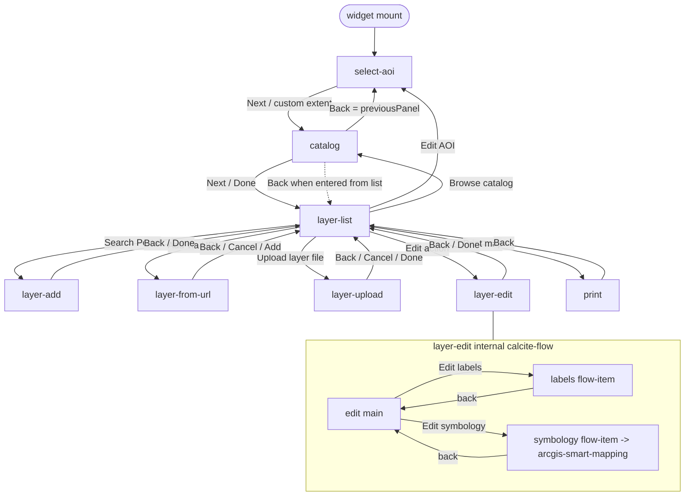

# briefing-tool - Wizard flow (CalciteFlow + Panel enum)

> Sample: `ArcGISExperienceBuilder/sdk-resources/widgets/briefing-tool/` - exbVersion **1.17.0**.
> Calcite and `@arcgis/*` components are **vendor** web components (NOT jimu). Any Calcite/arcgis
> prop or event described here is **approximate** and must be validated against the versions this repo
> ships (ExB 1.20 / Calcite alias drift - see Gotchas).
> Plain hyphens only in this doc; no em/en dashes.

## Concept: a single CalciteFlow as a wizard, panel state in Context drives the selected flow-item

The whole widget UI is one `<CalciteFlow>` acting as a multi-step wizard. Every step is a
`<CalciteFlowItem>`. There is **no router** and steps do **not** pass props to each other for
navigation. Instead a single `panel` value (a `Panel` enum) lives in the widget Context, and each
flow-item decides whether it is the visible step by comparing `panel` to its own enum value via the
Calcite `selected` prop. Navigation forward is `setPanel(Panel.X)`; navigation back is either the
Calcite flow-item back chevron (`onCalciteFlowItemBack`) or an explicit `setPanel(...)`.

Key idea: **panel state is the single source of truth**, held in one place (Context), and the
CalciteFlow renders whichever child has `selected` true. See
[context-and-state.md](context-and-state.md) for the Context wiring.

## The Panel enum [exact values + purpose]

From `src/runtime/constants/types.ts`:

```tsx
export enum Panel {
  SELECT_AOI = "select-aoi",
  CATALOG = "catalog",
  LAYER_LIST = "layer-list",
  LAYER_EDIT = "layer-edit",
  LAYER_UPLOAD = "layer-upload",
  LAYER_ADD = "layer-add",
  LAYER_FROM_URL = "layer-from-url",
  PRINT = "print",
}

export interface PanelProps {
  selected: boolean;
  onBack: () => void;
  onNext: () => void;
}
```

| Panel value            | Component            | Purpose (step) | Entered from | Exits to |
| ---------------------- | -------------------- | -------------- | ------------ | -------- |
| `SELECT_AOI`           | `select-aoi`         | Define the area of interest (search / COCOM / country / file upload / custom extent). Start step. | initial state; `layer-list` (Edit AOI) | `CATALOG` (on Next) |
| `CATALOG`              | `catalog`            | Browse the configured service catalog tree, add/remove services to the map. | `SELECT_AOI` (first run) or `LAYER_LIST` (add-more) | `LAYER_LIST` (Next/Done), or back to `previousPanel` |
| `LAYER_LIST`           | `layer-list`         | Hub step: view/manage layers, launch edit/add/upload/from-url, and go to print. | `CATALOG`, `LAYER_*` panels, `PRINT` | `SELECT_AOI`, `CATALOG`, `LAYER_ADD`, `LAYER_FROM_URL`, `LAYER_UPLOAD`, `LAYER_EDIT`, `PRINT` |
| `LAYER_EDIT`           | `layer-edit`         | Edit a single layer: blend mode, opacity, labels, symbology (hosts vendor smart-mapping). | `LAYER_LIST` (Edit action) | `LAYER_LIST` |
| `LAYER_ADD`            | `layer-add`          | Search the Portal and add layers. | `LAYER_LIST` (Search Portal) | `LAYER_LIST` |
| `LAYER_UPLOAD`         | `layer-upload`       | Upload a Shapefile (.zip) or GeoJSON file. | `LAYER_LIST` (Upload layer file) | `LAYER_LIST` |
| `LAYER_FROM_URL`       | `layer-from-url`     | Add a layer by URL + name. | `LAYER_LIST` (Add via URL) | `LAYER_LIST` |
| `PRINT`                | `print`              | Configure and export the briefing map (PNG). Terminal step. | `LAYER_LIST` (Print map) | `LAYER_LIST` |

The initial panel is `SELECT_AOI` (set in Context `useState<Panel>(Panel["SELECT_AOI"])`).

## Wiring: CalciteFlow + CalciteFlowItem selected-by-context.panel

`src/runtime/widget.tsx` mounts every panel component as a **sibling child** of one `<CalciteFlow>`.
The panels are always mounted; each one hides or shows itself:

```tsx
return (
  <WidgetContextProvider {...props}>
    <Alerts />
    <Confirm />
    {layoutManagerEl && createPortal(<LayoutManager />, layoutManagerEl)}
    <CalciteFlow id="briefing-tool-flow" className="e-flow calcite-mode-light">
      <SelectAOI />
      <Catalog />
      <LayerList />
      <LayerEdit />
      <LayerAdd />
      <LayerUpload />
      <LayerFromUrl />
      <Print />
    </CalciteFlow>
  </WidgetContextProvider>
);
```

Each panel component returns a `<CalciteFlowItem>` whose `selected` is derived from `context.panel`.
Example - the `layer-list` hub (`src/runtime/components/layer-list/layer-list.tsx`):

```tsx
const { panel, setPanel /* ... */ } = useWidgetContext();

return (
  <CalciteFlowItem
    selected={panel === Panel["LAYER_LIST"]}
    heading="Briefing Map Tool"
    className="e-layer-list"
  >
    {/* ... */}
    <CalciteDropdownItem onClick={() => setPanel(Panel["CATALOG"])}>Browse catalog</CalciteDropdownItem>
    <CalciteDropdownItem onClick={() => setPanel(Panel["LAYER_ADD"])}>Search Portal</CalciteDropdownItem>
    <CalciteDropdownItem onClick={() => setPanel(Panel["LAYER_FROM_URL"])}>Add via URL</CalciteDropdownItem>
    <CalciteDropdownItem onClick={() => setPanel(Panel["LAYER_UPLOAD"])}>Upload layer file</CalciteDropdownItem>
    <CalciteButton slot="footer" onClick={() => setPanel(Panel["PRINT"])}>Print map</CalciteButton>
  </CalciteFlowItem>
);
```

Two rendering styles coexist in the sample (both valid):

- **Always-return, hide via `selected`** (e.g. `layer-list`, `layer-add`, `layer-upload`,
  `layer-from-url`, `print`): the `CalciteFlowItem` is always in the tree and Calcite shows it when
  `selected` is true.
- **Early-return null, then `selected` too** (e.g. `catalog`, `select-aoi`): the component returns
  `null` when it is not its panel, and its `CalciteFlowItem` also carries `selected`. Example
  (`catalog.tsx`):

  ```tsx
  if (panel !== Panel["CATALOG"]) {
    return null;
  }
  return (
    <CalciteFlowItem
      heading={previousPanel === Panel["LAYER_LIST"] ? "Catalog" : "Add layers"}
      selected={panel === Panel["CATALOG"]}
      onCalciteFlowItemBack={() => handleBack()}
    >
      {/* ... */}
    </CalciteFlowItem>
  );
  ```

## Navigation: setPanel forward + calcite back + previousPanel for multi-parent panels

**Forward** is always an explicit `setPanel(Panel.X)` from a button/dropdown click. Every
`setPanel(Panel[...])` call in the sample:

- `select-aoi` -> `CATALOG` (via `handleNextButton(Panel["CATALOG"])` on custom extent or after a
  selection method finishes)
- `layer-list` -> `SELECT_AOI` (Edit AOI), `CATALOG`, `LAYER_ADD`, `LAYER_FROM_URL`, `LAYER_UPLOAD`,
  `LAYER_EDIT` (Edit action), `PRINT`
- `catalog` -> `LAYER_LIST` (Next/Done) or `previousPanel` (Back)
- `layer-edit`, `layer-add`, `layer-upload`, `layer-from-url`, `print` -> all back to `LAYER_LIST`

**Back** uses the Calcite flow-item chevron. For single-parent panels the back handler just hard-codes
the parent, e.g. `layer-add`:

```tsx
<CalciteFlowItem
  selected={panel === Panel["LAYER_ADD"]}
  heading="Add layers"
  onCalciteFlowItemBack={() => setPanel(Panel["LAYER_LIST"])}
>
```

For a **multi-parent** panel, back must return to wherever the user came from. `catalog` is reachable
from both `SELECT_AOI` (first run) and `LAYER_LIST` (add-more), so it navigates back to
`previousPanel` instead of a fixed value:

```tsx
const { panel, previousPanel, setPanel } = useWidgetContext();

const handleBack = () => {
  setPanel(previousPanel);
};

// heading + primary button label also branch on previousPanel:
// heading = previousPanel === Panel["LAYER_LIST"] ? "Catalog" : "Add layers"
// button  = previousPanel === Panel["LAYER_LIST"] ? "Done"    : "Next"
```

`previousPanel` is maintained centrally in Context, so any panel can read "where did I come from"
without prop drilling. From `context.tsx`:

```tsx
const [panel, setPanel] = useState<Panel>(Panel["SELECT_AOI"]);

// previous/current tracking so a panel reachable from multiple parents can navigate back correctly
const [previousPanel, setPreviousPanel] = useState<Panel>(Panel["SELECT_AOI"]);
const [currentPanel, setCurrentPanel] = useState<Panel>(Panel["SELECT_AOI"]);

useEffect(() => {
  // Set previousPanel to the old currentPanel before resetting it
  setPreviousPanel(currentPanel);
  // Set currentPanel to the panel now being rendered
  setCurrentPanel(panel);
}, [panel]);
```

Why the extra `currentPanel` state instead of just `previousPanel`? On each `panel` change the effect
needs the value the panel **had before** this change. It snapshots the old `currentPanel` into
`previousPanel`, then advances `currentPanel` to the new `panel`. `previousPanel` therefore always
holds "the step before the current one", which is exactly what a multi-parent panel (`catalog`) needs
for its Back button. Only `previousPanel` is exposed on the Context value; `currentPanel` is internal
bookkeeping.

## Flow map



## Per-panel responsibilities

- **select-aoi** (`select-aoi.tsx`): first step. Returns `null` when `panel === LAYER_LIST`. Renders a
  main `CalciteFlowItem` (`selected={active && !selectionMethod}`) offering methods (search, COCOM,
  country, file, custom extent) plus **nested** sub flow-items (`SelectCocom`, `SelectCountry`,
  `AoiUpload`, `Search`) each gated by `selected={active && selectionMethod === "..."}`. Sub-items use
  the `PanelProps` contract (`selected/onBack/onNext`). `onNext` calls `handleNextButton(Panel.CATALOG)`
  which captures the current map extent into `aoiExtent`. Exit: `CATALOG`.
- **catalog** (`catalog.tsx`): multi-parent. Loads the service catalog tree, add/remove services via
  map layers. Heading + primary button label branch on `previousPanel`. Back = `previousPanel`; Next =
  `LAYER_LIST`.
- **layer-list** (`layer-list.tsx`): the **hub**. Shows the AOI chip (click = back to `SELECT_AOI`),
  an `ArcgisLayerList` web component with per-item actions (view/zoom/edit/remove), an "Add layers"
  dropdown fanning out to `CATALOG`/`LAYER_ADD`/`LAYER_FROM_URL`/`LAYER_UPLOAD`, and a "Print map"
  footer button to `PRINT`. Edit action -> `setEditingLayer(layer)` + `setPanel(LAYER_EDIT)`.
- **layer-edit** (`layer-edit.tsx`): edits the layer held in `context.editingLayer`. Blend mode,
  opacity, and two sub-steps (labels, symbology) rendered as **its own** extra `CalciteFlowItem`s
  toggled by local `isShowLabelEditor` / `isShowSymbolEditor` state (not the `Panel` enum). Back/Done
  -> `LAYER_LIST`.
- **layer-add** (`layer-add.tsx`): Portal search + add. Back -> `LAYER_LIST`.
- **layer-upload** (`layer-upload.tsx`): Shapefile/GeoJSON upload. Cancel/Done/back -> `LAYER_LIST`.
- **layer-from-url** (`layer-from-url.tsx`): URL + name -> add layer. Cancel/Add/back -> `LAYER_LIST`.
- **print** (`print.tsx`): print/export config (aspect ratio, scale bar, compass, map inset, legend)
  read from `context.printConfig`; exports a PNG. Back -> `LAYER_LIST`.

## Wizard within a vendor flow (smart-mapping panels-gallery)

`layer-edit` demonstrates a **wizard-within-a-wizard**. Its symbology sub-step hosts the vendor
`<arcgis-smart-mapping>` web component, which runs its **own internal `calcite-flow`** (a
panels-gallery of style options). So the outer briefing-tool flow contains the `LAYER_EDIT` step, which
contains local label/symbology flow-items, one of which hands off to a vendor component that manages a
third, nested flow it fully owns:

```tsx
{isShowSymbolEditor && view && layer && (
  <CalciteFlowItem
    selected
    heading="Symbology"
    onCalciteFlowItemBack={() => setIsShowSymbolEditor(false)}
  >
    <arcgis-smart-mapping ref={agsSmartMapping} id={agssmId} className="mb-2" />
  </CalciteFlowItem>
)}
```

The briefing-tool code does not drive the smart-mapping internal panels; it only mounts the component
and styles it. For how those vendor Calcite/arcgis components are themed/restyled and how their assets
are wired, see [vendor-webcomponent-restyling.md](vendor-webcomponent-restyling.md) and
[internal-registry-and-assets.md](internal-registry-and-assets.md) (asset-path recipe).

## Data sharing across panels via useWidgetContext

Panels do **not** pass domain data to each other through props; they share it through
`useWidgetContext()`. The Context holds the wizard/domain state that must survive step changes:
`panel`, `previousPanel`, `setPanel`, `aoi`, `aoiExtent`, `editingLayer` (the layer `LAYER_EDIT`
operates on), `mapView`, `printConfig`, plus cross-cutting helpers (`dispatchAlert`, `confirm`). A
panel reads exactly what it needs:

```tsx
const { panel, setPanel, mapView, aoiExtent, setAoiExtent } = useWidgetContext(); // select-aoi
const { editingLayer, setEditingLayer, setPanel } = useWidgetContext();           // layer-list -> layer-edit
```

This is why the flow works with zero prop wiring between siblings: the CalciteFlow only decides
**which** flow-item is visible; the Context supplies **what** each flow-item works on. Full Context
shape and reducers are documented in [context-and-state.md](context-and-state.md).

## Gotchas

- **Two sources of truth to keep in sync.** CalciteFlow maintains its own internal back-stack of
  flow-items, but this sample treats `context.panel` as the real source of truth and re-derives
  `selected` from it. Always drive navigation through `setPanel(...)` (and, for local sub-steps,
  through local booleans like `isShowLabelEditor`). Do not rely on Calcite's internal stack alone, or
  the visible item and `panel` can diverge.
- **`previousPanel` only goes back one level.** It records the immediately prior step, not a full
  history. It is enough for `catalog` (two parents) but would not support deep multi-level back
  through arbitrary paths - if you add more multi-parent panels, prefer an explicit stack.
- **Local sub-steps vs enum steps.** `layer-edit` labels/symbology and `select-aoi` methods are
  **not** in the `Panel` enum; they are local component state layered on top of the parent panel.
  When adding steps, decide deliberately: a top-level wizard step goes in `Panel`; a detail view that
  only exists inside one parent can stay local.
- **1.17 Calcite/arcgis alias drift.** This sample pins `@arcgis/*-components` 4.33 and mixes import
  aliases (`@esri/calcite-components-react` vs `calcite-components`) across files. Props/events used
  here (`onCalciteFlowItemBack`, `selected`, `slot="footer"`) are vendor API and may differ from what
  this repo's ExB 1.20 baseline ships. Treat all Calcite/arcgis usage as **approximate** and validate.

## Lift-into-repo

- **Prefer this pattern for multi-step widget UX.** A single `<CalciteFlow>` + a `Panel` enum + one
  Context-held `panel` value is a clean, testable wizard model. Reuse it for any wizard-style widget.
- **Keep panel/wizard state in one place** (Context), and expose `setPanel` plus a single
  `previousPanel` (or an explicit stack) so panels never prop-drill navigation.
- **Derive `selected` from state, do not fight the vendor stack.** Render all steps as siblings and
  gate each with `selected={panel === Panel.X}`; use local booleans only for details private to one
  parent step.
- **Repo code style** (see `.github/instructions/code-style.instructions.md`): short-circuit (`&&`)
  guard calls, always semicolons, if-bodies on their own line, plain hyphens in comments/text.
- **Validate Calcite/arcgis imports and props against the 1.20 baseline** before lifting; this sample
  is 1.17 and uses an internal Artifactory registry for `@arcgis/*` (see
  [internal-registry-and-assets.md](internal-registry-and-assets.md)).

## See also

- [context-and-state.md](context-and-state.md) - the WidgetContext shape, reducers, and shared state.
- [vendor-webcomponent-restyling.md](vendor-webcomponent-restyling.md) - theming the vendor Calcite/arcgis components.
- [internal-registry-and-assets.md](internal-registry-and-assets.md) - registry, asset-path, and build recipe.
- [../09-demos-complex.md](../09-demos-complex.md) - the briefing-tool summary card.
- [../../editor-calcite-flow.md](../../editor-calcite-flow.md) - CalciteFlow usage patterns in this repo.
